# edap 容器设计文档

> edap = Enterprise Distributed Application Platform
> 一个轻量级 Java 应用服务器容器，Proto-First 多协议自动发布。

---

## 一、项目定位

edap 是一个**应用服务器**（类似 Tomcat / JBoss / Open Liberty），不是应用框架（区别于 Solon / Spring Boot）。

| 维度 | edap | Solon |
|------|------|-------|
| 进程模型 | 单进程多应用 | 单进程单应用 |
| 部署单元 | EAR 应用包 | JAR 应用 |
| 核心能力 | 容器管理 + 多应用 + 热部署 | 应用框架 + 插件 |
| 接口定义 | proto 文件 + option | Java 注解 |

---

## 二、核心设计理念

### 2.1 单一信息源（Single Source of Truth）

```proto
// hello.proto —— 唯一的接口定义
syntax = "proto3";
package io.edap.demo;

import "google/api/annotations.proto";      // HTTP option
import "edap/ws.proto";                      // WS option (edap 自定义)
import "edap/rpc.proto";                     // eRPC option

service HelloService {
    rpc SayHello (HelloRequest) returns (HelloResponse) {
        option (google.api.http).get = "/v1/hello";   // ← HTTP 注解
        option (edap.ws).method = "HelloService.SayHello";  // ← WS 注解
        option (edap.rpc).method = 1001;              // ← eRPC 注解
    };
}

message HelloRequest {
    string name = 1;
}

message HelloResponse {
    string message = 1;
}
```

**一个 proto 文件 = 接口契约 + 接口文档 + 多协议实现 + 多语言 SDK**

### 2.2 节点驱动的协议发布

**核心思想**：应用是协议无关的，节点才是协议载体。

开发者**不需要在应用里配置 protocols**。应用只写一份 proto + 实现业务逻辑即可。**部署到哪种节点，就自动获得该节点支持的协议能力**。

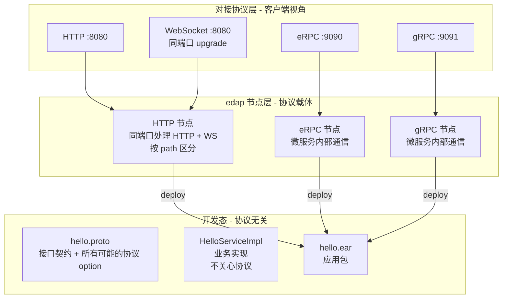

**节点类型对照**：

| 节点类型 | 激活的协议 option | 用途 | 典型端口 |
|---------|-----------------|------|---------|
| HTTP 节点 | `google.api.http` + `edap.ws` | Web 全栈服务（HTTP 请求 + WebSocket 同端口，HTTP server 按 path 区分） | 8080 |
| eRPC 节点 | `edap.rpc` | 微服务内部通信 | 9090 |
| gRPC 节点 | `edap.grpc` | 微服务内部通信（外部互通） | 9091 |

> **HTTP 节点 = HTTP + WebSocket**：HTTP server 本身就是 WebSocket 的载体——客户端通过 HTTP Upgrade 握手升级为 WebSocket 连接（按请求 path 区分走 HTTP Router 还是 WS Router），不需要额外端口。把 HTTP 和 WebSocket 拆成两种节点类型反而割裂了"一个 HTTP server 同时承担普通 HTTP 与 WebSocket"的天然能力。

**关键收益**：

- ✅ **应用零协议配置**：开发者只关心业务，不关心部署形态
- ✅ **一份 EAR 多场景部署**：同一个 hello.ear，部署到 HTTP 节点暴露 Web 服务，部署到 eRPC 节点变成微服务
- ✅ **环境隔离天然实现**：前端调 HTTP，后端互调用 eRPC，同一份代码
- ✅ **proto option 描述"能力谱"**：option 不是声明"必须用这个协议"，而是声明"这个方法**支持**这些协议，部署时由节点激活"

### 2.3 一次编写，多处自动生成

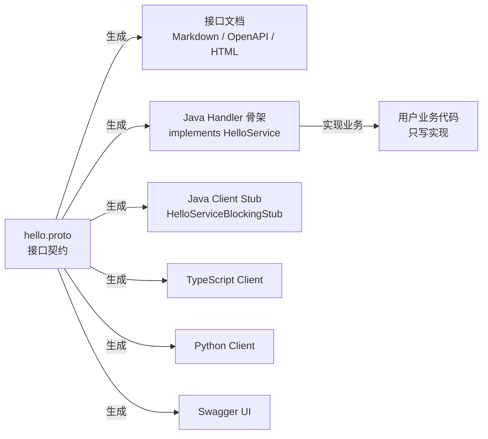

### 2.4 灵活打包：包可自由合并 / 分开部署

edap 的部署单元（EAR）和开发单元（包）是解耦的。开发者按业务模块拆分包，部署时**自由组合**这些包。

#### 核心概念

| 概念 | 维度 | 说明 |
|------|------|------|
| **包（Package）** | 开发维度 | 开发者视角，一个 proto + impl 一个包 |
| **EAR** | 部署维度 | 容器视角，可包含一个或多个包 |
| **应用（App）** | 运行维度 | 一个 EAR 部署后变成一个应用实例 |

#### 三种典型部署形态

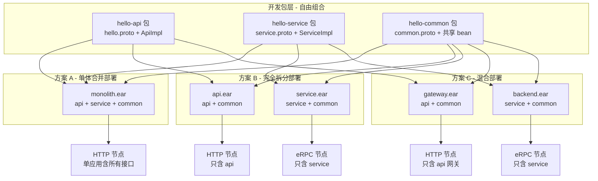

#### 共享包的隔离规则

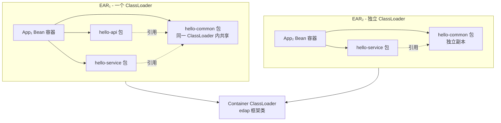

**隔离规则**：

| 范围 | 是否共享 | 说明 |
|------|---------|------|
| 同一 EAR 内 | ✅ 完全共享 | 共享包可直接被业务包引用 |
| 不同 EAR 之间 | 完全隔离 | 各自独立 ClassLoader，副本加载 |
| EAR ↔ Container | 单向（EAR 可见容器） | 框架类从容器 CL 加载 |

#### EAR 内 proto 文件组织（按 artifactId 目录分层）

当 EAR 包含多个 Maven 模块时，每个模块的 proto 文件按 **artifactId 目录** 分层组织。目录路径镜像 Maven 模块路径。

**每个 Maven 模块内部**：proto 文件统一放在 `src/main/resources/proto/` 目录下（与 Maven 标准资源约定一致）：

```
hello-api/
└── src/main/resources/proto/
    └── api.proto                    ← service UserService
└── src/main/java/io/edap/api/
    └── UserServiceImpl.java

hello-service/
└── src/main/resources/proto/
    └── service.proto                ← service OrderService
└── src/main/java/io/edap/service/
    └── OrderServiceImpl.java
```

打包进 jar 后，proto 文件位于 jar 内 `resources/proto/`：

```
hello-api.jar
└── resources/proto/api.proto

hello-service.jar
└── resources/proto/service.proto
```

**EAR 装配后的目录结构示例**（按 artifactId 重新分目录组织）：

```
monolith.ear/
├── BUILD.json                          ← EAR 元数据
├── hello-api/                          ← artifactId = hello-api
│   ├── api.proto                       ← service UserService
│   └── classes/
│       └── io/edap/api/UserServiceImpl.class
├── hello-service/                      ← artifactId = hello-service
│   ├── service.proto                   ← service OrderService
│   └── classes/
│       └── io/edap/service/OrderServiceImpl.class
└── hello-common/                       ← artifactId = hello-common
    ├── common.proto                    ← message BaseRequest
    └── classes/
        └── io/edap/common/BaseUtils.class
```

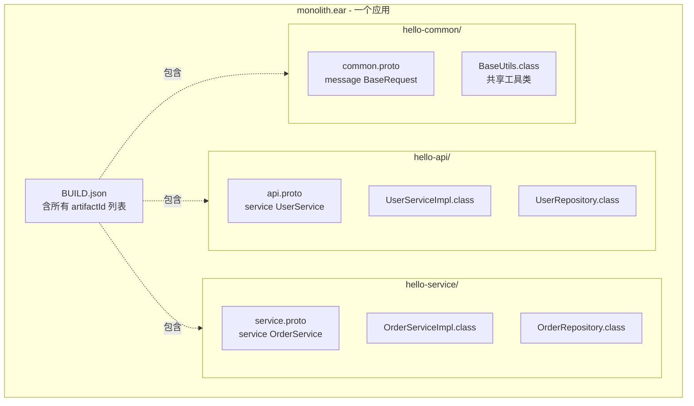

**proto 服务全限定名规则**：

```
全限定名 = {artifactId}.{proto_file}.{service_name}
```

示例：

| proto 文件路径 | service 定义 | 全限定名 |
|--------------|------------|---------|
| `hello-api/api.proto` | `service UserService` | `hello-api.api.UserService` |
| `hello-service/service.proto` | `service OrderService` | `hello-service.service.OrderService` |
| `hello-api/api.proto` | `service UserService`（另一个文件）| `hello-api.user.UserService` |

**命名空间天然隔离**：

```protobuf
// hello-api/api.proto
package io.edap.api;
service UserService {              // ← 全限定: hello-api.api.UserService
  rpc GetUser(...) returns (...);
}

// hello-service/service.proto
package io.edap.service;
service UserService {              // ← 全限定: hello-service.service.UserService
  rpc CreateUser(...) returns (...);
}
```

不同包里可以有同名 service（甚至同包名 `UserService`），因为 artifactId 已经把它们区分开了。

**容器扫描规则**：

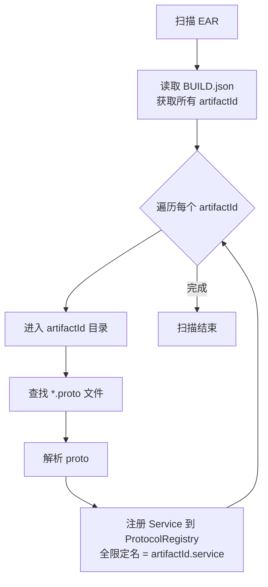

**关键收益**：

- ✅ **目录即归属**：从 proto 文件路径就能看出它来自哪个 Maven 模块，IDE 跳转友好
- ✅ **全限定名天然防冲突**：不同 artifactId 下的同名 service 不会冲突
- ✅ **构建可追溯**：proto 路径 = Maven 模块路径，编译期就能关联
- ✅ **零配置命名空间**：不需要手动指定 namespace，目录层级就是 namespace

#### 与 Maven 多模块的关系

edap 的"包"概念与 Maven 多模块天然契合：

```xml
<!-- 父 POM：聚合 -->
<modules>
    <module>hello-api</module>
    <module>hello-service</module>
    <module>hello-common</module>
</modules>

        <!-- 每个子模块独立编译输出 jar -->
<plugin>
<artifactId>maven-jar-plugin</artifactId>
</plugin>
```

**通过 Maven profile / assembly 决定 EAR 打包内容**：

```xml
<!-- profile-a: 单体部署 -->
<profile>
    <id>monolith</id>
    <dependencies>
        <dependency>hello-api</dependency>
        <dependency>hello-service</dependency>
        <dependency>hello-common</dependency>
    </dependencies>
</profile>

        <!-- profile-b: 拆分部署 -->
<profile>
<id>split</id>
<dependencies>
    <dependency>hello-api</dependency>
    <dependency>hello-common</dependency>
</dependencies>
</profile>
```

```bash
# 单体部署
mvn package -P monolith  # 生成 monolith.ear

# 拆分部署
mvn package -P split      # 生成 api.ear
cd ../hello-service && mvn package -P split  # 生成 service.ear
```

#### 关键收益

- ✅ **开发期模块化**：按业务边界拆包，职责清晰
- ✅ **部署期灵活**：根据场景自由组合，初期单体迭代，后期按需拆分
- ✅ **零代码改动**：同一份代码，EAR 打包组合变了，应用形态就变了
- ✅ **渐进式微服务**：业务发展后，无需重写代码，只需调整打包 profile
- ✅ **共享包天然隔离**：不同 EAR 互不污染，ClassLoader 级别隔离

---

## 三、参考设计：Spring 容器的核心思想

edap 不重复造 Spring 的轮子，但要借鉴其设计精华。

### 3.1 容器自身 —— BeanFactory / ApplicationContext

```
┌─────────────────────────────────────────┐
│          ApplicationContext             │  ← 对外门面，集成所有能力
│  ┌─────────────────────────────────┐    │
│  │        BeanFactory              │    │  ← 核心：getBean / containsBean
│  │  ┌──────────────────────────┐   │    │
│  │  │  beanDefinitionMap        │   │    │  ← 注册表 (name → BeanDefinition)
│  │  │  singletonObjects         │   │    │  ← 一级缓存（成品 bean）
│  │  │  earlySingletonObjects    │   │    │  ← 二级缓存（半成品，解决循环依赖）
│  │  │  singletonFactories       │   │    │  ← 三级缓存（ObjectFactory）
│  │  └──────────────────────────┘   │    │
│  └─────────────────────────────────┘    │
│  + AppResourceLoader（加载配置/类）       │
│  + ApplicationEventPublisher（事件）     │
│  + Environment（profile/property）       │
└─────────────────────────────────────────┘
```

### 3.2 扩展点 —— 容器的灵魂

```
InstantiationAwareBeanPostProcessor   ← 实例化前(可替换 bean)
            ↓
        构造器 / 工厂方法
            ↓
SmartInstantiationAwareBeanPostProcessor ← 提前暴露引用
            ↓
        属性注入
            ↓
BeanPostProcessor.postProcessBeforeInit  ← 初始化前（AOP 织入点）
            ↓
        @PostConstruct / InitializingBean / 自定义 init
            ↓
BeanPostProcessor.postProcessAfterInit   ← 初始化后（AOP 织入点）
            ↓
SmartLifecycle.start()               ← 运行时（容器启动完成事件）
```

---

## 四、参考设计：Solon 框架（轻量级对比）

### 4.1 三大核心组件

| 组件 | 作用 | 体验风格 |
|------|------|---------|
| Plugin 插件扩展机制 | 模块级扩展 | 编码风格 |
| Ioc/Aop 应用容器 | 依赖注入 + 切面 | 类似 Spring |
| Context + Handler | 通用请求处理（三元合一） | Http / WebSocket / Socket 同一套 API |

### 4.2 Solon 插件机制（两套 SPI）

```java
public interface Plugin {
    void start(AppContext context) throws Throwable;
    default void prestop() throws Throwable {}
    default void stop() throws Throwable {}
}
```

| 机制 | 用途 | 类比 |
|------|------|------|
| E-Spi | 普通扩展（编码风格） | Spring Factories / Java SPI |
| H-Spi | 生产级热插拔，独立 ClassLoader | OSGi |

### 4.3 Solon AppContext 设计要点

```java
// 关键设计：单类集成所有能力
public class AppContext extends BeanContainer {
    public AppContext(SolonApp app, ClassLoader classLoader, Props props) {
        super(app, classLoader, props);
        initialize();                                 // ① 注册所有 builder/extractor/injector
        lifecycle(LF_IDX_FIELD_COLLECTION_INJECT,     // ② 注册两个"注入审查回调"
                () -> startInjectReview(0));
        lifecycle(LF_IDX_PARAM_COLLECTION_INJECT,
                () -> startInjectReview(1));
    }
}
```

**两段式注入 —— Solon 的招牌设计**：

```java
public void start() {
    starting = true;
    Collection<BeanWrapLifecycle> asynInitTasks = startBeanLifecycle();
    started = true;
    startInjectReview(2);    // 第一段注入审查
    startInjectReview(2);    // 第二段，处理二阶依赖
    executeAsyncInitTasks(asynInitTasks);
    postStartBeanLifecycle();
}
```

**关键观察**：
- 构造函数不做任何 bean 扫描
- 扫描期只记录到 gatherSet，不立即解析
- start() 时统一 commit（不需要三级缓存就能处理循环引用）

---

## 五、edap 核心架构

### 5.1 容器 vs 工具 vs 应用 三层架构

```
Container（运行时核心）
    ├─ Container AppContext（容器级上下文）
    ├─ AppRegistry（应用注册表）
    ├─ ClassLoader（容器级）
    └─ Router（容器级路由）

DeployManager（管理工具）
    ├─ HTTP 管理 API（deploy_app / undeploy / list）
    └─ 操作 Container

Applications（被管理的多个应用）
    ├─ App₁（独立 CL + AppContext + Beans）
    ├─ App₂（独立 CL + AppContext + Beans）
    └─ Appₙ（独立 CL + AppContext + Beans）
```

> **类比**：Container = Tomcat，DeployManager = Tomcat Manager（管理控制台）

### 5.2 全景架构图

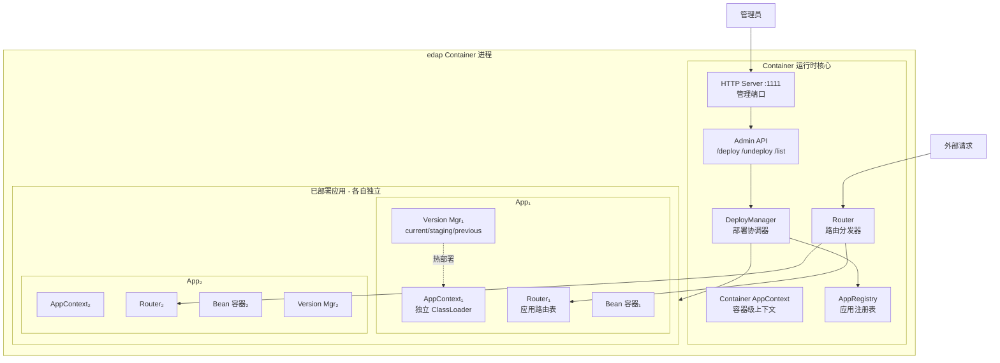

### 5.3 父子 ClassLoader 隔离

```
Container CL (容器) ──── 共享 edap-* 框架类
    │
    ├── App₁ CL ──── 加载 app₁ 自己的类
    ├── App₂ CL ──── 加载 app₂ 自己的类
    └── App₃ CL ──── 加载 app₃ 自己的类
        (双亲委派时,框架类走容器 CL,应用类自己加载)
```

---

## 六、Proto-First 设计

### 6.1 proto 驱动的多协议发布

应用在 proto 中声明**所有可能的协议绑定**（option），实际激活哪个由**部署节点的类型**决定。

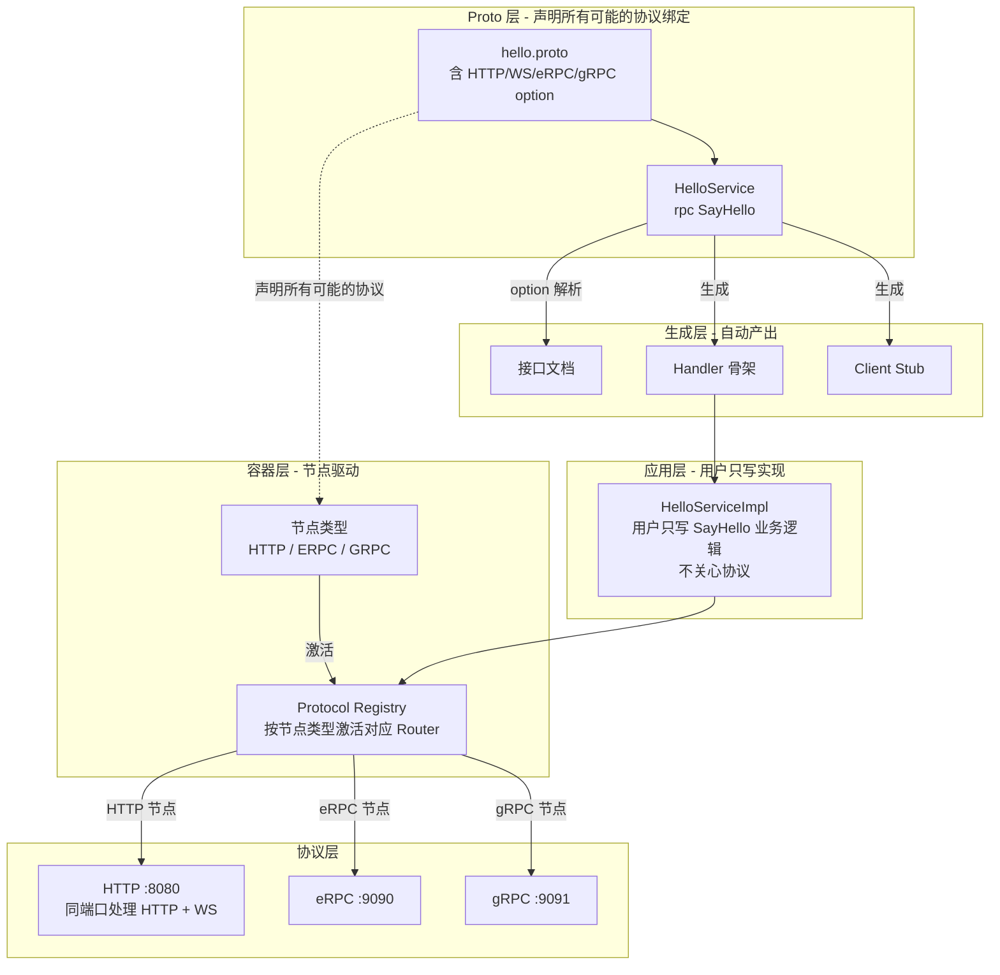

### 6.2 proto option 解析流程

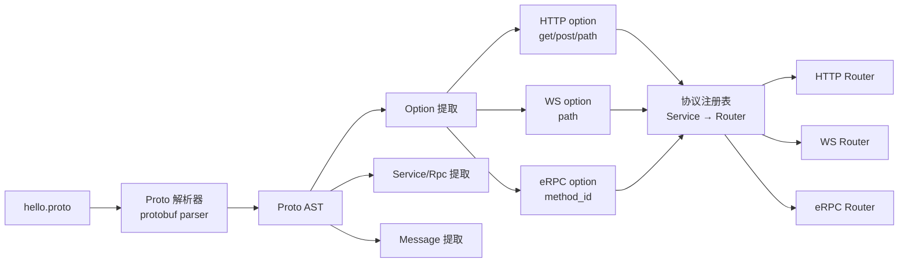

### 6.3 Option 标准化

| Option 类型 | 来源 | 作用 |
|-----------|------|------|
| `google.api.http` | Google 标准 | HTTP 路径和方法 |
| `edap.ws.path` | edap 自定义 | WebSocket 路径 |
| `edap.rpc.method_id` | edap 自定义 | eRPC 方法编号 |
| `edap.grpc` | 未来 | gRPC 兼容 |

### 6.4 proto 驱动的容器架构

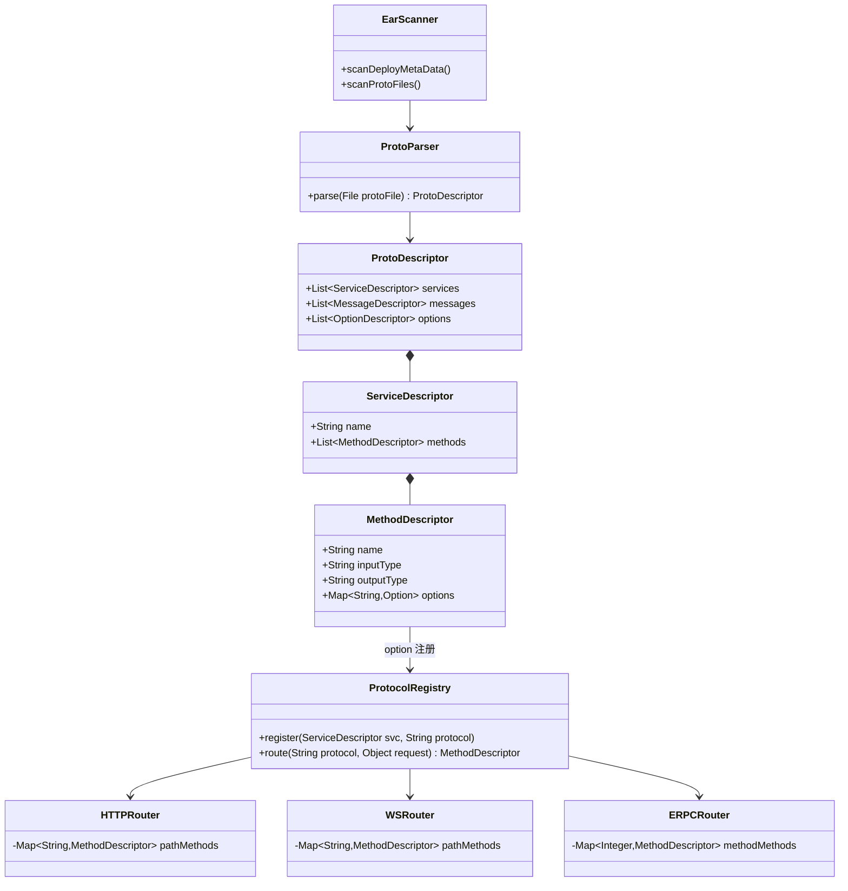

### 6.5 协议绑定自动生成 —— 约定优于配置 + 按需覆盖

**核心原则**：90% 场景用默认规则自动生成协议绑定，10% 特殊场景用户用 proto option 显式覆盖。

#### 核心思想

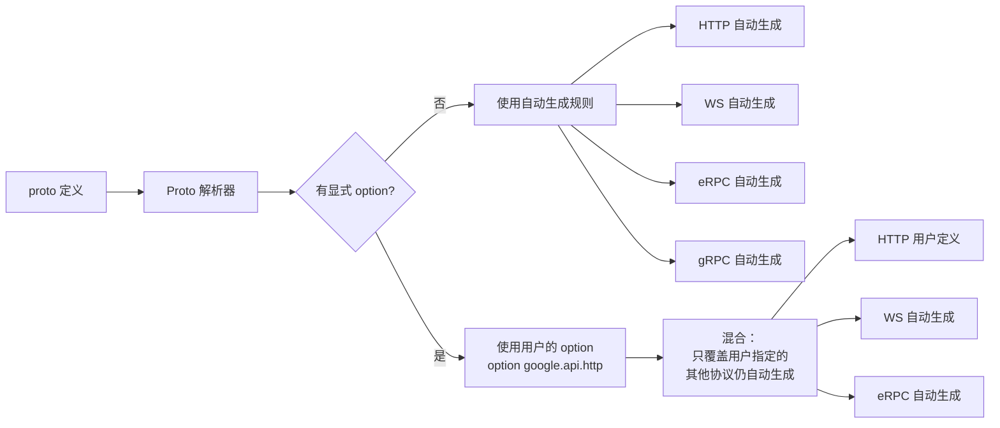

#### 默认生成规则

| 协议 | 默认规则 | 示例 |
|------|---------|------|
| **HTTP** | 统一用 **POST**，body 为 **JSON 字符串** | `POST /api/{ServiceName}/{MethodName}` (Content-Type: application/json) |
| **WebSocket** | **统一端点** + 消息 method 路由 | 端点 `/ws`，method = `{ServiceName}.{MethodName}` |
| **eRPC** | service.method 哈希生成 method_id | `hash("UserService.GetUser")` |
| **gRPC** | 标准 gRPC 路径 | `/UserService/GetUser` |

#### WS 协议的特殊处理

WS 不同于 HTTP/eRPC：**所有方法共享一个统一端点**，通过消息体里的 `method` 字段路由。

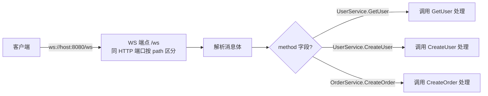

**客户端消息格式（JSON-RPC 风格）**：

```json
{
  "id": "req-001",
  "method": "UserService.GetUser",
  "params": {
    "user_id": "123"
  }
}
```

**服务端响应**：

```json
{
  "id": "req-001",
  "result": {
    "name": "张三",
    "age": 28
  }
}
```

**自动生成的 method 名**：默认 `{ServiceName}.{MethodName}`（如 `UserService.GetUser`）

#### HTTP 协议的特殊处理

HTTP 与传统 RESTful 惯例不同：**所有方法统一用 POST，请求参数通过 body 里的 JSON 字符串传递**。

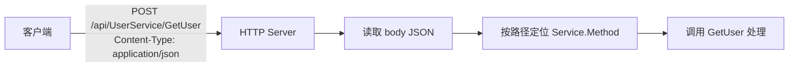

**为什么默认 POST + JSON body？**

| 决策 | 理由 |
|------|------|
| 统一 POST | 避免按方法名动词识别（`Get*→GET, Create*→POST` …）带来的歧义与特例<br/>GET 的可缓存性不适合"动作"语义（POST/PUT 更匹配 RPC 语义）<br/>简化默认生成规则，新方法零配置直接生效 |
| body 用 JSON | 与 WS（JSON-RPC 风格）保持一致，多协议同一份 body 序列化思路<br/>支持复杂嵌套结构、无 URL 长度限制<br/>`Content-Type: application/json` 业界通用 |

**典型 HTTP 请求示例**：

```http
POST /api/UserService/GetUser HTTP/1.1
Content-Type: application/json

{
  "user_id": "123"
}
```

**响应**：

```http
HTTP/1.1 200 OK
Content-Type: application/json

{
  "name": "张三",
  "age": 28
}
```

> 想用 RESTful 风格（GET/PUT/DELETE + 路径参数）？直接在 proto 里用 option 覆盖即可，其他协议仍走默认。

#### 实际示例对比

**最简 proto（推荐写法）**：

```protobuf
service UserService {
  rpc GetUser(GetUserRequest) returns (GetUserResponse);
  rpc CreateUser(CreateUserRequest) returns (CreateUserResponse);
  rpc UpdateUser(UpdateUserRequest) returns (UpdateUserResponse);
  rpc DeleteUser(DeleteUserRequest) returns (DeleteUserResponse);
}
```

**自动生成的协议绑定**：

| 方法 | HTTP（自动） | eRPC method_id（自动） | WS method（自动） |
|------|------------|---------------------|------------------|
| `GetUser` | `POST /api/UserService/GetUser` (body: JSON) | `0x4F3A...` | `UserService.GetUser` |
| `CreateUser` | `POST /api/UserService/CreateUser` (body: JSON) | `0x7B91...` | `UserService.CreateUser` |
| `UpdateUser` | `POST /api/UserService/UpdateUser` (body: JSON) | `0x2D5E...` | `UserService.UpdateUser` |
| `DeleteUser` | `POST /api/UserService/DeleteUser` (body: JSON) | `0x9C4F...` | `UserService.DeleteUser` |

> HTTP 全部统一为 `POST /api/Service/Method`，参数通过 body 的 JSON 字符串传递；WS 端点统一为 `/ws`，所有方法共享，客户端通过消息体 `method` 字段路由。

**用户想自定义时**（按需覆盖）：

```protobuf
service UserService {
  // 用默认规则（最常见，无需写 option）
  rpc GetUser(GetUserRequest) returns (GetUserResponse);

  // 自定义 HTTP 路径（其他协议仍用默认）
  rpc CreateUser(CreateUserRequest) returns (CreateUserResponse) {
    option (google.api.http).post = "/v1/users";        // ← 覆盖 HTTP
    // ↑ WS、eRPC、gRPC 仍走自动生成
  };

  // 自定义 eRPC method_id（特殊场景）
  rpc UpdateUser(UpdateUserRequest) returns (UpdateUserResponse) {
    option (edap.rpc).method = 10001;                   // ← 覆盖 eRPC
    // ↑ HTTP、WS、gRPC 仍走自动生成
  };

  // 自定义多个协议
  rpc DeleteUser(DeleteUserRequest) returns (DeleteUserResponse) {
    option (google.api.http).delete = "/v1/users/{user_id}";   // ← 自定义 HTTP
    option (edap.ws).method = "user.delete";                   // ← 自定义 WS method 名
    // ↑ eRPC、gRPC 仍走自动生成
  };
}
```

#### 覆盖粒度

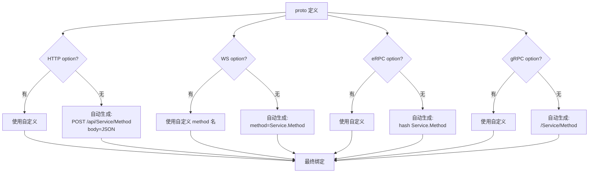

#### 容器端的处理逻辑

```java
// 伪代码：协议绑定解析器
class ProtocolBindingResolver {
    public Map<Protocol, Binding> resolve(ServiceDescriptor svc, MethodDescriptor method) {
        Map<Protocol, Binding> bindings = new HashMap<>();

        for (Protocol p : Protocol.values()) {
            // 1. 用户显式 option 优先
            OptionDescriptor explicit = method.findOption(p.optionName());
            if (explicit != null) {
                bindings.put(p, Binding.fromOption(explicit));
            } else {
                // 2. 否则走默认生成规则
                bindings.put(p, defaultRules.generate(p, svc, method));
            }
        }
        return bindings;
    }
}

// 默认规则生成器
class DefaultBindingRules {
    public Binding generate(Protocol p, ServiceDescriptor svc, MethodDescriptor method) {
        switch (p) {
            case HTTP:
                return generateHttp(svc, method);    // POST /api/Service/Method (body: JSON)
            case WS:
                return generateWs(svc, method);       // method = "Service.Method"
            case ERPC:
                return generateErpc(svc, method);     // hash("Service.Method")
            case GRPC:
                return generateGrpc(svc, method);     // /Service/Method
        }
    }
}
```

#### 用户覆盖的常见场景

| 场景 | 原因 | 示例 |
|------|------|------|
| URL 路径美化 | RESTful 风格要求 | `option (google.api.http).get = "/v1/users/{user_id}"` |
| HTTP 改用 GET/PUT/DELETE | 兼容 RESTful 客户端、浏览器缓存 | `option (google.api.http).get = "/api/users/{user_id}"` |
| eRPC method_id 固定 | 兼容老系统、调协议号 | `option (edap.rpc).method = 10001` |
| WS 子协议 | 不同客户端用不同协议 | `option (edap.ws).subprotocol = "graphql-ws"` |
| HTTP body 改非 JSON | 兼容已有二进制协议（如 protobuf） | `option (google.api.http).body = "*"` |
| gRPC 兼容外部 | 对接已有 gRPC 服务 | `option (edap.grpc).enable = true` |
| 部分协议禁用 | 某些方法不支持某协议 | `option (edap.rpc).enabled = false` |

#### 规则的可配置性

容器提供**应用级规则配置**（在 `application.yml` 或 build.json 里），允许覆盖默认生成规则：

```yaml
# application.yml - 全局规则
edap:
  binding:
    http:
      pathPattern: "/api/{service}/{method}"  # 自定义 HTTP 路径模板（默认 POST）
      bodyFormat: "json"                      # body 序列化格式（默认 json）
    erpc:
      methodIdStrategy: "hash"               # hash | increment | fixed
      hashSeed: 10000                        # 起始编号
    ws:
      endpoint: "/ws"                        # 统一端点
      methodPattern: "{service}.{method}"    # method 名生成规则
```

#### 关键收益

- ✅ **proto 文件极简**：90% 方法不用写 option，只在特殊场景覆盖
- ✅ **风格一致**：所有 service 默认同一种 URL / 协议风格
- ✅ **渐进式细化**：先用默认跑通，需要时再覆盖
- ✅ **规则可配置**：项目级定制默认生成规则
- ✅ **学习成本低**：新人不用学 option 怎么写，遵守命名约定即可

### 6.6 从 Java 接口反向生成 proto —— 兼容 Java 优先的开发流程

edap 不仅支持 Proto-First，还提供**逆向工具**：从已有的 Java 接口自动生成 proto 定义，让 Java-First 的项目也能平滑切换到 edap 的 Proto-First 模式。

> **当前范围（v1.0）**：本工具**仅支持纯 Java 接口（`interface`）+ 实现类（`implements`）** 的反向生成。
> **暂不支持** Spring MVC `@RestController` / `@GetMapping`、Dubbo `@DubboService`、gRPC `@GrpcService` 等带框架注解的类。
> 这些场景请先把 Controller/Service 类拆成 `interface + impl` 后再使用本工具。

#### 适用场景

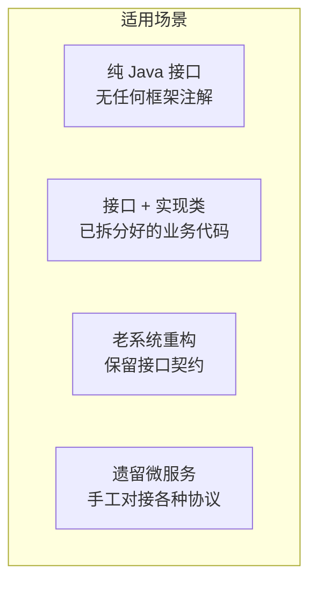

#### Java 结构 → proto 元素映射

| Java 结构 | 生成的 proto 元素 | 说明 |
|----------|------------------|------|
| `interface` | `service` 块 | 接口名 → service 名 |
| 接口方法 | `rpc` 块 | 方法名 → rpc 名 |
| 方法入参（自定义类）| `message` 块（作为 Request） | 参数类名 → message 名 |
| 方法返回值（自定义类）| `message` 块（作为 Response） | 返回类名 → message 名 |
| 关联的实现类（`impl`）| **不参与生成** | 仅用于校验接口已有实现，避免生成无人调用的 proto |

#### 实际转换示例

**原始 Java 接口 + 实现类**：

```java
package io.edap.demo.service;

// 纯 Java 接口（无任何框架注解）
public interface UserService {

    UserDTO getUser(Long userId);

    UserDTO createUser(CreateUserRequest req);

    UserDTO updateUser(Long userId, UpdateUserRequest req);

    void deleteUser(Long userId);
}

// 实现类（可选，工具只校验存在性，不读取其方法体）
public class UserServiceImpl implements UserService {

    @Override
    public UserDTO getUser(Long userId) {
        // ... 业务逻辑
    }

    @Override
    public UserDTO createUser(CreateUserRequest req) {
        // ... 业务逻辑
    }

    @Override
    public UserDTO updateUser(Long userId, UpdateUserRequest req) {
        // ... 业务逻辑
    }

    @Override
    public void deleteUser(Long userId) {
        // ... 业务逻辑
    }
}
```

**自动生成的 proto 文件**：

```protobuf
syntax = "proto3";
package io.edap.demo.service;

import "google/api/annotations.proto";
import "edap/ws.proto";
import "edap/rpc.proto";

option java_package = "io.edap.demo.service";
option java_multiple_files = true;

// ===== Message 块（从入参 / 返回值 / DTO 类生成）=====

message UserDTO {
  int64 user_id = 1;
  string name = 2;
  int32 age = 3;
}

// 单基本类型入参自动包装为 GetUserRequest
message GetUserRequest {
  int64 user_id = 1;   // ← 从方法签名 getUser(Long userId) 的参数名提取
}

// 已有的 POJO 直接复用
message CreateUserRequest {
  string name = 1;
  int32 age = 2;
}

// 多参数方法自动合并入参到 UpdateUserRequest
message UpdateUserRequest {
  int64 user_id = 1;   // ← 从方法签名 updateUser(Long userId, UpdateUserRequest req) 提取
  string name = 2;     // ← UpdateUserRequest 已有字段
  int32 age = 3;
}

// void 返回 → 生成 google.protobuf.Empty
// 单参数 Long userId → 自动包装 DeleteUserRequest
message DeleteUserRequest {
  int64 user_id = 1;
}

// ===== Service 块（从接口生成）=====

service UserService {
  rpc GetUser(GetUserRequest) returns (UserDTO) {
    // 默认绑定（按 §6.5）：HTTP POST + body=JSON，WS method=UserService.GetUser，eRPC hash
  };
  rpc CreateUser(CreateUserRequest) returns (UserDTO);
  rpc UpdateUser(UpdateUserRequest) returns (UserDTO);
  rpc DeleteUser(DeleteUserRequest) returns (google.protobuf.Empty);
}
```

> **协议绑定遵循 §6.5 默认生成规则**：HTTP 统一 `POST /api/Service/Method` + body JSON，WS 统一端点 `/ws` + method 字段，eRPC 哈希 method_id。用户可以在生成的 proto 上再加 option 覆盖。

#### 生成规则详解

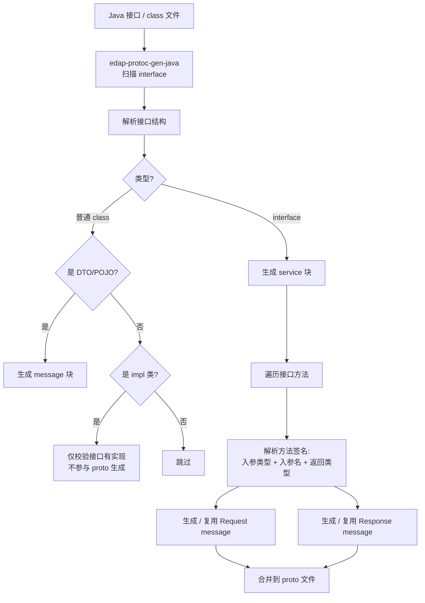

#### 使用方式

**Maven 插件**（在已有 Java 项目中）：

```xml
<build>
    <plugins>
        <plugin>
            <groupId>io.edap</groupId>
            <artifactId>edap-protoc-gen-java</artifactId>
            <version>1.0.0</version>
            <configuration>
                <sourcePackages>
                    <package>io.edap.demo.service</package>
                </sourcePackages>
                <outputDir>${project.basedir}/src/main/proto</outputDir>
                <naming>
                    <!-- 接口名 UserService → service UserService -->
                    <serviceSuffix>Service</serviceSuffix>
                </naming>
                <messageOptions>
                    <generateEmptyMessage>false</generateEmptyMessage>
                    <wrapSingleParam>true</wrapSingleParam>
                </messageOptions>
                <verifyImpl>true</verifyImpl>     <!-- 校验接口有实现类 -->
            </configuration>
            <executions>
                <execution>
                    <goals>
                        <goal>generate-proto</goal>
                    </goals>
                </execution>
            </executions>
        </plugin>
    </plugins>
</build>
```

**命令行工具**（适合临时转换）：

```bash
# 从源码目录扫描所有 interface
edap-protoc-gen-java \
    --source ./src/main/java \
    --output ./src/main/proto \
    --package io.edap.demo.service

# 从已编译的 class 文件扫描
edap-protoc-gen-java \
    --classpath ./target/classes \
    --output ./src/main/proto \
    --include "io.edap.demo.service.**"

# 只生成指定接口
edap-protoc-gen-java \
    --interface io.edap.demo.service.UserService \
    --output ./proto/user.proto

# 指定实现类（用于校验）
edap-protoc-gen-java \
    --interface io.edap.demo.service.UserService \
    --impl io.edap.demo.service.UserServiceImpl \
    --output ./proto/user.proto
```

#### 高级特性

**类型映射表**（Java → proto）：

| Java 类型 | proto 类型 | 说明 |
|----------|----------|------|
| `String` | `string` | |
| `int` / `Integer` | `int32` | |
| `long` / `Long` | `int64` | |
| `float` / `Float` | `float` | |
| `double` / `Double` | `double` | |
| `boolean` / `Boolean` | `bool` | |
| `byte[]` | `bytes` | |
| `BigDecimal` | `string` | 精度安全 |
| `BigInteger` | `int64` 或 `string` | 配置项 |
| `Date` / `LocalDateTime` | `string` 或自定义 | 配置项 |
| `List<T>` | `repeated T` | |
| `Map<K, V>` | `map<K, V>` | K/V 需是基本类型 |
| 自定义类 | 嵌套 message | 自动生成 |

**智能推断**（基于接口方法签名）：

- 方法多个入参 → 自动合并到一个 `XxxRequest` message（如 `UpdateUserRequest` 包含 `userId` + `req` 的字段）
- 方法单个基本类型入参 → 自动包装成 `XxxRequest`（如 `Long userId` → `GetUserRequest.user_id`）
- 方法单个 POJO 入参 → 可选包装（`wrapSingleParam` 配置项）
- 方法返回 `void` → 生成 `google.protobuf.Empty`
- 入参名（`userId`）→ 转为 snake_case 作为 message 字段名（`user_id`）
- 已存在的同名 POJO → 复用，不重复生成
- 关联 impl 类（`UserServiceImpl implements UserService`）→ 仅校验存在性，不读取方法体

#### 迁移工作流

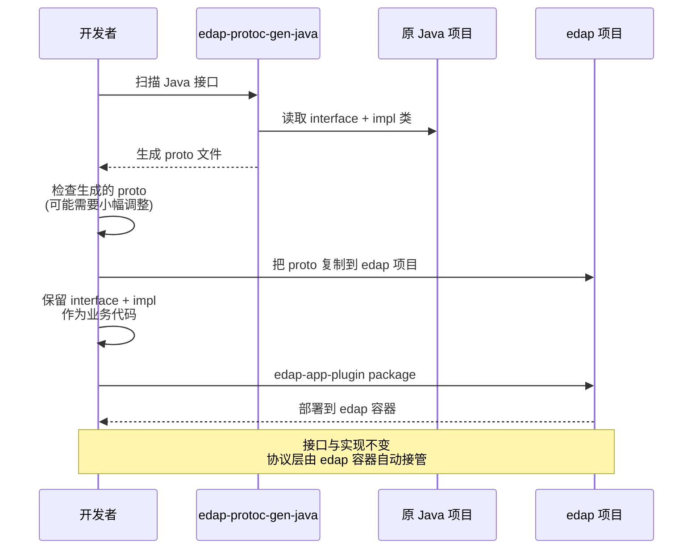

#### 与现有代码对齐

edap 已有 `ProtoServiceData` / `ProtoMethodData` / `AnnoData` 等基础结构，逆向生成工具可以**复用这些数据结构**：

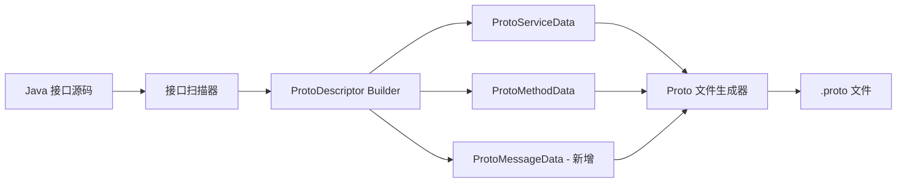

**关键收益**：

- ✅ **零迁移成本**：已有 Java 接口平滑切换到 edap
- ✅ **协议层升级**：从手工对接各种协议 → 由 edap 容器自动多协议发布
- ✅ **保留接口与实现**：业务代码完全不变，仅补一份 proto
- ✅ **工具复用**：复用 edap 现有的 ProtoServiceData 等数据结构
- ✅ **类型安全**：Java 类型 → proto 类型的映射是确定性的，无歧义

#### 局限与注意事项

- ⚠️ **当前仅支持纯 Java 接口**：不支持 Spring MVC `@RestController`、Dubbo `@DubboService` 等带框架注解的类（这些场景请先把 Controller 拆成 `interface + impl`）
- ⚠️ **方法重载**：Java 允许同名方法重载（不同参数），proto 不支持 → 同接口内重载方法需手动调整
- ⚠️ **复杂泛型可能丢失精度**：如 `List<Map<String, CustomType>>` 需要手动调整
- ⚠️ **继承关系拍平**：Java 接口继承在 proto 中用组合代替，需要手动调整
- ⚠️ **循环依赖**：接口互相引用时，生成的 proto 文件可能需要手动拆包

---

## 七、文档自动生成

### 7.1 文档生成管线

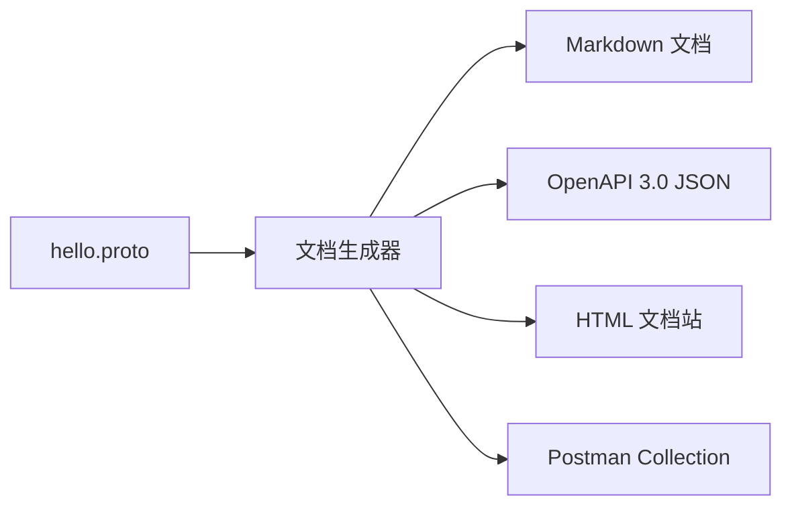

### 7.2 自动生成的 Markdown 示例

````markdown
# HelloService

> 自动生成于 hello.proto，请勿手动修改

## 接口列表

| 方法 | HTTP | WebSocket method | eRPC |
|------|------|-----------------|------|
| SayHello | `GET /v1/hello` | `HelloService.SayHello` | method_id=1001 |

## SayHello

**请求** `HelloRequest`
```json
{ "name": "string" }
```

**响应** `HelloResponse`
```json
{ "message": "string" }
```
````

---

## 八、多协议发布

### 8.1 容器层的多协议统一监听

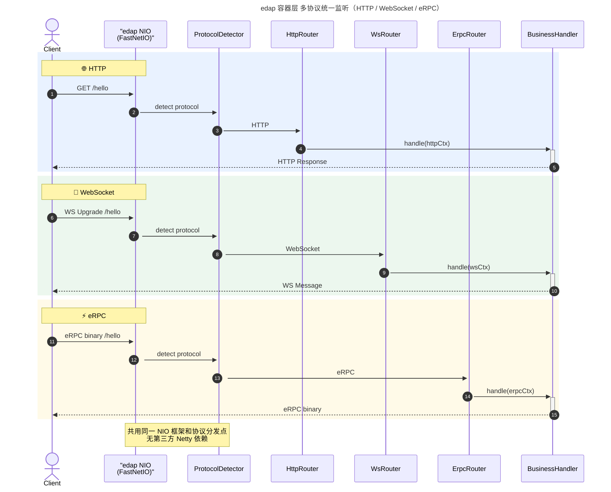

> **底层说明**：图中的 `edap NIO` 是 edap 自研的 NIO 框架（`io.edap.nio` 包，含 `FastNetIO` 等原生实现），不是 Netty。HTTP 层基于 `io.edap.http.server.HttpServerBuilder`，WS / eRPC 同理均为 edap 自研。整个容器不依赖任何第三方 NIO / HTTP 库。

### 8.2 节点驱动的协议发布

**应用零协议配置**。节点的类型在容器启动时由系统配置（或环境变量）决定，容器按节点类型激活对应的协议 Router。

```mermaid
flowchart LR
    NodeType[节点类型<br/>由系统配置决定]
    NodeType -->|HTTP 节点| Reg1[激活 HTTP Router + WS Router<br/>同端口扫描 google.api.http + edap.ws]
    NodeType -->|eRPC 节点| Reg2[激活 eRPC Router<br/>扫描 edap.rpc]
    NodeType -->|gRPC 节点| Reg3[激活 gRPC Router<br/>扫描 edap.grpc]

    Reg1 --> R1[HTTP Server :8080<br/>按 path 路由到 HTTP/WS Router]
    Reg2 --> R2[eRPC Router :9090]
    Reg3 --> R3[gRPC Router :9091]
```

**节点类型的配置方式**（容器侧，不是应用侧）：

```bash
# 通过系统属性
-Dedap.node.type=HTTP

# 或环境变量
EDAP_NODE_TYPE=ERPC

# 或容器启动配置文件
node:
  type: HTTP
```

### 8.3 单端口 vs 多端口方案对比

| 方案 | 优点 | 缺点 |
|------|------|------|
| 统一端口（协议嗅探） | 部署简单、负载均衡友好 | 需要解析协议头 |
| 多端口（每协议一端口） | 隔离清晰、协议纯粹 | 需要客户端配多个端口 |

**建议**：初期采用多端口，每个协议独立监听。

---

## 九、热部署（蓝绿部署）

### 9.1 部署元数据结构

```
apps/.deploy/
├── apps.json                       ← 应用 ID 列表
├── current-{appId}.json            ← 当前运行版本
├── previous-{appId}.json           ← 上一个版本（保留用于回滚）
├── staging-{appId}.json            ← 预上线版本（已加载,待切换）
└── history-{appId}.jsonl           ← 历史记录
```

### 9.2 热部署时序

```mermaid
sequenceDiagram
    autonumber
    participant Client as Client
    participant DM as DeployManager
    participant VM as VersionManager
    participant OldCtx as 旧版本 Context
    participant NewCtx as 新版本 Context

    Client->>DM: POST /deploy_app (新ear)
    DM->>VM: loadNew(newEar)
    VM->>NewCtx: 创建新 ClassLoader
    VM->>NewCtx: 创建新 AppContext
    VM->>NewCtx: beanMake + 启动
    NewCtx->>VM: 启动成功,写 staging-meta.json
    Note over NewCtx: 此时流量仍走 Old

    Client->>DM: POST /switch_app (appId)
    DM->>VM: switchVersion()
    VM->>VM: 原子切换 router 引用<br/>旧→current, 新→active
    VM->>DM: 写 current-meta.json
    DM-->>Client: 切换成功

    Note over OldCtx: 旧版本进入 Draining
    OldCtx->>OldCtx: 等待请求排空
    OldCtx->>OldCtx: 写 previous-meta.json
    OldCtx->>OldCtx: dispose Bean + 释放 ClassLoader
```

### 9.3 原子流量切换

```java
// 错误的做法
oldRouter.remove(path);
newRouter.add(path);   // 中间有空窗期

// 正确的做法（参考 Tomcat HostConfig）
AtomicReference<Router> currentRef = ...;
        newRouter.build();      // 先完整构建
currentRef.set(newRouter);  // 一行原子替换
```

### 9.4 优雅下线

```mermaid
flowchart TB
    Start[收到下线请求] --> Mark[标记为 Draining<br/>拒绝新连接]
    Mark --> Wait[等待进行中请求完成<br/>超时30s]
    Wait --> Notify{是否还有活跃连接?}
    Notify -->|是| Force[强制关闭<br/>记录告警]
    Notify -->|否| Disposal
    Force --> Disposal
    Disposal[Bean容器 dispose]
    Disposal --> Close[Closeable bean.stop]
    Close --> Dereg[从注册表移除]
    Dereg --> Free[释放 ClassLoader]
    Free --> Done[GC 回收]
```

### 9.5 资源释放清单

| 资源 | 释放方式 |
|------|---------|
| ClassLoader | 清空所有 ThreadLocal 引用 |
| 静态缓存 | BeanWrap / MethodWrap 清空 |
| Bean 单例 | `Lifecycle.stop()` + `DisposableBean` |
| 线程池 | shutdown + awaitTermination |
| 连接池 | DataSource.close |
| 定时任务 | Scheduler.remove |

---

## 十、有状态微服务与无中台部署

edap 支持两种部署形态：**有状态微服务** 和 **无中台部署**。这是 edap 区别于普通微服务框架的关键差异化能力。

### 10.1 两种部署形态概览

```mermaid
graph TB
    subgraph Stateful [有状态部署 - 分片亲和]
        S1[节点 1<br/>本地内存<br/>只服务 shard A]
        S2[节点 2<br/>本地内存<br/>只服务 shard B]
        S3[节点 N<br/>本地内存<br/>只服务 shard C]
        DB[(共享数据库)]
        S1 <-.->|读写本分片数据| DB
        S2 <-.->|读写本分片数据| DB
        S3 <-.->|读写本分片数据| DB
    end

    subgraph Stateless [无状态部署]
        N1[应用实例 1<br/>无状态]
        N2[应用实例 2<br/>无状态]
        N3[应用实例 N<br/>无状态]
        LB[负载均衡<br/>随机分配]
        LB --> N1
        LB --> N2
        LB --> N3
    end

subgraph NoMiddleware [无中台部署]
AppCtx[AppContext<br/>内置：注册发现/配置/监控]
Apps[应用集]
AppCtx -.内置.-> Apps
end
```

### 10.2 有状态微服务 —— 应对高并发资源需求

**核心场景**：某些资源（限流令牌、分布式锁、热点缓存、本地计数器、热点数据）需要**全局高频访问**，每次远程调用性能不够。

**edap 的解决思路**：
- **分片亲和路由**：相同 shard_key 的请求确定性路由到同一节点（一致性哈希，详见 §10.6）
- **本地内存即权威**：每个节点只维护自己分片的数据，**不跨节点同步内存**
- **DB 是唯一共享存储**：数据库共享即可（按 shard 分区是**可选的性能优化**，不是必需）
- **自然的数据局部性**：请求按 shard_key 确定性路由 → 每个节点天然只访问本分片数据，即便 DB 不分区，每个节点访问的也是自己的那部分数据
- **彻底摆脱 Redis**：因为没有跨节点共享内存需求，**不需要 Redis 类共享缓存**
- **DB 无并发冲突**：因为请求已按 shard_key 分开，**同一行数据只会被一个节点访问**——无需行锁 / 分布式事务，读写吞吐量大幅提升

```mermaid
graph LR
    subgraph Node [edap 节点 - 单 shard]
        subgraph App [应用实例]
            Bean[业务 Bean]
            LocalMem[本地内存<br/>只存本分片数据<br/>Map / Counter / Cache]
            Bean -.本地访问.-> LocalMem
        end
    end

    subgraph Cluster [集群 - 各节点独立 shard]
        N1[节点 1<br/>shard A]
        N2[节点 2<br/>shard B]
        N3[节点 N<br/>shard C]
    end

    LocalMem -.本地权威<br/>不跨节点同步.-> N1

    DB[(共享 DB<br/>是否分区可选)]
    N1 <-.->|读写本分片| DB
    N2 <-.->|读写本分片| DB
    N3 <-.->|读写本分片| DB
```

**高并发资源处理模式**：

| 场景 | 资源类型 | edap 实现 | 性能 |
|------|---------|----------|------|
| 限流 | 令牌桶 | 本地内存（userId 路由到固定节点）| 内存级访问 |
| 分布式锁 | 互斥信号 | 本地内存（lockKey 路由到固定节点）| 内存级访问 |
| 热点缓存 | KV 存储 | 本地 Map（key 路由到固定节点）| 内存级访问 |
| 计数器 | 数值累加 | 本地原子（counterKey 路由到固定节点）| 原子操作 |
| 会话 | Session | 本地 Map（sessionId 路由到固定节点）| 内存级访问 |
| DB 行读写 | 行 / 文档 | 同一行只被一个节点访问，**无行锁 / 无分布式事务** | 顺序写，无等待 |

**容器视角的有状态支持**：

```mermaid
classDiagram
    class StatefulApp {
        +String appId
        +boolean stateful
        +LocalMemory localMem
        +ShardRouter shardRouter
    }

    class LocalMemory {
        +Map~String,Object~ kv
        +AtomicLong counter
        +LockManager locks
        +put/get/remove
    }

    class ShardRouter {
        +String extractShardKey(request)
        +Node route(shardKey)
        +Map~String,Node~ ring
    }

    StatefulApp *-- LocalMemory
    StatefulApp --> ShardRouter : 同一 shardKey → 同一节点
```

**与无状态的关键区别**：

| 维度 | 无状态 | 有状态 |
|------|------|------|
| 扩缩容 | 直接加实例 | 一致性哈希重哈希（仅影响部分 shard）|
| 故障转移 | 任意实例可接 | shard 转移给其他节点接管 |
| 性能 | 受远程调用限制 | 内存级访问（本地内存，无跨节点通信）|
| DB 并发 | 同一行可能被多实例写 | 同一行只被一个节点写，**无行锁 / 无分布式事务** |
| 复杂度 | 简单 | 需考虑分片路由 |
| 共享内存 | 无 | 无（每个 shard 独立）|
| 适用场景 | HTTP API / 静态计算 | 高并发资源 / 热点数据 |

### 10.2.1 开发期体验 —— 配置驱动，本地内存放心用

edap 的有状态服务开发模型：**开发者只管写业务代码 + 声明配置，路由 / 节点分配 / shard 迁移由容器在运行时自动处理**。开发时可以把有状态服务当作"加强版的本地 Map"来用。

#### 三层职责划分

| 层级 | 开发者做什么 | 容器做什么 |
|------|------------|-----------|
| **代码层** | 按业务逻辑读写本地 Map / Cache / Counter | — |
| **声明层** | proto 方法 option 加 `(edap.rpc.sharded) = true` + `(edap.shard.key) = "user_id"` | 解析 proto option / 配置；分片数由容器运行时决定 |
| **运行层** | — | 一致性哈希路由、本地内存实例化、shard 迁移、运行期调优 |

#### 声明方式 —— proto option 优先，配置文件补充

**方式 1（推荐）**：在 proto 方法 option 中直接声明

```protobuf
service OrderService {
  rpc GetUserOrders(GetUserOrdersRequest) returns (GetUserOrdersResponse) {
    option (google.api.http.get) = "/v1/users/{user_id}/orders";
    option (edap.rpc.sharded) = true;         // ← 声明该方法为可分片（生成方法级 @Sharded 注解）
    option (edap.shard.key) = "user_id";      // ← 声明分片键（生成 @ShardKey 注解）
    option (edap.local_cache) = true;         // ← 启用本地内存缓存（可选）
    option (edap.cache_ttl) = "60s";          // ← 缓存过期（可选）
  };
}
```

**方式 2**：在 `application.yml` 中集中配置（适合非 proto 项目，或临时调整）

```yaml
# application.yml - 应用配置
edap:
  services:
    - name: OrderService
      stateful: true              # ← 声明为有状态服务
      shardKey: "user_id"         # ← 分片键
      localCache: true            # ← 启用本地内存缓存
      cacheTTL: 60s               # ← 缓存过期时间（可选）
```

#### 运行期调整 —— 根据数据分布动态调

```yaml
# 容器运行时，根据实际数据分布调整分片键或缓存策略
# 例：发现 user_id 分布不均，改用 tenant_id 平衡
edap:
  services:
    - name: OrderService
      stateful: true
      shardKey: "tenant_id"       # ← 运行期调整，无需改代码
      localCache: true
      cacheTTL: 120s              # ← 调长缓存时间
```

#### 典型代码写法（与写无状态一样简单）

```java
@Service
public class OrderServiceImpl implements OrderService {

    // 直接用本地 Map，无需考虑分布式
    private final Map<Long, List<Order>> cache = new ConcurrentHashMap<>();

    @Override
    public GetUserOrdersResponse getUserOrders(GetUserOrdersRequest req) {
        long userId = req.getUserId();

        // 本地缓存查找 → 命中率 90%+（同 shard_key 必路由到此节点）
        List<Order> orders = cache.get(userId);
        if (orders == null) {
            orders = db.query("SELECT * FROM orders WHERE user_id = ?", userId);
            cache.put(userId, orders);
        }

        return GetUserOrdersResponse.newBuilder()
                .addAllOrders(orders.stream().map(this::toProto).collect(toList()))
                .build();
    }
}
```

#### 开发流程对比

| 传统微服务开发时 | edap 有状态开发时 |
|-----------------|------------------|
| 思考：要不要加 Redis？ | 不用：直接用本地 Map |
| 思考：要不要分布式锁？ | 不用：单节点访问无竞争 |
| 思考：缓存击穿 / 数据一致性？ | 不用：本地访问无这些问题 |
| 思考：水平扩展后状态怎么办？ | 不用：路由自动按 shard 分配 |
| 写代码时刻提醒"我在写分布式" | 写代码就是普通单进程写法 |
| 部署后才看到效果 | 配置文件声明后即可看到分片效果 |

#### 关键收益

- ✅ **本地内存敢用**：开发者确信同 shard_key 请求都路由到此节点 → 本地 Map 缓存安全有效
- ✅ **开发零负担**：按单进程模式写代码，不被分布式复杂度干扰
- ✅ **运行期可调**：根据实际数据分布调整 shard_key、缓存策略，**无需改代码**
- ✅ **保持简单心智模型**：代码不需要知道自己在集群中运行
- ✅ **调试简单**：本地开发可直接 `stateful: false` 跑无状态模式

### 10.3 无中台部署 —— 自包含的容器

**传统微服务需要的中台**：
- 配置中心（Apollo / Nacos）
- 注册中心（Eureka / Consul）
- 服务发现（DNS / 注册中心）
- 监控中心（Prometheus / Grafana）
- 链路追踪（Zipkin / Jaeger）
- 限流熔断（Sentinel / Hystrix）

**edap 的"无中台"思路**：这些能力**内置到容器**，不依赖外部服务。

```mermaid
graph TB
    subgraph Traditional [传统微服务 - 有中台]
        App1[应用 1] --> C1[配置中心]
        App2[应用 2] --> C1
        App1 --> R1[注册中心]
        App2 --> R1
        App1 --> M1[监控中心]
        App2 --> M1
    end

subgraph EdapStyle [edap 部署 - 无中台]
CAC[Container AppContext<br/>内置：<br/>· 注册表<br/>· 配置存储<br/>· 健康检查<br/>· 指标收集]
AppA[应用 A]
AppB[应用 B]
CAC -.内置.-> AppA
CAC -.内置.-> AppB
end
```

**容器内置能力清单**：

| 传统中台 | edap 内置实现 | 备注 |
|---------|-------------|------|
| 配置中心 | `Container.Props` + `AppContext.cfg()` | 配置随 EAR 部署，无外部依赖 |
| 注册中心 | `AppRegistry`（Map<appId, AppContext>） | 进程内内存，无需网络发现 |
| 服务发现 | 容器内部 DNS / 直接调用 | 同进程内 RPC，无需网络 |
| 健康检查 | `AppState` 状态机 + 心跳 | 进程内监控 |
| 监控指标 | 容器内置 Metrics 收集器 | 可选导出到外部系统 |
| 限流熔断 | 应用内 `LocalMemory` 限流 | 本地内存（按 shard_key 路由），无需外部协调 |
| 链路追踪 | 容器内置 TraceId 传播 | 进程内传递 |

### 10.4 有状态与无中台的结合

**edap 的典型架构**：

```mermaid
graph TB
    subgraph Container [edap 容器 - 单进程]
        subgraph StatefulApps [有状态应用集 - 各节点独立 shard]
            SA1[有状态实例 1<br/>本地内存 shard A]
            SA2[有状态实例 2<br/>本地内存 shard B]
        end

        subgraph StatelessApps [无状态应用集]
            NA1[无状态实例 1]
            NA2[无状态实例 2]
            NA3[无状态实例 N]
        end

        subgraph Builtin [容器内置 - 替代中台]
            BuiltInReg[注册表]
            BuiltInCfg[配置存储]
            BuiltInMon[健康检查]
            BuiltInTrace[链路追踪]
        end
    end

    External[外部客户端]
    External --> NA1
    External --> NA2
    External --> NA3

    SA1 -.独立 shard<br/>不互相同步.-> SA2
```

**核心收益**：

- ✅ **零外部依赖**：单进程即可运行，无需额外部署 Nacos / Redis / Prometheus
- ✅ **启动即用**：不需要等中台就绪，应用就能跑
- ✅ **资源本地化**：高并发资源走本地内存，性能提升 10×~100×
- ✅ **渐进式外部化**：需要时再把配置/监控导出到外部系统
- ✅ **单机即是集群**：单 edap 容器 = 一个完整的微服务平台

### 10.5 何时需要扩展到外部系统

| 阶段 | 形态 | edap 能力 |
|------|------|----------|
| 单机 | 单 edap 容器，所有应用部署其内 | 完全无外部依赖 |
| 小集群 | 2~5 个 edap 节点，各节点独立 shard | 一致性哈希路由；DB 分区是可选性能优化 |
| 中型集群 | 多个 edap 节点 + 外部注册中心 | 容器可对接 Nacos / Consul |
| 大型集群 | 完整微服务生态 | 配置/监控/链路全外部化 |

> edap 的"无中台"不是"不能对接中台"，而是**开局无需中台**。

### 10.6 分片亲和性 + 批量处理 —— 吞吐量倍增器

这是 edap 有状态服务的**杀手锏**：通过请求属性分片，让相同属性的请求集中到同一节点处理，从而充分利用本地缓存和批量处理。

#### 核心思想

```mermaid
graph LR
    subgraph Req [请求]
        R1[请求<br/>userId=123]
        R2[请求<br/>userId=456]
        R3[请求<br/>userId=123]
        R4[请求<br/>userId=789]
        R5[请求<br/>userId=456]
    end

    subgraph Hash [一致性哈希]
        H[Shard Key 提取<br/>+ 一致性哈希]
    end

    subgraph Nodes [节点集群]
        N1[节点 A<br/>userId=123 分片]
        N2[节点 B<br/>userId=456 分片]
        N3[节点 C<br/>userId=789 分片]
    end

    R1 --> H
    R2 --> H
    R3 --> H
    R4 --> H
    R5 --> H

    H -->|123 →| N1
    H -->|456 →| N2
    H -->|789 →| N3
```

**关键特性**：
- 相同 shard_key 的请求**始终路由到同一节点**（即使节点扩缩容，影响范围最小）
- 同一节点收到多个同分片请求后，可以**合并为批量处理**
- 到达节点后，**本地缓存命中**（无需远程调用）

#### 三层性能优化

```mermaid
graph TB
    subgraph L1 [第一层 - 路由亲和]
        R[请求进入] --> Key[提取 shard_key]
        Key --> Hash[一致性哈希]
        Hash --> Route[路由到目标节点]
    end

subgraph L2 [第二层 - 本地缓存]
Cache{本地缓存命中?}
Cache -->|命中| Direct[直接返回<br/>~ 1ms]
Cache -->|未命中| Process[进入处理流程]
end

subgraph L3 [第三层 - 批量处理]
Buf[请求缓冲队列]
Batch[批量触发器<br/>时间窗口 / 大小阈值]
Exec[一次性批量执行]
Buf --> Batch
Batch --> Exec
Process --> Buf
end

Route --> Cache
```

**性能对比**：

| 优化层级 | 延迟 | 吞吐量 | 适用场景 |
|---------|------|--------|---------|
| 无优化（远程调用） | 100ms × N | 低 | 简单查询 |
| 本地缓存命中 | ~1ms | 高 ×100 | 重复请求 |
| 批量处理（10合1） | ~10ms | 高 ×10 | 聚合计算 |
| 缓存 + 批量 | ~5ms | 高 ×1000 | 高频聚合 |

#### shard_key 的声明方式

**proto 中声明**：

```protobuf
syntax = "proto3";
import "edap/shard.proto";   // edap 自定义分片 option

service OrderService {
  rpc GetUserOrders(GetUserOrdersRequest) returns (GetUserOrdersResponse) {
    option (google.api.http).get = "/v1/users/{user_id}/orders";
    option (edap.shard.key) = "user_id";          // ← 声明分片键（生成 @ShardKey 注解；分片数由 ClusterShardRouter 运行时决定）
    option (edap.shard_batch) = true;             // ← 启用批量处理
  };
}

message GetUserOrdersRequest {
  string user_id = 1;
  int32 page_size = 2;
}
```

**HTTP 协议提取**（自动从 path/query/header）：
```
GET /v1/users/123/orders    → shard_key = "123" (from path)
GET /api?session_id=xxx     → shard_key = "xxx" (from query)
```

**eRPC 协议提取**（从二进制字段）：
```
message Frame {
    int32 method_id = 1;
    bytes body = 2;
    string shard_key = 3;   // ← 由调用方填充
}
```

#### 典型应用场景

```mermaid
flowchart TB
    Req(["同一 shard key 的请求<br/>userId = 123"])

    subgraph S1 ["⚡ 场景 1 - 电商订单"]
        direction TB
        C1("用户 A 订单请求"):::flow
        C1C("节点本地缓存<br/>订单列表"):::cache
        C1B("批量聚合<br/>单次 DB 查询"):::cache
        C1 --> C1C
        C1 --> C1B
    end

    subgraph S2 ["🔌 场景 2 - WebSocket 长连接"]
        direction TB
        C2("同 session 连接"):::flow
        C2S("连接状态<br/>本地内存"):::state
        C2 --> C2S
    end

    subgraph S3 ["🚦 场景 3 - 用户级限流"]
        direction TB
        C3("userId=123 请求"):::flow
        C3T("本地令牌桶<br/>专用 quota"):::state
        C3 --> C3T
    end

    subgraph S4 ["📊 场景 4 - 实时聚合"]
        direction TB
        C4("同 partition 消息"):::flow
        C4A("批量聚合<br/>单次 DB 查询"):::cache
        C4 --> C4A
    end

    Req -. 一致性哈希 .-> S1
    Req -. session .-> S2
    Req -. userId .-> S3
    Req -. partition .-> S4

    classDef flow  fill:#d1e7dd,stroke:#198754,color:#0f5132,rx:10,ry:10
    classDef cache fill:#fff3cd,stroke:#ffc107,color:#664d03,rx:10,ry:10
    classDef state fill:#e2d9f3,stroke:#6f42c1,color:#4a2a85,rx:10,ry:10
```

#### 与无状态路由的对比

| 维度 | 无状态（随机路由） | 分片亲和 |
|------|------------------|---------|
| 路由策略 | 随机 / 轮询 | 一致性哈希 |
| 本地缓存 | 无效（命中率低） | 高效（命中率 90%+） |
| 批量处理 | 难以聚合 | 天然聚合 |
| 故障转移 | 任意节点接 | 一致性哈希重新分片，受影响范围可控 |
| 适用场景 | 简单 CRUD | 高并发聚合场景 |

#### 容器层支持

```mermaid
classDiagram
    class ShardRouter {
        +String extractShardKey(Context ctx, MethodDescriptor method)
        +Node route(String shardKey)
        +Map~String,Node~ ring
    }

    class LocalCache {
        +get(key) Object
        +put(key, value, ttl)
        +invalidate(key)
        +Map~String,CacheEntry~ data
    }

    class BatchProcessor {
        +submit(shardKey, request)
        +CompletableFuture~Result~ waitFor()
        +flush() 强制触发
    }

    class StatefulInstance {
        +ShardRouter router
        +LocalCache cache
        +BatchProcessor batcher
        +SharedMemory memory
    }

    StatefulInstance *-- ShardRouter
    StatefulInstance *-- LocalCache
    StatefulInstance *-- BatchProcessor
    StatefulInstance *-- SharedMemory
```

**关键收益**：

- ✅ **缓存命中率提升 10×+**：同分片请求集中，本地缓存有效
- ✅ **批量合并减少远程调用**：10 个请求合并为 1 次批处理
- ✅ **本地内存亲和**：高频访问的资源就在本地，避免网络延迟
- ✅ **故障范围可控**：扩缩容只影响部分分片，不全局重哈希
- ✅ **天然适配电商/订单/IM 等场景**：按用户分片是这些场景的天然属性

---

## 十一、容器能力下沉 —— 应用包按需精简

edap 容器**内置丰富的运行时能力**，应用打包时可以剔除这些已存在的依赖，**让应用包体积大幅缩减**。

### 11.1 设计思想

```mermaid
graph TB
    subgraph Traditional [传统模式 - 应用自带所有依赖]
        A1[应用 A<br/>10MB<br/>含 edap-json + httpclient + ...]
        A2[应用 B<br/>10MB<br/>含 edap-json + httpclient + ...]
        A3[应用 C<br/>10MB<br/>含 edap-json + httpclient + ...]
    end

subgraph EdapStyle [edap 模式 - 容器提供能力，应用精简]
CT[edap 容器<br/>内置能力库<br/>edap-json + httpclient + ...]
B1[应用 A<br/>1MB<br/>仅业务代码]
B2[应用 B<br/>1MB<br/>仅业务代码]
B3[应用 C<br/>1MB<br/>仅业务代码]
B1 -. 双亲委派 .-> CT
B2 -. 双亲委派 .-> CT
B3 -. 双亲委派 .-> CT
end

Traditional -. 对比 .-> EdapStyle
```

**核心机制**：父子 ClassLoader 双亲委派
- 应用 ClassLoader 找不到类时，自动委派到容器 ClassLoader
- 容器已提供的 jar，应用包内不再需要重复打包
- 共享 jar 在内存中只有一份（应用之间共享）

### 11.2 容器内置能力清单

edap 容器按"能力域"提供以下运行时支持：

| 能力域 | 容器内置 | 应用端使用方式 |
|--------|---------|---------------|
| **JSON 解析** | edap-json（自研） | 直接 import，零配置；性能优于 fastjson / jackson，与 dsl-json 相当但 API 更简洁，支持 **JSON5** |
| **HTTP 客户端** | OkHttp / HttpClient | 通过 `@HttpClient` 注入 |
| **编解码** | protobuf | proto 编译产物已包含 |
| **序列化** | protobuf / kryo / hessian | 注解 `@Serializer("protobuf")` |
| **数据库驱动** | JDBC 驱动（mysql / pgsql / oracle）| 通过 DataSource Bean 注入 |
| **连接池** | HikariCP / Druid | 通过 `@DataSource(url=...)` |
| **缓存客户端** | Redis / Caffeine | 通过 `@CacheClient` 注入 |
| **消息队列** | Kafka / RabbitMQ / RocketMQ | 通过 `@MQClient` 注入 |
| **配置解析** | properties / yaml / toml | 通过 `cfg()` 直接读取 |
| **日志** | edap-log（自研） | 通过 `Logger` 注解；性能优于 logback / log4j2 |
| **工具库** | Hutool / Guava / Commons | 直接 import |
| **AOP** | ASM / ByteBuddy | 注解自动织入 |
| **校验** | Hibernate Validator | `@NotNull @Min(...)` 注解 |
| **链路追踪** | 内置 TraceId 传递 | 自动注入到 MDC |
| **限流熔断** | Sentinel 内嵌版 | `@RateLimit(...)` |
| **定时任务** | 内置 Scheduler | `@Scheduled(cron=...)` |
| **分布式锁** | 内置 + 可选 Redis | `@DistributedLock` |

**应用打包时的精简效果**：

```
应用包 (传统)         应用包 (edap)
─────────────         ─────────────
edap-json.jar       → 容器提供（自研 JSON）
okhttp-4.12.0.jar    → 容器提供
mysql-connector.jar  → 容器提供
druid-1.2.20.jar     → 容器提供
edap-log.jar  → 容器提供（自研日志）
hutool-all.jar       → 容器提供
... 30+ 依赖
业务代码 .class       ← 保留
                      ─────
总计: 50MB            总计: 1MB
```

### 11.3 容器能力的元数据声明

容器在启动时发布"能力清单"（`container-capabilities.json`），供应用打包工具识别：

```json
{
  "container": {
    "name": "edap-container",
    "version": "1.0.0",
    "provides": [
      {
        "groupId": "io.edap",
        "artifactId": "edap-json",
        "version": "1.0.0",
        "scope": "runtime",
        "note": "自研 JSON 库，性能优于 fastjson/jackson，与 dsl-json 相当但 API 更简洁，支持 JSON5"
      },
      {
        "groupId": "com.squareup.okhttp3",
        "artifactId": "okhttp",
        "version": "4.12.0",
        "scope": "runtime"
      },
      {
        "groupId": "mysql",
        "artifactId": "mysql-connector-java",
        "version": "8.0.33",
        "scope": "runtime"
      }
      // ...
    ]
  }
}
```

### 11.4 应用打包时的精简流程

**一行命令搞定**：

```bash
edap-app-plugin package --container-version 1.0.0
```

`edap-app-plugin` 是 edap 官方提供的打包插件，集成在应用项目的 `pom.xml`（或 `build.gradle`）里。它做了两件事：

1. **剔除容器已有的包**（按指定容器版本过滤）
2. **自动生成 `build.json`**（含部署所需的全部元数据）

```mermaid
sequenceDiagram
    participant Dev as 开发者
    participant Plug as edap-app-plugin
    participant Ver as 版本清单服务
    participant EAR as hello.ear

    Dev->>Plug: edap-app-plugin package<br/>--container-version 1.0.0
    Plug->>Ver: 拉取容器版本 1.0.0 的<br/>container-capabilities.json
    Ver-->>Plug: 返回能力清单<br/>(含所有提供的 jar)
    Plug->>Plug: 扫描应用依赖树
    Plug->>Plug: 比对依赖 vs 容器能力<br/>(按 groupId/artifactId/version)
Loop 每个已剔除的依赖
        Plug->>Plug: 从 EAR 移除该 jar
End
Plug->>Plug: 自动生成 build.json<br/>(maven info + git info + 时间戳)
Plug->>Plug: 校验剩余依赖<br/>能通过双亲委派加载
Plug-->>Dev: hello.ear (1MB)
```

**关键特性**：

- ✅ **按容器版本过滤**：开发者明确指定目标容器版本，插件按版本清单剔除
- ✅ **自动生成 build.json**：不再需要手工编写 EAR 元数据
- ✅ **依赖树扫描**：递归扫描所有传递依赖，不漏 jar
- ✅ **可回退**：保留剔除清单在 `.edap/stripped-deps.txt`，调试时一目了然

**pom.xml 极简配置**（一次性，写完就不用管）：

```xml
<build>
    <plugins>
        <plugin>
            <groupId>io.edap</groupId>
            <artifactId>edap-app-plugin</artifactId>
            <version>1.0.0</version>
            <configuration>
                <!-- 默认目标容器版本（可用命令行 --container-version 覆盖）-->
                <containerVersion>1.0.0</containerVersion>

                <!-- 容器版本清单来源（默认从 edap 官方仓库拉取）-->
                <capabilitiesSource>https://caps.edap.io/v1/{version}</capabilitiesSource>

                <!-- 剔除策略：SAFE（保守，只剔除完全匹配）/ FORCE（激进，含传递依赖）-->
                <stripMode>SAFE</stripMode>
            </configuration>
        </plugin>
    </plugins>
</build>
```

**开发者体验**：

```bash
# 开发期：编译运行（不打包，不剔除）
mvn compile
mvn test

# 上线：打包成精简 EAR
mvn package                                    # 使用默认容器版本
edap-app-plugin package --container-version 1.2.0   # 显式指定版本

# 部署到指定容器
curl -X POST "http://container:1111/deploy_app?name=hello&version=1.0.0"

# 调试：查看本次剔除了哪些 jar
cat .edap/stripped-deps.txt
# edap-json-1.0.0.jar      (由容器提供)
# okhttp-4.12.0.jar         (由容器提供)
# mysql-connector-8.0.33.jar (由容器提供)
# ...
```

### 11.5 自动生成的 build.json

`build.json` 是 EAR 包的"自描述"清单，由 `edap-app-plugin` 自动生成，**开发者不需要手写**。

```json
{
  "appId": "io.edap.demo:hello",
  "version": "1.0.0",
  "containerVersion": "1.0.0",
  "buildTime": "2026-08-09T12:00:00Z",
  "git": {
    "branch": "main",
    "commit": "a1b2c3d",
    "commitMessage": "feat: add user service"
  },
  "maven": {
    "groupId": "io.edap.demo",
    "artifactId": "hello",
    "version": "1.0.0",
    "dependencies": [
      // 只保留未被容器剔除的依赖
      { "groupId": "io.edap", "artifactId": "hello-common", "version": "1.0.0" }
    ]
  },
  "capabilities": {
    "stripped": [
      { "groupId": "io.edap", "artifactId": "edap-json", "version": "1.0.0" },
      { "groupId": "com.squareup.okhttp3", "artifactId": "okhttp", "version": "4.12.0" },
      { "groupId": "mysql", "artifactId": "mysql-connector-java", "version": "8.0.33" }
    ],
    "kept": [
      { "groupId": "io.edap", "artifactId": "hello-common", "version": "1.0.0" }
    ]
  },
  "packages": [
    {
      "artifactId": "hello-api",
      "path": "hello-api/",
      "protoFiles": ["hello-api/api.proto"],
      "entryClasses": ["io.edap.api.UserServiceImpl"]
    },
    {
      "artifactId": "hello-common",
      "path": "hello-common/",
      "protoFiles": ["hello-common/common.proto"],
      "entryClasses": ["io.edap.common.BaseUtils"]
    }
  ]
}
```

**build.json 自动生成的内容**：

| 字段 | 来源 |
|------|------|
| `appId` / `version` | pom.xml |
| `containerVersion` | 命令行参数 |
| `buildTime` | 构建时刻 |
| `git.*` | 自动从 git 仓库提取（branch / commit / message）|
| `maven.*` | pom.xml 解析 |
| `capabilities.stripped` | 容器能力清单匹配结果 |
| `capabilities.kept` | 应用自带依赖（未被容器覆盖）|
| `packages` | 扫描 EAR 内 artifactId 目录生成 |

**收益**：

- ✅ **零手工维护**：开发者不再需要手写 build.json
- ✅ **元数据完整**：git 信息、maven 依赖、能力匹配结果全自动填充
- ✅ **可追溯**：`.edap/stripped-deps.txt` 记录每次剔除，方便审计
- ✅ **版本一致**：应用指定容器版本后，部署到非匹配版本容器时会被拒绝

### 11.7 三个关键保障

#### 1. 双亲委派可加载性验证

```mermaid
flowchart TB
    Strip[剔除依赖] --> Check{容器能加载?}
    Check -->|是| Pass[通过精简]
    Check -->|否| Keep[保留依赖]
```

打包插件在剔除前，验证：
- 容器 CL 确实能加载该类（不是仅 manifest 声明）
- 类的 API 签名与应用使用的版本兼容

#### 2. 版本冲突处理

```mermaid
graph LR
    A[应用想用 edap-json 2.0] --> B{容器提供 1.0.0}
    B -->|完全匹配| Strip[剔除]
    B -->|版本不匹配| Options{策略选择}
    Options -->|升级应用| Upgrade[升级应用代码到 1.0.0]
    Options -->|降级应用| Downgrade[应用代码改用 2.0 API]
    Options -->|本地保留| Keep[本地保留 edap-json 2.0<br/>应用 CL 优先加载]
```

#### 3. 应用覆盖容器

应用有特殊版本需求时，可以"应用覆盖容器"：

```xml
<configuration>
    <!-- 这个依赖即使容器提供，也保留在应用包内 -->
    <preserveDependencies>
        <dependency>com.google.guava:guava:31.0-jre</dependency>
    </preserveDependencies>
</configuration>
```

应用 ClassLoader 优先于容器 ClassLoader 加载（标准 Java 双亲委派的反向应用）。

### 11.8 收益与适用场景

| 场景 | 收益 | 示例 |
|------|------|------|
| 微服务架构 | 单应用包从 50MB 缩到 1MB | 部署 100 个微服务，节省 5GB 镜像空间 |
| Serverless | 冷启动时间减少（解压少）| 启动从 2s 降到 200ms |
| 边缘计算 | 镜像小，下载快 | K8s 节点拉镜像从 1min 降到 5s |
| 离线部署 | 应用分发轻量 | 推送 1MB vs 50MB 到边缘设备 |

**对开发者的影响**：

- ✅ **应用包极小**：只包含业务代码，部署更快
- ✅ **共享 jar 统一管理**：容器升级时，所有应用自动受益
- ✅ **依赖收敛**：避免每个应用版本不一致（容器统一版本）
- ✅ **构建更快**：剔除 jar 后打包、签名、传输都更快

**对容器的责任**：

- ⚠️ **容器版本要稳**：核心库一旦定下，不轻易变更 API（否则破坏应用）
- ⚠️ **能力清单要准**：漏声明会导致应用找不到类
- ⚠️ **兼容性测试**：每个容器版本要跑完整应用兼容性测试

### 11.9 与 OSGi / JPMS 的对比

| 维度 | OSGi | JPMS（Java 模块系统） | edap 容器能力下沉 |
|------|------|-------------------|------------------|
| 模块边界 | Bundle | module-info.java | EAR / ClassLoader |
| 类共享 | Export-Package | requires / transitive | 双亲委派 |
| 打包体积 | 中 | 中 | 极小 |
| 学习成本 | 高（OSGi 服务编程模型）| 中 | 低（标准 Maven）|
| 运行时复杂度 | 高 | 中 | 低（透明）|
| 适用场景 | 大型复杂系统 | JDK 模块化 | 微服务 / Serverless |

> edap 的"能力下沉"是**轻量级模块化**：不需要 OSGi 那样的复杂编程模型，不需要 JPMS 的 module-info.java 改造，只需 Maven 插件 + 双亲委派即可达成。

---

## 十二、应用状态机

```mermaid
stateDiagram-v2
    [*] --> Created : 扫描到 EAR
    Created --> Deploying : 解析+加载ClassLoader
    Deploying --> Staging : Bean容器启动完成
    Staging --> Active : 流量切换成功
    Staging --> Failed : 启动失败
    Active --> Upgrading : 收到新版本
    Upgrading --> Staging : 新版本启动
    Upgrading --> Active : 回滚
    Active --> Draining : 收到下线请求
    Draining --> Removed : 请求排空+资源释放
    Failed --> [*]
    Removed --> [*]
```

---

## 十三、容器核心类设计

> **概念边界**：`io.edap.Edap` 是 NIO 框架 + `ServerGroup` 的运行时容器（位于 `edap-nio` 模块），**不**依赖下游模块。`Container` 是普通 Java 应用（EAR 微服务）的容器，**位于 `edap-container` 模块**，通过 Edap 暴露的 `addServerGroup` / `getServerGroups` / `getNio` / `getProps` API 在 Edap 上注册自己的 `Server` 实例。独立 NIO 服务（未来的 edap-gateway / edap-mail 等）也是同样的接入方式。

### 13.1 顶层架构

```mermaid
classDiagram
    direction TB

    class Edap {
        <<NIO 框架 + ServerGroup 运行时>>
        +FastNetIO nio
        +Map~String,ServerGroup~ serverGroups
        +getNio()
        +getProps()
        +addServerGroup(ServerGroup)
        +getServerGroups()
        +run()
        +stop()
    }

    class Container {
        <<Java 应用容器<br/>(edap-container 模块)>>
        +Edap edap
        +File appsDir
        +AppRegistry apps
        +DeployManager deployManager
        +attach(Edap)
        +start()
        +stop()
        +deploy(File ear)
        +undeploy(appId, version)
    }

    class AppContext {
        +String appId
        +String version
        +ClassLoader appCL
        +BeanContainer beans
        +VersionManager versions
        +start()
        +stop()
    }

    class AppRegistry {
        +Map~String, List~AppContext~~ apps
        +register(AppContext)
        +get(appId)
        +listVersions(appId)
        +unregister(appId, version)
    }

    class DeployManager {
        +Container container
        +deployApp(name, version)
        +undeployApp(appId, version)
        +switchVersion(appId, version)
        +listApps()
    }

    Edap *-- ServerGroup : serverGroups
    Container ..> Edap : 调用 addServerGroup / getNio / getProps
    Container *-- AppRegistry
    AppRegistry *-- AppContext
    Container *-- DeployManager
    DeployManager --> Container : 操作

    classDef nioContainer fill:#0d6efd,stroke:#0a58ca,color:#fff,stroke-width:3px,rx:15,ry:15
    classDef javaContainer fill:#198754,stroke:#146c43,color:#fff,stroke-width:3px,rx:15,ry:15
    classDef component fill:#cfe2ff,stroke:#0d6efd,stroke-width:1.5px,color:#0a2540,rx:10,ry:10

    class Edap nioContainer
    class Container javaContainer
    class AppContext component
    class AppRegistry component
    class DeployManager component
```

**当前映射**：

| 本节设计名 | 当前代码对应 |
|------------|-------------|
| `Edap` | `io.edap.Edap`（已存在，NIO 框架 + ServerGroup 运行时，**保留** `addServerGroup` / `getServerGroups`） |
| `Container` | `io.edap.container.Container`（**新增**，在 edap-container 模块；通过 `edap.addServerGroup(...)` 接入） |
| `Edap.run()` | 启动 `FastNetIO` 后遍历 `serverGroups` 启动各 Server；Container 的 start 在 edap-container 的 Bootstrap 里 |
| `AppRegistry` | `Map<String, ServerGroup>` 在 `Edap` 内部（保留为 Edap 的通用 ServerGroup 概念；Container 自己在内部维护 appId → AppContext 映射） |
| `AppContext` | **目前不存在**——本节 13.3 要新增的设计 |
| `DeployManager` | `io.edap.container.mw.DeployManager`（已存在，改为持有 `Container`） |

### 13.2 DeployManager 重构后的样子

```java
public class DeployManager {
    private final Container container;
    private final File appsDir;

    public DeployManager(Container container, File appsDir) {
        this.container = container;
        this.appsDir = appsDir;
    }

    // 不再做任何加载 ClassLoader、初始化 Bean 的工作
    public BaseResult<String> deployApp(String name, String version) {
        File ear = locateEar(name, version);
        return container.deploy(ear);  // 委派给应用容器
    }

    public List<MicroServiceInfo> queryAppList() {
        return container.listApps();   // 委派给应用容器
    }

    public BaseResult<String> startApps() {
        return container.startApps();  // 委派给应用容器
    }
}
```

### 13.3 AppContext 设计（综合 Solon 与 Spring 之长）

> 原则：**轻量反射**（来自 Solon，避免启动期全 classpath 扫描） + **完整生命周期与扩展点**（来自 Spring，企业级场景） + **edap 独有**：per-EAR 隔离 + 协议感知 + shard 亲和。

#### 13.3.1 定位与边界

AppContext 是**单个应用**（一个 `appId` 一份；多版本时按版本号生成多个实例）的运行期容器，由 `Container.deploy(ear)` 创建并交给 `AppRegistry` 持有。

明确**不**承担：

- 全局单例（全局能力由 `Container` + 容器 CL 提供）
- 协议层（HTTP/WS/eRPC Router 是平级组件，AppContext 把路由挂到自己的 `RouterHub`，由 `Container` 按节点能力选择性 bind 到 `protocolRouters`）
- 跨 AppContext 通信（兄弟隔离，跨应用走 eRPC/gRPC）

#### 13.3.2 类图

```mermaid
classDiagram
    direction TB

    class AppContext {
        <<root>>
        +String appId
        +String version
        +ClassLoader appCL
        +BeanContainer beans
        +Environment env
        +EventPublisher events
        +AppResourceLoader resourceLoader
        +RouterHub routers
        +ShardRegistry shards
        +start()
        +stop()
        +getBean(name)
        +publishEvent(event)
    }
    class BeanContainer {
        +Map~String,BeanDef~ definitions
        +Map~String,Object~ singletons
        +Map~String,BeanPostProcessor~ postProcessors
        +register(BeanDef)
        +getBean(name)
        +injectDependencies(bean)
    }
    class Environment {
        +Props properties
        +getProperty(key)
    }
    class EventPublisher {
        +publish(event)
    }
    class AppResourceLoader {
        +load(path)
    }
    class RouterHub {
        +Map~String,Router~ routes
        +bindAll()
    }
    class ShardRegistry {
        +Map~String,Object~ shardByKey
        +invokeOnShard(name,key,inv)
    }

    AppContext "1" *-- "1" BeanContainer : 持有
    AppContext "1" *-- "1" Environment
    AppContext "1" *-- "1" EventPublisher
    AppContext "1" *-- "1" AppResourceLoader
    AppContext "1" *-- "1" RouterHub
    AppContext "1" *-- "1" ShardRegistry

    classDef root      fill:#0d6efd,stroke:#0a58ca,color:#fff,stroke-width:3px,rx:15,ry:15
    classDef component fill:#cfe2ff,stroke:#0d6efd,stroke-width:1.5px,color:#0a2540,rx:10,ry:10

    class AppContext root
    class BeanContainer component
    class Environment component
    class EventPublisher component
    class AppResourceLoader component
    class RouterHub component
    class ShardRegistry component
```

#### 13.3.3 三段式生命周期（沿用 Solon 两段式 + 补 Spring SmartLifecycle）

```java
public class AppContext {
    private volatile State state = State.NEW;

    public void start() {
        // ===== Phase 1: gather（仅反射记录，不创建对象） =====
        state = State.GATHERING;
        new AnnotationScanner(appCL)
                .scan(this::collectDefinition);    // 把带注解的类汇总到 BeanContainer.definitions

        // ===== Phase 2: commit（实例化 + 注入 + 初始化） =====
        state = State.COMMITTING;
        for (BeanDef def : beans.definitions.values()) {
            beans.instantiate(def);            // 选构造器
            beans.injectDependencies(def);     // @Inject / @Autowired
            beans.invokeInit(def);             // @PostConstruct / @Init
        }

        // ===== Phase 3: ready（路由注册 + SmartLifecycle 启动） =====
        state = State.READY;
        routers.bindAll();                     // 把 @HttpRoute 等挂到 ctx.routers()
        events.publish(new ContextRefreshedEvent(this));
        beans.getBeansOfType(Lifecycle.class)
                .forEach(Lifecycle::start);
        state = State.RUNNING;
    }

    public void stop() {
        state = State.STOPPING;
        beans.getBeansOfType(Lifecycle.class).descendingIterator().forEachRemaining(Lifecycle::stop);
        beans.destroyAllSingletons();          // @PreDestroy / @Destroy
        routers.unbindAll();
        events.publish(new ContextClosedEvent(this));
        state = State.STOPPED;
    }
}
```

**两个关键继承点**：

- 构造函数**不做任何扫描**——`new AppContext(...)` 亚毫秒，扫描发生在显式 `app.scan(...)` 或 `start()` 时（Solon 风格）
- 完整 `Lifecycle` 接口 + `SmartLifecycle`（`@PostConstruct` / `@PreDestroy` / `SmartLifecycle`），让有状态服务能挂 start / stop 钩子（Spring 风格）

#### 13.3.4 注解集（Spring + Solon + edap 三方融合）

| 来源 | 注解 | 作用域 | 在 AppContext 里的等价处理 |
|------|------|--------|--------------------------|
| Spring | `@Component` / `@Service` / `@Repository` / `@Controller` | 类 | 自动注册为 bean |
| Spring | `@Autowired` | 字段 / 构造器 / 方法 | 等价于 `@Inject` |
| Spring | `@Value("${...}")` | 字段 / 参数 | 从 `Environment` 注入配置值 |
| Spring | `@PostConstruct` / `@PreDestroy` | 方法 | 生命周期回调 |
| Spring | `@Order` | 类 / 方法 | 决定 bean 初始化 / 销毁顺序 |
| Solon | `@Inject` | 字段 / 构造器 / 方法 | 依赖注入 |
| Solon | `@Bean` | `@Configuration` 类里的方法 | 编程式注册一个 bean |
| edap | `@EdapService` | 类 | 标记为 RPC 服务，封装进 `ProtoServiceData` |
| edap | `@EdapMethod` | 方法 | 标记为服务方法，封装进 `ProtoMethodData` |
| edap | `@HttpRoute(method=, path=)` | 方法 | 注册到 `RouterHub.httpRoutes` |
| edap | `@WSRoute(method=)` | 方法 | 注册到 `RouterHub.wsRoutes` |
| edap | `@RpcRoute(methodId=)` | 方法 | 注册到 `RouterHub.rpcRoutes` |
| edap | `@ShardKey("userId")` | 类 / 方法 | 状态服务的分片键 |
| edap | `@Sharded`（来自 `io.edap.protobuf.annotation`） | 方法 | 标记方法所属 bean 的实例会被 `ClusterShardRouter` 在运行时扩展为 N 个分片（`@ShardKey` 指定分片键） |
| edap | `@LocalCache(ttl="30s")` | 字段 | 本地内存缓存（AOP 织入） |

> **注解兼容策略**：Spring 系注解（`@Component` / `@Autowired` / `@PostConstruct`）与 Solon 系注解（`@Inject` / `@Bean`）扫描时直接识别并等价到内部 bean 元数据；从 Solon / Spring 项目迁移到 edap 几乎零成本。

#### 13.3.5 Aware 接口（Spring 风格，按需暴露）

```java
public interface ApplicationContextAware { void setApplicationContext(AppContext ctx); }
public interface EnvironmentAware        { void setEnvironment(Environment env); }
public interface RouterHubAware          { void setRouterHub(RouterHub hub); }
public interface BeanNameAware           { void setBeanName(String name); }
```

注入时机：`BeanPostProcessor.postProcessBeforeInit` 调用。只需关心容器能力的少数 bean 显式实现，绝大多数业务 bean 不依赖容器。

#### 13.3.6 状态服务适配（edap 独有，详见 §10）

方法级别的 `@Sharded`（来自 `io.edap.protobuf.annotation`）标注所在 bean 是"可分片"的服务实现 bean。
**分片数不固化在 `BeanDef` / `build.json` / 注解里**——开发者部署时无法预知数据量和机器配置；运行时由 `ClusterShardRouter` 根据集群拓扑/资源状况决定，把分片实例塞进 `ShardRegistry`：

```java
public class ShardRegistry {
    private final Map<String, Map<Integer, Object>> shards;  // beanName → shardIdx → instance

    /** ClusterShardRouter 计算好 localIdx 后调用；多节点集群下避免按 localShardCount hash 错位 */
    public Object routeByIndex(String beanName, int localIdx) {
        return shards.get(beanName).get(localIdx);
    }

    /** 单节点部署时直接按 shardKey hash 命中本地分片 */
    public Object route(String beanName, String shardKey) {
        int shardCount = shards.get(beanName).size();
        int idx = Math.abs(shardKey.hashCode()) % shardCount;
        return shards.get(beanName).get(idx);
    }
}
```

请求进入时由 `@ShardKey` 标注的参数自动参与路由；同 shard key 的请求一定命中同一节点，无跨节点状态同步。
多节点集群下 `ClusterShardRouter` 先算 globalIdx → 映射 localIdx → `routeByIndex`，外部分发只能减少 invokeRemote 概率不能消除，invokeRemote 始终是错位请求的兜底（详见 §10 / `feedback_minimal_locking` 备忘）。

#### 13.3.7 Router 注册（与 §8、§19 联动）

```
Container.start()
  └── for each AppContext:
        ├── ctx.start()                       // 内部已把所有 @HttpRoute / @WSRoute / @RpcRoute 挂到 ctx.routers()
        └── 按本节点协议能力选择性 bind：
              ├── httpEnable?  httpRouter.bindRoutes(ctx.routers().httpRoutes())
              ├── wsEnable?    wsRouter.bindRoutes(ctx.routers().wsRoutes())
              ├── erpcEnable?  rpcRouter.bindRoutes(ctx.routers().rpcRoutes())
              └── grpcEnable?  grpcRouter.bindRoutes(ctx.routers().grpcRoutes())
```

每个节点只 bind 自己协议范围内的路由，零冗余。

#### 13.3.8 事件机制

| 内置事件 | 触发时机 |
|----------|---------|
| `ContextRefreshedEvent` | `start()` 完成时 |
| `ContextClosedEvent` | `stop()` 完成时 |
| `RouteRegisteredEvent` | 单条路由注册成功 |
| `BeanInjectFailedEvent` | 注入失败但继续运行（带 bean 名 + 异常） |
| `RouteInvokeErrorEvent` | 调用失败（异步） |

```java
// 自定义事件
public class UserLoggedInEvent extends ApplicationEvent { ... }

// 监听
@EventListener
public void onLogin(UserLoggedInEvent e) { metrics.incr("user.login"); }
```

事件总线 `EventPublisher` **per AppContext 独立**，不跨 AppContext 共享。

#### 13.3.9 容错原则

- bean 缺失 → `NoSuchBeanException(name, candidates)`
- 注入冲突（同一 type 多 bean 且未 `@Primary`） → `BeanAmbiguousException(type, candidates)`
- 循环依赖 → `CyclicDependencyException(chain)`，**不加三级缓存**（开发期暴露问题比生产期踩坑好；这是与 Spring 的一个刻意取舍点）

#### 13.3.10 与 Solon / Spring 的对比

| 维度 | Spring | Solon | edap AppContext |
|------|--------|-------|-----------------|
| 启动开销 | 重（全 classpath 扫描） | 轻（按需） | **轻**（仅扫描 EAR 内 class） |
| Bean 包装 | CGLIB / JDK Proxy | `BeanWrap` + 函数式 | 同 Solon |
| 循环依赖 | 三级缓存 | 两段式 | **两段式**（与 Solon 一致） |
| 注解 | 完整 | 完整 | **完整 + Spring/Solon 注解双向兼容** |
| Aware 体系 | 极丰富 | 较薄 | 适中（只保留容器级需要的 4 个） |
| Scope | 6 种 | 4 种 | **2 种**（singleton / prototype；分片由运行时 `ClusterShardRouter` 决定，不污染 Scope 枚举） |
| 事件 | `ApplicationEvent` + `@EventListener` | 简化的 listener | 同 Spring |
| 协议感知 | 无（HTTP-only） | 三元合一 handler | **多协议 + 按节点能力激活** |
| 状态服务 | Scope=session/request | 无 | **`@Sharded` + `ShardRegistry` + `ClusterShardRouter`（独有）** |

#### 13.3.11 完整骨架

```java
public class AppContext implements Lifecycle {
    private final String appId;
    private final String version;
    private final ClassLoader appCL;
    private final Container container;             // 父容器引用，跨 AppContext 通信走它
    private final BeanContainer beans;
    private final Environment env;
    private final EventPublisher events;
    private final AppResourceLoader resourceLoader;
    private final RouterHub routers;
    private final ShardRegistry shards;
    private volatile State state = State.NEW;

    public AppContext(String appId, String version, ClassLoader appCL, Container container) {
        this.appId = appId;
        this.version = version;
        this.appCL = appCL;
        this.container = container;
        this.beans = new BeanContainer(this);
        this.env = new Environment(container.env(), loadBuildJson(appCL));
        this.events = new EventPublisher(this);
        this.resourceLoader = new AppResourceLoader(appCL);
        this.routers = new RouterHub();
        this.shards = new ShardRegistry();   // shardCount 由 ClusterShardRouter 运行时决定
        // 构造函数到此为止，不做任何扫描
    }

    @Override public void start() { /* 13.3.3 的三段式 */ }
    @Override public void stop()  { /* 13.3.3 的逆序 */ }

    public <T> T getBean(String name, Class<T> type) { return beans.getBean(name, type); }
    public void publishEvent(ApplicationEvent e)    { events.publish(e); }
}
```

#### 13.3.12 与 Container 的关系

```
┌────────────────────────────────────────────────────────────────┐
│ Container （进程级，全局唯一）                                  │
│  ├── env            全局配置                                    │
│  ├── containerCL    容器 CL                                    │
│  ├── appRegistry    Map<appId, List<AppContext>>                │
│  │     ├── AppContext hello:1.0.0                              │
│  │     │     ├── beans / env / events / resourceLoader          │
│  │     │     ├── routers (http/ws/rpc/grpc 各自累计)            │
│  │     │     └── shards (@Sharded 才用；shardCount 由 ClusterShardRouter 决定)        │
│  │     ├── AppContext hello:1.1.0                              │
│  │     └── AppContext world:1.0.0                              │
│  ├── protocolRouters 按 NodeType 能力选择性 bind                 │
│  └── deployManager  操作 AppContext                             │
└────────────────────────────────────────────────────────────────┘
```

---

## 十四、Lifecycle 接口设计

```java
public interface Lifecycle {
    void start() throws Throwable;          // 启动
    default void postStart() throws Throwable {}   // 启动后（提交）
    default void preStop() throws Throwable {}     // 预停止（v2.9+）
    default void stop() throws Throwable {}        // 停止
}
```

### 容器对 Lifecycle 的统一管理

```java
public void lifecycle(int index, int priority, Lifecycle lifecycle) {
    lifecycleBeans.add(new RankEntity<>(lifecycle, index, priority));
    if (isStarting())  lifecycle.start();    // 注册即启动
    if (isStarted())   lifecycle.postStart();
}
```

---

## 十五、演进路线图

### 15.1 总体甘特图

```mermaid
gantt
    title edap 演进路线图（Proto-First 多协议 + 多应用 + 热部署）
    dateFormat YYYY-MM-DD
    axisFormat %m-%d

    section Stage 0 当前态
        EAR 打包 + 部署           :done, s0a, 2026-08-01, 30d
        DeployManager 工具化      :done, s0b, 2026-08-01, 30d
        EdapAppClassLoader        :done, s0c, 2026-08-01, 30d
        ProtoServiceData 元数据   :done, s0d, 2026-08-01, 30d

    section Stage 1 Container 拆分
        Container 类              :s1a, after s0a, 10d
        DeployManager 退化工具    :s1b, after s1a, 7d
        AppRegistry              :s1c, after s1a, 14d
        AppContext 骨架          :s1d, after s1c, 14d

    section Stage 2 Proto 解析
        proto 解析器              :s2a, after s1d, 14d
        ProtoDescriptor 模型      :s2b, after s2a, 7d
        EAR 内 proto 扫描         :s2c, after s2b, 10d
        容器启动加载 proto        :s2d, after s2c, 7d

    section Stage 3 Option 体系
        google.api.http 解析     :s3a, after s2d, 14d
        edap.ws option 定义      :s3b, after s3a, 10d
        edap.rpc option 定义     :s3c, after s3a, 10d
        Option → 协议路由映射     :s3d, after s3b, 14d

    section Stage 4 多协议 Router
        HTTP Router 注册          :s4a, after s3d, 14d
        WS Router 注册            :s4b, after s4a, 14d
        eRPC Router 注册          :s4c, after s4b, 14d
        多协议同时发布             :s4d, after s4c, 14d
        协议路由统一抽象           :s4e, after s3d, 14d

    section Stage 5 文档生成
        Markdown 文档生成         :s5a, after s2d, 7d
        OpenAPI 3.0 生成          :s5b, after s5a, 10d
        HTML 文档站               :s5c, after s5b, 14d
        Postman Collection        :s5d, after s5c, 7d

    section Stage 6 代码生成
        Handler 骨架生成          :s6a, after s3d, 14d
        Client Stub 生成          :s6b, after s6a, 14d
        TypeScript SDK 生成       :s6c, after s6b, 14d
        多语言 SDK 框架           :s6d, after s6c, 21d

    section Stage 7 热部署
        VersionManager 版本管理   :s7a, after s4d, 14d
        蓝绿部署 atomic 切换     :s7b, after s7a, 10d
        staging 预热启动          :s7c, after s7b, 7d
        请求排空                  :s7d, after s7c, 7d
        旧版本资源回收            :s7e, after s7d, 10d

    section Stage 8 gRPC 兼容
        gRPC proto 标准兼容       :s8a, after s4e, 14d
        gRPC Router 实现         :s8b, after s8a, 14d
        Protobuf 序列化对接       :s8c, after s8b, 14d
        外部 gRPC 客户端互通     :s8d, after s8c, 14d
```

### 15.2 阶段验收标准

| 阶段 | 验收标准 | 当前状态 |
|------|---------|---------|
| Stage 1 | `Container.start()` 能跑起来，DeployManager 仍工作 | 部分满足 |
| Stage 2 | `edap-protocol-parent`：由 `io.edap.protobuf.wire.parser.ProtoParser` 解析 .proto 文件；由 `io.edap.protobuf.idl.CodeGenertor` 生成 Java 接口（带注解）与 PB Message；protobuf 序列化/反序列化亦完成；配套测试齐备 | 已完成 |
| Stage 3 | proto option 自动注册到对应协议 Router | 未开始 |
| Stage 4 | 同一应用可同时发布为 HTTP / WS / eRPC | 未开始 |
| Stage 5 | 自动生成 Markdown / OpenAPI 文档 | 未开始 |
| Stage 6 | proto 生成 Handler 骨架和 Client Stub | 未开始 |
| Stage 7 | 新版本上线不影响旧版本，秒级切换 | 未开始 |
| Stage 8 | 兼容外部 gRPC 客户端调用 | 未开始 |

---

## 十六、容器 vs 应用 职责划分

| 维度 | Container（容器） | App（应用） |
|------|-----------------|------------|
| 数量 | 单进程一个 | 容器内多个 |
| ClassLoader | 父 CL | 子 CL（继承父） |
| 生命周期 | JVM 启动到关闭 | 独立 start/stop |
| 可见性 | 看到所有应用 | 只看自己和容器 |
| 失败隔离 | 应用崩不影响容器 | 应用崩不影响其他应用 |
| 灰度 | 不需要 | 需要（current/staging） |

---

## 十七、参考对照表

| edap 概念 | 等价成熟产品 | 可借鉴的实现 |
|----------|------------|------------|
| Container | Tomcat Embedded | 嵌入式启动 |
| AppContext | StandardContext | 一个 WebApp |
| AppRegistry | StandardHost | 管理多个 Context |
| EdapAppClassLoader | WebappClassLoaderBase | 双亲委派变体 |
| DeployManager | Tomcat Manager | 独立管理 webapp |
| Container Router | MapperListener + Mapper | 路径映射 |
| VersionManager | K8s Deployment | staging → current 切换 |
| 多协议发布 | grpc-gateway | proto option 适配 |

---

## 十八、容器启动流程

```mermaid
sequenceDiagram
    participant App as 应用开发者
    participant Proto as proto 文件
    participant Edap as edap 容器
    participant NIO as edap NIO
    participant Client as 客户端

    App->>Proto: 写 hello.proto + option
    App->>Edap: mvn package ear
    Note over Edap: 容器启动时:<br/>1. 加载 EAR<br/>2. 扫描 .proto 文件<br/>3. 解析 ServiceDescriptor<br/>4. 按 option 注册到对应 Router

    Client->>NIO: HTTP GET /v1/hello?name=world
    NIO->>Edap: HTTP Router
    Edap->>Edap: 匹配 ServiceDescriptor.SayHello
    Edap->>Edap: 调用用户实现 HelloServiceImpl
    Edap-->>Client: HTTP Response

    Client->>NIO: WS Connect /ws<br/>(method=HelloService.SayHello)
    NIO->>Edap: WS Router
    Edap->>Edap: 按 method 匹配 SayHello
    Edap-->>Client: WS Message

    Client->>NIO: eRPC binary method_id=1001
    NIO->>Edap: eRPC Router
    Edap->>Edap: 按 method_id 匹配
    Edap-->>Client: eRPC binary response
```

---

## 十九、现有代码对齐

edap 项目已有以下基础，需要在新架构中保留和增强：

### 19.1 设计前提：proto 信息在编译期下沉到注解

**容器运行期不再扫描 .proto 文件**。所有 proto 元信息（service 名、method 名、HTTP/WS/eRPC 绑定、shard_key、stateful 等）在 **代码生成阶段** 就被生成器写入 Java 接口与实现骨架的注解中，运行时只通过反射读取注解，不再解析 .proto 文本。

带来的影响：

- EAR 包里 **不再强制带 .proto 文件**（仅可选保留用于文档/调试）
- 启动期不再调用 `EarScanner` / `NestedJarScanner` 解析 proto
- 各协议 Router（HTTP / WS / eRPC / gRPC）由注解驱动注册，不再由 `ProtoDescriptor` 驱动
- proto 文件的作用收敛为：**人类编写的接口契约 + 代码生成器的输入**

> 这一决策意味着：原 §8（多协议 Router）部分、§20 最小第一步中"proto 解析器 + HTTP Router 注册"的实现方式整体下沉到 edap-protocol-parent 的代码生成器里，不出现在容器运行时。

### 19.2 现有文件的对齐方式

| 现有文件 | 对齐方式 |
|---------|---------|
| `Bootstrap.java` | 在 edap-container 模块里：创建 `Edap` + `Container`，调 `container.attach(edap)`（内部 addServerGroup） + `container.start()` + `edap.run()` |
| `DeployManager.java` | **承担管理工具角色**，但目前 `startApps()` / `deployApp()` 里还有不少“加载 ClassLoader / 初始化 Bean”逻辑——这些逻辑下沉到新增的 `AppContext.start()` 里，DeployManager 只保留 `container.deploy(ear)` + 元数据读写 + HTTP 管理接口 |
| `EdapAppClassLoader.java` | 作为 AppContext 的标准 ClassLoader 实现 |
| `HttpHandlerRegister.java` | 升级为 HTTP Router，扫描 `@HttpRoute(...)` 注解注册路由（不再基于 ProtoDescriptor） |
| `HttpConvertorFactory.java` | 保留作为 HTTP 协议层的适配器 |
| `EarScanner.java` | **废弃 proto 扫描职责**，只保留 EAR 结构扫描（manifest / lib / classes / 资源） |
| `NestedJarScanner.java` | **废弃**（不再扫 proto）；保留为 jar / 资源列表读取器 |
| `MicroServiceInfo.java` | 加 `protocols` 字段 |
| `NodeType.java` | 仍然是 protocols 的枚举雏形，启动期按它决定激活哪些 Router |
| `ProtoServiceData.java` / `ProtoMethodData.java` / `AnnoData.java` | **运行期 API**：扫描 EAR 加载完类后，通过反射读取 `@EdapService` / `@EdapMethod` / `@HttpRoute` / `@WSRoute` / `@RpcRoute` / `@ShardKey` / `@LocalCache` / `@Sharded` 等注解汇总成 `ProtoServiceData` / `ProtoMethodData` / `AnnoData` 对象；Router 注册、部署决策、状态查询都基于这些对象 |
| `DeployInfo.java` / `DeployMeta.java` / `DeployMetaData.java` | 部署元数据保持不变 |

> 你现有的 `NodeType` 已经枚举了 `WEB / WEB_SOCKET / ERPC / GRPC`，说明这个架构思路早就有了。
> 你现有的 `ProtoServiceData` / `ProtoMethodData` / `AnnoData` 既是 proto 描述符在内存里的雏形，也是**运行期天然的注解聚合容器**——扫描完类后把这些注解字段映射到 VO 里，注册、部署、查询都基于这些对象。

### 19.3 运行时注解一览（proto option → Java 注解的映射）

代码生成器按下面的映射，把 proto option 写入接口和实现类的注解里，容器只认这些注解：

| proto 中的来源                                    | 生成的运行时注解                                      |
|---------------------------------------------------|-------------------------------------------------------|
| `service FooService`                              | `@EdapService(name="FooService", pkg="io.edap.demo")` |
| `rpc Bar(...)`                                    | `@EdapMethod(name="Bar")`                             |
| `option (google.api.http.get) = "/v1/hello"`      | `@HttpRoute(method=GET, path="/v1/hello")`            |
| `option (google.api.http.post) = "/v1/hello"`     | `@HttpRoute(method=POST, path="/v1/hello", body="*")` |
| `option (edap.ws.method) = "FooService.Bar"`      | `@WSRoute(method="FooService.Bar")`                   |
| `option (edap.rpc.method) = 1001`                 | `@RpcRoute(methodId=1001)`                            |
| `option (edap.shard.key) = "userId"`               | `@ShardKey("userId")` + 所在方法 `@Sharded`（分片数由 `ClusterShardRouter` 运行时决定） |
| `option (edap.local_cache.ttl) = "30s"`           | `@LocalCache(ttl="30s")`                              |
| `option (edap.rpc.sharded) = true`                | 方法级 `@Sharded`                                     |

启动期，Container 拿到每个 `AppContext` 后做一次"注解扫描 → 注册到对应 Router"，各 Router 仅按匹配自己协议的注解过滤：

- HTTP 节点 → 同时激活 `HttpRouteRegister`（扫 `@HttpRoute`）+ `WsRouteRegister`（扫 `@WSRoute`），同端口按 path 区分走哪个 Router
- eRPC 节点 → 只激活 `RpcRouteRegister`，扫 `@RpcRoute`
- gRPC 节点 → 只激活 `GrpcRouteRegister`，扫 `@EdapService + @EdapMethod`（用 protobuf 描述序列化）

AppContext 不需要重复扫描，按节点能力选择性注册即可，零冗余。

---

## 二十、最小第一步建议

> 按 §19 设计：proto 解析 = 代码生成期的工作；容器运行时 = 注解驱动的注册。本节把"最小可验证版本"拆成两段：**Stage 1（容器拆分）** + **Stage 2（edap-protocol-parent 代码生成器）**。

### Stage 1：新增 `Container.java`，让 Container 通过 `ServerGroup` 接入 Edap（容器侧，约 1 周）

> `io.edap.Edap` 是 NIO 框架 + ServerGroup 运行时；本阶段新增 `io.edap.container.Container`，让 Container 通过 Edap 的 `addServerGroup` / `getNio` / `getProps` API 在 Edap 上挂载自己的 ServerGroup。**Edap 不新增任何"成员"接口**——它的 API 已经够用了。

1. **`Edap.java` 保留与新增**：
    - **保留** `addServerGroup` / `getServerGroups` —— Container 通过这个 API 接入
    - **新增** `getNio()` —— 暴露 NIO 实例（之前 NIO 隐藏在 ServerGroup / Server 内部）
2. **新增 `Container.java`**（位于 edap-container 模块）：
    - `attach(Edap)` 方法：拿到 Edap 引用 + 把自己的 `ServerGroup` 通过 `edap.addServerGroup(...)` 注册
    - `start()` 方法：扫描 `appsDir` 下的 `.ear`，逐个 `deploy(ear)`
    - `deploy(File ear)`：`new AppContext(ear) → ctx.start() → registry.register(ctx)`
    - 把现有 `DeployManager.startApps()` 中的"建 EarScanner / 读 deployInfo / 加载类 / 加载 bean"整体下沉到 `AppContext.start()` 的 Phase 1+2
3. **`AppContext.java`（新增，§13.3 设计）**：
    - 持有 `appCL`、`BeanContainer`、`Environment`、`RouterHub`、`ShardRegistry`、`EventPublisher`
    - `start()` 走三段式：gather → commit → ready（详见 §13.3.3）
    - 启动日志：`[AppContext] scanAnnotations: XXX → @HttpRoute(...)` 取代"已解析 hello.proto"
4. **`DeployManager` 简化**：
    - 删除现有 `appBeanInit()` / `deployAppToContainer()` / `startApps()` 里 EarScanner / Bean 相关代码
    - 改为 `container.deploy(ear)` + 部署元数据读写
5. **`Bootstrap` 调整**：在 edap-container 模块里 — `new Edap()` + `new Container(appsDir)` + `container.attach(edap)` + `container.start()` + `edap.run()`。**不**在 Edap 里调 Container。

### Stage 2：edap-protocol-parent 代码生成器（构建侧）

> proto 解析阶段（Step 4）已经完成——`io.edap.protobuf.wire.parser.ProtoParser` 负责 .proto 文本解析，测试齐备。Step 5 的 Java 代码 + 注解生成由 `io.edap.protobuf.idl.CodeGenertor` 负责。Step 6 构建插件是剩余工作。

4. **proto 解析 — ✅ 已完成**：
    - 由 `io.edap.protobuf.wire.parser.ProtoParser` 负责（自研轻量解析器）
    - 支持 service / rpc / message + 这几个 option：
      `google.api.http`、`edap.ws`、`edap.rpc`、`edap.shard`、`edap.local_cache`
    - 输出 `ProtoDescriptor` 对象树（这里的 `ProtoServiceData` / `ProtoMethodData` / `AnnoData` 与运行期同名 VO 结构一致，**代码生成和运行期用的是同一套对象模型**，避免双向转换损耗）
    - 配套单元测试齐备
5. **注解生成器 — ✅ 已完成**（由 `io.edap.protobuf.idl.CodeGenertor` 负责）：
    - 遍历 `ProtoDescriptor`，为每个 service 生成 `XXXApi.java`（interface，带 `@EdapService` + `@EdapMethod` + 对应 `@HttpRoute` / `@WSRoute` / `@RpcRoute` / `@ShardKey` / `@LocalCache` / `@Sharded`）
    - 为每个 rpc 生成 `XXXProto.java`（PB message）和 service stub（PB 序列化/反序列化的 Message）
    - 提供 `XXXImplSkeleton.java` 模板，开发者继承并实现业务方法
6. **接入 Maven/Gradle**（剩余工作）：
    - 用 `edap-protoc-maven-plugin`（或 `edap-protoc-gradle-plugin`）在 `generate-sources` 阶段自动跑

### 验证（一气呵成）

```bash
# 1. 写一个最简 hello.proto（含 google.api.http option）

# 2. 构建期——代码生成器跑一遍
mvn generate-sources
#   → 生成 HelloServiceApi.java（带 @HttpRoute(GET,"/v1/hello")）
#   → 生成 HelloRequest.java / HelloResponse.java（PB Message）

# 3. 开发者补业务
cat > HelloServiceImpl.java <<EOF
public class HelloServiceImpl implements HelloServiceApi { ... }
EOF

# 4. 打包（edap-app-plugin 自动剔除运行时由容器提供的 jar）
mvn package
#   → hello.ear（不含 .proto，已下沉到 class 注解里）

# 5. 部署到 HTTP 节点
curl -X POST "http://container:1111/deploy_app?name=hello&version=1.0.0"

# 6. 容器启动日志应打印
#   [Container] scanAnnotations: HelloServiceApi → @HttpRoute(GET,/v1/hello)
#   [HttpRouter] registered: GET /v1/hello → HelloServiceImpl.sayHello

# 7. 验证
curl "http://container:1111/v1/hello?name=edap"
#   → {"message": "hello edap"}
```

> 关键点：**容器启动日志不再打印"已解析 hello.proto"，而是"scanAnnotations: @HttpRoute /v1/hello → ..."**。这是 §19 设计落地到 §20 的核心标志。

---

## 二十一、用户视角的完整体验

```bash
# 1. 开发者写一份 proto
cat > hello.proto <<EOF
syntax = "proto3";
package io.edap.demo;
import "google/api/annotations.proto";
import "edap/ws.proto";
import "edap/rpc.proto";

service HelloService {
    rpc SayHello(HelloRequest) returns (HelloResponse) {
        option (google.api.http).get = "/v1/hello";
        option (edap.ws).method = "HelloService.SayHello";
        option (edap.rpc).method = 1001;
    };
}

message HelloRequest {
    string name = 1;
}

message HelloResponse {
    string message = 1;
}
EOF

# 2. 实现业务逻辑（不用关心协议）
@Service
public class HelloServiceImpl implements HelloService {
    @Override
    public HelloResponse sayHello(HelloRequest req) {
        return HelloResponse.newBuilder()
            .setMessage("hello " + req.getName())
            .build();
    }
}

# 3. 打包（开发者无需关心部署协议）
mvn package  # 生成 hello.ear（含 proto + impl）

# 4. 部署 hello.ear 到不同类型的节点
curl -X POST "http://http-node:1111/deploy_app?name=hello&version=1.0.0"
curl -X POST "http://erpc-node:1111/deploy_app?name=hello&version=1.0.0"

# 5. 同一个应用在不同节点暴露不同协议
curl "http://http-node:8080/v1/hello?name=world"                # HTTP 节点（普通 HTTP 请求）
wscat -c ws://http-node:8080/ws -x '{"method":"HelloService.SayHello","params":{"name":"world"}}'   # HTTP 节点（同端口，按 path 走 WS Router，统一端点 + method 字段）
./edap-cli --server=erpc-node rpc --method=1001 --data='{"name":"world"}'  # eRPC 节点

# 6. 自动生成的接口文档
curl "http://container:1111/api-docs/hello.md"   # Markdown
open "http://container:1111/swagger-ui"          # Swagger UI

# 7. 灵活打包：根据需要合并 / 分开部署
#    同一个 hello 模块，可以选择合并到 monolith.ear 或单独打成 hello.ear

# 方案 A：单体合并部署（初期迭代快）
mvn package -P monolith
# → 生成 monolith.ear（包含 api + service + common），部署到任意节点

# 方案 B：拆分部署（按业务边界独立伸缩）
mvn package -P api-only         # → api.ear（含 api + common）
cd ../hello-service
mvn package -P service-only     # → service.ear（含 service + common）

# 部署 api.ear 到 HTTP 节点，service.ear 到 eRPC 节点
curl -X POST "http://http-node:1111/deploy_app?name=api&version=1.0.0"
curl -X POST "http://erpc-node:1111/deploy_app?name=service&version=1.0.0"

# 同一份业务代码，按需组合，零代码改动
```

---

## 二十二、终极目标态

```mermaid
graph TB
    subgraph Dev [开发态]
        Proto[hello.proto<br/>唯一接口源]
        Impl[HelloServiceImpl<br/>业务实现]
    end

    subgraph Build [构建态]
        Ear[hello.ear<br/>含 proto + impl]
        Doc[hello.md<br/>自动生成文档]
        Stub[HelloServiceStub<br/>自动生成客户端]
    end

    subgraph Runtime [运行态 - 同 EAR 部署到不同节点]
        subgraph HTTPNode [HTTP 节点（同端口 HTTP + WS）]
            App1[App 实例<br/>激活 google.api.http + edap.ws]
            HTTP[HTTP Server :8080<br/>按 path 路由 HTTP / WS]
        end
        subgraph ERPCNode [eRPC 节点]
            App2[App 实例<br/>激活 edap.rpc]
            ERPC[eRPC :9090]
        end
        subgraph GRPCNode [gRPC 节点 - 未来]
            App3[App 实例<br/>激活 edap.grpc]
            GRPC[gRPC :9091]
        end
    end

    subgraph ClientEcosystem [客户端生态]
        Web[Web 前端<br/>TypeScript SDK]
        Mobile[移动端<br/>iOS / Android SDK]
        Server[服务端互调<br/>Java/Python/Go SDK]
    end

    Proto --> Impl
    Proto --> Ear
    Proto --> Doc
    Proto --> Stub

    Ear -.deploy.-> HTTPNode
    Ear -.deploy.-> ERPCNode
    Ear -.deploy.-> GRPCNode

    App1 --> HTTP
    App2 --> ERPC
    App3 --> GRPC

    HTTP --> Web
    ERPC --> Server
    GRPC --> Server
    Stub --> Web
    Stub --> Mobile
    Stub --> Server
```

---

## 二十三、与 gRPC / grpc-gateway 对比

| 维度 | gRPC + grpc-gateway | edap proto-first |
|------|-------------------|------------------|
| 接口定义 | proto | proto |
| HTTP 暴露 | grpc-gateway 二次转换 | proto option 直接适配 |
| 文档生成 | 需要 protoc-gen-doc | 内置 |
| SDK 多语言 | protoc-gen-* | 自研 + protoc-gen |
| 协议支持 | gRPC + HTTP（gateway）| HTTP / WS / eRPC / gRPC 统一 |
| 服务端开发 | 手写 impl | proto 生成 + 手写 impl |
| 多应用 | 不支持 | 原生支持 |
| 热部署 | 不支持 | 原生支持 |

> edap 比 grpc-gateway 更彻底：**一份 proto，多协议原生支持，无需 gateway 转换层。**
> edap 比 Tomcat 更现代：**Proto-First + 多协议发布 + 热部署。**

---

## 二十四、风险与建议

1. **不要跳阶段**：Stage 2 的"两段式注入"必须基于 Stage 1 的 Lifecycle，没有统一生命周期就没法做"延迟 commit"
2. **保留向后兼容**：现有 `DeployManager` API（`queryAppList`、`deployApp`）应保留为 Lifecycle bean，对外暴露能力不变
3. **AOT 索引先做单包验证**：挑一个最简 app 做 POC，跑通"扫描 → 落盘 → 重启读索引"全流程，再推广
4. **测试覆盖**：每个阶段都要写"容器自身的测试"——`new Container()`、`deploy(ear)`、`listApps()` 的语义稳定性
5. **proto 解析是核心**：Stage 2 投入产出比最高，把这个做扎实后再扩展其他协议
6. **多协议路由一致性**：同一 service 的不同协议实现，必须保证业务语义一致（同一份 impl）
7. **热部署的状态**：current/staging/previous 三套版本的状态机要严格测试，避免数据不一致

---

**文档版本**：v1.0
**最后更新**：2026-08-09
**适用项目**：edap
