# Edap / Container / AppContext 详细设计

> 本文档是 `README.md` §13「容器核心类设计」的深入展开。README 给出顶层架构与全景对照；本文档给出字段、方法、状态机、协作顺序与异常路径，作为开发期的实施规范。
>
> **目标读者**：在 edap / edap-container-parent / edap-appcontext 模块下做改动的开发者。
>
> **覆盖范围**：
>
> | 层 | 本文档章节 | 对应类 | 关系 |
> |----|-----------|--------|------|
> | 顶层 I/O 编排器 | 第二章 | `io.edap.Edap` | 已存在，承担 NIO + ServerGroup 生命周期 |
> | 微服务容器子系统 | 第三章 | `io.edap.container.Container`（新增） | **位于 edap-container 模块**，通过 Edap 的 `ServerGroup` API 在 Edap 上注册 Server 实例，实现多 microservice 部署 |
> | 单个应用上下文 | 第四章 | `io.edap.container.app.AppContext`（新增） | Container 创建并管理 |
> | 协作流程 | 第六章 | Bootstrap → Edap / Container / AppContext / DeployManager | Bootstrap 在 edap-container 模块内，串起 Edap 与 Container |
> | 线程模型 | 第七章 | 三段式与锁策略 |

---

## 一、目标与范围

### 1.1 三类概念的边界

edap 的能力分三层，避免混淆：

| 概念 | 范畴 | 角色 | 是否含 Bean 容器 | 是否走 EAR | 例子 |
|------|------|------|-----------------|-----------|------|
| **Edap** | NIO 框架层（`edap-nio`） | "NIO 框架 + ServerGroup 运行时"——持有并启动 edap-nio，对下游模块暴露 `addServerGroup` / `getNio` / `getProps` | ❌ | ❌ | 进程入口 |
| **Container** | 普通 Java 应用层（`edap-container`） | "Java 应用的容器"——管多 app、多版本、ClassLoader 隔离、Bean 装配；通过 Edap 的 ServerGroup API 接入 | ✅ | ✅ | microservice 部署 |
| **独立 NIO 服务** | 其他下游模块（未来的 `edap-gateway` / `edap-mail` 等） | 直接接 edap-nio 的独立服务，无 Bean 隔离需求；通过 Edap 的 ServerGroup API 接入 | ❌ | ❌ | 网关 / 邮件 / 监控 |

```
                 进程入口（Bootstrap.main，位于下游模块）
                          │
                          ▼
            ┌──────────────────────────────────────┐
            │  Edap   =  NIO 框架 + ServerGroup 运行时  │  ← 持 edap-nio + Props，暴露 ServerGroup API
            │  （edap-nio 模块，不依赖任何下层模块）     │
            └─────────────────┬────────────────────┘
                              │ addServerGroup / getNio / getProps
        ┌─────────────────────┴─────────────────────┐
        │                       │                   │
   ┌────▼─────────────┐  ┌──────▼────────┐  ┌───────▼────────┐
   │ Container        │  │ 独立 NIO 服务 │  │ 独立 NIO 服务  │
   │ (edap-container) │  │ (edap-gateway)│ │ (edap-mail)   │
   │                  │  │               │  │               │
   │ AppContext₁      │  │ ServerGroup   │  │ ServerGroup   │
   │ AppContext₂      │  │  └ Server     │  │  └ Server     │
   │ AppContextₙ      │  │               │  │               │
   └──────────────────┘  └───────────────┘  └───────────────┘
```

关键澄清：

- **Edap ≠ Container**。Edap 是**最底层**，管 NIO 框架与 `ServerGroup`；Container 在另一个模块，**专门管 Java 应用**（典型场景：microservice 多应用）。
- **Container 不是 Edap 的成员**。Edap 完全不知道 Container 的存在——Container 通过 Edap 暴露的 **通用 NIO / ServerGroup API** 在 Edap 上注册 `Server` 实例，"多 microservice 部署"这件事由 Container 自己负责。
- **模块依赖方向**：edap-nio **不**依赖 edap-container。Container（下游模块）反过来依赖 Edap（上游模块）。

### 1.2 本设计要回答的问题

1. Edap 作为 NIO 框架的容器，启动后要做什么？`run()` / `stop()` 顺序如何？NIO 框架实例怎么暴露给成员？
2. Container 的字段、状态、对外方法？`deploy(File ear)` / `undeploy(appId, compositeVersion)` 各自做什么？
3. 单个应用的生命周期怎么走？三段式（gather / commit / ready）每段在干什么？
4. 应用上下文启动期要完成哪些事情？Bean 怎么扫描、怎么注入、怎么挂到 Router？
5. 有状态服务的分片实例怎么管理？同一个应用多版本时怎么隔离？
6. 独立 NIO 服务（网关 / 邮件等下游模块）怎么接入 Edap？什么场景用 Container、什么场景用独立 NIO 服务？
7. 异常路径：bean 缺失 / 循环依赖 / 协议绑定冲突 / ClassLoader 加载失败——Edap / Container 怎么处置？

### 1.3 不在本设计范围内

- proto 解析与代码生成（见 README §6、§20，由 edap-protocol-parent 负责）
- HTTP/WebSocket/eRPC/gRPC Router 各自的协议实现
- 热部署流程中的请求排空与版本切换（README §9 有概览，详细设计与本文档解耦）
- 容器能力下沉（README §11）
- edap-nio 框架本身的内部实现（属另一个独立模块的设计范畴）

### 1.4 设计哲学：复杂度封死在框架层

edap 容器在设计上有明确的**价值取向**：把可封装的复杂度都封死在 `Container` / `RouterHub` / `BeanContainer` 这一层，让应用层只写声明式代码。这一选择背后的权衡如下：

#### 1.4.1 框架税（framework tax）权衡

edap 的所有"复杂设计"（ASM 字节码生成、ClassLoader 隔离、三张表 registry、lifecycleLock + appLocks 双层锁、EAR 扫描、blue-green 槽位等），都是**一次实现、被所有应用复用**的。每多一个应用来用，框架复杂度的边际成本是 0，但**每个请求**都能享受零反射路径、ClassLoader 隔离、蓝绿切换这些能力。

典型算账：

| 框架做的"复杂事" | 框架侧一次性成本 | 每个应用侧每次请求的收益 |
|----------------|----------------|----------------------|
| `AppContext.generateHandler` 用 ASM 字节码生成 per-route Handler impl class（§3.5.7） | 一次生成逻辑实现 + `HandlerAsmGenerator` + `GeneratedClassLoader` 设计 | 每个 HTTP 请求省 10-30 ns（`Method.invoke` → 直接 `invokevirtual`） |
| `Container` 持 `lifecycleLock` + `appLocks[]` 双层锁（§3.9） | 一次锁设计 + 锁顺序约定 | 应用层零锁，零并发 bug |
| `Container` 持三张表（registry / currentRouters / appLocks，§3.7） + `commit()` 四阶段原子发布 | 一次三表实现 + 不变量维护 | 应用层零感知——`container.deploy(ear)` 一行即可 |
| `EdapAppClassLoader` per-app 隔离（§3.8） | 一次 CL 隔离实现 + 关闭顺序 | 应用层每个 app 看到独立 namespace，多版本共存零成本 |
| EAR 扫描 + `DeployMetaData` 持久化（§3.6.5） | 一次 EAR 扫描器 + 启动期重生成 | 应用层 `container.deploy(ear)` 一行，启动期 `Container.start()` 自动恢复 |

**结论**：框架侧**多写 100 行复杂逻辑**是划算的，只要它能让 N 个应用各少写 100 行 + 每个请求省一点 CPU——edap 的所有"复杂设计"都通过这道算账。

#### 1.4.2 复杂度封死的具体边界

框架层（`Container` / `RouterHub` / `BeanContainer` / `AppContext`）"故意"做这些事，把复杂度挡在内部：

- **反射元数据解析**：`Container.bindAll` + `AppContext.generateHandler` 阶段一次性把 `Method` / bean 实例封进 ASM 生成的 Handler impl class（缓存在 ctx 上，业务路径上**完全没有反射**）
- **ClassLoader 切换**：`Container.bindAll` 在内部切 TCCL 到 appCL，应用层不用感知 ClassLoader
- **线程安全**：`Container` 把 lifecycleLock + appLocks + 三表的不变量都维护好，应用层只调 `container.deploy(ear)` / `container.switchVersion(...)`
- **资源生命周期**：bean 的 `@PostConstruct` / `@PreDestroy` 顺序、appCL 的 close、RouterHub 的 `unbindAll` 都由 `AppContext.start()` / `AppContext.stop()` 串起来，应用层不用想
- **路由冲突检测**：`(method, path)` 冲突在 EAR scanner 阶段（部署期）就 fail，应用层不用在运行期处理

#### 1.4.3 与"轻框架"路线的对比

另一种路线是让框架只做最小的事（Bean 容器 + 路由分发），其他事情推给应用层（自己处理反射、自己管锁、自己做 ClassLoader 隔离）。edap 没有走这条路，原因是：

- **edap 是微服务容器框架**，目标是让用户写最少的样板代码就拿到生产级能力（蓝绿、ClassLoader 隔离、零反射热路径）
- **一次实现，多处复用**：上面那张算账表说明，框架复杂度的边际成本是 0
- **应用层写复杂代码 = 出 bug**：锁设计错了 / 反射调用忘了 setAccessible / ClassLoader 关闭顺序错了——这些坑 framework 写一次就避开了，应用层写 N 次还会踩

#### 1.4.4 与其他章节的呼应

本文档后续章节出现的"复杂设计"，都是上面这道算账的具体兑现，读者可以**逐章验证**：

- **§3.5.7 ASM 字节码生成**：零反射热路径
- **§3.7 Registry 三张表 + commit() 四阶段**：原子发布 + 零锁应用
- **§3.8 ClassLoader 隔离 + 关闭顺序**：应用层 0 感知
- **§3.9 双层锁 + 锁顺序约定**：应用层 0 锁代码
- **§3.6 三槽位模型**：应用层 0 版本切换代码

---

## 二、Edap（`io.edap.Edap`）

### 2.1 角色与边界

**Edap 是 NIO 框架 + ServerGroup 的运行时容器**，位于 `edap-nio` 模块。它的职责定义：

- 持有 edap-nio（`io.edap.nio`）的 **NIO 实例**，并在 `run()` 时启动它
- 提供 **`Props` 全局配置** + 进程级 runtime
- 暴露 **`ServerGroup` API**（`addServerGroup` / `getServerGroups`）—— 这是 Edap 对下游模块（edap-container / 未来的 gateway / mail 等）的**唯一对外扩展点**
- 作为进程级**统一启动入口**与生命周期管理者

**Edap 不做的事**：

- **不**导入 edap-container / edap-protocol-parent / edap-component 等下游模块的任何类（**模块依赖方向的红线**）
- **不**定义"成员"或"容器"接口让下游模块实现
- **不**管理 microservice 应用的部署 / 卸载（这是 Container 的事，发生在 edap-container 模块）
- **不**解析 .proto（由代码生成期完成）

### 2.2 类图

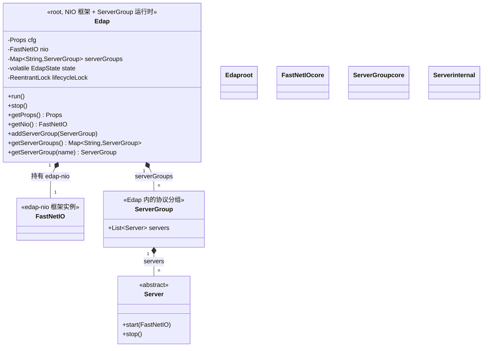

### 2.3 状态机（`EdapState`）

#### 2.3.1 状态迁移表

| 当前状态 | 允许迁移到 | 触发动作 | 终态？ |
|---------|----------|---------|--------|
| **NEW** | STARTING | `run()` | 否 |
| **STARTING** | RUNNING | nio.start + 所有 Server.start 成功 | 否 |
| **STARTING** | STARTING_FAILED | nio.start 或某个 Server.start 抛错 | 否 |
| **RUNNING** | STOPPING | `stop()` | 否 |
| **STARTING_FAILED** | STOPPING | `stop()`（用于清理） | 否 |
| **STOPPING** | STOPPED | 所有 Server 已 stop + nio.stop | **是** |
| **STOPPED** | — | — | **terminal** |

特殊处理：
- `stop()` **幂等**：STOPPED → STOPPED 是 no-op
- `stop()` 在 NEW 状态调：直接标记 STOPPED（无需走 STOPPING 过渡）
- `STARTING_FAILED → STOPPING` 合法：启动失败后用户仍可调 `stop()` 触发清理

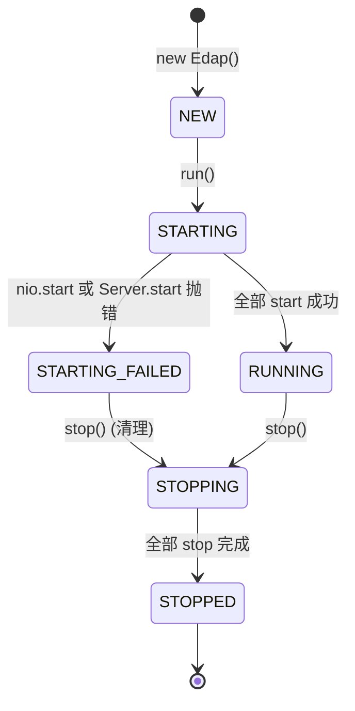

#### 2.3.2 枚举定义

```java
package io.edap;

public enum EdapState {
    NEW,              // 刚 new 出来，未 run()
    STARTING,         // run() 进入，nio.start() 阶段
    RUNNING,          // nio + 所有 Server 已 start；可继续 addServerGroup
    STARTING_FAILED,  // run() 期间出错
    STOPPING,         // stop() 进入，逆序清理
    STOPPED;          // terminal

    /**
     * 校验迁移合法性；非法迁移抛 IllegalStateException。
     * 由 lifecycleLock 串行化保证多线程下不会被并发踩到非法迁移。
     */
    public void checkTransitionTo(EdapState to) {
        if (!canTransitionTo(to)) {
            throw new IllegalStateException(
                "Illegal EdapState transition: " + this + " -> " + to);
        }
    }

    public boolean canTransitionTo(EdapState to) {
        switch (this) {
            case NEW:             return to == STARTING;
            case STARTING:        return to == RUNNING || to == STARTING_FAILED;
            case RUNNING:         return to == STOPPING;
            case STARTING_FAILED: return to == STOPPING;
            case STOPPING:        return to == STOPPED;
            case STOPPED:         return false;
            default:              return false;
        }
    }

    // —— 查询辅助 ——
    public boolean isTerminal()  { return this == STOPPED; }
    public boolean isRunning()   { return this == RUNNING; }
    public boolean isStarted()   { return this != NEW; }
    public boolean isStopping()  { return this == STOPPING || this == STOPPED; }
}
```

#### 2.3.3 在 Edap 中的使用

```java
public class Edap {
    private volatile EdapState state = EdapState.NEW;
    private final ReentrantLock lifecycleLock = new ReentrantLock();

    public void run() {
        lifecycleLock.lock();
        try {
            state.checkTransitionTo(EdapState.STARTING);  // NEW -> STARTING
            state = EdapState.STARTING;
            try {
                nio.start();
                for (ServerGroup sg : serverGroups.values()) {
                    for (Server s : sg.servers) {
                        s.start(nio);
                    }
                }
                state.checkTransitionTo(EdapState.RUNNING);  // STARTING -> RUNNING
                state = EdapState.RUNNING;
            } catch (Throwable t) {
                log.error("Edap.run failed", t);
                state = EdapState.STARTING_FAILED;
                doStop();           // 不重新 lock，由 run() 的 finally 释放
            }
        } finally {
            lifecycleLock.unlock();
        }
    }

    public void stop() {
        lifecycleLock.lock();
        try {
            if (state == EdapState.STOPPED) return;     // 幂等 no-op
            if (state == EdapState.NEW) {                // 还没 start 过
                state = EdapState.STOPPED;
                return;
            }
            if (state == EdapState.STOPPING) return;    // 已经在停
            state.checkTransitionTo(EdapState.STOPPING);
            state = EdapState.STOPPING;
        } finally {
            lifecycleLock.unlock();
        }
        doStop();   // 释放锁后再做 I/O（s.stop 可能阻塞）
    }

    /** 不持有 lifecycleLock；调用前需把 state 设到 STOPPING */
    private void doStop() {
        for (ServerGroup sg : reverse(serverGroups.values())) {
            for (Server s : reverse(sg.servers)) {
                try { s.stop(); } catch (Throwable t) { log.warn(t); }
            }
        }
        try { nio.stop(); } catch (Throwable t) { log.warn(t); }
        lifecycleLock.lock();
        try {
            state = EdapState.STOPPED;
        } finally {
            lifecycleLock.unlock();
        }
    }

    public EdapState getState() { return state; }
}
```

#### 2.3.4 关键设计点

1. **volatile + ReentrantLock**：状态字段用 volatile 保证可见性，迁移操作由 `lifecycleLock` 串行化（避免 CAS 的 ABA 问题）

2. **`stop()` 拆两段**：先在锁内把 state 改成 `STOPPING` 再释放锁，然后**锁外**做 I/O（`s.stop()` 可能阻塞）；最后再拿锁把 state 改成 `STOPPED`。`run()` 的 catch 块直接调 `doStop()`（锁外），不重新加锁避免死锁

3. **`run()` 的清理路径**：`STARTING_FAILED` 后 `doStop()` 会在锁外清理；但因为 `run()` 的 `finally` 会释放 `lifecycleLock`，`doStop()` 内部最后的 `state = STOPPED` 需要**重新拿一次 lifecycleLock**——这就是 `doStop()` 末尾二次加锁的原因

4. **`checkTransitionTo()` 在迁移前调**：抛 `IllegalStateException` 给出清晰的非法迁移报错。开发期可以快速定位状态机 bug；运行期会被 `run()` / `stop()` 的 lifecycleLock 串行化兜底

5. **`isTerminal()` / `isRunning()` 等查询**：外部健康检查 / metrics 用。`getState()` 返回 enum，外部可以用 `switch` 做穷举

6. **`addServerGroup` 在哪些状态允许**：见 §2.5.4。**RUNNING** 期间允许（动态加 Server）；**STOPPING / STOPPED** 期间拒绝

### 2.4 字段说明

| 字段 | 类型 | 作用 |
|------|------|------|
| `cfg` | `Props` | 全局配置（节点名、协议开关、JVM 参数、节点类型等） |
| `nio` | `FastNetIO` | **核心**：edap 自研的 NIO 框架实例 |
| `serverGroups` | `Map<String, ServerGroup>` | 按名称管理的 ServerGroup，**下游模块通过 addServerGroup 在这里挂载自己的 Server** |
| `state` | `volatile EdapState` | 顶层状态机 |
| `lifecycleLock` | `ReentrantLock` | 串行化 `addServerGroup` / `run` / `stop` |

### 2.5 关键方法

```java
public class Edap {
    public Edap();

    // 启动入口
    public void run();
    public void stop();

    // ServerGroup 管理（下游模块的扩展点）
    public void addServerGroup(ServerGroup sg);
    public Map<String, ServerGroup> getServerGroups();
    public ServerGroup getServerGroup(String name);

    // 暴露给下游模块的访问接口
    public Props     getProps();
    public FastNetIO getNio();

    // 状态查询
    public EdapState getState();
}
```

#### 2.5.1 `run()` 流程

> 完整代码见 §2.3.3。下表是"为什么这样写"的注解。

| 步骤 | 动作 | 状态变化 | 锁策略 |
|------|------|---------|--------|
| 1 | 拿 `lifecycleLock` | — | 锁内 |
| 2 | `state.checkTransitionTo(STARTING)` | NEW → STARTING 校验 | 锁内 |
| 3 | `state = STARTING` | NEW → STARTING | 锁内 |
| 4 | `nio.start()` | — | 锁内（NIO 启动通常很快） |
| 5 | 遍历 `serverGroups` 调每个 Server.start | — | 锁内 |
| 6 | `state.checkTransitionTo(RUNNING)` | STARTING → RUNNING 校验 | 锁内 |
| 7 | `state = RUNNING` | STARTING → RUNNING | 锁内 |
| 8 | catch 异常 → `state = STARTING_FAILED` | STARTING → STARTING_FAILED | 锁内 |
| 9 | `doStop()` | — | **锁外**（避免死锁） |
| 10 | finally 释放 lifecycleLock | — | — |

#### 2.5.2 `stop()` 流程

> 完整代码见 §2.3.3。下表是拆两段的原因。

| 步骤 | 动作 | 锁策略 |
|------|------|--------|
| 1 | 拿 `lifecycleLock` | 锁内 |
| 2 | 幂等检查：`state == STOPPED` 直接返回 | 锁内 |
| 3 | NEW 状态特例：直接 `state = STOPPED` | 锁内 |
| 4 | 已在 STOPPING：直接返回（幂等） | 锁内 |
| 5 | `state.checkTransitionTo(STOPPING)` 然后 `state = STOPPING` | 锁内 |
| 6 | 释放 `lifecycleLock` | — |
| 7 | `doStop()` 逆序停 Server + 停 nio | **锁外**（`s.stop()` 可能阻塞） |
| 8 | `doStop()` 末尾再拿一次 lifecycleLock 写 `STOPPED` | 锁内 |

**为什么不全程持锁**：`s.stop()` 涉及 I/O 与对端通信，可能阻塞数百毫秒到数秒。如果持锁期间被其他线程的 `addServerGroup` 等待，会出现"停止过程阻塞业务请求注册"的反直觉延迟。

#### 2.5.3 `addServerGroup` 状态守卫

`addServerGroup` 在不同状态下的允许行为：

| 当前状态 | addServerGroup 行为 | 备注 |
|---------|---------------------|------|
| NEW | ✅ 允许 | 启动前配置阶段 |
| STARTING | ⚠️ 拒绝（抛 `IllegalStateException`） | 启动期间不希望改 ServerGroup 列表 |
| RUNNING | ✅ 允许 | **支持热插拔**，下游模块可在运行时挂载新 ServerGroup |
| STARTING_FAILED | ❌ 拒绝 | 启动失败，进程即将退出 |
| STOPPING | ❌ 拒绝 | 进入关闭流程 |
| STOPPED | ❌ 拒绝 | terminal |

实现：

```java
public void addServerGroup(ServerGroup sg) {
    lifecycleLock.lock();
    try {
        EdapState s = state;
        if (s != EdapState.NEW && s != EdapState.RUNNING) {
            throw new IllegalStateException(
                "Cannot addServerGroup in state " + s);
        }
        serverGroups.put(sg.getName(), sg);
    } finally {
        lifecycleLock.unlock();
    }
}
```

#### 2.5.4 下游模块怎么"挂"到 Edap 上

**Edap 不定义任何"成员"接口**。下游模块（edap-container、未来的 gateway、mail 等）通过以下方式扩展：

```java
// 在 edap-container 模块的 Bootstrap 里（典型）
Edap edap = new Edap();

// Container 在自己的模块里 new 出来，
// 然后通过 Edap 暴露的 ServerGroup API 注册自己的 Server 实例
Container container = new Container(new File("apps"));
container.attach(edap);                          // Container 内部创建 ServerGroup 并 addServerGroup
container.startApps();                           // 扫描 apps/ 下的 EAR，逐一部署
container.startServers();                        // 每个 AppContext 把自己的 Router Server 注册到 ServerGroup

edap.run();
```

或者更直接地：

```java
// 在 edap-gateway 模块里（未来）
Edap edap = new Edap();
ServerGroup sg = new ServerGroup("gateway");
sg.addServer(new GatewayHttpServer(8080));
edap.addServerGroup(sg);                          // ← 唯一扩展点

edap.run();
```

**关键**：所有这些代码都发生在**下游模块**里，Edap 的代码里**完全没有** `Container` / `Gateway` 等下游类名的 import。这就是"edap-nio 不依赖下层"的实现方式。

### 2.6 与现有 `Edap.java` 的关系

**保留（不动的部分）**：
- `Bootstrap.main()` 用 `new Edap()` 创建顶层对象的习惯
- `Edap.run()` 作为进程启动入口
- **`addServerGroup(ServerGroup)` / `getServerGroups()`**：这是 Edap 对下游模块的核心 API，**保留并强化**

**改动（新增能力）**：
- **新增** `getNio()` —— 暴露 NIO 实例（之前 NIO 隐藏在 ServerGroup / Server 内部）
- **新增** `getProps()` / `getState()` —— 已有 API 形式调整

**改动（明确不做的）**：
- **不**新增 `addContainer` / `addComponent` / `getContainer` / `getComponents` / `snapshot` —— 这些都违反模块依赖方向
- **不**定义 `EdapMember` 接口让下游模块实现

### 2.7 错误处理

| 异常源 | 处理 | 详见 |
|--------|------|------|
| `nio.start()` 抛错 | state = `STARTING_FAILED`；`doStop()` 清理；不启动任何 Server | §2.3.3 |
| 某个 Server 的 `start()` 抛错 | 已启动的 Server 逆序 stop；state = `STARTING_FAILED` | §2.3.3 |
| `run()` 重复调（state ≠ NEW） | `checkTransitionTo(STARTING)` 抛 `IllegalStateException` | §2.3.2 |
| `stop()` 重复调（state == STOPPED） | 幂等 no-op | §2.3.3 |
| `addServerGroup` 在非 NEW / RUNNING 状态 | 抛 `IllegalStateException` | §2.5.3 |
| `state` 非法迁移（如 RUNNING → RUNNING） | `checkTransitionTo` 抛 `IllegalStateException` | §2.3.2 |

---

## 三、Container（`io.edap.container.Container`）

### 3.1 角色与边界

Container = **位于 `edap-container` 模块**的 microservice 多应用管理器，专门负责 **microservice 多应用** 的部署、生命周期、路由分发。它是"按 appId 隔离多个应用"这件事的承担者。

**模块边界（关键约束）**：

- Container 位于 **edap-container 模块**，依赖 edap-nio
- Container **不**作为 Edap 的成员（Edap 完全不知道 Container 的存在）
- Container 通过 Edap 暴露的**通用 API**（`getServerGroups()` / `getNio()` / `getProps()`）在 Edap 上注册自己的 `Server` 实例
- Container 的创建与启动发生在 `edap-container` 模块的 `Bootstrap` 里（**不是** Edap 内部）

**Container 在做什么**（继承现有 `DeployManager.java` 中的相关能力，但下沉到 Container）：

- 持有 registry 协议的**三张表**：`registry`（appId → SlotEntry，真值）、`currentRouters`（appId → RouterHub，流量指针）、`appLocks`（appId → 写锁）；三者的不变量与提交顺序见 §3.7
- 持有 `DeployManager` 引用（管理入口）
- `attach(edap)` 时创建 `appServerGroup` 并 `edap.addServerGroup(appServerGroup)`（一次性）
- 协议路由注册由 `ctx.start() → Container.bindAll() → RouterHub.setHandlers()` 完成 NIO 注册；Container **不**在 deploy/undeploy/stop 时操纵 ServerGroup 列表
- 提供 `deploy(File ear)`、`undeploy(appId, compositeVersion)`、`switchVersion(appId, targetCompositeVersion)`、`listSlots(appId)`、`listApps()`
- **version 用 composite 区分 SNAPSHOT 重发**：`composite = mavenVersion.endsWith("-SNAPSHOT") ? mavenVersion + "@" + buildTime : mavenVersion`；详见 §3.5.3

**清楚不做**：

- 不解析 .proto（由代码生成期完成）
- **不构造 Bean**（由每个 `AppContext` 完成）
- 不直接接收外部 HTTP/WS 流量到业务方法（流量经由 `protocolRouters`，由 Container 控制的 ServerGroup 处理）
- 不持有非 microservice 服务的成员（那些属于其他模块）

### 3.2 类图

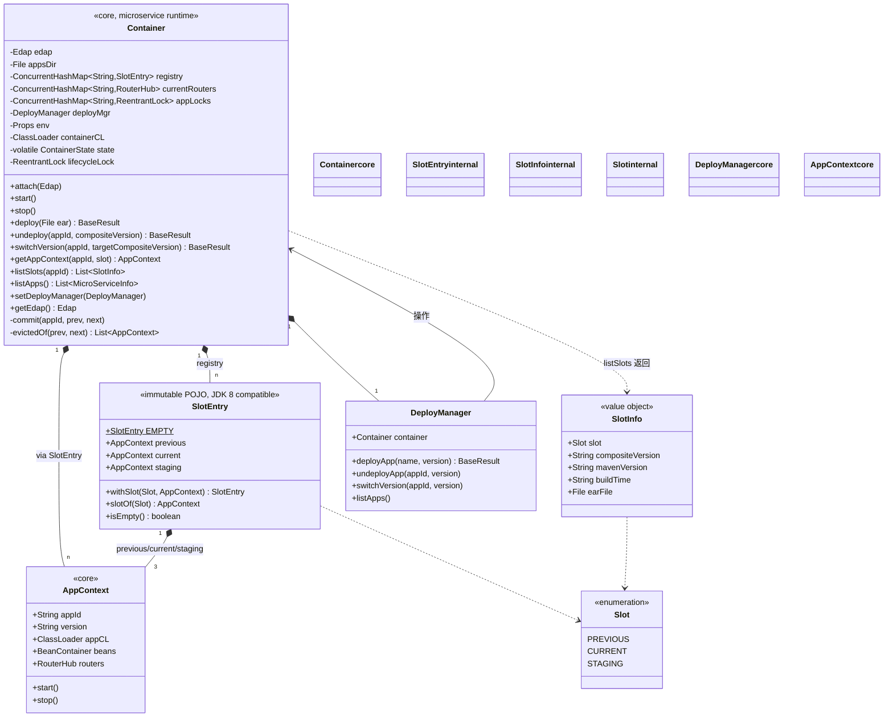

### 3.3 状态机（`ContainerState`）

#### 3.3.1 状态迁移表

**全局状态**——只反映 Container 自身生命周期（attach / start / stop），不反映单个 appId 的部署/卸载/切换。

| 当前状态 | 允许迁移到 | 触发动作 | 锁策略 |
|---------|----------|---------|--------|
| **NEW** | ATTACHED | `attach(edap)` | lifecycleLock |
| **ATTACHED** | STARTING | `start()` | lifecycleLock |
| **STARTING** | RUNNING | appsDir 扫描完成（部分 EAR 失败不影响） | lifecycleLock |
| **STARTING** | START_FAILED | 致命错（attach 后无法初始化） | lifecycleLock |
| **RUNNING** | STOPPING | `stop()` | lifecycleLock |
| **START_FAILED** | STOPPING | `stop()` 触发清理 | lifecycleLock |
| **STOPPING** | STOPPED | 所有 AppContext 已 stop | lifecycleLock |
| **STOPPED** | — | — | terminal |

**特别说明**：

- 全局状态机里**没有** `DEPLOYING` / `UNDEPLOYING` / `SWITCHING`——因为 per-appId 锁粒度下，这些操作可以并发进行，全局状态无法表达"哪个 appId 在部署"
- 单个 appId 的"正在部署"由 `appLocks[appId]` 持有者隐含表达
- `stop()` **幂等**：STOPPED → STOPPED 是 no-op

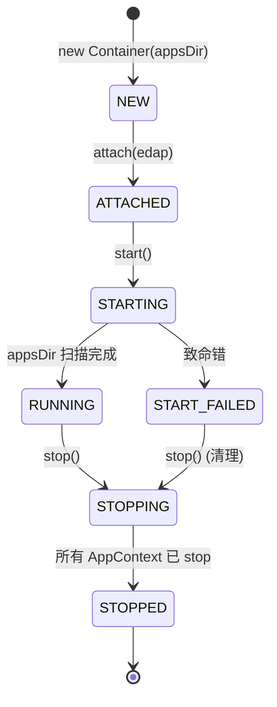

#### 3.3.2 枚举定义

```java
package io.edap.container;

public enum ContainerState {
    NEW,             // 刚 new 出来
    ATTACHED,        // 已 attach(edap)，可调 start()
    STARTING,        // 扫描 appsDir
    RUNNING,         // 正常服务中（deploy/undeploy/switchVersion 可并发）
    START_FAILED,    // start() 致命错
    STOPPING,        // 关闭中
    STOPPED;         // terminal

    public void checkTransitionTo(ContainerState to) {
        if (!canTransitionTo(to)) {
            throw new IllegalStateException(
                "Illegal ContainerState transition: " + this + " -> " + to);
        }
    }

    public boolean canTransitionTo(ContainerState to) {
        switch (this) {
            case NEW:         return to == ATTACHED;
            case ATTACHED:    return to == STARTING;
            case STARTING:    return to == RUNNING || to == START_FAILED;
            case RUNNING:     return to == STOPPING;
            case START_FAILED: return to == STOPPING;
            case STOPPING:    return to == STOPPED;
            case STOPPED:     return false;
            default:          return false;
        }
    }

    // —— 查询辅助 ——
    public boolean isTerminal()     { return this == STOPPED; }
    public boolean isRunning()      { return this == RUNNING; }
    public boolean isServing()      { return this == RUNNING; }
    public boolean isStarting()     { return this == ATTACHED || this == STARTING; }
    public boolean isStopping()     { return this == STOPPING || this == STOPPED; }
}
```

**两层锁的区分**：

| 锁 | 保护的状态 | 持有时长 | 阻塞什么 |
|----|----------|---------|---------|
| `lifecycleLock`（`ReentrantLock`） | `state` 顶层状态：NEW → ATTACHED → STARTING → RUNNING → STOPPING → STOPPED | **短**（仅状态字段写入） | `attach` / `start` / `stop` 与 `run` 串行；不会阻塞业务请求 |
| `appLocks[appId]`（每 appId 一把 `ReentrantLock`） | 单 appId 的 SlotEntry 替换 | **长**（deploy 一个 EAR 可能数百毫秒到几秒） | 仅同 appId 的其他 `deploy` / `undeploy` / `switchVersion`；不同 appId 完全并行 |

**关键**：`deploy` / `undeploy` / `switchVersion` 不持有 `lifecycleLock`——它们持 `appLocks[appId]`，避免阻塞业务请求的注册（详见 §3.9）。

### 3.4 字段说明

| 字段 | 类型 | 可见性 | 作用 | 锁/同步 |
|------|------|--------|------|--------|
| `edap` | `Edap` | `private` | 反向引用，访问全局配置 / NIO 框架 | `lifecycleLock` 保护写入；读取在 `attach` 后无锁（happens-before 由 attach 建立） |
| `appsDir` | `File` | `private final` | EAR 文件目录（构造时确定） | 不变，无需同步 |
| `registry` | `ConcurrentHashMap<String, SlotEntry>` | `private final` | appId → SlotEntry（不可变 POJO，含 previous/current/staging 三个 AppContext） | 写：`appLocks[appId]`；读：0 锁（ConcurrentHashMap.get 原子） |
| `appLocks` | `ConcurrentHashMap<String, ReentrantLock>` | `private final` | 每个 appId 一把写锁 | `computeIfAbsent` 创建；**只增不删**——CAS 删除不足以保证互斥，原因见 §3.7.5 |
| `deployMgr` | `DeployManager` | `private` | 部署管理入口（注入） | `lifecycleLock` 保护写入；start 后只读 |
| `env` | `Props` | `private` | Container 级配置（从 `edap.getProps().child("container")`） | `lifecycleLock` 保护写入 |
| `containerCL` | `ClassLoader` | `private final` | 构造时记录的 `Container.class.getClassLoader()`，作为所有 `EdapAppClassLoader` 的 parent | 不变 |
| `state` | `volatile ContainerState` | `private volatile` | 状态机当前位置 | 由 `lifecycleLock` 串行化迁移 |
| `lifecycleLock` | `ReentrantLock` | `private final` | 串行化 `attach` / `start` / `stop` 与 `state` 迁移 | — |
| `appServerGroup` | `ServerGroup` | `private` | Container 持有，**只在 `attach` 时一次性创建并 `addServerGroup` 到 Edap**；后续 deploy/undeploy/stop 不再 addServer/removeServer | `attach` 时创建并 addServerGroup 到 edap；之后不再变动 |
| `currentRouters` | `ConcurrentHashMap<String, RouterHub>` | `private final` | appId → 当前接流量的 RouterHub 指针；由 `commit()` 统一维护，不调任何 Edap 方法 | 写：`appLocks[appId]` 内，经 `commit()`（§3.7.3）；读：业务 dispatch 0 锁 |

### 3.5 关键方法

#### 3.5.0 槽位枚举（`Slot`）

```java
public enum Slot {
    PREVIOUS,   // 上一个 current 的"快速回滚"备份
    CURRENT,    // 当前接流量的版本
    STAGING     // 已启动但未接流量的版本（灰度/预发）
}
```

每个 appId 在 registry 中对应一个 `SlotEntry`，最多 3 个槽位非空（**JDK 8 兼容版**：用 plain final class 代替 record，保持不可变语义）：

```java
/** 不可变 POJO：每次 mutate 整个替换，ConcurrentHashMap.put 原子发布。
 *  JDK 8 兼容版（无 record）。仅作为 ConcurrentHashMap 的 value 用，
 *  故无需 equals/hashCode。 */
public final class SlotEntry {

    /** 空实例：registry 中不存在该 appId 时的等价值，用于消除写路径的 null 分支
     *  （`registry.getOrDefault(appId, SlotEntry.EMPTY)`，见 §3.7.3）。不可变故可安全共享。 */
    public static final SlotEntry EMPTY = new SlotEntry(null, null, null);

    private final AppContext previous;
    private final AppContext current;
    private final AppContext staging;

    public SlotEntry(AppContext previous, AppContext current, AppContext staging) {
        this.previous = previous;
        this.current  = current;
        this.staging  = staging;
    }

    public AppContext previous() { return previous; }
    public AppContext current()  { return current; }
    public AppContext staging()  { return staging; }

    public SlotEntry withSlot(Slot slot, AppContext ctx) {
        switch (slot) {
            case PREVIOUS: return new SlotEntry(ctx, current, staging);
            case CURRENT:  return new SlotEntry(previous, ctx, staging);
            case STAGING:  return new SlotEntry(previous, current, ctx);
            default: throw new IllegalArgumentException("unknown slot: " + slot);
        }
    }

    public AppContext slotOf(Slot slot) {
        switch (slot) {
            case PREVIOUS: return previous;
            case CURRENT:  return current;
            case STAGING:  return staging;
            default: throw new IllegalArgumentException("unknown slot: " + slot);
        }
    }

    public boolean isEmpty() {
        return previous == null && current == null && staging == null;
    }

    @Override public String toString() {
        return "SlotEntry{previous=" + previous
             + ", current=" + current
             + ", staging=" + staging + '}';
    }
}
```

#### 3.5.0+ 类签名

```java
public class Container {
    public Container(File appsDir);

    // Bootstrap 里调
    public void attach(Edap edap);          // 拿 Edap 引用；edap.addServerGroup(appServerGroup)
    public void start();                    // 扫描 appsDir，部署已有 EAR

    // Bootstrap / SIGTERM 时调
    public void stop();

    // 部署入口
    public BaseResult<String> deploy(File ear);
    public BaseResult<String> undeploy(String appId, String compositeVersion);   // 按 composite version 找槽位删
    public BaseResult<String> switchVersion(String appId, String targetCompositeVersion);

    // 查询（按槽位）
    public AppContext getAppContext(String appId, Slot slot);           // 单数，按 (appId, slot) 取
    public List<SlotInfo> listSlots(String appId);                      // 列 appId 下 3 个槽位；SlotInfo 含 compositeVersion + Slot
    public List<MicroServiceInfo> listApps();
    public Edap getEdap();

    // 注入
    public void setDeployManager(DeployManager dm);

    // 状态
    public ContainerState getState();
}
```

**为什么查询是 `getAppContext(appId, slot)` 而不是 `getAppContexts(appId)` 返回 List**：

- 槽位有 3 个固定值（PREVIOUS / CURRENT / STAGING），调用方明确知道要哪个
- 一次只问一个槽位，List 强迫调用方再做 `.get(0)` 之类二次猜测
- API 形态对称：`getAppContext` 是读，`switchVersion` 是写；都对 (appId, slot/version) 维度操作
- `previous` 大多数调用方不关心，暴露 List 反而泄漏内部状态

**为什么 `undeploy` 仍按 `version` 而不是 `slot`**：

- 部署在哪个槽位是 Container 内部状态，调用方不应关心
- "我要删 v1.0.0" 是版本级意图，Container 内部定位到那个槽位再删

**为什么用 composite version 而非 mavenVersion**：

- Maven SNAPSHOT（`1.0.0-SNAPSHOT`）可被反复构建；同一 version 字符串 + 不同 buildTime = 不同产物
- 同一 EAR 文件的 buildTime 不变 → composite 不变 → 第二次 deploy 是"重复部署"应被拒（正确）
- 不同 EAR 但同 mavenVersion（SNAPSHOT 重发）→ composite 不同 → 应允许，3 槽模型继续生效
- 调用方从 `listSlots(appId)` 拿到每个槽位的 compositeVersion，再传给 `switchVersion` / `undeploy`；避免"version 不带歧义吗"的疑问
- 详见 §3.5.3 `resolveVersion()`

**为什么新增 `listSlots(appId)`**：

- composite version 比 mavenVersion 长（含 `@buildTime`），调用方手工拼很容易错
- 管理接口先 listSlots 查到目标 compositeVersion 再操作，避免歧义

每个方法的契约（前置 / 后置 / 锁策略 / 错误）见下面各小节。

#### 3.5.1 `attach(Edap edap)`

```
前置：state == NEW
后置：state == ATTACHED；edap 字段非空；env 来自 edap.getProps().child("container")；
      appServerGroup 已 addServerGroup 到 edap；deployMgr 仍可能为 null
锁：lifecycleLock 内
```

```java
public void attach(Edap edap) {
    lifecycleLock.lock();
    try {
        state.checkTransitionTo(ContainerState.ATTACHED);  // NEW -> ATTACHED
        this.edap = edap;
        this.env  = edap.getProps().child("container");
        this.appServerGroup = new ServerGroup("apps");
        edap.addServerGroup(appServerGroup);               // 唯一对外暴露点
        state = ContainerState.ATTACHED;
    } finally {
        lifecycleLock.unlock();
    }
}
```

#### 3.5.2 `start()`

```
前置：state == ATTACHED
后置：state ∈ {RUNNING, START_FAILED}；appsDir 下的 .ear 全部尝试部署
锁：lifecycleLock 仅保护 state 写入；逐个 EAR 部署用各自 appId 的 appLock（deploy() 内部）
```

```java
public void start() {
    lifecycleLock.lock();
    try {
        state.checkTransitionTo(ContainerState.STARTING);  // ATTACHED -> STARTING
        state = ContainerState.STARTING;
    } finally {
        lifecycleLock.unlock();
    }

    // 锁外做扫描 + 部署；deploy() 内部用各自 appId 的 appLock 串行（不同 appId 并行）
    File[] ears = appsDir.listFiles((d, n) -> n.endsWith(".ear"));
    boolean fatal = false;
    if (ears != null) {
        for (File ear : ears) {
            BaseResult<String> r = deploy(ear);
            if (!r.isSuccess() && isFatalDeployCode(r.getCode())) {
                fatal = true;
                break;
            } else if (!r.isSuccess()) {
                log.warn("EAR {} 启动失败: {}", ear.getName(), r.getMessage());
            }
        }
    }

    lifecycleLock.lock();
    try {
        if (fatal) {
            state = ContainerState.START_FAILED;
        } else {
            state = ContainerState.RUNNING;                // STARTING -> RUNNING
        }
    } finally {
        lifecycleLock.unlock();
    }
}
```

#### 3.5.3 `deploy(File ear)`

```
前置：state ∈ {RUNNING}
后置（成功）：registry 中该 appId 对应 SlotEntry 多一个 AppContext；返回 BaseResult.success
后置（失败）：registry 不变；返回 BaseResult.fail(code, msg)
锁：appLocks[appId]（不持 lifecycleLock）
```

```java
public BaseResult<String> deploy(File ear) {
    // 1. 解析 EAR
    DeployMetaData dmd;
    try {
        dmd = new EarScanner(ear).scanDeployMetaData();
    } catch (IOException e) {
        return BaseResult.fail(103, "EAR 包结构错误: " + e.getMessage());
    }
    String appId   = dmd.getMavenInfo().getGroupId() + ":" + dmd.getMavenInfo().getArtifactId();
    String mavenVersion = dmd.getMavenInfo().getVersion();
    // 2. 计算 composite version（SNAPSHOT 加 buildTime 后缀；详见 resolveVersion）
    String version = resolveVersion(mavenVersion, dmd.getBuildInfo());

    ReentrantLock appLock = appLocks.computeIfAbsent(appId, k -> new ReentrantLock());
    appLock.lock();
    try {
        SlotEntry prev = registry.getOrDefault(appId, SlotEntry.EMPTY);

        // 3. 重复部署检查（composite version 匹配才算重复）
        if (findSlotByCompositeVersion(prev, version) != null) {
            return BaseResult.fail(101, "已部署同版本: " + appId + ":" + version);
        }
        // 4. 槽位满检查
        Slot target = firstEmptySlot(prev);
        if (target == null) {
            return BaseResult.fail(105, "已存在3个版本，请先 undeploy");
        }

        // 5. 建 ClassLoader + AppContext
        EdapAppClassLoader appCL = new EdapAppClassLoader(ear, containerCL);
        AppContext ctx = new AppContext(this, appId, version, appCL, dmd);

        // 6. 三段式启动（GATHERING → COMMITTING → READY）
        try {
            ctx.start();                                   // 详见 §4
        } catch (Throwable t) {
            ctx.destroyPartial();                          // 回滚已注册的 Bean / 路由
            appCL.close();                                // 释放 ClassLoader
            return BaseResult.fail(104, "AppContext 启动失败: " + t.getMessage());
        }

        // 7. 提交：三张表对齐 + 驱逐者 stop，全部收敛在 commit() 一处（§3.7.3）
        //    deploy 只往空槽写，驱逐集恒为空；落到 CURRENT 槽时 commit 自动更新 currentRouters
        commit(appId, prev, prev.withSlot(target, ctx));
        writeDeployMeta(appId, target.name().toLowerCase(), dmd);
        // 注意：不在此处 addServer 到 appServerGroup
        //   - appServerGroup 在 attach() 时已创建并 addServerGroup 到 Edap
        //   - 协议路由由 ctx.start() → Container.bindAll() → RouterHub.setHandlers() 内部完成 NIO 注册
        //   - Container 不操纵 ServerGroup 列表，避免与 Edap 的 Server 生命周期混淆
        return BaseResult.success(appId + ":" + version + " -> " + target);

    } catch (RuntimeException e) {
        log.error("deploy 异常", e);
        return BaseResult.fail(105, e.getMessage());
    } finally {
        appLock.unlock();                                  // 不删 appLocks 条目（§3.7.5）
    }
}

/**
 * 计算 composite version：
 *   - 正式版（原样返回 mavenVersion）
 *   - SNAPSHOT 版（拼接 buildTime；同一 EAR 重发 buildTime 不变 → composite 不变 → 视为重复）
 *   - 兜底（SNAPSHOT 但 buildTime 缺失 → 回退 mavenVersion + warn）
 */
private String resolveVersion(String mavenVersion, BuildInfo buildInfo) {
    if (mavenVersion == null || !mavenVersion.endsWith("-SNAPSHOT")) {
        return mavenVersion;
    }
    String buildTime = buildInfo == null ? null : buildInfo.getBuildTime();
    if (buildTime == null || buildTime.isEmpty()) {
        log.warn("SNAPSHOT 包缺少 buildTime，回退 mavenVersion={}（同 mavenVersion 的二次部署会被拒）",
                 mavenVersion);
        return mavenVersion;
    }
    return mavenVersion + "@" + buildTime;       // "1.0.0-SNAPSHOT@20260811093000"
}
```

**注意**：deploy 不再把 `state` 切到 `DEPLOYING`——全局状态机里没有 `DEPLOYING` 这个状态。每个 appId 的"正在部署"由 `appLocks[appId]` 持有者隐含表达。

#### 3.5.4 `undeploy(String appId, String version)`

```
前置：state ∈ {RUNNING}
后置（成功）：三张表中该槽位已摘除；其 AppContext 已 stop、ClassLoader 已 close；返回 success
后置（找不到）：返回 BaseResult.fail(404)；三张表不变
锁：appLocks[appId]（不持 lifecycleLock）
参数：version = composite version（SNAPSHOT 时含 @buildTime；先调 listSlots(appId) 查）
```

```java
public BaseResult<String> undeploy(String appId, String version) {
    // version 是 composite version（deploy 时计算的字符串）
    ReentrantLock appLock = appLocks.get(appId);
    if (appLock == null) return BaseResult.fail(404, "未部署: " + appId);
    appLock.lock();
    try {
        SlotEntry prev = registry.get(appId);
        if (prev == null) return BaseResult.fail(404, "未部署: " + appId);

        // 按 composite version 找槽位；SNAPSHOT 多个 build 共存时也能区分
        Slot slot = findSlotByCompositeVersion(prev, version);
        if (slot == null) return BaseResult.fail(404, "版本 " + version + " 未部署: " + appId);

        // 提交：commit() 内部按 §3.7.10 的摘除顺序执行
        //   阶段1 currentRouters.remove（先断流）
        //   阶段2 registry.put / remove（三槽全空则删 key，保证 I1）
        //   阶段4 evicted.stop()（RouterHub.unbindAll → @PreDestroy → Lifecycle.stop → CL close）
        // 注意：不需要从 appServerGroup 移除 Server
        //   - "停止接收流量"由阶段1的指针摘除 + ctx.stop() 的 unbindAll 共同完成
        //   - removeServer 只改 ServerGroup 列表引用，对 NIO 绑定无影响，是冗余
        //   - Server 生命周期由 Edap.run() / Edap.stop() 管理，不归 Container 操纵
        commit(appId, prev, prev.withSlot(slot, null));
        deleteDeployMeta(appId, slot, version);
        return BaseResult.success(appId + ":" + version + " (slot=" + slot + ")");

    } finally {
        appLock.unlock();                                   // 不删 appLocks 条目（§3.7.5）
    }
}
```

**两处必须由 `commit()` 承担、早期草稿曾遗漏的事**（详见 §3.7.9）：

1. **先断流后销毁**：若先 `ctx.stop()` 再改表，销毁期间业务仍能从 `currentRouters` 取到这个正在 unbind 的 AppContext
2. **卸载 CURRENT 槽必须摘指针**：否则 `currentRouters` 继续指向已 stop 的 RouterHub（I2 破坏），业务持续 500

#### 3.5.5 `stop()`

```
前置：state ∈ {RUNNING, START_FAILED, STOPPING, STOPPED}
后置：state == STOPPED（幂等）
锁：lifecycleLock 仅保护 state 写入；逐个 AppContext.stop() 锁外
```

```java
public void stop() {
    lifecycleLock.lock();
    try {
        if (state == ContainerState.STOPPED) return;          // 幂等
        if (state == ContainerState.NEW
            || state == ContainerState.ATTACHED) {            // 还没启动
            state = ContainerState.STOPPED;
            return;
        }
        if (state == ContainerState.STOPPING) return;         // 已经在停
        state.checkTransitionTo(ContainerState.STOPPING);    // RUNNING/START_FAILED -> STOPPING
        state = ContainerState.STOPPING;
    } finally {
        lifecycleLock.unlock();
    }

    // 锁外：逆序停所有 AppContext（从所有 3 槽位收集）
    List<AppContext> all = new ArrayList<>();
    for (SlotEntry entry : registry.values()) {
        if (entry.previous() != null) all.add(entry.previous());
        if (entry.current()  != null) all.add(entry.current());
        if (entry.staging()  != null) all.add(entry.staging());
    }
    Collections.reverse(all);
    for (AppContext ctx : all) {
        try {
            // 同 undeploy：ctx.stop() 已覆盖路由/Server 摘除，不另调 removeServer
            ctx.stop();
        } catch (Throwable t) {
            log.warn("Container.stop 时 {} 异常", ctx.appId(), t);
        }
    }

    lifecycleLock.lock();
    try {
        state = ContainerState.STOPPED;                        // STOPPING -> STOPPED
    } finally {
        lifecycleLock.unlock();
    }
}
```

#### 3.5.6 `bindAll(AppContext, RouterHub, 4 × List<RouteEntry>, BeanContainer)` —— 路由解析入口

```
前置：state ∈ {RUNNING}；调用方持有 lifecycleLock（AppContext.start() Phase 3 单线程）
后置（成功）：RouterHub.bound == true；4 份协议 typed Handler List 已写入；Method 已 setAccessible(true)
后置（失败）：RouterHub.bound == false（partial 状态不写入）；异常冒泡到 AppContext.start() → deploy() 回滚
锁：不持锁——调用方在 lifecycleLock 内，bindAll 内部无需再加锁
```

**职责**：

`Container.bindAll` 是 RouterHub 写入 Handler List 的**唯一入口**——把 EAR scanner 生成的 `RouteEntry` 列表转换为可立即 dispatch 的**协议 typed Handler 列表**（`HttpHandler` / `WSServiceMsgHandler<?>` / `ErpcHandler` / `GrpcHandler`），含 bean 实例 + `Method` 反射 + `setAccessible(true)` + `ctx.generateHandler(targetIf, entry, bean, method, ctx.shards())` 用 ASM 字节码生成对应 typed 接口的实现类 + 实例化。**Shard 不再独立成第 5 份 List**——shard 字段在每个 RouteEntry / GrpcMethodEntry 上，生成 Handler 内部根据 `entry.shard()` 决定是否走 ShardRegistry。

调用方：`AppContext.start()` Phase 3（READY，§4.4.3）。**只在 deploy 路径上执行一次**，`Container.switchVersion` 路径**不调**（仅换 `currentRouters[appId]` 指针）。

```java
/**
 * 把 4 份 RouteEntry List 解析为 4 份协议 typed Handler List，写入 RouterHub。
 * 触发时机：AppContext.start() Phase 3（READY），单线程（持 lifecycleLock）。
 *
 * 解析流程（每条 entry）：
 *   1) beans.getBean(entry.beanName())                       查已实例化的 bean
 *   2) resolveMethod(bean, entry.methodName(), paramTypes)   按 methodName + 参数类型解析 Method
 *   3) method.setAccessible(true)                           跨 CL 调用必须
 *   4) ctx.generateHandler(targetIf, entry, bean, method,
 *      ctx.shards())  // shards 仅在 entry.shard() == true 时实际被生成 Handler 引用
 *      ASM 字节码生成该协议 typed 接口
 *                                                            （HttpHandler/WSServiceMsgHandler/...）
 *                                                            的实现类 + 实例化（缓存挂在 ctx 上，
 *                                                            详见 §3.5.7）
 *                                                            ——若 entry.shard() == true，生成 Handler
 *                                                            持有 ShardRegistry 引用，handle 内部
 *                                                            按 shardKey 走 ShardRegistry 选实例
 *
 * 全部 4 份 List 解析成功后调 hub.setHandlers(...) 一次性提交；
 * 解析途中任一失败 → 临时 List 随栈帧释放，RouterHub.4 份 List 保持空（partial 不写入）。
 *
 * @param ctx            当前 AppContext（提供 appCL + generatedHandlers/generatedCLs 缓存 + ShardRegistry）
 * @param hub            目标 RouterHub（必属参数 ctx.routers()）
 * @param httpEntries    HTTP 路由条目（来自 ctx.deployMetaData().httpRoutes()）
 * @param wsEntries      WS 路由条目
 * @param erpcEntries    eRPC 路由条目
 * @param grpcEntries    gRPC 路由条目
 * @param beans          已实例化的 Bean 容器（来自 ctx.beans()）
 */
public void bindAll(AppContext ctx,
                    RouterHub hub,
                    List<HttpRouteEntry> httpEntries,
                    List<WsRouteEntry>   wsEntries,
                    List<ErpcRouteEntry> erpcEntries,
                    List<GrpcRouteEntry> grpcEntries,
                    BeanContainer beans) {
    // 临时 List：解析途中失败时不污染 RouterHub；元素类型 = 各协议 typed Handler 接口
    List<HttpHandler>            httpH  = new ArrayList<>(httpEntries.size());
    List<WSServiceMsgHandler<?>> wsH    = new ArrayList<>(wsEntries.size());
    List<ErpcHandler>            erpcH  = new ArrayList<>(erpcEntries.size());
    List<GrpcHandler>            grpcH  = new ArrayList<>(grpcEntries.size());

    // eRPC requestType 解析需要 appCL；提前切 TCCL，避免 Class.forName 走 caller CL 找不到类
    ClassLoader prevCL = Thread.currentThread().getContextClassLoader();
    Thread.currentThread().setContextClassLoader(beans.appClassLoader());
    try {
        for (HttpRouteEntry e : httpEntries) {
            Object bean = beans.getBean(e.beanName());
            Method  m    = resolveMethod(bean, e.methodName(), httpParamTypes(e));
            m.setAccessible(true);
            // targetIf = HttpHandler.class；ctx.generateHandler 按 (targetIf, Method) 二元组
            // 查找 / 生成实现 HttpHandler 接口的 final class，handle(req, resp) 字节码从
            // HttpRouteEntry 提 path/body 参数 + 调 bean method + 写 resp.body（§4.6.4）
            // ——entry.shard() == true 时插入 ShardRegistry.route(beanName, shardKey) 选实例
            httpH.add(ctx.generateHandler(HttpHandler.class, e, bean, m, ctx.shards()));
        }
        for (WsRouteEntry e : wsEntries) {
            Object bean = beans.getBean(e.beanName());
            // bean method 入参 = msgType（String / byte[]），用于 resolveMethod 定位 Method
            Class<?> msgType = Class.forName(e.msgType());
            Method  m    = resolveMethod(bean, e.methodName(), new Class<?>[]{ msgType });
            m.setAccessible(true);
            // targetIf = WSServiceMsgHandler.class（容器内 functional interface）；
            // 生成实现 WSServiceMsgHandler<T> 接口的 final class（T 由 WsRouteEntry.msgType 决定），
            // handle(T msg) 字节码：直接 invokevirtual bean.handleMsg(msg) 返回 T
            // ——entry.shard() == true 时按 shardKey 走 ShardRegistry
            wsH.add(ctx.generateHandler(WSServiceMsgHandler.class, e, bean, m, ctx.shards()));
        }
        for (ErpcRouteEntry e : erpcEntries) {
            Object bean = beans.getBean(e.beanName());
            Method  m    = resolveMethod(bean, e.methodName(),
                                         new Class<?>[]{ Class.forName(e.requestType()) });
            m.setAccessible(true);
            // targetIf = ErpcHandler.class；handle(req, resp) 字节码按 ErpcRouteEntry.requestType
            // FQCN 反序列化 req.body → 调 bean → 按 responseType FQCN 序列化 resp.body
            // ——entry.shard() == true 时按 shardKey 走 ShardRegistry
            erpcH.add(ctx.generateHandler(ErpcHandler.class, e, bean, m, ctx.shards()));
        }
        for (GrpcRouteEntry e : grpcEntries) {
            // gRPC 一个 service 含多个 method，每个 method 各自生成 Handler
            for (GrpcMethodEntry me : e.methods()) {
                Object bean = beans.getBean(e.beanName());
                Method  m    = resolveMethod(bean, me.javaMethodName(), new Class<?>[0]);
                m.setAccessible(true);
                // targetIf = GrpcHandler.class；handle(req, resp) 字节码按 GrpcMethodEntry.reqDesc
                // FQCN 反序列化 req.body → 调 bean.javaMethodName → 按 respDesc FQCN 序列化 resp.body
                // ——GrpcMethodEntry.shard() == true 时按 shardKey 走 ShardRegistry
                grpcH.add(ctx.generateHandler(GrpcHandler.class, me, bean, m, ctx.shards()));
            }
        }
    } finally {
        Thread.currentThread().setContextClassLoader(prevCL);
    }

    // 全部解析成功 → 一次性提交；setHandlers 任一参数为 null 抛 IllegalArgumentException
    hub.setHandlers(httpH, wsH, erpcH, grpcH);
}

/** 按 methodName + 参数类型列表从 bean.getClass() 解析 Method。 */
private static Method resolveMethod(Object bean, String methodName, Class<?>[] paramTypes) {
    try {
        return bean.getClass().getMethod(methodName, paramTypes);
    } catch (NoSuchMethodException e) {
        throw new RouteBindException(bean, methodName, paramTypes, e);
    }
}

/** 从 HttpRouteEntry.pathParams 推出 Method 参数类型（默认 String）。 */
private static Class<?>[] httpParamTypes(HttpRouteEntry e) {
    String[] names = e.pathParams();
    Class<?>[] types = new Class<?>[names.length];
    for (int i = 0; i < names.length; i++) types[i] = String.class;
    return types;
}
```

> **注**：`Container.bindAll` 通过 `ctx.generateHandler(targetIf, entry, bean, method, shards)` 调 ASM 字节码生成逻辑（已上提到 `AppContext`，详见 §3.5.7）——`generatedHandlers` / `generatedCLs` 缓存在 ctx 上，bindAll 不再持有任何缓存字段。`targetIf` 是协议 typed Handler 接口的 `Class` 对象（`HttpHandler.class` / `WSServiceMsgHandler.class` / `ErpcHandler.class` / `GrpcHandler.class`），由 bindAll 按 4 份 List 分别传入。`shards` 是 `ShardRegistry` 引用，生成 Handler 内部按 `entry.shard()` 决定是否真的用它（false 时可传 null 或同一个对象，字节码不引用）。

**关键约束**：

- **不持锁**：调用方 AppContext.start() Phase 3 在 lifecycleLock 内单线程执行，bindAll 内部无需再加锁（避免双锁）
- **临时 List + 一次性 setHandlers**：解析途中失败时 4 份临时 List 随栈帧释放，RouterHub.4 份 List 仍为空，`bound` 不被错误置 true——partial 状态不存在
- **`Class.forName(...)` 走 appCL**：`Class.forName(e.requestType())` 默认走 caller CL（Container 的 CL），找不到 appCL 加载的请求体类——因此 bindAll 进入时**先把 TCCL 切到 appCL**，退出前 finally 还原
- **`setAccessible(true)` 跨 CL**：appCL 加载的 bean 类，其 `Method` 在 Container CL（启动类加载器）下不可访问，必须显式 `setAccessible(true)`（Java 9+ module 系统下需要 `--add-opens java.base/java.lang=ALL-UNNAMED` 等）
- **ASM 生成类的 CL 隔离**：generateHandler 内部用专用 ClassLoader（parent = appCL）加载生成的类，**不污染** appCL 的 namespace；详见 §3.5.7
- **`targetIf` 决定生成类的协议语义**：bindAll 传入的 `targetIf.class`（HttpHandler.class / ...）决定 `generateHandler` 用哪套"协议提参 + 协议响应写入" 字节码模板（§4.6.4 emitProtocolArgsExtraction / emitProtocolResponseWrite 的派发依据）；同一 bean method 被多协议路由时，每个 targetIf 生成独立的实现类

**为什么 bindAll 由 Container 做而不是 RouterHub**：

- Container 持有 appCL + 知道 deploy 上下文，能在解析时正确切 TCCL；RouterHub 不应感知 ClassLoader 细节
- 解析失败时只有 Container 知道怎么回滚（`ctx.destroyPartial()` + `appCL.close()`，§3.5.3 阶段 6）
- 多版本切换（`Container.switchVersion`）时只换 `currentRouters[appId]` 指针，**不调 bindAll**——映射工作在 deploy 路径上一次性做完，SwitchVersion 路径 0 bindAll 成本（详见 §3.6.x）
- ASM 生成器（`HandlerAsmGenerator`）是无状态的工具（ClassWriter 内部缓存与 app 无关），可作为**静态单例**在 `Container` / `HandlerAsmGenerator` 自身上共享；**生成类缓存 + 专用 ClassLoader 缓存在 `AppContext` 上**——见 §3.5.7（防止 appCL 被悬挂引用，违反 §3.8 防内存泄漏不变量的反例）

**错误处理**（与 §4.6.9 RouterHub 错误处理对齐）：

| 失败点 | 抛异常 | 后果 |
|--------|--------|------|
| `RouteEntry.beanName` 在 BeanContainer 找不到 | `NoSuchBeanException(beanName)` | AppContext.start() 失败，registry 不写；deploy 返回 fail(104) |
| `RouteEntry.methodName` 找不到 / 参数类型不匹配 | `RouteBindException(bean, methodName, paramTypes, NoSuchMethodException)` | 同上 |
| `ErpcRouteEntry.requestType` 不能 `Class.forName` | `RouteBindException(... ClassNotFoundException)` | 同上 |
| `HttpRouteEntry.pathParams` 与实际 method 参数列表不匹配 | `resolveMethod` 抛 `NoSuchMethodException` → `RouteBindException` | 同上 |
| `Method.setAccessible(true)` 抛 `SecurityException` | `RouteBindException(... SecurityException)` | 同上 |
| `generateHandler(targetIf, ...)` ASM 生成失败 / 加载失败 / 反射实例化失败 / `targetIf` 非协议 Handler 接口 | `RouteBindException(bean, methodName, ..., ex)` | 同上 |

**与 AppContext 的契约**：

- **输入**：ctx 启动到 Phase 3 时，`beans` 已 ready（Phase 2 COMMITTING 完成，所有 `@PostConstruct` 已跑过），`deployMetaData.routes()` 已从磁盘还原（启动期，`Container.start()` 内调 EAR scanner 重生成）或从 EAR scanner 生成（部署期）
- **输出**：调 `hub.setHandlers(...)` 后，RouterHub.4 份协议 typed Handler List 可被协议 Router 读——`Container.commit()` 阶段 3 之后协议 Router 调 `httpRouter.bindRoutes(ctx.routers().httpHandlers())`
- **不变量**：`hub.isBound() == true` ⇔ `ctx.state() == RUNNING`（§4.6.10 自检任务）

**与 `Container.commit()` 的顺序约束**：

- `commit()` 阶段 1（`currentRouters.put`）→ 阶段 2（`registry` 写）→ 阶段 3（协议 Router 注册 handler）→ 阶段 4（被驱逐者 stop）——bindAll 必须在 commit 阶段 3 之前完成，即在 `ctx.start()` 返回之前
- `Container.deploy()` 阶段 6 调 `ctx.start()`，start 返回后 commit 阶段 3 自然能拿到已 bound 的 RouterHub

```java
    // 注入
    public void setDeployManager(DeployManager dm);

    // 查询
    public Edap getEdap();
}
```

#### 3.5.7 `AppContext.generateHandler(Class<T> targetIf, RouteEntry, bean, Method)` —— ASM 字节码生成协议 typed Handler 实现类

```
前置：AppContext 已构造（持有 generatedHandlers + generatedCLs 缓存字段 + ShardRegistry）
      ASM 生成器走 HandlerAsmGenerator.INSTANCE（静态单例，无 app 状态）
      targetIf 必须是 4 个协议 typed Handler 接口之一（HttpHandler / WSServiceMsgHandler /
      ErpcHandler / GrpcHandler）
后置（成功）：ctx.generatedHandlers[HandlerKey] = 生成的 targetIf 实现类；返回新实例化的 targetIf 实例
后置（失败）：抛 RouteBindException；ctx.generatedHandlers 不变（computeIfAbsent 原子性）
锁：computeIfAbsent 内部 synchronized（CHM bucket 锁）；同一 HandlerKey 并发只生成一次
```

**职责**：

把"扫描期纯 String 的 RouteEntry" + "运行期 bean 实例 + Method 反射对象" + "协议 typed 接口 `targetIf`" + "ShardRegistry（仅在 entry.shard() == true 时实际被引用）" 桥接为**可立即 dispatch 的协议 Handler 实例**——Handler 实现类用 ASM 字节码生成，**直接实现 `targetIf`**（§4.6.4 已描述各协议 typed 接口与生成类的形态），本节描述生成逻辑本身。

调用方：`Container.bindAll`（§3.5.6）的 4 个 for 循环内部，每解析完一条 entry 都调一次 `ctx.generateHandler(targetIf, entry, bean, method, ctx.shards())`——`targetIf` 是该 List 对应的协议接口（`HttpHandler.class` / `WSServiceMsgHandler.class` / `ErpcHandler.class` / `GrpcHandler.class`）。

**为什么用 ASM 而不是反射 / MethodHandle / LambdaMetafactory**：

| 方案 | 热路径开销 | 备注 |
|------|----------|------|
| `Method.invoke(bean, args)` | 签名检查 + 装箱拆箱 + `Object[]` 分配 | 即使 JIT 内联，反射开销仍占 5-10% CPU（高频路由场景） |
| `MethodHandle.invokeExact(args)` | 略好于 Method.invoke，但仍需 invokeExact 调用约定 + spreader | 类型签名必须严格匹配，丢失泛型友好性 |
| LambdaMetafactory 动态实现 | 首次调用有初始化开销，后续接近 ASM | 入口方法签名受限于 functional interface——只能生成"lambda 签名 = protocol 接口方法签名" 的 lambda，**无法动态桥接协议入参到任意 bean method 签名** |
| **ASM 生成 typed Handler** | 硬编码协议提参 + cast + 直接 invokevirtual + 协议响应写入 | JIT 完全优化，**热路径零反射开销**；typed Handler 接口 = 协议契约，类型清晰 |

结论：edap 容器选 ASM——既享受零反射性能，又让生成类**直接实现各协议 typed 接口**（`HttpHandler` / `WSServiceMsgHandler<?>` / `ErpcHandler` / `GrpcHandler`），协议 Router 拿到 handler 后调 `handle(req, resp)` / `handle(msg)` 直接命中协议契约，无需 downcast 或泛型擦除。Shard 是按 `entry.shard()` 在生成 Handler 内部接入的横切关注点，不引入新接口。

**`AppContext` 持有的相关字段（缓存归属说明 + 反例）**

```java
public class AppContext {
    /**
     * 生成类的缓存：同一 (targetIf, Method) 二元组只生成一次。
     *
     * 为什么 key 是 HandlerKey 而不是单个 Method：
     *   同一 bean method 可能被多个协议路由（如 sayHello 同时是 HttpHandler 和 ErpcHandler），
     *   不同 targetIf → 不同实现类（不同 typed 接口 + 不同协议提参 / 响应字节码），
     *   需要各自缓存、彼此互不干扰。
     *
     * 【必须挂在 AppContext 上而不是 Container】：
     *   - 放在 Container 上 → Container 是进程级单例，与进程同生命周期
     *     → Method → Class → generated CL →(parent)→ appCL 整条引用链永久存活
     *     → AppContext.stop() 调 appCL.close() 后 appCL 仍被 Container 强引用
     *     → appCL 永远无法 GC（违反 §3.8 防内存泄漏不变量）
     *   - 放在 AppContext 上 → AppContext 销毁时整张 Map 一并释放
     *     → Method → Class → generated CL → appCL 整条引用链与 ctx 同死
     *     → appCL 终于可被 GC
     */
    private final Map<HandlerKey, Class<?>> generatedHandlers = new ConcurrentHashMap<>();

    /** 生成类的 ClassLoader 缓存：appCL → 专用 generated-CL（parent = appCL）。
     *  同上理由，必须挂在 AppContext 上。 */
    private final Map<ClassLoader, ClassLoader> generatedCLs = new ConcurrentHashMap<>();
}

/** (targetIf, Method) 二元组，作为 generatedHandlers 的 key。 */
record HandlerKey(Class<?> targetIf, Method method) {
    // 自动 equals/hashCode 基于 targetIf + Method
}
```

**`generateHandler` 主流程（`AppContext` 实例方法）**

```java
/**
 * 把 (targetIf, entry, bean, method) 桥接为可立即 dispatch 的协议 typed Handler 实例。
 *
 * 关键点：
 *   - 同一 (targetIf, Method) 二元组只生成一次 Handler impl class（ctx.generatedHandlers 缓存）
 *   - 生成类实现 targetIf 接口（HttpHandler / WSServiceMsgHandler / ErpcHandler / GrpcHandler）
 *   - 生成类的 ClassLoader parent = appCL（能引用 appCL 加载的 bean 类 / entry 类）
 *   - 缓存挂在 ctx 上：AppContext.stop() 后整条引用链断开，appCL 可 GC
 *   - 当 entry.shard() == true 时，生成 Handler 持有 ShardRegistry 引用，handle 内部按 shardKey 选实例
 *
 * @param targetIf 协议 typed Handler 接口的 Class 对象（HttpHandler.class / WSServiceMsgHandler.class / ...）
 * @param entry    具体 RouteEntry / GrpcMethodEntry（HttpRouteEntry / WsRouteEntry / ErpcRouteEntry / GrpcMethodEntry）
 * @param bean     已实例化的 bean（来自 BeanContainer）
 * @param method   bean 上的目标 Method（已 setAccessible(true)）
 * @param shards   ShardRegistry 引用（entry.shard() == true 时生成 Handler 内部使用；否则可传 null）
 * @return 新实例化的 targetIf 实例（实际类型是 ASM 生成的 final class），
 *         协议入口方法（handle / handle(msg)）字节码按 bean method 参数类型硬编码 cast +
 *         直接 invokevirtual——热路径零反射
 */
@SuppressWarnings("unchecked")
public <T> T generateHandler(Class<T> targetIf, Object entry, Object bean, Method method,
                             ShardRegistry shards) {
    Class<?> beanClass = bean.getClass();
    HandlerKey cacheKey = new HandlerKey(targetIf, method);

    // 1. 缓存查找：同一 (targetIf, Method) → 复用之前生成的 Handler impl class
    Class<?> handlerClass = generatedHandlers.computeIfAbsent(cacheKey, k -> {
        // 2. 拿生成类专用 ClassLoader（parent = appCL）
        ClassLoader appCL = beanClass.getClassLoader();      // bean 必被 appCL 加载
        ClassLoader genCL = generatedCLs.computeIfAbsent(appCL, cl -> new GeneratedClassLoader(cl));

        // 3. ASM 字节码生成（无状态工具 HandlerAsmGenerator.INSTANCE，不持有 app 状态）
        //    按 targetIf 派发到对应的 emit 模板（HttpHandler → emitHttpHandle、...，
        //    详见 §4.6.4 emitProtocolArgsExtraction / emitProtocolResponseWrite）
        //    shard 字段在每个 emit 模板里检查：true 时插入 ShardRegistry.route() 字节码
        byte[] bytes = HandlerAsmGenerator.INSTANCE.generateHandlerClass(
                targetIf, k.method(), entry.getClass(), beanClass);

        // 4. 加载类（defineClass 不走双亲委派；走 genCL → parent (appCL) 解析 bean/entry 类型）
        try {
            return Class.forName(
                    HandlerAsmGenerator.INSTANCE.className(targetIf, k.method()),
                    true, genCL);
        } catch (ClassNotFoundException e) {
            throw new RouteBindException(bean, k.method().getName(), k.method().getParameterTypes(), e);
        }
    });

    // 5. 反射实例化：(bean, entry, shards) → 构造器签名 (beanClass, entryClass, ShardRegistry)
    //    shard 字段在 entry.shard() == false 时构造器 ignored（字节码不引用 shards）
    try {
        return (T) handlerClass
            .getConstructor(beanClass, entry.getClass(), ShardRegistry.class)
            .newInstance(bean, entry, shards);
    } catch (ReflectiveOperationException ex) {
        throw new RouteBindException(bean, method.getName(), method.getParameterTypes(), ex);
    }
}
```

**`HandlerAsmGenerator` —— 无状态工具类，作为静态单例共享**

```java
/**
 * 用 ASM 字节码生成协议 typed Handler 实现类。
 *
 * 【为什么可以作为静态单例跨 AppContext 共享而不引入 appCL 泄漏】：
 *   - ClassWriter 内部缓存（class hierarchy info / constant pool）只引用 java.lang.* 等标准类
 *   - 不持有任何用户 app 的 Class 引用
 *   - 因此 HandlerAsmGenerator.INSTANCE 跨多个 AppContext 复用是安全的
 *
 * 关键技术：
 *   - ClassWriter flags = COMPUTE_FRAMES | COMPUTE_MAXS（自动算 stack map / max stack）
 *   - 按 targetIf 派发到协议对应的 emit 模板：
 *       HttpHandler          → emitHttpHandle / emitHttpResponseWrite（req.getPathParam + resp.setBody）
 *       WSServiceMsgHandler  → emitWsServiceMsgHandle（直接 invokevirtual bean.handleMsg(msg) 返回 T，无协议响应写入）
 *       ErpcHandler          → emitErpcHandle / emitErpcResponseWrite（req.deserializeBody + resp.serializeBody）
 *       GrpcHandler          → emitGrpcHandle / emitGrpcResponseWrite（同 Erpc，按 FQCN）
 *   - shard 字段检查：每个 emit 模板在生成 invokevirtual 前查 entry.shard() == true
 *     → 插入 ShardRegistry.route(beanName, shardKey) 字节码 + 改写 invokevirtual 目标
 *     → shardKey 参数提取（在 protocol args extraction 阶段多留一个 local var）
 *   - bean method 调用部分：按 bean method 参数类型硬编码 cast + 直接 invokevirtual
 *   - 基本类型参数：checkcast 包装类 + 调 intValue()/longValue()/... 解包
 *   - 基本类型返回值：调包装类 valueOf() 装箱
 *   - void 返回值：按协议约定（HTTP/WS/eRPC/gRPC 通常不写响应）
 */
public final class HandlerAsmGenerator {

    /** 静态单例：跨所有 AppContext 共享。 */
    public static final HandlerAsmGenerator INSTANCE = new HandlerAsmGenerator();

    /** 类名规则：<InterfaceSimpleName>$<methodName>_<paramTypesJoined>__<hash>——保证唯一 + 可缓存 */
    public String className(Class<?> targetIf, Method method) {
        String paramTypes = Arrays.stream(method.getParameterTypes())
            .map(c -> c == int.class ? "I" : c == long.class ? "J" : c.getName().replace('.', '_'))
            .collect(Collectors.joining("_"));
        int hash = Objects.hash(targetIf.getName(), method.getDeclaringClass().getName(),
                                 method.getName(), paramTypes);
        String ifSimpleName = targetIf.getSimpleName();
        return "io.edap.container.app.gen." + ifSimpleName + "$" + method.getName() + "_"
             + paramTypes + "__" + Integer.toHexString(hash);
    }

    /**
     * 生成协议 typed Handler 实现类的字节码。返回的字节码可被 defineClass 加载。
     *
     * 生成的类长这样（以 HttpHandler 为例，详见 §4.6.4）：
     *   public final class HttpHandler$<m>_<p>__<h> implements HttpHandler {
     *       private final <BeanClass> bean;
     *       private final <具体 Entry> entry;
     *       public HttpHandler$<m>_<p>__<h>(<BeanClass> bean, <具体 Entry> entry) { ... }
     *       public void handle(HttpRequest req, HttpResponse resp) throws IOException {
     *           // 1. emitHttpHandle：从 req 按 entry 提参数 → local var 3, 4, ...
     *           // 2. 加载 bean 字段 + 各 local var → 直接 invokevirtual bean.method(...)
     *           // 3. emitHttpResponseWrite：把 bean 返回值写入 resp
     *       }
     *   }
     */
    public byte[] generateHandlerClass(Class<?> targetIf, Method method,
                                       Class<?> entryClass, Class<?> beanClass) {
        String internalBeanName    = Type.getInternalName(beanClass);
        String beanDescriptor      = Type.getDescriptor(beanClass);
        String entryInternalName   = Type.getInternalName(entryClass);
        String entryDescriptor     = Type.getDescriptor(entryClass);
        String handlerInternalName = className(targetIf, method).replace('.', '/');

        ClassWriter cw = new ClassWriter(ClassWriter.COMPUTE_FRAMES | ClassWriter.COMPUTE_MAXS);
        cw.visit(Opcodes.V17, Opcodes.ACC_PUBLIC | Opcodes.ACC_FINAL,
                 handlerInternalName, null, "java/lang/Object",
                 new String[] { Type.getInternalName(targetIf) });           // implements targetIf

        // 字段：bean + entry
        cw.visitField(Opcodes.ACC_PRIVATE | Opcodes.ACC_FINAL, "bean", beanDescriptor, null, null)
          .visitEnd();
        cw.visitField(Opcodes.ACC_PRIVATE | Opcodes.ACC_FINAL, "entry", entryDescriptor, null, null)
          .visitEnd();

        // 构造器：(BeanClass, EntryClass) → V
        generateConstructor(cw, beanDescriptor, entryDescriptor);

        // 协议入口方法（HttpHandler.handle / WSServiceMsgHandler.handle / ErpcHandler.handle / ...）
        // —— 按 targetIf 派发到对应 emit 模板：
        //    1) 协议提参（emitProtocolArgsExtraction）：把协议入参 + entry 转换成 bean method 参数
        //    2) 直接 invokevirtual bean.method(args...)
        //    3) 协议响应写入（emitProtocolResponseWrite）：把 bean 返回值翻译回协议响应
        generateHandlerEntryMethod(cw, targetIf, method, internalBeanName, beanDescriptor,
                                   entryInternalName, entryDescriptor);

        cw.visitEnd();
        return cw.toByteArray();
    }

    /**
     * 生成协议入口方法的方法体——这是热路径，**完全无反射**：
     *   1) 按 targetIf 选择协议提参 emit 模板（HTTP/WS/eRPC/gRPC 各自不同）
     *   2) 加载 bean 字段 + 各 local var → 直接 invokevirtual bean.method(arg0, arg1, ...)
     *      （entry.shard() == true 时改走 ShardRegistry.route(beanName, shardKey) 选实例）
     *   3) 按 targetIf 选择协议响应写入 emit 模板
     */
    private void generateHandlerEntryMethod(ClassWriter cw, Class<?> targetIf, Method method,
                                            String internalBeanName, String beanDescriptor,
                                            String entryInternalName, String entryDescriptor) {
        if (targetIf == HttpHandler.class) {
            generateHttpHandlerHandle(cw, method, internalBeanName, beanDescriptor, entryDescriptor);
        } else if (targetIf == WSServiceMsgHandler.class) {
            // 注意：WSServiceMsgHandler<T> 是泛型接口，class 字面量是 raw type
            // 生成类签名需要用 ASM Signature 属性保留泛型参数：implements WSServiceMsgHandler<TParam>
            // TParam 从 method.getParameterTypes()[0] 推导（即 WsRouteEntry.msgType）
            generateWSServiceMsgHandle(cw, method, internalBeanName, beanDescriptor, entryDescriptor);
        } else if (targetIf == ErpcHandler.class) {
            generateErpcHandlerHandle(cw, method, internalBeanName, beanDescriptor, entryDescriptor);
        } else if (targetIf == GrpcHandler.class) {
            generateGrpcHandlerHandle(cw, method, internalBeanName, beanDescriptor, entryDescriptor);
        } else {
            throw new IllegalArgumentException(
                "Unsupported targetIf: " + targetIf + "（必须为 HttpHandler / WSServiceMsgHandler / " +
                "ErpcHandler / GrpcHandler 之一）");
        }
    }

    /**
     * 以 HttpHandler 为例的 emit 模板——其他协议 emit 同形但提参 / 响应写入不同。
     *
     * 生成的 handle(req, resp) 字节码（伪码）：
     *   1) 加载 this.entry 字段 → local var 3
     *   2) 按 bean method 参数类型生成"从 req 提参"字节码 → local var 4, 5, ...
     *      （按 entry.pathParams + entry.hasBody 调 req.getPathParam / req.getQueryParam / req.getBody）
     *   3) 加载 this.bean 字段 + 各 local var → 直接 invokevirtual bean.method(args...)
     *   4) 按 bean 返回类型生成"写 resp"字节码
     *      （void 不写 / 引用类型 resp.setBody / 基本类型 box 后 setBody / Object returnValue → setBody）
     */
    private void generateHttpHandlerHandle(ClassWriter cw, Method method,
                                           String internalBeanName, String beanDescriptor,
                                           String entryDescriptor) {
        // 协议入口方法签名：(Lio/edap/http/HttpRequest;Lio/edap/http/HttpResponse;)V
        MethodVisitor mv = cw.visitMethod(
            Opcodes.ACC_PUBLIC, "handle",
            "(Lio/edap/http/HttpRequest;Lio/edap/http/HttpResponse;)V",
            null, new String[] { "java/io/IOException" });
        mv.visitCode();

        // 1) 协议提参 emitHttpArgsExtraction(mv, method, entryDescriptor) → local var 4, 5, ...
        // 2) 加载 this.bean → 直接 invokevirtual bean.method(args...)
        // 3) 协议响应写入 emitHttpResponseWrite(mv, method)
        // ...（伪码略，详见 §4.6.4 emitProtocolArgsExtraction / emitProtocolResponseWrite）

        mv.visitInsn(Opcodes.RETURN);
        mv.visitMaxs(0, 0);
        mv.visitEnd();
    }

    // generateWSServiceMsgHandle / generateErpcHandlerHandle / generateGrpcHandlerHandle 各自实现
    // 协议提参 + 协议响应写入的 emit 模板
    // ——结构与 generateHttpHandlerHandle 同形，差异在提参与响应写入的具体字节码
    // shard 字段在每个 emit 模板的"加载 bean 字段"位置检查：true 时插入 ShardRegistry.route(beanName, shardKey) 字节码
    // 伪码略——见本项目 HandlerAsmGenerator.java
}
```

**生成类的 ClassLoader 隔离**

```java
/**
 * 专用 ClassLoader：parent = appCL。
 * - 生成类能被 appCL 加载的所有类（bean 类、entry 类）解析
 * - 生成类**不**被 appCL 看见（不走双亲委派，defineClass 直接进 genCL namespace）
 * - AppContext.stop() 时 appCL.close()，genCL 也失去引用链 → 生成类随之 GC
 */
private static class GeneratedClassLoader extends ClassLoader {
    GeneratedClassLoader(ClassLoader parent) { super(parent); }

    @Override
    protected Class<?> findClass(String name) throws ClassNotFoundException {
        // 从缓存拿生成类的字节码（asmGen.generateClassBytes(name) 由 generateHandlerClass 写入）
        byte[] bytes = HandlerAsmGenerator.classBytes(name);
        if (bytes == null) throw new ClassNotFoundException(name);
        return defineClass(name, bytes, 0, bytes.length);
    }
}
```

**为什么不直接用 appCL 加载生成类**：

- appCL 是 EAR 的 ClassLoader——它**不感知** edap 容器生成的类；生成类也不该污染 appCL 的 namespace
- 用专用 genCL（parent = appCL）做隔离层：appCL 关掉时，genCL 也失去强引用，生成类被 GC
- `ctx.generatedCLs[appCL]` 缓存避免同一个 app 重复生成 genCL（一般每个 app 只会有 1 个 genCL）

**`generatedHandlers` 缓存的 key 用 `HandlerKey(targetIf, Method)` 而不是单个 `Method`**：

- 同一 bean method 可能被多个协议路由（少见但合法，如 `sayHello` 同时是 HttpHandler 和 ErpcHandler 入口）——不同 targetIf 对应不同协议提参 / 响应写入 emit，生成类是**不同 final class**，缓存必须区分
- `HandlerKey` 自动基于 `targetIf` + `Method` 算 equals/hashCode，简单可靠
- `Method` 强引用 `Class` → `ClassLoader` → 整个 app——但**因为缓存本身在 AppContext 上**，整条引用链与 ctx 同生命周期，AppContext.stop() 后整条链断开（见上面"缓存归属"说明）
- 同一 (beanClass, methodName, paramTypes) 组合下 JVM 保证 `Method` 唯一（反射 API 的不变量），用 `Method` 当 key 语义清晰

**`generatedHandlers` 缓存与 multi-version 部署的兼容性**：

- 不同 version 部署各自的 `AppContext`，每个 `AppContext` 持**自己的** `generatedHandlers` 缓存
- **不**跨 version 复用：v1 和 v2 部署相同 HelloService.jar 时，它们的 `appCL` 是分开的（per-app ClassLoader 隔离，§3.8），加载出来的 `Class<?>` 是**不同实例**，对应的 `Method` 对象也不同 → 缓存 miss，各自生成各自的 Handler impl class
- 这与 §3.8 per-app ClassLoader 隔离的设计一致——同一逻辑类在两个 app 里就是两个 `Class<?>`，没有任何"共享"的语义空间
- 跨 version 复用**没有必要**：每个 app 的 Handler impl class 不大（~500 字节），重复生成的开销可忽略；真正昂贵的是 `Class.forName` + 反射实例化，而这两步只在每个 app 部署时跑一次

**错误处理**：

| 失败点 | 抛异常 | 后果 |
|--------|--------|------|
| `targetIf` 不是 4 个协议 Handler 接口之一 | `IllegalArgumentException` | AppContext.start() 失败，registry 不写 |
| ASM 生成字节码过程异常（如栈计算错） | `RouteBindException(..., 生成异常)` | 同上 |
| `Class.forName`（genCL）抛 ClassNotFoundException | `RouteBindException(...)` | 同上 |
| `Constructor.newInstance` 抛异常 | `RouteBindException(...)` | 同上 |
| `Method` 上调 `setAccessible(true)` 失败（前置 bindAll 已 catch） | — | 不进入 generateHandler |

**`HandlerAsmGenerator.INSTANCE` 静态单例的资源约束**：

- `INSTANCE` 持 ClassWriter 内部缓存（class hierarchy info / constant pool）——长期持有可能 OOM
- 缓解：定期调 `HandlerAsmGenerator.INSTANCE.clearCaches()`（如每小时一次，或每个 AppContext.stop() 后调一次），释放已加载类的字节码缓存
- 实际 OOM 风险低：ClassWriter 缓存的是 java.lang.* 等标准类的引用信息（不持有用户 app 的 Class），每次生成 ~500 字节类元数据，单进程长期跑也只占几 MB

**为什么把缓存挂在 `AppContext` 而不是独立 `HandlerFactory`**：

- 独立 `HandlerFactory` 也是与 AppContext 同生命周期的对象（依附于 ctx），独立出来反而要传 ctx 进 factory，徒增耦合
- AppContext 已经持有 appCL + beans + routers，再加 generatedHandlers/generatedCLs 是最少改动
- AppContext 销毁 = factory 销毁 = 缓存释放——生命周期天然对齐
- 关键约束：缓存必须在 ctx 上，**不能**上提到 Container 单例（否则 appCL 永久泄漏，见"缓存归属"段）

#### 3.5.8 ~ 3.5.10（保留编号供未来扩展）

> 当前未使用，保留以备 §3.5.x 未来增补——如 `Container.reload(ear)` / `Container.listApps()` / `Container.getMetrics()` 等。

#### 3.5.11（旧版 attach 流程示意图，由 §3.5.1 取代）

```
attach(Edap edap):
  1. assert state == NEW
  2. this.edap = edap
  3. this.env = edap.getProps().child("container")
  4. // 向 Edap 注册 Container 自己的 ServerGroup（Container 持有自己的 ServerGroup）
  5. ServerGroup appSG = new ServerGroup("apps");
  6. this.appServerGroup = appSG;
  7. edap.addServerGroup(appSG);
  8. state = ATTACHED
```

#### 3.5.12（旧版 start 流程示意图，由 §3.5.2 取代）

```
start():
  1. assert state == ATTACHED
  2. state = STARTING
  3. // 注册当前目录下的所有 .ear
  4. for ear in appsDir.listFiles(*.ear):
  5.    try { deploy(ear) } catch (Throwable t) { log.warn }
  6. state = RUNNING
```

#### 3.5.13（旧版 deploy 流程示意图，由 §3.5.3 取代）

```
deploy(File ear):
  1. deployLock.lock()
  2. assert state == RUNNING
  3. try:
  4.   dmd = new EarScanner(ear).scan()            // 仅读 BUILD.json / MANIFEST
  5.   appId = dmd.mavenInfo.groupId + ":" + dmd.mavenInfo.artifactId
  6.   version = dmd.mavenInfo.version
  7.   if registry.get(appId, version) != null:
  8.      return BaseResult.fail(101, "已部署同版本")
  9.   appCL = new EdapAppClassLoader(ear, containerCL)
  10.  ctx = new AppContext(this, appId, version, appCL, dmd)
  11.  ctx.start()                                 // 三段式（gather/commit/ready）
  12.  registry.register(ctx)
  13.  // 不在这里 bind 路由——由 Edap 在 run() 期间统一处理
  14.  return BaseResult.success
  15. catch (Exception e):
  16.   log.error("deploy failed", e)
  17.   return BaseResult.fail(104, e.message)
  18. finally:
  19.   deployLock.unlock()
```

#### 3.5.14（旧版 undeploy 流程示意图，由 §3.5.4 取代）

```
undeploy(appId, version):
  1. deployLock.lock()
  2. ctx = registry.get(appId, version)
  3. if ctx == null: return BaseResult.fail(404)
  4. ctx.stop()                              // 逆序：RouterHub.unbindAll → bean destroy → CL close
  5. registry.unregister(appId, version)
  6. return BaseResult.success
  7. finally:
  8.   deployLock.unlock()
```

#### 3.5.15（旧版 stop 流程示意图，由 §3.5.5 取代）

```
stop():
  1. state = STOPPING
  2. // 逆序停止所有 AppContext
  3. for ctx in reverse(registry.allStartOrder()):
  4.    try { ctx.stop() } catch (Throwable e) { log.warn }
  5. state = STOPPED
```

### 3.6 多版本与蓝绿部署

#### 3.6.1 三槽位模型

```
SlotEntry（每个 appId 一个）

  ┌─────────────────────────────────────────────────────────┐
  │  appId = "com.x:pay"                                     │
  │  ┌─────────┐   ┌─────────┐   ┌─────────┐                │
  │  │ previous│   │ current │   │ staging │                │
  │  │  v1.0.0 │   │  v1.1.0 │   │  v1.2.0 │                │
  │  │ STOPPED │   │ RUNNING │   │ STARTED │                │
  │  └─────────┘   └─────────┘   └─────────┘                │
  └─────────────────────────────────────────────────────────┘
```

**槽位语义**：

| 槽位 | 角色 | 来源 |
|------|------|------|
| `current` | 当前线上接收流量的版本 | `switchVersion()` 把 staging 切过来 |
| `staging` | 已启动但未接流量的版本（灰度/预发） | `deploy(ear)` 写入 |
| `previous` | 上一个 current 的"快速回滚"备份 | `switchVersion()` 时被踢到 previous |

**约束**：

- 一个 appId 同一时刻最多 3 个 AppContext 实例；超出返回 `BaseResult.fail(105, "已存在3个版本，请先 undeploy")`
- `current` 与 `staging` 不允许同时 `STOPPED`——必须保证至少一个能接流量
- `previous` 自动 GC：超过 `previous.ttl`（默认 24h，配置 `container.previous.ttl`）由后台线程 undeploy

#### 3.6.2 `deploy(File ear)` 与 `switchVersion()` 关系

| 步骤 | 行为 |
|------|------|
| `deploy(ear)` v1.0 → v1.2 | staging 槽写入 v1.2；current 仍是 v1.1 |
| `switchVersion(appId, v1.2)` | v1.1 落入 previous；v1.2 从 staging → current；触发 Router 重 bind |
| `switchVersion(appId, v1.0)` | v1.0 落到 previous；从 previous 取 v1.0 → current；v1.2 被 undeploy |
| `deploy(ear)` v1.0-SNAPSHOT@T1 → v1.0-SNAPSHOT@T2 | staging 槽写入 `@T2`（composite 不同，允许共存） |
| `deploy(ear)` 同一 EAR v1.0-SNAPSHOT@T1 重发 | composite 不变 → 拒绝（101 "已部署同版本"） |
| `switchVersion(appId, v1.0-SNAPSHOT@T2)` | staging → current；先 listSlots 查 composite |
| 启动时读 `current-*.json` | 自动调 `deploy(ear)` + `switchVersion` 把磁盘状态恢复成内存 |

#### 3.6.3 `switchVersion(appId, version)` 实现

```java
public BaseResult<String> switchVersion(String appId, String version) {
    // version = composite version（含 SNAPSHOT 的 @buildTime）
    // 调用方应先 listSlots(appId) 查到目标 compositeVersion 再传入
    // 前置：appLocks[appId] 持有
    ReentrantLock appLock = appLocks.get(appId);
    if (appLock == null) return BaseResult.fail(404, "appId 未部署");
    appLock.lock();
    try {
        SlotEntry prev = registry.get(appId);
        if (prev == null) return BaseResult.fail(404, "appId 未部署");
        // 比对用 composite；SNAPSHOT 同 mavenVersion 不同 buildTime 也能正确识别
        if (prev.current() != null && version.equals(compositeOf(prev.current()))) {
            return BaseResult.fail(101, "已是当前版本");
        }
        SlotEntry next;
        AppContext demotedCurrent = prev.current();
        if (prev.staging() != null && version.equals(compositeOf(prev.staging()))) {
            // staging → current；current 落入 previous
            next = new SlotEntry(demotedCurrent, prev.staging(), null);
        } else if (prev.previous() != null && version.equals(compositeOf(prev.previous()))) {
            // previous → current（快速回滚）；current 落入 staging
            next = new SlotEntry(null, prev.previous(), demotedCurrent);
        } else {
            return BaseResult.fail(404, "版本不在 staging/previous 中，无法切换");
        }
        // 提交：commit() 负责 registry → currentRouters 的顺序（§3.7.10）
        //   - 不调 edap.rebindRouter：Edap 不知道 Router 逻辑，不持有路由表
        //   - 各 AppContext 的 routes 已在 ctx.start() 时由 Container.bindAll() → RouterHub.setHandlers() 注册到 NIO
        //   - 切换版本只是换"哪个 RouterHub 接流量"，不是重新注册 routes
        //   - 掉出三个槽位的 AppContext 由 commit 阶段4 显式 stop（I5），不能交给 GC
        commit(appId, prev, next);
        // 持久化 current-*.json（失败仅告警，不回滚内存；见 §3.7.8）
        writeDeployMeta(appId, "current", next.current().dmd());
        return BaseResult.success("切换到 " + version);
    } finally { appLock.unlock(); }
}

/** 从 AppContext 拿 composite version（从 dmd 反算，保持与 deploy 时一致） */
private String compositeOf(AppContext ctx) {
    DeployMetaData dmd = ctx.dmd();
    return resolveVersion(dmd.getMavenInfo().getVersion(), dmd.getBuildInfo());
}
```

**槽位驱逐**——switchVersion 是三个写方法里**唯一驱逐集非空**的：

| 分支 | next 槽位分配 | 被驱逐者 | 处理 |
|------|-------------|---------|------|
| staging → current | `(旧current, 旧staging, null)` | **旧 previous** | `commit` 阶段4 显式 `stop()` |
| previous → current（回滚） | `(null, 旧previous, 旧current)` | **旧 staging** | 同上 |

§3.6.2 行为表里"v1.2 被 undeploy"指的就是这个驱逐动作。**降级不销毁**（旧 current 落入 previous 槽，仍在表内，in-flight 请求可跑完），**销毁只发生在掉出三个槽位时**。

#### 3.6.4 启动恢复

```java
public void start() {
    // ... 状态机 STARTING ...
    for (File ear : appsDir.listFiles("*.ear")) {
        DeployInfo info = readDeployInfo(appIdOf(ear));
        // 磁盘记录了 current → 直接进 CURRENT 槽；否则进 STAGING 等人工切换
        Slot target = (info != null && info.getCurrent() != null) ? Slot.CURRENT : Slot.STAGING;
        deployToSlot(ear, target);
        // currentRouters 由 deploy → commit 阶段3 自动填充，此处无需手工补写
    }
    reconcileDeployMeta();          // 磁盘对账（§3.7.7）
    // 状态机 RUNNING
}
```

#### 3.6.5 持久化文件格式（compositeVersion）

每个 appId 在 `apps/.deploy/` 下有 3 个槽位文件 + 1 个历史追加文件：

```
apps/.deploy/
├── apps.json                                          # appId 列表
├── current-com.x:pay-1.0.0.json                       # 当前槽（composite version 原样拼进文件名）
├── current-com.x:pay-1.0.0-SNAPSHOT@20260811093000.json  # 当前槽（SNAPSHOT @buildTime）
├── previous-com.x:pay-1.0.0.json                      # previous 槽
├── staging-com.x:pay-1.0.0-SNAPSHOT@20260811140000.json   # staging 槽（同 mavenVersion 不同 buildTime）
└── history-com.x:pay.jsonl                            # 每次部署追加一行 JSON
```

`current-*/previous-*/staging-*` 文件命名规则：`<slot>-<appId 用 ':' 替换为 '-' 拼接 compositeVersion>.json`

**`DeployMeta` JSON schema**（现有字段基础上新增 `compositeVersion`）：

```json
{
  "earName": "com.x-pay-1.0.0-SNAPSHOT.ear",
  "buildTime": "20260811093000",
  "artifactVersion": "1.0.0-SNAPSHOT",
  "compositeVersion": "1.0.0-SNAPSHOT@20260811093000",
  "deployer": "container",
  "onliner": "container",
  "previousEarName": "",
  "deployTime": "20260811145501",
  "onlineTime": "20260811145501"
}
```

**关键约束**：
- compositeVersion 与 mavenVersion + buildTime 必须自洽（启动恢复时校验）
- SNAPSHOT 重发若 buildTime 不变 → compositeVersion 不变 → 持久化文件名不冲突
- SNAPSHOT 重发若 buildTime 变 → compositeVersion 变 → 两个槽位文件共存

### 3.7 Registry 详细设计

> registry **不是一个类**，而是 Container 内部由**三张 `ConcurrentHashMap` 构成的一套协议**：`registry`（真值表）、`currentRouters`（流量指针表）、`appLocks`（每 appId 写锁表）。单独看任何一张都无法判断正确性——正确性由三张表之间的**不变量**（§3.7.2）和**写入顺序**（§3.7.9、§3.7.10）共同保证。
>
> 本节是这套协议的权威定义。§3.5 / §3.6 / §3.9 中的 deploy / undeploy / switchVersion 代码都是本节的实例化，**冲突时以本节为准**。

#### 3.7.1 数据模型：三张表

```java
/** ① 真值表：appId → SlotEntry（不可变 POJO）。回答"部署了什么" */
private final ConcurrentHashMap<String, SlotEntry> registry = new ConcurrentHashMap<>();

/** ② 指针表：appId → 当前接流量的 RouterHub。回答"流量走哪个" */
private final ConcurrentHashMap<String, RouterHub> currentRouters = new ConcurrentHashMap<>();

/** ③ 锁表：appId → 写锁。只增不删（原因见 §3.7.5） */
private final ConcurrentHashMap<String, ReentrantLock> appLocks = new ConcurrentHashMap<>();
```

**为什么是三张表而不是一张**：

| 表 | 语义 | 变更频率 | 谁读 |
|----|------|---------|------|
| `registry` | **真值**——这个 appId 有哪几个版本活着 | 每次 deploy / undeploy / switchVersion | 管理端（listApps / listSlots）、stop() |
| `currentRouters` | **指针**——哪个版本在接流量 | 仅 deploy 到 CURRENT / undeploy CURRENT / switchVersion | **业务 dispatch 热路径** |
| `appLocks` | **写串行化**——同 appId 的写者互斥 | 只增（首次写该 appId 时） | 仅写者 |

三者分离的收益：业务热路径只碰 `currentRouters`，一次 `get` 直接拿到 `RouterHub`，**不需要先取 SlotEntry 再取 current 再取 routers**（少两跳指针 + 少一次 null 判断）。代价是引入了"指针必须与真值对齐"的不变量 I2，由 §3.7.9 的写入顺序保证。

**Key 语义**：`appId = groupId + ":" + artifactId`（来自 `dmd.getMavenInfo()`），全 Container 唯一。三张表**共用同一个 key 空间**——这是不变量成立的前提。

**Value 语义**：`SlotEntry(previous, current, staging)`——三个槽位的 AppContext 引用，字段**全为 final**（§3.5.0）。

**完整结构对照**：

| 字段 | 类型 | 同步策略 |
|------|------|---------|
| `registry` | `ConcurrentHashMap<String, SlotEntry>` | 读：0 锁；写：`appLocks[appId]` 内 |
| `currentRouters` | `ConcurrentHashMap<String, RouterHub>` | 读：0 锁（业务热路径）；写：`appLocks[appId]` 内 |
| `appLocks` | `ConcurrentHashMap<String, ReentrantLock>` | `computeIfAbsent` 创建；**永不删除**（§3.7.5） |
| `lifecycleLock` | `ReentrantLock` | 保护 `state` 顶层迁移；与三张表无关 |
| `appServerGroup` | `ServerGroup` | `attach` 时一次性创建并 `addServerGroup` 到 Edap；不参与 registry 协议 |

#### 3.7.2 不变量清单

以下 7 条是 registry 协议的全部正确性内容。实现时每条都应有对应断言或测试；**任何一条被破坏都是 bug，不是"可接受的弱一致"**。

| # | 不变量 | 破坏后的后果 | 如何验证 |
|---|--------|------------|---------|
| **I1** | `registry` 中不存在 value 为 `null` 的条目，也不存在三槽全空的 `SlotEntry`（三槽全空 → `remove(appId)`） | `listApps()` 出现空壳应用；`isEmpty()` 判断失效 | 每次写后断言 `next.isEmpty() ⇒ 走 remove 分支` |
| **I2** | `currentRouters.containsKey(appId)` ⟺ `registry.get(appId) != null && registry.get(appId).current() != null`，且 `currentRouters.get(appId) == registry.get(appId).current().routers()`（引用相等） | **指针悬空**：流量打到已 stop 的 AppContext（路由已 unbind、CL 已 close）→ 业务 500 | 自检任务定期全表比对（§3.7.13） |
| **I3** | 同一 appId 的三个槽位，`compositeVersion` 两两不同 | `findSlotByCompositeVersion` 返回歧义槽位；undeploy 删错版本 | deploy 前的 101 检查 |
| **I4** | 任一时刻，一个 appId 至多一个写者；且该 appId 在**整个进程生命周期内**只对应一个 `ReentrantLock` 实例 | 两个写者并发 → SlotEntry 丢失更新 + 幽灵 AppContext（§3.7.5） | `appLocks` 只增不删 |
| **I5** | 从 SlotEntry 中移出的 AppContext，**必须在同一次写操作内被显式 `ctx.stop()`**；不允许交给 GC | 路由仍 bind 在 NIO、`@PreDestroy` 不执行、ClassLoader 不 close → 幽灵实例 + 句柄泄漏 | 每次写后比对 `evictedOf(prev, next)` 是否全部 stop |
| **I6** | `registry` / `currentRouters` 的**写**只发生在持有 `appLocks[appId]` 期间；**读**不需要任何锁 | 写并发 → I1/I2/I3 全部失效 | 代码审查；写方法入口断言 `appLock.isHeldByCurrentThread()` |
| **I7** | 运行期 `registry` 是真值，`apps/.deploy/*.json` 是**重启种子**；两者允许短暂不一致，方向恒为"内存新、磁盘旧" | 反向（磁盘新、内存旧）意味着有绕过 appLock 的写盘路径 | 写盘永远排在内存写之后（§3.7.9） |

**I5 是最容易漏的一条**。Java 的 GC 只回收内存，不会：解除 `RouterHub` 在 NIO 上的路由绑定、执行 `@PreDestroy`、关闭 `EdapAppClassLoader` 持有的 jar 文件句柄。一个从 SlotEntry 里"掉出去"但没被 stop 的 AppContext，会继续以幽灵状态接收并处理请求——**比内存泄漏严重得多**。

#### 3.7.3 API 表面

**读路径全清单**——registry 协议只有 4 个读入口，全部 0 锁：

| 入口 | 读哪张表 | 一致性 | 调用频率 |
|------|---------|--------|---------|
| 业务 dispatch | `currentRouters.get(appId)` | 强（单 key 原子读） | 每请求 |
| `getAppContext(appId, slot)` | `registry.get(appId).slotOf(slot)` | 强（单 key） | 管理端 |
| `listSlots(appId)` | `registry.get(appId)` | 强（单 key，SlotEntry 不可变） | 管理端 |
| `listApps()` | `registry.values()` 迭代 | **弱**（跨 key 无快照，§3.7.11） | 管理端 |

```java
// ① 业务 dispatch 热路径：一次 get 直达 RouterHub，不经过 SlotEntry
RouterHub routers = currentRouters.get(appId);                    // 0 锁
if (routers == null) return Result.fail(503, "未部署或当前无接流量版本");

// ② 管理接口：列出某 appId 的 3 槽位（单 key 读 → 强一致快照）
SlotEntry entry = registry.get(appId);                             // 0 锁
if (entry == null) return Collections.emptyList();
return Stream.of(entry.previous(), entry.current(), entry.staging())
             .filter(Objects::nonNull)
             .map(ctx -> new SlotInfo(slotOfContext(entry, ctx), compositeOf(ctx), ctx))
             .collect(toList());
```

> `slotOfContext(entry, ctx)` 是**反向查找**（给定 AppContext 求其槽位），与 `SlotEntry.slotOf(Slot)`（给定槽位求 AppContext）方向相反，注意别混淆。

**写路径通用骨架**——三个写方法（deploy / undeploy / switchVersion）都是这个骨架的实例：

```java
ReentrantLock appLock = appLocks.computeIfAbsent(appId, k -> new ReentrantLock());
appLock.lock();
try {
    SlotEntry prev = registry.getOrDefault(appId, SlotEntry.EMPTY);   // 0 锁，null 归一
    SlotEntry next = mutate(prev, ...);                              // 纯函数，不可变替换
    commit(appId, prev, next);                                       // 唯一提交口（§3.7.9）
} finally {
    appLock.unlock();                                                // 注意：不删 appLocks 条目
}
```

**`commit` 是三张表唯一的提交口**，把不变量 I2 / I5 收敛到一处实现：

```java
/** registry 协议的唯一提交口：负责三张表对齐 + 驱逐者 stop。
 *  必须在持有 appLocks[appId] 时调用。 */
private void commit(String appId, SlotEntry prev, SlotEntry next) {
    boolean promoting = next.current() != null;

    // —— 阶段 1：断流 / 换指针（保证 I2 "指针不悬空"，顺序见 §3.7.10）——
    if (!promoting) {
        currentRouters.remove(appId);                        // 摘除：先断流
    }

    // —— 阶段 2：改真值 ——
    if (next.isEmpty()) {
        registry.remove(appId);                              // I1：三槽全空不留空壳
    } else {
        registry.put(appId, next);                           // 原子发布
    }

    // —— 阶段 3：提升指针（真值已含新 current，此时换指针不会悬空）——
    if (promoting && next.current() != prev.current()) {
        currentRouters.put(appId, next.current().routers());
    }

    // —— 阶段 4：驱逐者显式 stop（I5，GC 不承担此职责）——
    for (AppContext evicted : evictedOf(prev, next)) {
        try {
            evicted.stop();
        } catch (Throwable t) {
            log.warn("驱逐 {} 时 stop 异常（已从 registry 摘除，继续）", evicted.appId(), t);
        }
    }
}

/** prev 里有、next 里没有的 AppContext = 被挤出槽位者。用引用相等比对（实例唯一）。 */
private List<AppContext> evictedOf(SlotEntry prev, SlotEntry next) {
    List<AppContext> out = new ArrayList<>(3);
    for (AppContext c : new AppContext[]{prev.previous(), prev.current(), prev.staging()}) {
        if (c != null && c != next.previous() && c != next.current() && c != next.staging()) {
            out.add(c);
        }
    }
    return out;
}
```

**`SlotEntry.EMPTY` 常量**（消除全部 `prev == null` 分支）：

```java
public final class SlotEntry {
    /** 空实例：registry 中不存在该 appId 时的等价值。不可变故可安全共享。 */
    public static final SlotEntry EMPTY = new SlotEntry(null, null, null);
    // ... 其余同 §3.5.0
}
```

**辅助写**（不走 commit 的路径）：

| 方法 | 持锁 | 说明 |
|------|------|------|
| `attach(edap)` | `lifecycleLock` | 仅写入 `appServerGroup`；不碰三张表 |
| `start()` | `lifecycleLock` 仅写 state；deploy 内部各自抢 `appLock` | 串行遍历 appsDir |
| `stop()` | `lifecycleLock` 仅写 state；逐个 `ctx.stop()` 在锁外 | 收集 3 槽位全部 AppContext；进程退出路径，不维护 I1/I2 |

`stop()` 是唯一豁免不变量的路径——Container 整体终止时，三张表随 Container 一起被丢弃，没有后续读者，逐表清理是无意义的开销。

#### 3.7.4 不可变 + 原子发布原理

**核心不变量**：
- SlotEntry 不可变 → 业务读要么看到完整旧值，要么看到完整新值
- ConcurrentHashMap.put 原子 → 替换过程对外不可见
- 同 appId 写者持 appLock 串行 → 不存在两个新值并发发布

**证明"无线性不一致"**：

设线程 T1 持 appLock 在做 `SlotEntry(prev=ctx1, current=ctx1, staging=null)` → `SlotEntry(prev=ctx1, current=ctx2, staging=null)`；同时 T2 业务读：

1. 若 T2 的 `registry.get(appId)` 在 T1 的 `put` **之前**返回：T2 看到 ctx1（旧）
2. 若 T2 的 `registry.get(appId)` 在 T1 的 `put` **之后**返回：T2 看到 ctx2（新）
3. **不可能**存在"看到 SlotEntry(previous=ctx1, current=ctx1, staging=null) 但 current 字段被换成 ctx2"的中间态——因为 SlotEntry 不可变

**反例（如果 SlotEntry 可变会怎样）**：

```java
// ❌ 灾难：可变 SlotEntry
public class SlotEntry {
    private AppContext current;
    public void setCurrent(AppContext ctx) { this.current = ctx; }
}
// T1: setCurrent(ctx2)  // 仅替换 current 引用
// T2: getCurrent()  → 可能看到 ctx2（如果 happens-before 建立）
// T3: getPrevious() → 仍是 ctx1（没动）
// 出现"previous 是 ctx1，current 是 ctx2"——但 SlotEntry 整体语义已变，T2/T3 看不到一致的快照
```

**所以不可变不是优化，是正确性必要条件**。

#### 3.7.5 `appLocks` 的生命周期：为什么只增不删

`appLocks` 是三张表里唯一**不做删除**的表。这不是偷懒，是因为"回收锁对象"与"用锁对象做互斥"在语义上冲突——`ConcurrentHashMap` 的 CAS 删除**不足以**保证正确性。

**反例：`remove(K, V)` CAS 删除仍会导致两个写者并发**

设 `appLocks` 在 undeploy 清空 appId 时执行 `appLocks.remove(appId, appLock)`（看起来是"正确的 CAS 删除"）：

| 时刻 | T1 `undeploy(com.x:pay)` | T2 `deploy(com.x:pay)` | T3 `deploy(com.x:pay)` |
|------|--------------------------|------------------------|------------------------|
| 1 | `computeIfAbsent` → 锁 **A** | | |
| 2 | `A.lock()` ✔ 持有 | | |
| 3 | | `computeIfAbsent` → 锁 **A**（尚未删除） | |
| 4 | | `A.lock()` → **阻塞** | |
| 5 | `registry.remove(appId)` | | |
| 6 | `appLocks.remove(appId, A)` → CAS 成立，**删除** | | |
| 7 | `A.unlock()` | | |
| 8 | | `A.lock()` ✔ 持有 —— 但 A 已不在表中 | |
| 9 | | | `computeIfAbsent` → 新建锁 **B** |
| 10 | | | `B.lock()` ✔ **立刻拿到** |
| 11 | | `registry.get` → null | `registry.get` → null |
| 12 | | 长操作：建 CL、扫注解、装配 Bean | 长操作：建 CL、扫注解、装配 Bean |
| 13 | | `commit` → `registry.put(appId, E2)` | |
| 14 | | | `commit` → `registry.put(appId, E3)` **覆盖 E2** |

**结果**：T2 部署出的 AppContext 从 registry 中消失，但它已经 `start()` 完成——路由 bind 在 NIO 上、ClassLoader 持有 jar 句柄、`@PreDestroy` 永不执行。这是一个**没有任何引用能找到、却仍在处理请求的幽灵实例**（违反 I4 + I5）。

根因：CAS 删除只保证"删的是我这把锁"，**不保证此刻没有其他线程正把这把锁当作有效互斥体**。步骤 8 的 T2 拿着一把已经"退休"的锁，而互斥语义已经转移到 B。

**方案 A：只增不删（本设计采用）**

```java
// 写路径唯一的锁获取方式
ReentrantLock appLock = appLocks.computeIfAbsent(appId, k -> new ReentrantLock());
appLock.lock();
try { ... } finally { appLock.unlock(); }      // 不删表项
```

一个 appId 在进程生命周期内**永远映射到同一个锁实例**，I4 成立，上述竞态整类消失。

**内存代价可忽略**：

| 组成 | 大小（64 位 JVM，开启压缩指针） |
|------|------------------------------|
| `ReentrantLock` + 内部 `NonfairSync` | ≈ 48 B |
| `ConcurrentHashMap.Node` | ≈ 32 B |
| key `String` | **0**（与 registry 共用同一个 appId 实例） |
| 合计 | ≈ **80 B / appId** |

appId 来自运维部署的 EAR 包，**不是外部输入**，不存在无界增长或 DoS 面。即使一个进程历史上部署过 10000 个不同应用，也只有 ≈ 800 KB——远小于单个 `EdapAppClassLoader` 的开销。

**方案 B：若将来确实需要回收（不采用，仅备案）**

标准做法是"取锁后复验"循环，代价是每次写路径多一次 `get`：

```java
private ReentrantLock acquire(String appId) {
    while (true) {
        ReentrantLock lk = appLocks.computeIfAbsent(appId, k -> new ReentrantLock());
        lk.lock();
        if (appLocks.get(appId) == lk) {
            return lk;                     // 复验：这把锁仍是当前有效互斥体
        }
        lk.unlock();                       // 已被回收，重来
    }
}
```

只有当 appId 基数真的无界时（例如 appId 由外部请求参数决定）才值得引入这个循环。**当前设计不满足该前提，因此不引入**。

#### 3.7.6 内存模型与 GC

**GC 引用链**（undeploy CURRENT 槽、且这是最后一个槽位时）：

```
Step 1: currentRouters.remove(appId)        ← 新流量不再进入 ctx1（阶段 1）
Step 2: registry.remove(appId)              ← 管理视图不再列出 ctx1（阶段 2）
Step 3: ctx1.stop()                         ← 显式：unbind 路由 + @PreDestroy + appCL.close()（阶段 4 / I5）
Step 4: in-flight 业务线程返回 → 释放对 ctx1 的最后强引用
Step 5: ctx1 可被 GC；其 beans / routers / appCL 跟随回收
Step 6: appLocks[appId] 保留        ← 不删（§3.7.5）
```

**关键顺序**：Step 3 的 `ctx.stop()` 是**显式调用**，不是 GC 的副作用。GC 只负责 Step 5 的内存回收；解绑路由、跑 `@PreDestroy`、close ClassLoader 这三件事 GC 一件都不做。

**三层 GC 关系**：

| 对象 | 被谁强引用 | 何时失去引用 | 回收前必须做的显式动作 |
|------|-----------|-------------|---------------------|
| `SlotEntry` | `registry` 的 value | registry 替换/删除后立即 | 无（纯数据） |
| `AppContext` | SlotEntry 的槽位字段 + in-flight 业务线程栈 | SlotEntry 替换 **且** 业务线程退出后 | `ctx.stop()`（I5） |
| `EdapAppClassLoader` | `AppContext.appCL` | AppContext 被回收后 | `appCL.close()`（在 `ctx.stop()` 内） |

**ClassLoader 泄漏的典型来源**（`appCL.close()` 之外仍需注意）：应用代码注册的 `ThreadLocal`、JDBC `DriverManager`、`java.util.logging` handler、以及任何把 appCL 加载的对象塞进容器级静态字段的行为。这些由 `AppContext.stop()` 的清理清单负责（§4.13），registry 协议本身不介入。

**`appServerGroup` 不在 GC 链里**：它在 `attach` 时一次性创建并注册到 Edap，与 appId 无关；`stop()` 后由 Edap 回收（§3.5.5）。

#### 3.7.7 启动恢复与磁盘对账

```java
public void start() {
    lifecycleLock.lock();
    try { state = STARTING; } finally { lifecycleLock.unlock(); }

    boolean fatal = false;
    File[] ears = appsDir.listFiles((d, n) -> n.endsWith(".ear"));
    if (ears != null) {
        for (File ear : ears) {
            DeployInfo info = readDeployInfo(appIdOf(ear));
            Slot target = (info != null && info.getCurrent() != null) ? Slot.CURRENT : Slot.STAGING;
            BaseResult<String> r = deployToSlot(ear, target);    // 复用 deploy 路径
            if (!r.isSuccess() && isFatalDeployCode(r.getCode())) {
                fatal = true;                                    // 致命错才标 START_FAILED
                break;
            } else if (!r.isSuccess()) {
                log.warn("EAR {} 启动失败: {}", ear.getName(), r.getMessage());
            }
        }
    }
    reconcileDeployMeta();                                       // 对账（见下）

    lifecycleLock.lock();
    try { state = fatal ? START_FAILED : RUNNING; } finally { lifecycleLock.unlock(); }
}
```

**关键设计**：

- **启动期 deploy 走与运行时 deploy 同一路径**（都是 `deployToSlot(ear, slot)` → `commit`），不另写一套"启动恢复逻辑"；三张表的不变量因此在启动期同样成立
- `currentRouters` 随每次 deploy 到 CURRENT 槽由 `commit` 阶段 3 自动填充，**不需要 §3.6.4 里那段手工补写**
- 启动期是**单线程串行**的：没有并发写者，但仍走 `appLock`——保持路径唯一，避免"启动期特例"

**磁盘对账（`reconcileDeployMeta`）**

`apps/*.ear`（EAR 文件）与 `apps/.deploy/*.json`（槽位元数据）是两份独立的磁盘状态，可能因进程被 kill、磁盘写失败（I7 允许的"内存新、磁盘旧"）而不一致。四象限：

| 磁盘 `.deploy/*.json` | `apps/*.ear` | 含义 | 启动期处理 |
|----------------------|--------------|------|-----------|
| 有 | 有 | 正常 | 按 json 记录的槽位 deploy |
| 有 | **无** | EAR 被手工删除，或上次 undeploy 删了 EAR 没删元数据 | **删除孤儿 json**，记 WARN；不进 registry |
| **无** | 有 | 新投放的 EAR，或上次 `writeDeployMeta` 失败（I7 场景） | deploy 到 STAGING 槽，补写 json |
| 无 | 无 | — | — |

```java
/** 启动期对账：以"内存 registry 已恢复完成"为基准，反向修正磁盘 */
private void reconcileDeployMeta() {
    for (File meta : deployMetaDir.listFiles((d, n) -> n.endsWith(".json"))) {
        String appId  = appIdOfMeta(meta);
        String version = compositeVersionOfMeta(meta);
        SlotEntry entry = registry.get(appId);
        if (entry == null || findSlotByCompositeVersion(entry, version) == null) {
            log.warn("孤儿部署元数据 {}（对应 EAR 不存在或未成功启动），删除", meta.getName());
            meta.delete();                                   // 孤儿 json
        }
    }
    for (Map.Entry<String, SlotEntry> e : registry.entrySet()) {
        for (Slot slot : Slot.values()) {                    // 内存有、磁盘无 → 补写
            AppContext ctx = e.getValue().slotOf(slot);
            if (ctx != null && !deployMetaExists(e.getKey(), slot, compositeOf(ctx))) {
                writeDeployMeta(e.getKey(), slot.name().toLowerCase(), ctx.dmd());
            }
        }
    }
}
```

**对账方向恒为"内存 → 磁盘"**：启动恢复完成后，内存 registry 才是本次进程的真值（I7）；磁盘元数据被修正成与之一致。这条规则让"上次进程写盘失败"不会污染这次启动。

**其余启动期边界**：

- 重复版本（同 compositeVersion 的 EAR 出现两次）→ `deployToSlot` 返回 101 → 跳过，记 WARN，不影响启动
- 同 appId 的多个 EAR（不同版本）→ 依次落入 PREVIOUS / CURRENT / STAGING；超过 3 个返回 105，多余的被跳过
- `listFiles` 返回顺序**不保证**——若磁盘元数据指定了 CURRENT，槽位分配与文件顺序无关；否则全落 STAGING，需要人工 `switchVersion`

#### 3.7.8 失败模式与回滚

| 场景 | 行为 | 一致性 |
|------|------|--------|
| `deploy()` 中 `ctx.start()` Phase 1/2/3 任一抛错 | `ctx.destroyPartial()` 回滚 bean + 路由；`appCL.close()`；**三张表都不写** | 三表不变；调用方收到 104 |
| `deploy()` 期间 OOM（`commit` 之前） | AppContext 半初始化但从未进表 | 一致；对象随 GC 回收 |
| `deploy()` 期间 OOM（`commit` 之中） | `registry.put` 可能已完成、`currentRouters.put` 未完成 | **I2 破坏**；由自检任务（§3.7.13）发现并告警，人工 undeploy 重做 |
| `commit` 阶段 4 `evicted.stop()` 抛错 | 记 WARN 继续；驱逐者已从三表摘除 | 三表一致；但该 AppContext 可能残留句柄（I5 尽力而为） |
| `switchVersion()` 中 `writeDeployMeta` 抛错（磁盘 IO） | 三表都已更新；磁盘元数据滞后 | 符合 I7"内存新、磁盘旧"；下次启动由对账修复 |
| 两 deploy 同 appId 并发 | `appLock` 串行 → 第二个看到第一个的 SlotEntry，返回 101 / 105 | 正确 |
| 两 deploy **不同** appId 并发 | 无共享锁，完全并行 | 正确（跨 appId 无不变量） |
| `undeploy` 与业务 dispatch 并发 | 业务可能在 `currentRouters.remove` 之前取到 RouterHub，之后 `ctx.stop()` 已 unbind | in-flight 请求可能失败；由 drain 缓解（§3.7.10） |
| `appLocks` 条目被回收后重建 | **不会发生**——只增不删（§3.7.5） | 正确（I4 恒成立） |
| `registry.get` 返回 null（appId 不存在） | 调用方按 404 处理 | 正确（读路径永不抛 NPE） |
| `currentRouters.get` 返回 null（未部署，或已部署但无 CURRENT 槽） | 调用方按 503 处理 | 正确 |

**为什么"OOM 发生在 commit 之中"是唯一无法自愈的场景**：`commit` 的四个阶段不是事务——`ConcurrentHashMap` 没有跨 key 的原子性，三张表也无法一起提交。设计上接受这一点，因为：

1. OOM 已经意味着进程处于不可信状态，加事务只是把问题推后
2. 该窗口是**微秒级**（三次 map 写），且只在 OOM / `ThreadDeath` 这类 `Error` 下出现
3. 自检任务（§3.7.13）能在秒级发现 I2 破坏并告警，比引入事务层便宜得多

**`writeDeployMeta` 失败为什么不回滚**：

```java
// 顺序保证（不能改）：内存三表先，磁盘最后
commit(appId, prev, next);                                  // ① 内存三表（§3.7.9）
writeDeployMeta(appId, "current", next.current().dmd());    // ② 磁盘（失败仅告警，不回滚）
```

- 内存状态已是新的；回滚内存 = 业务被切回旧版本，而调用方已收到"切换成功"——更糟
- 下次启动由 `reconcileDeployMeta()` 按"内存 → 磁盘"方向自然修复（§3.7.7）
- 这正是 I7 允许的方向：**内存新、磁盘旧**永远可恢复，反过来不可

#### 3.7.9 写者协议：三条完整路径

三个写方法共享同一骨架——**校验 → 长操作 → `commit`**。校验与长操作因方法而异，`commit` 完全复用（§3.7.3）。

**路径一：`deploy(File ear)`**

```java
public BaseResult<String> deploy(File ear) {
    DeployMetaData dmd = scanEar(ear);                       // 锁外：解析 EAR
    String appId   = mavenAppIdOf(dmd);
    String version = resolveVersion(mavenVersionOf(dmd), dmd.getBuildInfo());

    ReentrantLock lock = appLocks.computeIfAbsent(appId, k -> new ReentrantLock());
    lock.lock();
    try {
        SlotEntry prev = registry.getOrDefault(appId, SlotEntry.EMPTY);

        // 1. 校验（基于 prev 快照；持锁期间 prev 不会变）
        if (findSlotByCompositeVersion(prev, version) != null) return fail(101, "已部署同版本");
        Slot target = firstEmptySlot(prev);
        if (target == null)                                   return fail(105, "已存在3个版本");

        // 2. 长操作（数百 ms ~ 数 s；仅阻塞同 appId 的其他写者）
        EdapAppClassLoader appCL = new EdapAppClassLoader(ear, containerCL);
        AppContext ctx = new AppContext(this, appId, version, appCL, dmd);
        try {
            ctx.start();
        } catch (Throwable t) {
            ctx.destroyPartial();
            closeQuietly(appCL);
            return fail(104, "AppContext 启动失败: " + t.getMessage());   // 三表未写，无需回滚
        }

        // 3. 提交（driver 不再手工碰三张表）
        commit(appId, prev, prev.withSlot(target, ctx));
        writeDeployMeta(appId, target.name().toLowerCase(), dmd);
        return success(appId + ":" + version + " -> " + target);
    } finally {
        lock.unlock();
    }
}
```

`deploy` 的驱逐集恒为空（只往空槽写），因此 `commit` 阶段 4 是 no-op。

> **⚠ 待确认：`firstEmptySlot` 的槽位优先级与 §3.6 的语义冲突**
>
> 当前 `firstEmptySlot` 按 `PREVIOUS → CURRENT → STAGING` 顺序找空槽，于是**一个全新应用的首次 deploy 会落到 PREVIOUS 槽**——而 §3.6.1 定义 PREVIOUS 是"上一个 current 的快速回滚备份"，§3.6.2 又说 `deploy(ear)` 应写 staging 槽。三处对不上，且首次部署后应用不接流量（`current` 为空 → 业务 503），必须再手工 `switchVersion` 一次。
>
> 建议改为按语义选槽，PREVIOUS 只由 `switchVersion` 的降级动作填充、`deploy` 永不主动写入：
>
> ```java
> /** deploy 的目标槽（替代 firstEmptySlot） */
> private Slot deployTargetSlot(SlotEntry entry) {
>     if (entry.isEmpty())         return Slot.CURRENT;    // 首次部署：直接接流量
>     if (entry.staging() == null) return Slot.STAGING;    // 灰度槽空闲
>     return null;                                          // → 105：先 undeploy staging 或 switchVersion
> }
> ```
>
> 这会让 105 的语义从"已存在 3 个版本"收紧为"staging 槽被占用"。**本项未落定，待决策后同步修改 §3.5.3 / §3.6.2 / §3.9.2。**

**路径二：`undeploy(String appId, String compositeVersion)`**

```java
public BaseResult<String> undeploy(String appId, String version) {
    ReentrantLock lock = appLocks.get(appId);                // 从未部署过 → 无锁条目
    if (lock == null) return fail(404, "未部署: " + appId);
    lock.lock();
    try {
        SlotEntry prev = registry.get(appId);
        if (prev == null)  return fail(404, "未部署: " + appId);
        Slot slot = findSlotByCompositeVersion(prev, version);
        if (slot == null)  return fail(404, "版本 " + version + " 未部署");

        // 摘除即驱逐：commit 负责断流 → 改真值 → stop（顺序见 §3.7.10）
        commit(appId, prev, prev.withSlot(slot, null));
        deleteDeployMeta(appId, slot, version);
        return success(appId + ":" + version + " (slot=" + slot + ") 已卸载");
    } finally {
        lock.unlock();                                       // 不删 appLocks 条目（§3.7.5）
    }
}
```

**与旧版实现的两处关键差异**（旧版见 §3.5.4，已按本节修正）：

1. 旧版先 `ctx.stop()` 再改 `registry`——在 stop 执行期间业务仍能从 `currentRouters` 取到这个正在销毁的 AppContext。现在由 `commit` 保证**先断流后销毁**
2. 旧版卸载 CURRENT 槽时**完全没有维护 `currentRouters`**——指针继续指向已 stop 的 RouterHub（I2 破坏，业务持续 500）。现在由 `commit` 阶段 1 统一 `remove`

**路径三：`switchVersion(String appId, String compositeVersion)`**

```java
public BaseResult<String> switchVersion(String appId, String version) {
    ReentrantLock lock = appLocks.get(appId);
    if (lock == null) return fail(404, "未部署: " + appId);
    lock.lock();
    try {
        SlotEntry prev = registry.get(appId);
        if (prev == null) return fail(404, "未部署: " + appId);
        if (prev.current() != null && version.equals(compositeOf(prev.current()))) {
            return fail(101, "已是当前版本");
        }

        SlotEntry next;
        if (prev.staging() != null && version.equals(compositeOf(prev.staging()))) {
            // 前进：staging → current，旧 current 降级为 previous，旧 previous 被驱逐
            next = new SlotEntry(prev.current(), prev.staging(), null);
        } else if (prev.previous() != null && version.equals(compositeOf(prev.previous()))) {
            // 回滚：previous → current，旧 current 退到 staging，旧 staging 被驱逐
            next = new SlotEntry(null, prev.previous(), prev.current());
        } else {
            return fail(404, "版本不在 staging/previous 中，无法切换");
        }

        commit(appId, prev, next);                           // 换指针 + 驱逐者 stop 都在里面
        writeDeployMeta(appId, "current", next.current().dmd());
        return success("切换到 " + version);
    } finally {
        lock.unlock();
    }
}
```

**switchVersion 的驱逐集非空**——这是 `commit` 阶段 4 存在的根本原因：

| 分支 | next 槽位分配 | 被驱逐者 | 若不 stop 的后果 |
|------|-------------|---------|----------------|
| staging → current | `(旧current, 旧staging, null)` | **旧 previous** | 幽灵实例：路由仍 bind、CL 未 close |
| previous → current（回滚） | `(null, 旧previous, 旧current)` | **旧 staging** | 同上 |

§3.6.2 的行为表里"v1.2 被 undeploy"描述的正是这个驱逐动作——旧实现里它**只存在于文档，代码从未执行**。

#### 3.7.10 摘除顺序与 in-flight 请求

**统一顺序规则**（`commit` 的阶段 1 / 3 就是它的实现）：

> **提升**（新版本上线）：先写 `registry`，后写 `currentRouters`
> **摘除**（版本下线）：先删 `currentRouters`，后删 `registry`

两条规则由同一个不变量导出：**`currentRouters` 指向的 RouterHub 必须属于 `registry` 中某个 AppContext**（I2 的"指针不悬空"部分）。

| 操作 | 顺序 | 中间态 | 悬空？ |
|------|------|--------|-------|
| 提升 | registry → 指针 | 真值含新 ctx，指针仍指旧 ctx（旧 ctx 在 previous 槽，仍在表内） | 否 ✔ |
| 提升（反序） | 指针 → registry | 指针指向尚未进表的 ctx | **是** ✘ |
| 摘除 | 指针 → registry | 无指针，真值仍含 ctx | 否 ✔ |
| 摘除（反序） | registry → 指针 | 指针指向已出表的 ctx | **是** ✘ |

**in-flight 请求**

三张表的写是原子的，但**已经取到 `RouterHub` 引用、正在执行业务方法的线程**无法被 map 操作影响：

```
业务线程：  routers = currentRouters.get(appId)   ← 取到 ctx1 的 RouterHub
写者线程：                                          commit → 断流 → ctx1.stop() → unbind + CL close
业务线程：  routers.dispatch(...)                  ← 打在已 unbind 的 RouterHub 上
```

**处理策略：可配置静默期，默认关闭**

```java
// commit 阶段 3 与阶段 4 之间插入
long drainMillis = env.getLong("container.undeploy.drainMillis", 0L);
if (drainMillis > 0 && !evicted.isEmpty()) {
    sleepQuietly(drainMillis);        // 持 appLock 睡；只阻塞同 appId 的其他写者
}
```

| 取值 | 语义 | 适用 |
|------|------|------|
| `0`（默认） | 立即 stop；in-flight 请求可能失败 | 开发/测试；短请求（< 10ms）场景 |
| `1000 ~ 5000` | 断流后等一个请求周期再 stop | 生产；绝大多数场景足够 |

**为什么不做精确引用计数**：精确 drain 需要在每次 dispatch 前后维护 per-AppContext 的 in-flight 计数器——这会在**业务热路径**上加一对原子操作，为了一个每天发生几次的运维动作，代价放错了地方。固定静默期把成本完全留在写路径上，业务读仍是 0 锁 0 原子操作。

睡眠持有 `appLock` 是有意的：它保证静默期内不会有同 appId 的新部署插进来，且**不影响其他 appId、不影响任何业务请求**。

#### 3.7.11 弱一致读语义

registry 协议对读者提供**两级**一致性，管理端必须知道自己拿到的是哪一级：

| 读操作 | 级别 | 保证 | 不保证 |
|--------|------|------|--------|
| `currentRouters.get(appId)` | **强** | 返回值要么是切换前的 RouterHub，要么是切换后的 | — |
| `registry.get(appId)` | **强** | 返回的 SlotEntry 是某一时刻的完整快照（不可变，三槽自洽） | — |
| `registry.values()` / `entrySet()` 迭代 | **弱** | 不抛 `ConcurrentModificationException`；每个元素自身自洽 | **跨 appId 无全局快照** |

**跨 appId 无快照具体意味着什么**：

```java
// listApps() 迭代期间，若 appA 被 undeploy、appB 被 deploy：
for (Map.Entry<String, SlotEntry> e : registry.entrySet()) { ... }
// 可能的结果组合（全部合法）：
//   - 看到 appA（迭代器已越过它，之后才删）+ 看不到 appB
//   - 看不到 appA + 看到 appB
//   - 两个都看到 / 两个都看不到
```

也就是说，`listApps()` 的返回值**可能不对应任何一个真实存在过的时刻**。

**这是刻意接受的，不打算修**：

- 管理端口（1111）本来就允许秒级滞后；部署是每天几次的低频操作
- 业务路径完全不走这条路——热路径只有 `currentRouters.get(appId)`，是强一致的
- 要做跨 appId 强一致，就必须引入全局读写锁或不可变快照层。这会为"管理端偶尔想看一眼全局"的需求，给**所有** deploy / undeploy 加上跨 appId 的协调成本——按资源隔离粒度划分锁的原则会被破坏

若某天管理端确实需要全局一致视图，正确做法是**在管理端做重试比对**（连续两次 `listApps()` 结果相同即认为稳定），而不是在 Container 内部加锁。

#### 3.7.12 并发时序

**场景：appA 的 switchVersion 与业务 dispatch 并发**

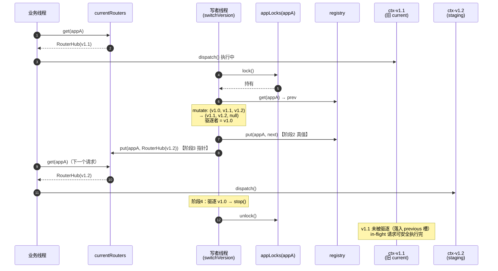

**关键读法**：v1.1 从 current 降级为 previous，**仍在 SlotEntry 内**，因此没有被 stop——它的 in-flight 请求可以正常跑完。真正被 stop 的是彻底掉出三个槽位的 v1.0。这正是三槽位模型的价值：**降级不销毁，销毁只发生在掉出槽位时**。

**场景：同 appId 两个 deploy 并发**

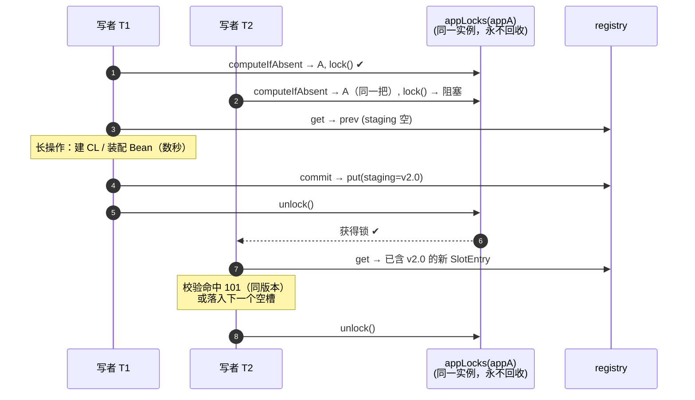

T2 拿到的一定是 T1 提交后的 SlotEntry——因为 `unlock` / `lock` 建立了 happens-before，且 `registry.get` 发生在获得锁之后。**这是"锁只增不删"的直接收益**：若 T1 释放前删掉了锁条目，T2 与后来者可能持有不同锁对象，上述串行链条断裂（§3.7.5）。

#### 3.7.13 可观测性与自检

**导出指标**（管理端口 1111）：

| 指标 | 来源 | 用途 |
|------|------|------|
| `registry.apps` | `registry.size()` | 当前部署的应用数 |
| `registry.contexts` | 三槽位非空计数之和 | 实际存活的 AppContext 数（≥ apps） |
| `registry.serving` | `currentRouters.size()` | 正在接流量的应用数 |
| `registry.locks` | `appLocks.size()` | 历史出现过的 appId 数（只增；与 `apps` 的差 = 已全量卸载的应用数） |
| `registry.lockWaitMs` | 写路径 `lock()` 前后计时 | 同 appId 写竞争程度；持续偏高说明部署过于频繁 |
| `registry.evicted` | `commit` 阶段 4 计数 | 驱逐并 stop 的 AppContext 数 |

**不变量自检任务**（默认 60s 一次，`container.selfcheck.intervalSeconds`）：

```java
/** 只读扫描，不持任何锁；发现破坏只告警不自动修复 */
private void selfCheck() {
    for (Map.Entry<String, SlotEntry> e : registry.entrySet()) {   // 弱一致迭代，可接受
        String appId = e.getKey();
        SlotEntry entry = e.getValue();

        if (entry.isEmpty()) {                                     // I1
            log.error("[registry-selfcheck] I1 破坏：{} 的 SlotEntry 三槽全空", appId);
        }
        AppContext cur = entry.current();
        RouterHub ptr  = currentRouters.get(appId);
        if (cur == null && ptr != null) {                          // I2
            log.error("[registry-selfcheck] I2 破坏：{} 无 current 槽但指针存在（悬空）", appId);
        } else if (cur != null && ptr != cur.routers()) {
            log.error("[registry-selfcheck] I2 破坏：{} 指针与 current 槽不一致", appId);
        }
        if (hasDuplicateCompositeVersion(entry)) {                 // I3
            log.error("[registry-selfcheck] I3 破坏：{} 存在重复 compositeVersion", appId);
        }
    }
    for (String appId : currentRouters.keySet()) {                 // I2 反向
        if (!registry.containsKey(appId)) {
            log.error("[registry-selfcheck] I2 破坏：{} 有指针但不在 registry（悬空）", appId);
        }
    }
}
```

**为什么只告警不自动修复**：不变量被破坏意味着出现了设计外的执行路径（`Error`、绕过 `commit` 的写、或 JVM 层故障）。此时自动"修复"会掩盖根因，且修复动作本身需要抢 `appLock`——把一个只读的诊断任务变成写者，风险高于收益。正确响应是告警 + 人工 `undeploy` 重做。

**自检本身不持锁**，因此它读到的是弱一致视图，理论上可能在一次并发 `commit` 的微秒窗口内误报。缓解：**连续两次扫描都报同一条才升级为 ERROR**，单次仅记 DEBUG。

### 3.8 ClassLoader 生命周期

#### 3.8.1 父子层级

```
                ┌──────────────────────┐
                │ Bootstrap CL         │  JDK + edap-nio + edap-container（不含应用）
                └──────────┬───────────┘
                           │
                ┌──────────▼───────────┐
                │ containerCL          │  EdapAppClassLoader("container")
                │  (共享 jar)           │  parent = Bootstrap CL
                └──────────┬───────────┘
                           │
       ┌───────────────────┼───────────────────┐
       │                   │                   │
┌──────▼──────┐    ┌──────▼──────┐    ┌──────▼──────┐
│ appCL v1.0  │    │ appCL v1.1  │    │ appCL v1.2  │
│ parent =    │    │ parent =    │    │ parent =    │
│ containerCL │    │ containerCL │    │ containerCL │
└─────────────┘    └─────────────┘    └─────────────┘
```

**为什么 appCL.parent = containerCL 而不是 Bootstrap CL**：

- 避免每个应用重复加载共享 jar（如 `edap-protocol`、`edap-json`）——一次加载，三版本共享
- 应用之间互不可见：appCL 委托 containerCL 但反过来不行
- 容器升级（containerCL 内的 jar 更新）所有 appCL 自动跟随

#### 3.8.2 关闭顺序

`undeploy(appId, version)` / `stop()` 必须**逆序**关闭 CL：

```java
private void closeAppCL(EdapAppClassLoader cl, AppContext ctx) {
    // 1. 先 unbind Router（AppContext 内部做：ctx.routers().unbindAll()）
    //    注意：不调 edap.unbindRouter——Edap 不知道 Router 逻辑
    //    unbindAll 由 ctx.stop() 内 RouterHub 完成（§4.6）
    // 2. 再 destroy bean（可能引用了 CL 加载的类，触发类的卸载）
    beanContainer.destroyAll();
    // 3. 最后 close CL（JDK URLClassLoader.close() 释放 jar 文件句柄）
    try {
        cl.close();
    } catch (IOException e) {
        log.warn("close appCL failed", e);
    }
    // 4. 强制 GC 建议（非必须，靠 System.gc() 触发类卸载）
    System.gc();
}
```

#### 3.8.3 防内存泄漏

| 风险 | 防御 |
|------|------|
| 旧版本 ClassLoader 持有 jar 文件句柄（Windows 无法 unlink） | CL 必须先关闭再 GC；undeploy 显式 close |
| 静态字段引用 CL 加载的 Class | Bean destroy 时 `BeanDef.clazz = null`；AppContext static map 全部清空 |
| ThreadLocal 未清理 | AppContext.stop() 扫描所有线程的 ThreadLocal，发现引用本 CL 加载的 Class 时强制 remove |
| 业务线程池内的 Runnable 闭包持 Bean | 业务 Runnable 持有 `WeakReference<Bean>`；undeploy 前 wait + drain 业务队列 |

### 3.9 并发模型

#### 3.9.1 锁层次

```java
// 锁（仅两类）
private final ReentrantLock lifecycleLock = new ReentrantLock();                 // 保护 state
private final ConcurrentHashMap<String, ReentrantLock> appLocks = new ConcurrentHashMap<>();

// 注册中心：ConcurrentHashMap<appId, SlotEntry>，value 是不可变 POJO
private final ConcurrentHashMap<String, SlotEntry> registry = new ConcurrentHashMap<>();
```

| 锁 | 保护对象 | 持有者 | 阻塞什么 |
|----|----------|--------|----------|
| `lifecycleLock` | `state` 字段 | `start()` / `stop()` | 其他状态迁移；毫秒级 |
| `appLocks[appId]` | 单 appId 的 SlotEntry 替换 | `deploy()` / `undeploy()` / `switchVersion()` | 仅同 appId 的其他写 |

**关键原则**：

- **按 appId 隔离写**：appA 部署慢不会阻塞 appB 的 undeploy
- **业务请求完全不持锁**：`currentRouters.get(appId)`，O(1) 无锁读，一跳直达 RouterHub
- **SlotEntry 不可变**：每次 mutate 整个 SlotEntry 替换，无中间态；ConcurrentHashMap.put 原子发布
- **AppContext 状态自洽**：`ctx.start()` 返回时已就绪；`commit` 只是"暴露"早已就绪的 AppContext，读者不可能看到中间态
- **`appLocks` 只增不删**：保证一个 appId 在进程内恒对应同一把锁；CAS 删除会导致两个写者持不同锁并发（§3.7.5）

#### 3.9.2 写路径（deploy / undeploy / switchVersion）

三个写方法的完整代码见 **§3.7.9 写者协议**，此处只给共同骨架——它们的差异只在"校验"与"长操作"，三张表的提交动作全部收敛在 `commit()` 一处：

```java
ReentrantLock appLock = appLocks.computeIfAbsent(appId, k -> new ReentrantLock());
appLock.lock();
try {
    SlotEntry prev = registry.getOrDefault(appId, SlotEntry.EMPTY);   // 0 锁读
    // ① 校验：基于 prev 快照（持锁期间 prev 不会变）→ 失败直接返回，三张表不变
    // ② 长操作：CL 创建、注解扫描、Bean 装配（数百 ms ~ 数 s，仅同 appId 互斥）
    // ③ 提交：registry / currentRouters 对齐 + 驱逐者 stop（§3.7.3、§3.7.10）
    commit(appId, prev, next);
} finally {
    appLock.unlock();                     // 不删 appLocks 条目
}
```

**长操作放在锁内是有意的**：它只阻塞同 appId 的其他写者，而同 appId 的并发部署本来就必须串行（否则 I3 / I4 失效）。不同 appId 完全并行，业务请求全程无感。

**两个校验辅助函数**：

```java
/** 辅助：找 composite version 所在的槽位，没有返回 null。
 *  比对 AppContext 持有的 composite（deploy 时写入 AppContext.version），
 *  用 composite 而非 mavenVersion，区分 SNAPSHOT 的多次构建。 */
private Slot findSlotByCompositeVersion(SlotEntry entry, String compositeVersion) {
    if (entry.previous() != null && compositeVersion.equals(entry.previous().version())) return Slot.PREVIOUS;
    if (entry.current()  != null && compositeVersion.equals(entry.current().version()))  return Slot.CURRENT;
    if (entry.staging()  != null && compositeVersion.equals(entry.staging().version()))  return Slot.STAGING;
    return null;
}

/** 辅助：找第一个空槽位（deploy target）；三个都非空返回 null → 调用方回 105 */
private Slot firstEmptySlot(SlotEntry entry) {
    if (entry.previous() == null) return Slot.PREVIOUS;
    if (entry.current()  == null) return Slot.CURRENT;
    if (entry.staging()  == null) return Slot.STAGING;
    return null;
}
```

#### 3.9.3 业务读路径

```java
/** 业务 dispatch 热路径：一次 get 直达 RouterHub（不经过 SlotEntry） */
public Result invoke(String appId, String method, Object[] args) {
    RouterHub routers = currentRouters.get(appId);                // ConcurrentHashMap.get：无锁
    if (routers == null) {
        return Result.fail(503, "appId 未部署，或当前无接流量版本");
    }
    return routers.dispatch(method, args);
}

/** 管理端读：单 key 读 → 强一致快照 */
public AppContext getAppContext(String appId, Slot slot) {
    SlotEntry entry = registry.get(appId);                        // 无锁
    return entry == null ? null : entry.slotOf(slot);
}
```

**为什么放心**：

- `SlotEntry` 是不可变 POJO，read 看到的要么是旧值要么是新值，**绝无线性不一致**
- `AppContext` 从 `ctx.start()` 返回时状态已自洽（beans 已装配、routers 已 bind）
- `commit` 之前业务读不到；`commit` 之后业务一定能完整调用
- `switchVersion` 期间 `currentRouters.get` 读到的要么是旧 RouterHub 要么是新的，不存在"半个指针"；且旧版本降级到 previous 槽后**不会被 stop**，in-flight 请求可安全跑完（§3.7.12）
- 唯一的例外是 **undeploy / 驱逐**：已取到 RouterHub 的 in-flight 请求可能打在正在 stop 的实例上，由 `container.undeploy.drainMillis` 缓解（§3.7.10）

#### 3.9.4 锁获取顺序约定

**死锁面 = 0**，因为：

- 任何方法最多持一把锁
- `lifecycleLock` 单独使用（`start()` / `stop()`）
- `appLocks[appId]` 单独使用（`deploy()` / `undeploy()` / `switchVersion()`）
- **绝对禁止**：嵌套获取两个 `appLocks[appId]`（如 `appLockA` 内再去 `appLockB`）
- **绝对禁止**：在持 `appLocks[appId]` 时再去抢 `lifecycleLock`（如果真的需要，应该先做完 appLock 内的活释放再抢 lifecycleLock）

```java
// ✅ 正确：start() 内需要先持 lifecycleLock 改 state，再迭代 deploy
public void start() {
    lifecycleLock.lock();
    try {
        state = ContainerState.STARTING;
    } finally { lifecycleLock.unlock(); }
    // 释放 lifecycleLock 后再迭代 deploy（每个 deploy 内部只抢 appLock）
    for (File ear : appsDir.listFiles("*.ear")) {
        deploy(ear);                              // 每轮独立抢 appLock[appId]
    }
}

// ❌ 错误：在 appLock 内反过来抢 lifecycleLock
public void deploy(File ear) {
    appLock.lock();
    try {
        lifecycleLock.lock();                     // ← 死锁风险
        try { ... } finally { lifecycleLock.unlock(); }
    } finally { appLock.unlock(); }
}
```

#### 3.9.5 管理接口的特殊情况

`listApps()` / `query_app_list()` 等管理接口用 `registry.values()` 拿到 ConcurrentHashMap 的**弱一致视图**——返回值可能不对应任何一个真实存在过的时刻（跨 appId 无快照）。

**这是刻意接受的**：管理端口 1111 允许秒级滞后；部署是低频操作；业务请求不走这条路。

**不要为此加锁**：要做跨 appId 强一致就得引入全局读写锁或不可变快照层，等于为"管理端偶尔看一眼"给所有 deploy / undeploy 加上跨 appId 协调成本——按资源隔离粒度划分锁的原则会被破坏。若管理端确实需要稳定视图，正确做法是在**管理端**重试比对（连续两次结果相同即认为稳定）。

完整的两级一致性说明见 **§3.7.11**。

### 3.10 错误处理

| 失败点 | 处理 | 返回 / 状态 |
|--------|------|-------------|
| `EarScanner` 找不到 BUILD.json | 抛 `EarFormatException` | `BaseResult.fail(103, "ear 包结构错误")` |
| 重复部署同 `appId:compositeVersion` | 不抛，直接返回 | `BaseResult.fail(101, "已部署同版本")` |
| 已存在 3 个版本（composite 各异） | 不抛 | `BaseResult.fail(105, "已存在3个版本，请先 undeploy")` |
| SNAPSHOT 包 buildTime 缺失 | warn，回退 mavenVersion | 部署成功；同 mavenVersion 二次部署会被拒（视为重复） |
| `AppContext.start()` 任一阶段抛错 | 调 `ctx.destroyPartial()` 回滚 | `BaseResult.fail(104, e.msg)`；state = START_FAILED |
| `Container.start()` 期间某 EAR 失败 | 不影响其他 EAR，仅记 warn | state 仍 = RUNNING |
| 状态不在 RUNNING 时调 `deploy()` | 抛 `IllegalStateException` | — |
| `switchVersion` 目标 composite 不在 staging/previous | 不抛 | `BaseResult.fail(404, "版本不在 staging/previous 中")` |
| `Edap.addServerGroup` 抛错（重复 key） | 视为严重错误 | 抛回 `attach()` 调用方；Container 状态 = START_FAILED |
| 容器 OOM | 紧急 stop 所有 AppContext | state = STOPPING → STOPPED；触发 `OnCriticalError` 事件 |
| 业务调用时 AppContext 已 undeploy | `currentRouters.get` 返回 null | 返回 503 |
| `commit` 阶段4 驱逐者 `stop()` 抛错 | 记 WARN 继续——驱逐者已从三表摘除，不能因它失败而回滚 | 操作整体仍返回 success |
| 自检发现不变量 I1/I2/I3 被破坏 | 仅 ERROR 告警，**不自动修复**（§3.7.13） | 需人工 `undeploy` 重做 |

**registry 三张表相关的失败模式**（`commit` 各阶段、磁盘写盘、并发竞态）单列在 **§3.7.8**，本表只覆盖 Container 级别的入口错误。

### 3.11 与 Edap、DeployManager、AppContext 的协作

```
       edap-container 模块                          edap-nio 模块
       ──────────────────                          ──────────────

   ┌───────────────────────┐                ┌───────────────────────┐
   │ Bootstrap (edap-container) │             │ Edap                  │
   │  - new Edap()         │                │  - FastNetIO nio      │
   │  - new Container(...) │  attach(edap)  │  - ServerGroups map   │
   │  - container.start()  │ ─────────────► │                       │
   │  - edap.run()         │                └───────────────────────┘
   └──────────┬────────────┘                            ▲
              │ Container.deploy(ear)                   │ addServerGroup
              │ deployApp / undeployApp                 │
              ▼                                         │
   ┌───────────────────────┐                            │
   │ Container             │ ───────────────────────────┘
   │  - registry (SlotEntry│  attach() 一次性 addServerGroup("apps")
   │      per appId)       │  deploy/undeploy 不再 addServer/removeServer
   │  - appLocks[appId]    │  协议路由由 ctx.start→Container.bindAll→RouterHub.setHandlers 完成
   │  - currentRouters     │  详细见 §3.7 Registry
   │  - DeployManager      │
   │  - attach(edap)       │
   └──────────┬────────────┘
              │ registry.put(appId, slotEntry)
              ▼
   ┌───────────────────────┐    ┌──────────────────┐
   │ AppContext            │    │ DeployManager    │
   │ (单个应用上下文)       │    │ (HTTP /1111 管理)│
   └───────────────────────┘    └──────────────────┘
```

要点：

- `Bootstrap` 在 edap-container 模块：负责 `new Edap()` + `new Container()` + `container.attach(edap)` + `container.start()` + `edap.run()`
- Container 通过 `edap.addServerGroup(...)` 把自己管理的 `ServerGroup` 注册到 Edap
- 运行时由 HTTP 1111 端口的 `DeployManager` 接收外部 `deploy_app` 请求 → `Container.deploy(ear)`
- AppContext 由 Container 创建和管理，**不直接对 Edap 暴露**

### 3.12 与现有 `DeployManager.java` 的关系

**现状**：

- `DeployManager` 既负责管理接口（HTTP /1111），又把"加载 EAR、建 ClassLoader、生成 bean"这些应用层逻辑放在自己手里（见 `startApps()` / `appBeanInit()` / `deployAppToContainer()`）

**改后**：

- `DeployManager` 仅承担 HTTP 适配器角色：接收 `/deploy_app` / `/undeploy_app` / `/list_apps`，调用 Container 对应方法
- 应用层逻辑（建 ClassLoader / 启动 AppContext）**全部下沉**到 Container 与 AppContext，DeployManager 不再持有

---

## 四、AppContext

### 4.1 角色与边界

AppContext = **单个应用**（`appId:version`）的运行期容器，由 `Container.deploy(ear)` 创建；多版本时**每个版本一个实例**。

**清楚不做**：

- 不持有其他 AppContext 引用（兄弟隔离，跨应用通信走 eRPC/gRPC）
- 不写 `build.json` / `apps.json` 等部署元数据（由 `DeployManager` 负责）
- 不直接接收外部流量（流量通过 Container 的 `currentRouters[appId]` 路由到当前 AppContext 的 RouterHub；**Edap 不参与路由决策**）

### 4.2 类图

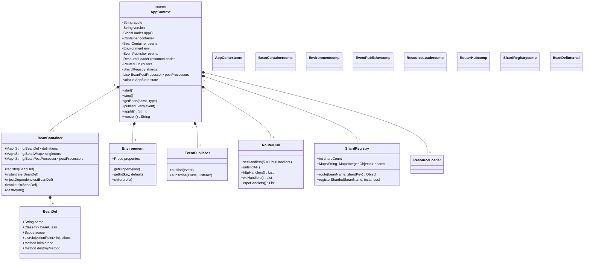

### 4.3 字段说明

| 字段 | 类型 | 作用 |
|------|------|------|
| `appId` / `version` | `String` | 应用唯一标识 |
| `appCL` | `ClassLoader` | 通过 `EdapAppClassLoader(ear, containerCL)` 创建 |
| `container` | `Container` | 父容器，访问 deployMgr / edap 等 |
| `beans` | `BeanContainer` | Bean 装配核心 |
| `env` | `Environment` | 配置注入（build.json + Container.env） |
| `events` | `EventPublisher` | 内部事件总线 |
| `resourceLoader` | `ResourceLoader` | 通过 appCL 读 jar 内资源 |
| `routers` | `RouterHub` | 协议路由集合（被动数据持有者），由 AppContext.start() 在 Phase 3 通过 `Container.bindAll() → RouterHub.setHandlers()` 注册到 NIO（**与 Edap 无关**，Edap 不知道 Router 是什么）；多版本时多个 AppContext 的 routes 都注册，Container 的 `currentRouters[appId]` 决定接流量的是哪个 |
| `shards` | `ShardRegistry` | `@Stateful` 类的分片实例 |
| `postProcessors` | `List<BeanPostProcessor>` | Bean 初始化前后钩子 |
| `state` | `volatile AppState` | 生命周期位置 |

### 4.4 三段式生命周期（gather / commit / ready）

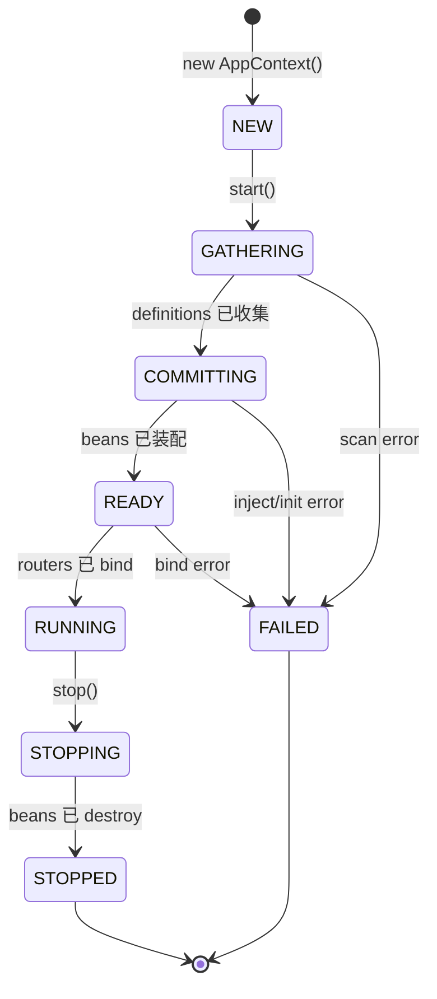

#### 4.4.1 Phase 1 — GATHERING

**职责**：扫描 EAR 内 class，把所有带 `@Component` / `@Service` / `@Bean` / `@EdapService` 的元素汇总成 `BeanDef`，**不实例化、不注入、不调用 @PostConstruct**。

```java
state = GATHERING;
AnnotationScanner scanner = new AnnotationScanner(appCL);
scanner.scan(beanClass -> {
    BeanDef def = BeanDef.fromClass(beanClass);
    def.injections = scanInjections(beanClass);    // 字段/构造器/方法上的 @Inject/@Autowired
    def.initMethod = findInitMethod(beanClass);    // @PostConstruct / @Init
    def.destroyMethod = findDestroyMethod(beanClass);
    def.scope = detectScope(beanClass);            // singleton/prototype/@Stateful
    beans.register(def);
});
state = COMMITTING;
```

**关键不变量**：

- 此阶段只生成 VO（`BeanDef`），不创建任何应用对象
- 失败时 `state = FAILED`，清理已注册的 `BeanDef`

#### 4.4.2 Phase 2 — COMMITTING

**职责**：实例化每个 bean、做依赖注入、调 `@PostConstruct`。

```java
state = COMMITTING;
// 拓扑排序：被依赖的先初始化
List<BeanDef> sorted = beans.topologicalSort();
for (BeanDef def : sorted) {
    Object instance = beans.instantiate(def);    // 选构造器（最多参数的 @Inject / @Autowired）
    beans.injectDependencies(def, instance);     // 字段/Setter 注入
    invokeInit(def, instance);                   // @PostConstruct / @Init
    beans.put(def.name, instance);
}
state = READY;
```

**循环依赖检测**：

- 沿用 Solon 的两段式注入，**不引入三级缓存**
- 检测到 `A → B → A` 立刻抛 `CyclicDependencyException(A → B → A)`
- 仅在 prototype scope 上容忍循环引用（警告但不抛）

#### 4.4.3 Phase 3 — READY

**职责**：注册路由、触发 SmartLifecycle 启动、发 `ContextRefreshedEvent`。

```java
state = READY;
// 路由解析由 Container.bindAll 完成（§3.5.x）：
//   1) 按 deployMetaData.routes() 拿到 4 份 RouteEntry List
//   2) 对每条 entry 做 Method 反射 + setAccessible + bean 查找
//   3) 把 4 份 Handler List 通过 RouterHub.setHandlers(...) 一次性写入
container.bindAll(routers,
                  deployMetaData.httpRoutes(),
                  deployMetaData.wsRoutes(),
                  deployMetaData.erpcRoutes(),
                  deployMetaData.grpcRoutes(),
                  beans);
for (Lifecycle lc : beans.getBeansOfType(Lifecycle.class).values()) {
    lc.start();                                         // SmartLifecycle.start()
}
events.publish(new ContextRefreshedEvent(this));
state = RUNNING;
```

**注**：`Container.bindAll()` 在 Phase 3 已经把 routes 解析为 Handler 并写入 RouterHub——**解析工作只在 deploy 路径做一次**，SwitchVersion 时只换 `Container.currentRouters[appId]` 指针（§3.6.x），不重做 bindAll。多版本时各 AppContext 的 routes 都注册到 NIO，业务 dispatch 由 Container 的 `currentRouters[appId]` 决定走哪个 RouterHub。

### 4.5 BeanContainer 内部

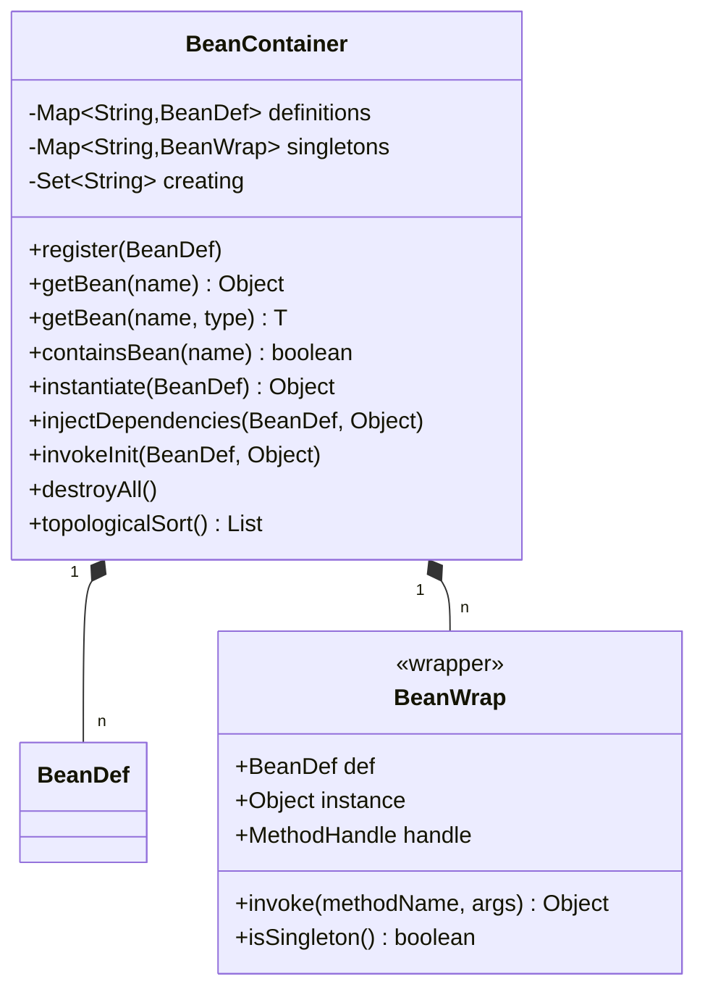

**`BeanWrap` 来自 Solon 设计**——把"实例 + 调用方式"包成一个对象，便于函数式处理（不依赖反射代理）。

#### 4.5.1 角色与边界

**BeanContainer = 单个 AppContext 的 Bean 容器**，承担 AppContext 内 Bean 的全生命周期管理：

- 收集 GATHERING 阶段注册进来的 `BeanDef`
- 在 COMMITTING 阶段做依赖注入（Aware / @Inject 字段 / @Inject 方法）、调 `@PostConstruct`
- 在 READY 阶段触发 `SmartLifecycle.start()`
- 暴露运行时 `getBean(name)` / `singletons()` 给协议 Router 与 RouterHub
- 销毁时逆序跑 `@PreDestroy`、`SmartLifecycle.stop()`、释放单例引用

**清楚不做**：

- 不知道任何协议（HTTP/WS/eRPC/gRPC/Shard）——协议层只通过 `singletons()` 拿 bean 实例
- 不知道其他 AppContext 的存在——兄弟隔离
- 不持有 ClassLoader——`Class<?>` 引用由 BeanDef 持有，由 AppContext 兜底 close
- 不做 Bean 的 AOP 织入（按 @Transactional / @RateLimit 等切面是 §9.4 扩展点）
- 不做"路由注解扫描"——那是 EAR scanner / AnnotationScanner 的事，BeanContainer 只接收 `BeanDef`

#### 4.5.2 字段说明

| 字段 | 类型 | 可见性 | 作用 | 同步 |
|------|------|--------|------|------|
| `definitions` | `LinkedHashMap<String, BeanDef>` | `private final` | 所有已注册的 BeanDef（GATHERING 写入） | 单线程写（Phase 1），之后只读 |
| `singletons` | `ConcurrentHashMap<String, BeanWrap>` | `private final` | singleton / stateful bean 实例 + BeanWrap | 单线程写（Phase 2 / stop）；运行时多线程读 |
| `creating` | `HashSet<String>` | `private final` | 当前正在实例化的 bean name（循环依赖检测） | Phase 2 内单线程；不跨阶段保留 |
| `env` | `Environment` | `private final` | `@Value` / `@AutoConfig` 配置读取 | 启动期只读 |
| `events` | `EventPublisher` | `private final` | BeanInjectFailedEvent / RouteInvokeErrorEvent 等 | 启动期单线程；运行时按 listener 约定 |
| `state` | `volatile BeanContainerState` | `private volatile` | 内部状态机（COLLECTING → INSTANTIATING → READY → DESTROYING → DESTROYED） | 单线程迁移；迁移前 `checkTransitionTo` 校验 |

**`definitions` 用 `LinkedHashMap`**：保证 `topologicalSort()` 输出的稳定性，便于测试断言与日志；性能差异在 bean 数 < 10000 时可忽略。

**`singletons` 用 `ConcurrentHashMap`**：注册期单线程写、运行时多线程读——典型 CHM 用例，不持锁。

**`creating` 用普通 `HashSet`**：仅 Phase 2 短窗口使用，全程单线程——避免 `ConcurrentHashMap.newKeySet()` 的 CAS 开销。

#### 4.5.3 数据结构

**`BeanDef` = GATHERING 阶段生成的不可变 POJO**，描述"如何创建一个 bean"：

```java
public final class BeanDef {
    private final String               name;        // bean 名（默认类简单名）
    private final Class<?>             beanClass;   // bean 类型（ClassLoader 加载后才有）
    private final Scope                scope;       // SINGLETON / PROTOTYPE / STATEFUL
    private final List<String>         injectionNames;  // 字段 / 方法依赖的 bean 名（拓扑排序用）
    private final List<InjectionPoint> injections;  // 字段 / 方法注入点的反射元数据
    private final Method               initMethod;  // @PostConstruct / @Init
    private final Method               destroyMethod; // @PreDestroy / @Destroy
    private final int                  order;       // @Order（同层拓扑序二级排序）
    private final int                  shardCount;  // @Stateful 的分片数（scope=STATEFUL 时有效）

    public String name()              { return name; }
    public Class<?> beanClass()       { return beanClass; }
    public Scope scope()              { return scope; }
    public List<String> injectionNames() { return injectionNames; }
    public List<InjectionPoint> injections() { return injections; }
    public Method initMethod()        { return initMethod; }
    public Method destroyMethod()     { return destroyMethod; }
    public int order()                { return order; }
    public int shardCount()           { return shardCount; }
}

public enum Scope { SINGLETON, PROTOTYPE, STATEFUL }
```

**`injectionNames` 与 `injections` 的区分**：

- `injectionNames` 是 `List<String>`——只存依赖的 bean 名；拓扑排序只用这个，不碰 `Class`
- `injections` 是 `List<InjectionPoint>`——存 `Field` / `Method` 反射元数据；`injectDependencies` 时按这个写值
- 分离的好处：拓扑排序的输入是"哪个 bean 依赖哪个 bean"的图，不需要反射细节

**`BeanWrap` = COMMITTING 阶段创建好的运行期包装**：

```java
public final class BeanWrap {
    private final BeanDef def;
    private final Object  instance;

    public BeanWrap(BeanDef def, Object instance) {
        this.def = def;
        this.instance = instance;
    }

    public BeanDef def()        { return def; }
    public Object  instance()   { return instance; }
    public boolean isSingleton(){ return def.scope() == Scope.SINGLETON
                                || def.scope() == Scope.STATEFUL; }
}
```

**`BeanWrap` 来自 Solon 设计**——把"实例 + 元数据"包成一个对象，便于函数式处理（不依赖反射代理）。

#### 4.5.4 关键方法

**GATHERING 阶段（AppContext.start Phase 1，单线程）**

```java
/** 注册一个 BeanDef；state == COLLECTING 才允许调。 */
public void register(BeanDef def) {
    state.checkTransitionGuard(BeanContainerState.COLLECTING);
    if (definitions.putIfAbsent(def.name(), def) != null) {
        throw new DuplicateBeanException(def.name());
    }
}

/** 拓扑排序：被依赖的先初始化。
 *  返回的 List 是最终实例化顺序。
 *  循环依赖立刻抛 CyclicDependencyException（§4.5.7）。 */
public List<BeanDef> topologicalSort() {
    List<BeanDef> sorted = new ArrayList<>(definitions.size());
    Set<String> visited = new HashSet<>();
    Set<String> inStack = new HashSet<>();
    for (BeanDef def : definitions.values()) {
        dfs(def, visited, inStack, sorted);
    }
    // 同层（依赖集相同）按 @Order 升序，再按 name 字典序
    sorted.sort(Comparator
        .comparingInt((BeanDef d) -> d.order())
        .thenComparing(BeanDef::name));
    return sorted;
}

private void dfs(BeanDef def, Set<String> visited, Set<String> inStack,
                 List<BeanDef> sorted) {
    if (visited.contains(def.name())) return;
    if (inStack.contains(def.name())) {
        throw new CyclicDependencyException(tracePath(inStack, def.name()));
    }
    inStack.add(def.name());
    for (String depName : def.injectionNames()) {
        BeanDef dep = definitions.get(depName);
        if (dep != null) dfs(dep, visited, inStack, sorted);
    }
    inStack.remove(def.name());
    visited.add(def.name());
    sorted.add(def);
}
```

**COMMITTING 阶段（Phase 2，单线程）**

```java
/** 实例化（不注入、不调 init）。selectConstructor 选最多 @Inject 参数的；无则无参。 */
public Object instantiate(BeanDef def) {
    state.checkTransitionGuard(BeanContainerState.INSTANTIATING);
    if (creating.contains(def.name())) {
        throw new CyclicDependencyException("creating already has " + def.name());
    }
    creating.add(def.name());
    try {
        Constructor<?> ctor = selectConstructor(def.beanClass());
        ctor.setAccessible(true);
        return ctor.newInstance(ctorArgs(ctor, def));
    } catch (InvocationTargetException e) {
        throw new BeanInstantiationException(def.name(), e.getTargetException());
    } catch (ReflectiveOperationException e) {
        throw new BeanInstantiationException(def.name(), e);
    } finally {
        creating.remove(def.name());
    }
}

/** 依赖注入 + Aware 回调。
 *  顺序：Aware 接口 → @Inject 字段 → @Inject 方法。 */
public void injectDependencies(BeanDef def, Object instance) {
    injectAware(def, instance);          // 4 个 Aware 接口
    for (InjectionPoint ip : def.injections()) {
        if (ip.isField()) {
            Object dep = resolveDependency(ip);
            Field f = ip.field();
            f.setAccessible(true);
            f.set(instance, dep);
        } else {                          // setter-style method
            Method m = ip.method();
            Object[] args = resolveMethodArgs(m);
            m.setAccessible(true);
            m.invoke(instance, args);
        }
    }
}

private void injectAware(BeanDef def, Object instance) {
    if (instance instanceof ApplicationContextAware) {
        ((ApplicationContextAware) instance).setApplicationContext(this.appContext);
    }
    if (instance instanceof EnvironmentAware) {
        ((EnvironmentAware) instance).setEnvironment(this.env);
    }
    if (instance instanceof BeanNameAware) {
        ((BeanNameAware) instance).setBeanName(def.name());
    }
    if (instance instanceof RouterHubAware) {
        ((RouterHubAware) instance).setRouterHub(this.appContext.routers());
    }
}

/** 调 @PostConstruct / @Init。 */
public void invokeInit(BeanDef def, Object instance) {
    if (def.initMethod() == null) return;
    try {
        def.initMethod().setAccessible(true);
        def.initMethod().invoke(instance);
    } catch (InvocationTargetException e) {
        throw new BeanInitFailedException(def.name(), e.getTargetException());
    } catch (ReflectiveOperationException e) {
        throw new BeanInitFailedException(def.name(), e);
    }
}
```

**READY 阶段（Phase 3，单线程）**——`Lifecycle.start()` 由 AppContext 触发，BeanContainer 提供查找：

```java
/** 启动所有 SmartLifecycle bean（按 @Order 升序）。 */
public void startLifecycles() {
    List<BeanWrap> ordered = singletons.values().stream()
        .filter(bw -> bw.instance() instanceof Lifecycle)
        .sorted(Comparator
            .comparingInt((BeanWrap bw) -> bw.def().order())
            .thenComparing(bw -> bw.def().name()))
        .collect(Collectors.toList());
    for (BeanWrap bw : ordered) {
        ((Lifecycle) bw.instance()).start();
    }
}
```

**运行时查询（多线程安全）**

```java
public Object getBean(String name) {
    BeanWrap bw = singletons.get(name);
    if (bw == null) throw new NoSuchBeanException(name);
    return bw.instance();
}

public <T> T getBean(String name, Class<T> type) {
    return type.cast(getBean(name));
}

public boolean containsBean(String name) {
    return singletons.containsKey(name);
}

/** Container.bindAll 用：拿所有 singleton BeanWrap，弱一致迭代。 */
public Collection<BeanWrap> singletons() {
    return singletons.values();
}
```

**销毁（AppContext.stop，单线程）**

```java
/** 逆序：Lifecycle.stop() → @PreDestroy → 清空 singletons。
 *  异常一律记 WARN 继续——已 unbind 路由，业务不会再到这。 */
public void destroyAllSingletons() {
    state.transitionTo(BeanContainerState.DESTROYING);

    // 1. 逆序 Lifecycle.stop()
    List<BeanWrap> ordered = new ArrayList<>(singletons.values());
    ordered.sort(Comparator
        .comparingInt((BeanWrap bw) -> bw.def().order())
        .reversed());
    for (BeanWrap bw : ordered) {
        if (!(bw.instance() instanceof Lifecycle)) continue;
        try { ((Lifecycle) bw.instance()).stop(); }
        catch (Throwable t) {
            log.warn("Lifecycle.stop failed for {}", l -> l.arg(bw.def().name()).threw(t));
        }
    }

    // 2. 逆序 @PreDestroy
    for (BeanWrap bw : ordered) {
        Method dm = bw.def().destroyMethod();
        if (dm == null) continue;
        try { dm.setAccessible(true); dm.invoke(bw.instance()); }
        catch (Throwable t) {
            log.warn("@PreDestroy failed for {}", l -> l.arg(bw.def().name()).threw(t));
        }
    }

    // 3. 清空 singletons
    singletons.clear();
    state.transitionTo(BeanContainerState.DESTROYED);
}

/** destroyAll 是 destroyAllSingletons 的语义别名。 */
public void destroyAll() { destroyAllSingletons(); }
```

#### 4.5.5 与 AppContext 三段式协作

```
AppContext.start()                                  BeanContainer state
  │                                                  ─────────────────
  ├─ Phase 1 GATHERING
  │    │
  │    ├─ AnnotationScanner.scan(c -> {
  │    │      BeanDef def = BeanDef.fromClass(c);
  │    │      beans.register(def);                    ──► COLLECTING
  │    │  })
  │    │
  │    └─ for def in beans.topologicalSort():  // 一次性，Phase 1 末尾
  │         // 暂存排序结果，Phase 2 用
  │
  ├─ beans.transitionTo(INSTANTIATING)
  │
  ├─ Phase 2 COMMITTING
  │    │
  │    └─ for def in sorted:
  │         instance = beans.instantiate(def)
  │         beans.injectDependencies(def, instance)
  │         beans.invokeInit(def, instance)
  │         if SINGLETON: beans.singletons.put(...)
  │         if STATEFUL:  shardRegistry.registerSharded(...)
  │
  ├─ beans.transitionTo(READY)
  │
  └─ Phase 3 READY
       │
       ├─ beans.startLifecycles()                    // SmartLifecycle.start()
       └─ events.publish(ContextRefreshedEvent)

AppContext.stop()
  │
  └─ beans.destroyAllSingletons()
       │
       ├─ 逆序 Lifecycle.stop()
       ├─ 逆序 @PreDestroy
       └─ singletons.clear()                         ──► DESTROYED
```

**关键约束**：

- Phase 1/2/3 全程单线程，AppContext.start 持有 lifecycleLock
- `singletons.put` 全部发生在 Phase 2 内，业务 dispatch 此时尚未开始
- READY 后业务 dispatch 才并发触发 `getBean` / `singletons()`——CHM 保证可见性

#### 4.5.6 Scope 与 @Primary

**三种 Scope**：

| Scope | 行为 | 存储位置 |
|-------|------|----------|
| `SINGLETON` | 默认；唯一实例，整个 AppContext 共用 | `BeanContainer.singletons` |
| `PROTOTYPE` | 每次 `getBean` 创建新实例；不缓存 | 临时变量（调用方持有） |
| `STATEFUL` | 由 `ShardRegistry` 接管；按 shardKey 路由到 N 个分片实例 | `ShardRegistry.shards[beanName]` |

**`@Primary` 候选消歧**：

- `@Inject` 字段类型有多个候选 bean → 优先选带 `@Primary` 的
- 无 `@Primary` 且多个候选 → 抛 `NoUniqueBeanException(type, candidates)`
- 检测时机：`resolveDependency` 阶段；部署期 fail

**`@Order` 排序范围**：

- 同 `BeanDef` 内：单实例无意义
- 跨 BeanDef（同层拓扑序内）：用 `def.order()` 二级排序
- 同 `order` 内：用 `def.name()` 字典序

#### 4.5.7 循环依赖检测

**沿用 Solon 的两段式注入**——**不引入 Spring 的三级缓存**：

1. `instantiate(def)` → 创建实例，**不**注入字段、不调 init
2. `injectDependencies(def, instance)` → 注入字段 + Aware + 方法
3. `invokeInit(def, instance)` → @PostConstruct

**检测点在 1 之前**：

```java
if (creating.contains(def.name())) {
    throw new CyclicDependencyException(...);
}
```

`creating` 是 Phase 2 内的局部级状态——`instantiate` 进入时 add，退出时 remove，失败也在 finally remove。

**为什么不用三级缓存**：Solon 的两段式已经够用：先 instantiate 出"半成品"（已分配内存但字段未注入），再 inject 时 setter 注入构造器参数之外的依赖——setter 循环引用（A.setB() → B.setA()）可以工作，构造器循环引用（A(B b) → B(A a)）直接挂。

**`@Stateful` 的循环引用**：警告但不抛——分片实例本来就允许多实例，破坏性低。

**`PROTOTYPE` 的循环引用**：警告但不抛——每次新创建，破坏性低。

#### 4.5.8 并发语义

| 操作 | 持锁 | 备注 |
|------|------|------|
| `register(BeanDef)` | 无锁 | Phase 1 单线程写 `definitions`（LinkedHashMap） |
| `topologicalSort()` | 无锁 | Phase 1 末单线程调一次；写 `visited` / `inStack` |
| `instantiate` | 无锁 | Phase 2 单线程；写 `creating`（HashSet） |
| `injectDependencies` | 无锁 | Phase 2 单线程；递归 `getBean` 触发其他 bean 创建 |
| `invokeInit` | 无锁 | Phase 2 单线程；调用户 `@PostConstruct` |
| `startLifecycles` | 无锁 | Phase 3 单线程 |
| `getBean(name)` | 无锁 | 读 `singletons`（CHM） |
| `getBean(name, type)` | 无锁 | 同上 |
| `containsBean` | 无锁 | 读 `singletons` |
| `singletons()` | 无锁 | 返回 `singletons.values()` 弱一致视图 |
| `destroyAllSingletons` | 无锁 | AppContext.stop 单线程；调 `singletons.clear()` |

**lifecycle 阶段为什么不用锁**：

- AppContext.start Phase 1/2/3 全在主线程串行
- 业务 dispatch 尚未开始（`currentRouters` 还没指向此 AppContext）
- 无并发读，无需并发安全

**runtime 路径为什么用 CHM**：

- 业务 dispatch 线程多线程并发读
- 注册期单线程写 + 运行时多线程读 = CHM 典型用例
- `HashMap` + 完成后 `unmodifiableMap` 也行，但要 volatile "ready" 标记，复杂度更高

**destroy 阶段为什么单线程**：

- AppContext.stop 持有 lifecycleLock
- RouterHub.unbindAll 已在 destroyAllSingletons 之前完成（§4.6.6 关闭顺序）
- 业务 dispatch 已被路由层拦截，不会再触达 bean

#### 4.5.9 错误处理

**容器异常全部继承 `RuntimeException`**——9 个 `io.edap.container.exc.*Exception` 均为 unchecked。这是有意设计：

- 容器异常是部署期错误（Phase 1/2/3 失败），不属于业务正常控制流，不需要强制 caller 处理
- `BeanContainer.register / instantiate / injectDependencies / invokeInit / startLifecycles / getBean` 等方法签名不应被 throws 子句污染
- 与 Spring `BeansException` / Guice `ConfigurationException` 的设计一致
- AppContext.start 主线程 catch `RuntimeException` → `destroyPartial()` 兜底（§4.13）

| 失败点 | 异常 | 阶段 | 后果 |
|--------|------|------|------|
| `register` 同名 bean 重复 | `DuplicateBeanException(name)` | Phase 1 | AppContext.start fail |
| `topologicalSort` 循环依赖 | `CyclicDependencyException(路径)` | Phase 1 末 | Phase 2 fail |
| `instantiate` 找不到合适构造器 | `NoSuitableConstructorException(beanClass)` | Phase 2 | fail |
| `instantiate` 构造器抛业务异常 | `BeanInstantiationException(name, cause)` | Phase 2 | fail，cause 是原异常 |
| `injectDependencies` `@Inject` 找不到 bean | `NoSuchBeanException(name)` | Phase 2 | fail |
| `injectDependencies` 多候选无 `@Primary` | `NoUniqueBeanException(type, candidates)` | Phase 2 | fail |
| `invokeInit` `@PostConstruct` 抛错 | `BeanInitFailedException(name, cause)` | Phase 2 | fail，cause 是原异常 |
| `startLifecycles` `Lifecycle.start` 抛错 | `LifecycleStartFailedException(name, cause)` | Phase 3 | fail |
| `destroyAllSingletons` `Lifecycle.stop` 抛错 | 记 WARN 继续 | 销毁 | 业务已不触达，宽容 |
| `destroyAllSingletons` `@PreDestroy` 抛错 | 记 WARN 继续 | 销毁 | 同上 |

**所有 Phase 1/2/3 失败都回滚已创建实例**：

- 由 `AppContext.start` 的 catch 块统一处理：`ctx.destroyPartial()`（§4.13）
- BeanContainer 自身不持有"rollback"逻辑——只要 `singletons` 还没被外部看到，GC 兜底
- `creating` 在 instantiate 失败时已在 finally remove，不留残留

**Phase 1 末排序失败**：

- 此时 `singletons` 还是空的——回滚 = 啥也不做
- `creating` 不可能被填（Phase 1 不调 instantiate），无残留
- 直接让 AppContext.start 抛错即可

#### 4.5.10 可观测性

| 指标 | 来源 | 含义 |
|------|------|------|
| `beans.definitions` | `definitions.size()` | 已注册 BeanDef 数 |
| `beans.singletons` | `singletons.size()` | 已就绪的 singleton 数 |
| `beans.statefulTotal` | ShardRegistry.size 之和 | 分片 bean 总实例数 |
| `beans.commitCostMs` | Phase 2 起止计时 | Bean 实例化 + 注入 + init 总耗时 |
| `beans.injectFailures` | 注入失败计数（累计） | 健康度指标 |
| `beans.cyclicDependencies` | 循环依赖检测抛出次数 | 部署期问题计数 |
| `beans.state` | `state.name()` | 当前状态机位置 |

**自检**（与 §3.7.13 registry-selfcheck 联动）：

- `singletons` 中每个 `BeanWrap.instance` 的 `getClass().getClassLoader()` 应等于 `appCL`（防止 ClassLoader 泄漏）
- `definitions` 中所有 `name` 在 `singletons` / `shardRegistry` 至少有一处可达（`@Primary` / 显式 getBean 引用）

#### 4.5.11 BeanContainerState

```java
public enum BeanContainerState {
    COLLECTING,       // Phase 1：register BeanDef
    INSTANTIATING,    // Phase 2：instantiate / inject / init
    READY,            // Phase 3 完成：singletons 可被业务读
    DESTROYING,       // stop() 进入：Lifecycle.stop / @PreDestroy
    DESTROYED;        // terminal

    public void checkTransitionGuard(BeanContainerState expected) {
        if (this != expected) {
            throw new IllegalStateException(
                "BeanContainer state " + this + " ≠ expected " + expected);
        }
    }
    public void transitionTo(BeanContainerState to) {
        if (!canTransitionTo(to)) {
            throw new IllegalStateException(
                "Illegal BeanContainerState transition: " + this + " -> " + to);
        }
        // setter 由 lifecycleLock 串行化（AppContext 持有）
    }
    public boolean canTransitionTo(BeanContainerState to) {
        switch (this) {
            case COLLECTING:    return to == INSTANTIATING;
            case INSTANTIATING: return to == READY;
            case READY:         return to == DESTROYING;
            case DESTROYING:    return to == DESTROYED;
            case DESTROYED:     return false;
            default:            return false;
        }
    }
}
```

**两层锁的区分**：

- `BeanContainerState` 由 AppContext 的 `lifecycleLock` 串行化（与 §3.3 ContainerState 共用同一把锁）
- 不为 BeanContainer 单独加锁——AppContext 持有锁期间 BeanContainer 全部方法都是单线程调用

#### 4.5.12 类完整实现

> 上述各方法的串联版，对应 `edap-container-parent/edap-container/src/main/java/io/edap/container/BeanContainer.java`：

```java
package io.edap.container;

import io.edap.container.event.EventPublisher;
import org.slf4j.Logger;
import org.slf4j.LoggerFactory;

import javax.inject.Inject;

import java.lang.reflect.Constructor;
import java.lang.reflect.Field;
import java.lang.reflect.InvocationTargetException;
import java.lang.reflect.Method;
import java.lang.reflect.Parameter;
import java.util.ArrayList;
import java.util.Collection;
import java.util.Comparator;
import java.util.HashSet;
import java.util.LinkedHashMap;
import java.util.List;
import java.util.Set;
import java.util.concurrent.ConcurrentHashMap;
import java.util.stream.Collectors;

/**
 * BeanContainer = 单个 AppContext 的 Bean 容器。
 *
 * 责任 GATHERING / COMMITTING / READY / DESTROYING / DESTROYED 五态生命周期：
 *   - GATHERING：register BeanDef（Phase 1）
 *   - COMMITTING：instantiate → injectDependencies → invokeInit（Phase 2）
 *   - READY：startLifecycles（Phase 3）→ 业务 dispatch 触发 getBean / singletons()
 *   - DESTROYING / DESTROYED：逆序 stop / @PreDestroy / 清空 singletons
 *
 * 全程由 AppContext 的 lifecycleLock 串行化（Phase 1/2/3/销毁），运行时 getBean 无锁。
 */
public class BeanContainer {

    private static final Logger log = LoggerFactory.getLogger(BeanContainer.class);

    // —— 字段 ——

    /** GATHERING 阶段写：所有注册的 BeanDef。LinkedHashMap 保证遍历顺序 = 注册顺序。 */
    private final LinkedHashMap<String, BeanDef> definitions = new LinkedHashMap<>();

    /** COMMITTING 阶段写、运行时多线程读：singleton / stateful 实例 + BeanWrap。 */
    private final ConcurrentHashMap<String, BeanWrap> singletons = new ConcurrentHashMap<>();

    /** COMMITTING 阶段内、循环依赖检测用：当前正在 instantiate 的 bean name。 */
    private final HashSet<String> creating = new HashSet<>();

    /** 所有已实例化 BeanDef 的最终顺序（topologicalSort 输出）；Phase 2 用。 */
    private List<BeanDef> sorted = List.of();

    private final Environment       env;
    private final EventPublisher    events;
    private final AppContext        appContext;
    private final ShardRegistry     shards;

    private volatile BeanContainerState state = BeanContainerState.COLLECTING;

    public BeanContainer(AppContext appContext, Environment env, EventPublisher events,
                         ShardRegistry shards) {
        this.appContext = appContext;
        this.env        = env;
        this.events     = events;
        this.shards     = shards;
    }

    // —— Phase 1 GATHERING ——

    /** 注册一个 BeanDef。state == COLLECTING 才允许调。 */
    public void register(BeanDef def) {
        state.checkTransitionGuard(BeanContainerState.COLLECTING);
        if (definitions.putIfAbsent(def.name(), def) != null) {
            throw new DuplicateBeanException(def.name());
        }
    }

    /** 拓扑排序：被依赖的先初始化。循环依赖立刻抛 CyclicDependencyException（§4.5.7）。 */
    public List<BeanDef> topologicalSort() {
        List<BeanDef> result = new ArrayList<>(definitions.size());
        Set<String> visited = new HashSet<>();
        Set<String> inStack = new HashSet<>();
        for (BeanDef def : definitions.values()) {
            dfs(def, visited, inStack, result);
        }
        // 同层（依赖集相同）按 @Order 升序，再按 name 字典序
        result.sort(Comparator
            .comparingInt((BeanDef d) -> d.order())
            .thenComparing(BeanDef::name));
        this.sorted = List.copyOf(result);
        return this.sorted;
    }

    private void dfs(BeanDef def, Set<String> visited, Set<String> inStack,
                     List<BeanDef> result) {
        if (visited.contains(def.name())) return;
        if (inStack.contains(def.name())) {
            throw new CyclicDependencyException(tracePath(inStack, def.name()));
        }
        inStack.add(def.name());
        for (String depName : def.injectionNames()) {
            BeanDef dep = definitions.get(depName);
            if (dep != null) dfs(dep, visited, inStack, result);
        }
        inStack.remove(def.name());
        visited.add(def.name());
        result.add(def);
    }

    /** 构造循环依赖路径字符串（A → B → A → ...），仅用于异常 message。 */
    private static String tracePath(Set<String> inStack, String backTo) {
        return inStack.stream().collect(Collectors.joining(" → ")) + " → " + backTo;
    }

    /** Phase 1 → Phase 2 状态迁移。 */
    public void transitionToCommitting() {
        state.transitionTo(BeanContainerState.INSTANTIATING);
    }

    // —— Phase 2 COMMITTING ——

    /** 实例化（不注入、不调 init）。selectConstructor 选最多 @Inject 注解参数的；无则无参。 */
    public Object instantiate(BeanDef def) {
        state.checkTransitionGuard(BeanContainerState.INSTANTIATING);
        if (creating.contains(def.name())) {
            throw new CyclicDependencyException("creating already has " + def.name());
        }
        creating.add(def.name());
        try {
            Constructor<?> ctor = selectConstructor(def.beanClass());
            ctor.setAccessible(true);
            return ctor.newInstance(ctorArgs(ctor, def));
        } catch (InvocationTargetException e) {
            throw new BeanInstantiationException(def.name(), e.getTargetException());
        } catch (ReflectiveOperationException e) {
            throw new BeanInstantiationException(def.name(), e);
        } finally {
            creating.remove(def.name());
        }
    }

    /** 选构造器：最多 @Inject 注解参数的；无则无参；无则 NoSuitableConstructorException。 */
    private static Constructor<?> selectConstructor(Class<?> beanClass) {
        Constructor<?>[] all = beanClass.getDeclaredConstructors();
        Constructor<?> best = null;
        int bestScore = -1;
        for (Constructor<?> c : all) {
            Inject ann = c.getAnnotation(Inject.class);
            int score = (ann != null) ? c.getParameterCount() : 0;
            if (score > bestScore) { bestScore = score; best = c; }
        }
        if (best == null) {
            throw new NoSuitableConstructorException(beanClass);
        }
        return best;
    }

    /** 按构造器参数类型递归 getBean（依赖解析）；@Inject 标注的入参才解析。 */
    private Object[] ctorArgs(Constructor<?> ctor, BeanDef def) {
        Parameter[] params = ctor.getParameters();
        Object[] args = new Object[params.length];
        for (int i = 0; i < params.length; i++) {
            if (params[i].getAnnotation(Inject.class) == null) {
                args[i] = null;          // 非 @Inject 参数由调用方自行处理（罕见）
            } else {
                args[i] = resolveDependencyByType(params[i].getType());
            }
        }
        return args;
    }

    /** 依赖注入 + Aware 回调。顺序：Aware → @Inject 字段 → @Inject 方法。 */
    public void injectDependencies(BeanDef def, Object instance) {
        injectAware(def, instance);          // 4 个 Aware 接口
        for (InjectionPoint ip : def.injections()) {
            if (ip.isField()) {
                Object dep = resolveDependency(ip);
                Field f = ip.field();
                f.setAccessible(true);
                try {
                    f.set(instance, dep);
                } catch (IllegalAccessException e) {
                    throw new BeanInjectFailedException(def.name(), f.getName(), e);
                }
            } else {                          // setter-style method
                Method m = ip.method();
                Object[] args = resolveMethodArgs(m, def);
                m.setAccessible(true);
                try {
                    m.invoke(instance, args);
                } catch (InvocationTargetException e) {
                    throw new BeanInjectFailedException(def.name(), m.getName(), e.getTargetException());
                } catch (IllegalAccessException e) {
                    throw new BeanInjectFailedException(def.name(), m.getName(), e);
                }
            }
        }
    }

    /** 4 个 Aware 接口回调。顺序：ApplicationContextAware → EnvironmentAware → BeanNameAware → RouterHubAware。 */
    private void injectAware(BeanDef def, Object instance) {
        if (instance instanceof ApplicationContextAware) {
            ((ApplicationContextAware) instance).setApplicationContext(this.appContext);
        }
        if (instance instanceof EnvironmentAware) {
            ((EnvironmentAware) instance).setEnvironment(this.env);
        }
        if (instance instanceof BeanNameAware) {
            ((BeanNameAware) instance).setBeanName(def.name());
        }
        if (instance instanceof RouterHubAware) {
            ((RouterHubAware) instance).setRouterHub(this.appContext.routers());
        }
    }

    /** 单 InjectionPoint 解析：直接按 ip 所指示的 bean 名（构建期已绑定）取。 */
    private Object resolveDependency(InjectionPoint ip) {
        return resolveDependencyByName(ip.beanName(), ip.requiredType());
    }

    /** 方法注入参数解析：按参数类型递归 getBean（仅 @Inject 标注参数）。 */
    private Object[] resolveMethodArgs(Method m, BeanDef def) {
        Parameter[] params = m.getParameters();
        Object[] args = new Object[params.length];
        for (int i = 0; i < params.length; i++) {
            if (params[i].getAnnotation(Inject.class) == null) {
                args[i] = null;
            } else {
                args[i] = resolveDependencyByType(params[i].getType());
            }
        }
        return args;
    }

    /** 按类型 + @Primary 解析候选 bean。 */
    private Object resolveDependencyByType(Class<?> type) {
        if (type == AppContext.class)     return this.appContext;
        if (type == Environment.class)    return this.env;
        if (type == EventPublisher.class) return this.events;
        if (type == RouterHub.class)      return this.appContext.routers();
        if (type == ShardRegistry.class)  return this.shards;

        List<BeanWrap> candidates = new ArrayList<>();
        for (BeanWrap bw : singletons.values()) {
            if (type.isInstance(bw.instance())) {
                candidates.add(bw);
            }
        }
        if (candidates.isEmpty()) throw new NoSuchBeanException(type);
        if (candidates.size() == 1) return candidates.get(0).instance();

        // 多个候选：@Primary 消歧
        BeanWrap primary = null;
        for (BeanWrap bw : candidates) {
            if (bw.def().beanClass().isAnnotationPresent(Primary.class)) {
                if (primary != null) throw new NoUniqueBeanException(type, candidates);
                primary = bw;
            }
        }
        if (primary == null) throw new NoUniqueBeanException(type, candidates);
        return primary.instance();
    }

    /** 按 bean 名直接取（InjectionPoint 编译期已绑定名）。 */
    private Object resolveDependencyByName(String beanName, Class<?> requiredType) {
        BeanWrap bw = singletons.get(beanName);
        if (bw == null) throw new NoSuchBeanException(beanName);
        if (requiredType != null && !requiredType.isInstance(bw.instance())) {
            throw new BeanTypeMismatchException(beanName, requiredType, bw.instance().getClass());
        }
        return bw.instance();
    }

    /** 调 @PostConstruct / @Init。 */
    public void invokeInit(BeanDef def, Object instance) {
        if (def.initMethod() == null) return;
        try {
            def.initMethod().setAccessible(true);
            def.initMethod().invoke(instance);
        } catch (InvocationTargetException e) {
            throw new BeanInitFailedException(def.name(), e.getTargetException());
        } catch (ReflectiveOperationException e) {
            throw new BeanInitFailedException(def.name(), e);
        }
    }

    /** 把 instance 存入 singletons（按 BeanDef.scope 选择 SINGLETON / STATEFUL 路径）。 */
    public void registerInstance(BeanDef def, Object instance) {
        if (def.scope() == Scope.SINGLETON) {
            singletons.put(def.name(), new BeanWrap(def, instance));
        } else if (def.scope() == Scope.STATEFUL) {
            singletons.put(def.name(), new BeanWrap(def, instance));  // template 实例
            shards.registerSharded(def.name(), instance, def.shardCount());  // 扩展为 N 个分片
        }
        // PROTOTYPE 不缓存
    }

    /** Phase 2 → Phase 3 状态迁移。 */
    public void transitionToReady() {
        state.transitionTo(BeanContainerState.READY);
    }

    // —— Phase 3 READY ——

    /** 启动所有 SmartLifecycle bean（按 @Order 升序）。 */
    public void startLifecycles() {
        List<BeanWrap> ordered = singletons.values().stream()
            .filter(bw -> bw.instance() instanceof Lifecycle)
            .sorted(Comparator
                .comparingInt((BeanWrap bw) -> bw.def().order())
                .thenComparing(bw -> bw.def().name()))
            .collect(Collectors.toList());
        for (BeanWrap bw : ordered) {
            try {
                ((Lifecycle) bw.instance()).start();
            } catch (Throwable t) {
                throw new LifecycleStartFailedException(bw.def().name(), t);
            }
        }
    }

    // —— 运行时查询（多线程读）——

    public Object getBean(String name) {
        BeanWrap bw = singletons.get(name);
        if (bw == null) throw new NoSuchBeanException(name);
        return bw.instance();
    }

    public <T> T getBean(String name, Class<T> type) {
        return type.cast(getBean(name));
    }

    public boolean containsBean(String name) {
        return singletons.containsKey(name);
    }

    /** Container.bindAll 用：拿所有 singleton BeanWrap，弱一致迭代。 */
    public Collection<BeanWrap> singletons() {
        return singletons.values();
    }

    /** BeanContainer 持有的 appCL（AppContext 持有真 CL，BeanContainer 只透传）。 */
    public ClassLoader appClassLoader() {
        return appContext.appCL();
    }

    // —— 销毁（AppContext.stop 单线程）——

    /** 逆序：Lifecycle.stop() → @PreDestroy → 清空 singletons。
     *  异常一律记 WARN 继续——已 unbind 路由，业务不会再到这。 */
    public void destroyAllSingletons() {
        state.transitionTo(BeanContainerState.DESTROYING);

        // 1. 逆序 Lifecycle.stop()
        List<BeanWrap> ordered = new ArrayList<>(singletons.values());
        ordered.sort(Comparator
            .comparingInt((BeanWrap bw) -> bw.def().order())
            .reversed());
        for (BeanWrap bw : ordered) {
            if (!(bw.instance() instanceof Lifecycle)) continue;
            try { ((Lifecycle) bw.instance()).stop(); }
            catch (Throwable t) {
                log.warn("Lifecycle.stop failed for {}", bw.def().name(), t);
            }
        }

        // 2. 逆序 @PreDestroy
        for (BeanWrap bw : ordered) {
            Method dm = bw.def().destroyMethod();
            if (dm == null) continue;
            try {
                dm.setAccessible(true);
                dm.invoke(bw.instance());
            } catch (Throwable t) {
                log.warn("@PreDestroy failed for {}", bw.def().name(), t);
            }
        }

        // 3. 清空 singletons（STATEFUL 的分片实例也由 ShardRegistry 释放）
        singletons.clear();
        shards.clear();
        state.transitionTo(BeanContainerState.DESTROYED);
    }

    /** destroyAll 是 destroyAllSingletons 的语义别名（classDiagram 兼容）。 */
    public void destroyAll() { destroyAllSingletons(); }

    // —— 访问器 ——

    public BeanContainerState state()   { return state; }
    public int                 size()   { return singletons.size(); }
    public List<BeanDef>       sorted() { return sorted; }
}
```

**`InjectionPoint` —— 注入点的反射元数据封装**：

> 构造期由 AnnotationScanner 生成 BeanDef 时一并生成；Phase 2 注入时按 isField / isMethod 分支执行注入。

```java
package io.edap.container;

import java.lang.reflect.Field;
import java.lang.reflect.Method;

/**
 * 注入点：字段注入 / 方法注入（setter-style）的统一封装。
 *
 * 构造期被 BeanDef 持有，Phase 2 注入时按 isField() 分支执行：
 *   - 字段：f.set(instance, dep)
 *   - 方法：m.invoke(instance, args)  // args 按方法参数解析
 *
 * beanName() / requiredType()：
 *   - 字段：beanName 由 @Inject("name") 指定；无则按 requiredType 解析
 *   - 方法：beanName 来自 @Inject("name")（setter-style 通常按 parameter 推导）
 */
public final class InjectionPoint {

    public enum Kind { FIELD, METHOD }

    private final Kind       kind;
    private final Field      field;          // kind == FIELD 时非 null
    private final Method     method;         // kind == METHOD 时非 null
    private final String     beanName;       // 直接绑定的 bean 名（@Inject("xxx")）；可能 null
    private final Class<?>   requiredType;   // 依赖类型（按类型解析时用）

    public static InjectionPoint field(Field f, String beanName, Class<?> requiredType) {
        return new InjectionPoint(Kind.FIELD, f, null, beanName, requiredType);
    }

    public static InjectionPoint method(Method m, String beanName, Class<?> requiredType) {
        return new InjectionPoint(Kind.METHOD, null, m, beanName, requiredType);
    }

    private InjectionPoint(Kind kind, Field field, Method method,
                           String beanName, Class<?> requiredType) {
        this.kind         = kind;
        this.field        = field;
        this.method       = method;
        this.beanName     = beanName;
        this.requiredType = requiredType;
    }

    public boolean  isField()      { return kind == Kind.FIELD; }
    public boolean  isMethod()     { return kind == Kind.METHOD; }
    public Field    field()        { return field; }
    public Method   method()       { return method; }
    public String   beanName()     { return beanName; }
    public Class<?> requiredType() { return requiredType; }
}
```

**与上面 BeanContainer 类的对应关系**：

- `def.injections()` 返回 `List<InjectionPoint>`，Phase 2 `injectDependencies` 按 `isField()` 分支执行
- `resolveDependency(ip)` 优先按 `beanName` 取（`@Inject("name")` 显式声明），无则按 `requiredType` 走 `resolveDependencyByType`（含 @Primary 消歧）
- `resolveMethodArgs(m, def)` 用于方法注入：按方法参数类型递归 `resolveDependencyByType`（仅 @Inject 标注参数解析，非 @Inject 参数为 null——罕见场景）
- `injectAware` 与 `resolveDependencyByType` 共同覆盖了 4 个 Aware 接口 + 普通依赖注入

**与 §4.5.4 §4.5.5 §4.5.7 §4.5.8 §4.5.9 §4.5.10 的对应**：

- §4.5.4 关键方法：所有方法在 `BeanContainer` 类完整实现中已展开
- §4.5.5 与 AppContext 三段式协作：调用方为 `AppContext.start()` 三段，BeanContainer 暴露 `register` / `topologicalSort` / `transitionToCommitting` / `instantiate` / `injectDependencies` / `invokeInit` / `registerInstance` / `transitionToReady` / `startLifecycles` / `destroyAllSingletons` 一组阶段性 API
- §4.5.7 循环依赖检测：`creating` HashSet 由 `instantiate` 维护；`topologicalSort` 用 `inStack` / `visited` 提前检测
- §4.5.8 并发语义：所有 §4.5.8 表格的"无锁"行都由"持有 lifecycleLock / 写 final 字段 / CHM"三种机制保证
- §4.5.9 错误处理：异常类型 `DuplicateBeanException` / `CyclicDependencyException` / `NoSuitableConstructorException` / `BeanInstantiationException` / `NoSuchBeanException` / `NoUniqueBeanException` / `BeanInjectFailedException` / `BeanTypeMismatchException` / `BeanInitFailedException` / `LifecycleStartFailedException` 在 §4.5.9 表里逐项对应
- §4.5.10 可观测性：`state()` / `size()` / `definitions.size()` / `singletons.size()` / `shards.size()` 这一组访问器对外暴露自检指标

### 4.6 RouterHub

#### 4.6.1 角色与边界

**RouterHub = 单个 AppContext 的"业务方法入口"集合**，是**被动数据持有者**——只存储由 `Container.bindAll`（§3.5.x）解析好的 4 份 `Handler` List（每条 `Handler` 含 `RouteEntry` + 已实例化的 bean + 已 `setAccessible(true)` 的 `Method`），交给 Container / 协议 Router 使用。

- 它**不**做注解扫描——`@HttpRoute` / `@WSRoute` / `@RpcRoute` / `@EdapService` / `@ShardKey` 在 EAR 部署时由 scanner 用 ASM 读 `.class` 字节码生成 `RouteEntry` 列表，存到 `DeployMetaData`（§3.6.5 持久化格式）
- 它**不**做"`RouteEntry` → `Handler`"的解析（`Method` 反射 + `setAccessible` + bean 查找）——这是 `Container.bindAll` 的职责，RouterHub 只承接结果
- 它**不**直接接 NIO 流量（NIO 在 Edap 那侧）
- 它**不**做协议编解码（HTTP/WS/eRPC/gRPC 编解码在各自的协议 Router 中）
- 它**只**做两件事：**接受 `Container.bindAll` 调用 `setHandlers(...)` 写入的 4 份 `Handler` List** + **把 List 直读给协议 Router**

**为什么 `bindAll` 的 `Method` 解析由 Container 做而不是 RouterHub**：

- `Method` 反射依赖 `bean.getClass()`（appCL 已加载的类），而 appCL 由 Container 持有 + 管理；解析阶段要访问 ClassLoader 资源，由 Container 来做最自然
- `bindAll` 失败（`NoSuchMethodException` / bean 缺失 / `SecurityException`）时需要回滚 AppContext 启动；这一上下文只有 Container 有（它持 `appLocks[appId]`，知道当前是不是 deploy 路径）
- 部署期（`Container.deploy`）和 SwitchVersion 路径上 RouterHub 的写入逻辑完全一致——只在 deploy 路径做一次解析，SwitchVersion 只换 `currentRouters[appId]` 指针，**不重做 bindAll**（见 §3.6.x 多版本切换章节）

**为什么由 AppContext 而不是 Container 持有**：路由本质上绑定到某个应用版本上——v1 的 `/v1/hello` 跟 v2 的 `/v1/hello` 是不同 Java `Method` 对象。多版本共存时，每个版本独立持有自己的 RouterHub，路由注册到 NIO 后，由 Container 的 `currentRouters[appId]` 决定接流量的是哪个 RouterHub。`Container.switchVersion` 只换指针、**不调 `Container.bindAll`**——映射工作在 deploy 路径上 `Container.deploy() → ctx.start() Phase 3 → Container.bindAll(...) → RouterHub.setHandlers(...)` 已一次性做好。

```
                Container 三张表
                ┌──────────────────────────────────────────┐
                │ registry       appId → SlotEntry          │
                │ currentRouters appId → RouterHub  ←── 指针 │
                │ appLocks       appId → ReentrantLock      │
                └──────────────────────────────────────────┘
                                       │
                                       ▼ 当前接流量
                       ┌──────────────────────────┐
                       │ RouterHub (v1.1)         │
                       │  httpHandlers[5]         │ ← 业务 dispatch 走这里
                       │  wsHandlers[2]           │
                       │  erpcHandlers[3]          │
                       │  grpcHandlers[1]         │
                       └──────────────────────────┘
```

**清楚不做**：

- **不做注解扫描**（`@HttpRoute` / `@WSRoute` / `@RpcRoute` / `@EdapService` / `@ShardKey`）——由 EAR scanner 在部署时完成，扫到 `DeployMetaData.routes`
- **不做 `RouteEntry → Handler` 解析**（`Method` 反射 + `setAccessible` + bean 查找）——由 `Container.bindAll` 完成（§3.5.x），RouterHub 只承接结果
- 不做协议编解码（HTTP 头解析、gRPC frame 切分等）
- 不持 NIO Channel / 不做 I/O
- 不做 in-flight 统计（精确 drain 太贵；走 `container.undeploy.drainMillis` 静默期方案）
- 不做路径匹配的 Trie / Radix tree 优化（路由条目的查找由协议 Router 完成，RouterHub 只暴露 Handler List）
- **不做 (method, path) 冲突检测**——也是 EAR scanner 的事，部署期 fail，`Container.bindAll` 拿到的是无冲突列表

#### 4.6.2 字段

| 字段 | 类型 | 可见性 | 作用 | 同步 |
|------|------|--------|------|------|
| `httpHandlers` | `List<HttpHandler>` | `private final` | HTTP handler 列表（实现类由 `AppContext.generateHandler` 用 ASM 字节码生成 `HttpHandler` 实现，handle 热路径零反射；当 `HttpRouteEntry.shard == true` 时 handle 内部按 shardKey 走 ShardRegistry） | `Container.bindAll` 单线程写，setHandlers 后只读 |
| `wsHandlers` | `List<WSServiceMsgHandler<?>>` | `private final` | WS 服务消息 handler 列表（实现类由 ASM 生成 `WSServiceMsgHandler<T>` 实现，T = String 或 byte[]，由 `WsRouteEntry.msgType` 决定；`handle(msg)` 直接 invokevirtual bean method，热路径零反射；当 `WsRouteEntry.shard == true` 时按 shardKey 走 ShardRegistry） | 同上 |
| `erpcHandlers` | `List<ErpcHandler>` | `private final` | eRPC handler 列表（实现类由 ASM 生成 `ErpcHandler` 实现，按 methodId 派发 → bean method；当 `ErpcRouteEntry.shard == true` 时按 shardKey 走 ShardRegistry） | 同上 |
| `grpcHandlers` | `List<GrpcHandler>` | `private final` | gRPC handler 列表（实现类由 ASM 生成 `GrpcHandler` 实现，handle 时按 FQCN 字符串定位 PB 描述 → dispatch；当 `GrpcMethodEntry.shard == true` 时按 shardKey 走 ShardRegistry） | 同上 |
| `bound` | `volatile boolean` | `private volatile` | `setHandlers` 是否已执行（防止重复绑定）；同时给 unbindAll 当幂等栅栏 | 单写单读 |

**Shard 不再是独立的第 5 份 Handler 列表**：分片亲和是每个 `RouteEntry` 的 `shard` 字段（`HttpRouteEntry.shard` / `WsRouteEntry.shard` / `ErpcRouteEntry.shard` / `GrpcMethodEntry.shard`），与协议路由**正交**——任何协议的路由都可以同时是 shard 亲和的。`shard == true` 时，生成 Handler 内部持有 `ShardRegistry` 引用，`handle` 提参后从 shardKey 参数提取 key、`shardRegistry.route(beanName, shardKey)` 选实例、再 `invokevirtual`；`shard == false` 时直接 `invokevirtual this.bean.method(...)`。所有 4 份 Handler List 元素类型仍然是各自的协议 typed 接口。

**为什么 4 个 List 而不是 1 个 Map<协议, List>**：

- 协议路由器调用方在编译期就知道要哪个 List；用 Map 反而要做一次 type-erased 强转
- 每个 List 元素类型不同（`HttpHandler` / `WSServiceMsgHandler<?>` / `ErpcHandler` / `GrpcHandler`），用 Map 只能存 `List<? extends Handler>`，再丢失泛型 → 协议 Router 拿到 handler 后必须按 `instanceof` 区分
- 字段直读比 `handlers.get("http")` 少一次 hash，可读性也更高

**为什么 List 而不是 Map<path, handler>**：

- RouterHub 不做查找，只做"RouteEntry → Handler 的解析 + 汇总 → 交给协议 Router"；查找由协议 Router 自己用 Trie/Radix 实现
- 同一 path 多入口（GET + POST）List 比 Map 友好：Map 要把 method 拼到 key 里
- Handler 元素是 ASM 生成的 final class 实例，**不允许**做 hash key（基于 `==` 或 `hashCode` 的语义都不可靠；且 entry 内的 path/methodId 字符串才是真正要索引的）

#### 4.6.3 路由条目类型

> **本节定义的 `RouteEntry` = RouterHub 的输入**，由 EAR scanner 在**部署期**用 ASM 读 `.class` 字节码生成，存到 `DeployMetaData.routes`（§3.6.5 持久化格式）；启动期由 `Container.start()` 读磁盘 JSON 还原回内存 List。
>
> RouterHub **不**做注解扫描——它只承接 `Container.bindAll`（§3.5.6）写入的 Handler，**不生成、不修改** RouteEntry。
> `(method, path)` 冲突检测也在 EAR scanner 阶段完成（部署期 fail），`Container.bindAll` 拿到的是无冲突列表。

每种协议一个 final class，**全部 immutable**（field final + 构造一次）。4 份 RouteEntry 之间**不**共享基接口或抽象类——它们只是"协议入参到 bean method"的纯数据载体，4 份之间没有共同泛型操作（HTTP 有 path、eRPC 有 methodId，公共字段只有 `beanName` / `methodName` / `shard` 等，但那是具体业务相似性，不是类型契约的一部分）。

**HttpRouteEntry**

```java
public final class HttpRouteEntry {
    private final String   method;     // "GET" / "POST" / "PUT" / "DELETE" / "PATCH"，与 @HttpRoute.method() 字面值一致
    private final String   path;       // "/v1/hello"
    private final String   beanName;   // "helloServiceImpl"
    private final String   methodName; // bean 方法名（"sayHello"），不持有 Method 对象
    private final boolean  hasBody;    // path 上的 body="*" 标记
    private final String[] pathParams; // 解析出的 {id} / {name} 顺序（用于 handler 拼装）
    private final boolean  shard;      // true = 路由 shard 亲和（@ShardKey 标注）；handle 内部按 shardKey 走 ShardRegistry

    public HttpRouteEntry(String method, String path, String beanName,
                          String methodName, boolean hasBody, String[] pathParams,
                          boolean shard) {
        this.method = method;
        this.path = path;
        this.beanName = beanName;
        this.methodName = methodName;
        this.hasBody = hasBody;
        this.pathParams = pathParams;
        this.shard = shard;
    }

    public String   method()     { return method; }
    public String   path()       { return path; }
    public String   beanName()   { return beanName; }
    public String   methodName() { return methodName; }
    public boolean  hasBody()    { return hasBody; }
    public String[] pathParams() { return pathParams; }
    public boolean  shard()      { return shard; }
}
```

**字段命名区分两个 method**：`method` = HTTP 动词（GET/POST），`methodName` = bean 上的 Java 方法名（"sayHello"）。前者决定路由匹配维度，后者用于反射查 Method。

- `pathParams` 在 EAR scanner 阶段（部署期）正则解析一次，存到 RouteEntry；避免每次 dispatch 都跑正则
- **不持有 `Method` 对象**：Method 是运行期反射对象，扫描期未稳定持有（依赖 appCL 是否就绪、bean 是否已实例化）。RouteEntry 只承载扫描期就确定的元数据，Method 由 `Container.bindAll` 阶段解析（见 §3.5.6）

**WsRouteEntry**

```java
public final class WsRouteEntry {
    private final String  path;        // "/ws/chat"
    private final String  beanName;    // "chatServiceImpl"
    private final String  methodName;  // "handleMsg"
    private final String  msgType;     // "java.lang.String" 或 "byte[]"
    // 决定生成类 WSServiceMsgHandler<T> 中 T 的具体类型
    private final boolean shard;       // true = 路由 shard 亲和（@ShardKey 标注）；handle 内部按 shardKey 走 ShardRegistry

    public WsRouteEntry(String path, String beanName, String methodName, String msgType, boolean shard) {
        this.path = path;
        this.beanName = beanName;
        this.methodName = methodName;
        this.msgType = msgType;
        this.shard = shard;
    }

    public String  path()       { return path; }
    public String  beanName()   { return beanName; }
    public String  methodName() { return methodName; }
    public String  msgType()    { return msgType; }
    public boolean shard()     { return shard; }
}
```

**WS 是单 path 路由**：一个 path 对应一个 bean 入口方法。dispatch 入口是 `WSServiceMsgHandler<T>.handle(T msg)`（容器内 functional interface，T 由 `msgType` 限定为 `String` 或 `byte[]`），bean method 入参 / 返回类型与 msgType 一致。RouterHub 只做 path → `WSServiceMsgHandler<?>` 实例的映射；具体业务方法分发由 typed 接口 + ASM 生成类完成。

**连接生命周期回调（`@OnOpen` / `@OnClose` / `@OnError`）不属于 RouterHub 路由表**——这些是连接级回调而非消息路由，由 `ServiceWSHandler implements io.edap.http.WSHandler` 单独处理（参见 §4.6.4 WSHandler 角色说明）。

**RpcRouteEntry（eRPC）**

```java
public final class ErpcRouteEntry {
    private final int      methodId;     // eRPC methodId（PB descriptor 算出）
    private final String   beanName;
    private final String   methodName;
    private final String   requestType;  // 请求体 FQCN，用于反序列化
    private final String   responseType; // 响应体 FQCN，用于序列化
    private final boolean  shard;        // true = 路由 shard 亲和（@ShardKey 标注）；handle 内部按 shardKey 走 ShardRegistry

    public ErpcRouteEntry(int methodId, String beanName, String methodName,
                          String requestType, String responseType, boolean shard) {
        this.methodId = methodId;
        this.beanName = beanName;
        this.methodName = methodName;
        this.requestType = requestType;
        this.responseType = responseType;
        this.shard = shard;
    }

    public int      methodId()     { return methodId; }
    public String   beanName()     { return beanName; }
    public String   methodName()   { return methodName; }
    public String   requestType()  { return requestType; }
    public String   responseType() { return responseType; }
    public boolean  shard()        { return shard; }
}
```

eRPC 用 methodId 做请求路由（不是 path）。methodId 在编译期由 edap-protocol 生成器固化到 `@RpcRoute` 上。`requestType` / `responseType` 是 FQCN 字符串（不是 `Class<?>`），保持与 DeployMetaData 一致的"扫描期纯 String"原则。

**GrpcRouteEntry（gRPC）**

```java
public final class GrpcRouteEntry {
    private final String                serviceName; // "helloworld.Greeter"
    private final List<GrpcMethodEntry> methods;

    public GrpcRouteEntry(String serviceName, List<GrpcMethodEntry> methods) {
        this.serviceName = serviceName;
        this.methods = methods;
    }

    public String                serviceName() { return serviceName; }
    public List<GrpcMethodEntry> methods()     { return methods; }
}

public final class GrpcMethodEntry {
    private final String  methodName;     // "SayHello"（PB 描述里的方法名）
    private final String  javaMethodName; // "sayHello"（bean 上的 Java 方法名）
    private final String  reqDesc;        // 请求体 PB 描述的 FQCN（保持与 HttpRouteEntry 同样的"扫描期纯 String"原则）
    private final String  respDesc;       // 响应体 PB 描述的 FQCN
    private final boolean shard;          // true = 此 gRPC 方法 shard 亲和（@ShardKey 标注）；handle 内部按 shardKey 走 ShardRegistry

    public GrpcMethodEntry(String methodName, String javaMethodName,
                           String reqDesc, String respDesc, boolean shard) {
        this.methodName = methodName;
        this.javaMethodName = javaMethodName;
        this.reqDesc = reqDesc;
        this.respDesc = respDesc;
        this.shard = shard;
    }

    public String  methodName()     { return methodName; }
    public String  javaMethodName() { return javaMethodName; }
    public String  reqDesc()        { return reqDesc; }
    public String  respDesc()       { return respDesc; }
    public boolean shard()          { return shard; }
}
```

gRPC 走 PB 描述序列化（区别于 eRPC 的 methodId + FQCN）。一组 GrpcRouteEntry 对应一个 `@EdapService` 接口的所有 method。`methodName` 是 PB 描述里的方法名（"SayHello"），`javaMethodName` 是 bean 上对应的 Java 方法名（"sayHello"），`reqDesc` / `respDesc` 是请求/响应体的 PB 描述 FQCN 字符串。

**edap 的 gRPC 是 gRPC 兼容实现，不依赖 gRPC 与 Google 官方 protobuf**：扫描期读 `.proto` 文件解析出 FQCN 字符串（不持有 `com.google.protobuf.Descriptors.Descriptor` 运行时对象），运行时按 FQCN 走应用自己的 PB 描述查询路径。这样 `edap-container` 模块**不**引入 `io.grpc:grpc-api` 或 `com.google.protobuf:protobuf-java` 依赖，应用层按需引入自己的 PB 实现即可。

**Shard 不再独立成第 5 份 RouteEntry**：

shard 信息下沉为每个 RouteEntry / GrpcMethodEntry 的 `shard` 字段——所有协议的路由都可以声明为 shard 亲和。shard 实例的注册（ShardRegistry `registerSharded`）由 AppContext.start() Phase 2 COMMITTING 期在做 `@Stateful` bean 实例化时完成（§4.5.5），与 dispatch 路径解耦。Sharding 维度（shardCount）也归 ShardRegistry / BeanDef，与 RouteEntry 无关——分片实例数是 bean 维度（同一 bean 上所有路由共享 shardCount），不是路由维度。

#### 4.6.4 Handler 类型

**Handler = `AppContext.generateHandler` 阶段用 ASM 字节码生成的"协议数据 ↔ bean 方法数据"双向转换器**：每个 route 一个 ASM 生成的 final class，**直接实现该协议的 typed Handler 接口**（如 `HttpHandler` / `WSServiceMsgHandler<?>` / `ErpcHandler` / `GrpcHandler`）。协议 Router 拿到 Handler 后调它的协议方法（`handle(req, resp)` / `handle(msg)` / ...）——字节码内部完成"协议数据 → bean method 参数"提参 + `invokevirtual bean.method(...)` 直接调用 + "bean method 返回 → 协议响应"序列化，**热路径零反射**。

**为什么每协议一份 typed 接口，而不是统一泛型接口**：

- 协议数据格式不同（HTTP path/body、WS message、eRPC methodId+PB、gRPC FQCN+PB）——把"协议入参 + 协议响应"作为接口签名本身就是有意义的契约，handler 调用方一看就知道要传什么
- 与既有 `io.edap.http.HttpHandler` 同形（void handle(req, resp)），沿用项目里既有的协议接口设计模式；WS 的 dispatch 入口 `WSServiceMsgHandler<T>` 是容器内新增的 functional interface（与 `io.edap.http.WSHandler` 是不同关注点：业务消息 vs 连接事件）
- 不引入 `io.edap.container.app.Handler<R>` 这种"为统一而统一"的内部接口（虚的协变返回、抽象的 `Object invoke(Object...)` 没有真实语义）
- edap-container 按需依赖协议模块（`io.edap.http` / `io.edap.erpc` / `io.edap.grpc`），不引入协议依赖时该协议能力不进入 RouterHub

**Handler 的本质职责（每协议都一样）**：

```
协议数据 ─┐                              ┌─→ bean.method(args)
          ├─ Handler.handle ─┤
          │   (ASM 生成的实现类)         │
bean.return ─┘                              └─→ 协议响应数据
```

把"协议数据格式"翻译成"bean 方法入参"、把"bean 方法返回"翻译成"协议响应"——这就是 Handler 全部的活。每协议的具体翻译规则不一样，但接口形态（拿协议入参 → 调 bean → 写协议响应）是统一的。

**4 份协议 typed Handler 接口（散落在各协议模块）**

> 下面是各接口的形态示意。具体签名取决于协议模块最终定型——edap-container 只通过编译期依赖拿到这些类型，不持有任何协议接口的代码（**没有 `io.edap.container.Handler` 这种"内部统一接口"**）。

**HTTP（`io.edap.http.HttpHandler` —— 已存在的项目内接口）**

```java
package io.edap.http;

@FunctionalInterface
public interface HttpHandler extends Serializable {
    void handle(HttpRequest req, HttpResponse resp) throws IOException;
}
```

ASM 生成的 `HttpHandler` 实现类的 `handle(req, resp)` 字节码：按 `HttpRouteEntry.pathParams` / `hasBody` 从 `req` 提 path/query/body 参数 → `invokevirtual bean.sayHello(arg0, arg1, ...)` → 把返回值写到 `resp`（引用类型写 body / 基本类型装箱后写 / void 不写 body）。

**WS（`io.edap.container.ws.WSServiceMsgHandler<T>` —— 容器内定义的 dispatch 入口）**

```java
package io.edap.container.ws;

/**
 * WS 服务消息 dispatch 入口：泛型 functional interface，T = 业务消息类型。
 *
 * 与 io.edap.http.WSHandler 的边界（重要）：
 *   - io.edap.http.WSHandler 是 WS **连接级**事件接口（onOpen / onMessage(ws, msg) /
 *     onError / onPing / onClose），由 edap-http 框架调用，处理 WS 协议层事件
 *   - 本接口是**业务消息级** dispatch 入口：收到一条业务消息 T、调 bean method、
 *     返回业务响应 T——纯 functional shape（消息进来、消息出去，无连接对象）
 *
 * 接口放在 io.edap.container.ws 包里（属于 edap-container 模块内部），
 * 不放在 io.edap.http 包里——避免 edap-container 反向依赖 edap-http 的 WS 模块，
 * 同时明确"业务消息 dispatch" 与 "WS 连接事件" 是两个不同的关注点。
 */
@FunctionalInterface
public interface WSServiceMsgHandler<T> {
    T handle(T msg);
}
```

ASM 生成的 `WSServiceMsgHandler<T>` 实现类 `@Override` `handle(T msg)`：
- `T` 由 `WsRouteEntry.msgType`（FQCN 字符串）反推出来的具体类型，**实际限定为 `String` 或 `byte[]`**（WS 协议层的业务消息两种形态：文本 / 二进制）
- 生成类签名 `implements WSServiceMsgHandler<具体T>`（用 ASM `Signature` 属性保留泛型参数）
- `handle(T msg)` 字节码：`T result = bean.handleMsg(msg); return result;`——直接 `invokevirtual`，零反射
- WS 协议层收到 bean 返回的 `T` 后负责把它发回客户端（文本 / 二进制按 T 的形态分发）

**`io.edap.http.WSHandler` 在容器里的角色**：

容器**不**直接使用 `io.edap.http.WSHandler` 做 dispatch——它由容器内的 `ServiceWSHandler implements WSHandler`（见 `io.edap.container.ws.ServiceWSHandler`）持有，处理 WS **连接级**事件（onOpen/onClose/onError）。这些连接事件**不**进入 4 份 Handler 路由表——它们属于 WS 协议层与连接本身的耦合，与业务消息 dispatch 解耦。

```
WS 协议层收到连接 / 消息
       │
       ├── 连接级事件（onOpen / onClose / onError / onPing）
       │      └→ ServiceWSHandler（实现 io.edap.http.WSHandler）—— 连接生命周期管理
       │
       └── 业务消息（payload → T）
              └→ WSServiceMsgHandler<T>（ASM 生成，4 份 List 之一）—— 业务 dispatch
                     └→ handle(msg) → bean.handleMsg(msg) → T 响应
```

**为什么 `T handle(T msg)` 而不是 `void onMessage(WSConnection, T)`**：

- WS 服务消息 dispatch 是**纯 functional**："进来一条业务消息、出去一条业务响应"，无连接对象语义
- 入参 / 出参类型相同（T）= bean method 的入参 / 返回类型一致——这是 WS 业务消息 dispatch 的常见形态
- 接口自描述：`WSServiceMsgHandler<String>` 一眼看出"处理文本消息"；`WSServiceMsgHandler<byte[]>` 一眼看出"处理二进制消息"
- 协议层负责：收到消息 → 反序列化为 T → 调 handler.handle(msg) → 序列化响应发回

**`WsRouteEntry` 需要新增 `msgType` 字段**（原 §4.6.3 已有 `path`/`beanName`/`methodName`，缺消息类型）：

```java
public final class WsRouteEntry {
    private final String  path;        // "/ws/chat"
    private final String  beanName;    // "chatServiceImpl"
    private final String  methodName;  // "handleMsg"
    private final String  msgType;     // "java.lang.String" 或 "byte[]"（FQCN 文本 / FQCN 字节数组）
    // msgType 决定生成类的 WSServiceMsgHandler<T> 中 T 的具体类型
}
```

- `msgType = "java.lang.String"` → 生成 `WSServiceMsgHandler<String>` 实现类
- `msgType = "byte[]"`（FQCN 表示即 `[B` 的字符串形式 `byte[]` 或 `[B`）→ 生成 `WSServiceMsgHandler<byte[]>` 实现类
- ASM 用 `Signature` 属性在 class 文件保留泛型参数，使运行时可通过反射拿到 `WSServiceMsgHandler<String>.handle(String msg)` 的精确签名

**`WsRouteEntry` 与 bean method 的契约**：

- bean method 入参类型 = msgType（如 `String handleMsg(String msg)` 或 `byte[] handleMsg(byte[] msg)`）
- bean method 返回类型 = msgType（保持 `T handle(T msg)` 的对称性）
- bean method 抛出的业务异常原样上抛给 WS 协议层 → 协议层决定发回错误消息还是关闭连接

**eRPC（`io.edap.erpc.ErpcHandler` —— 协议模块新定义）**

```java
package io.edap.erpc;

@FunctionalInterface
public interface ErpcHandler {
    void handle(ErpcRequest req, ErpcResponse resp) throws IOException;
}
```

ASM 生成的 `ErpcHandler` 实现类的 `handle(req, resp)` 字节码：按 `ErpcRouteEntry.requestType`（FQCN 字符串 → appCL 加载）反序列化 `req.body()` → `invokevirtual bean.methodId(args)` → 按 `responseType` 序列化返回值到 `resp.body()`。

**gRPC（`io.edap.grpc.GrpcHandler` —— 协议模块新定义）**

```java
package io.edap.grpc;

@FunctionalInterface
public interface GrpcHandler {
    void handle(GrpcRequest req, GrpcResponse resp) throws IOException;
}
```

ASM 生成的 `GrpcHandler` 实现类的 `handle(req, resp)` 字节码：按 `GrpcRouteEntry.methods` 找到与 req method 对应的 `GrpcMethodEntry`，按 `reqDesc`（FQCN 字符串）→ appCL 加载 PB 描述 → 反序列化 `req.body()` → 调 `bean.javaMethodName(...)` → 按 `respDesc` 序列化返回值到 `resp.body()`。**注意：edap gRPC 不依赖 `io.grpc:grpc-api` 或 `com.google.protobuf:protobuf-java`**——`GrpcRequest`/`GrpcResponse` 是 edap 自定义类型，`reqDesc`/`respDesc` 是 FQCN 字符串，应用按需引入自己的 PB 实现（§4.6.3 GrpcRouteEntry 已说明）。

**Shard 不再独立成 Handler 类型**——它是每个 RouteEntry / GrpcMethodEntry 的 `shard` 字段（HttpRouteEntry / WsRouteEntry / ErpcRouteEntry / GrpcMethodEntry 都加），与协议路由**正交**。**为什么不是独立的 Handler 类型**：

- Shard 不改协议入口形态——生成 Handler 仍然是 `HttpHandler` / `WSServiceMsgHandler<?>` / `ErpcHandler` / `GrpcHandler`，协议 Router 拿到的 typed List 元素类型不变
- 任何协议的路由都可以同时是 shard 亲和的；把 shard 抽成独立 Handler 类型会让它在 4 份 List 之外多一份 List，路由表变得不对称
- 在生成类层面统一处理：`entry.shard() == true` 时，生成 Handler 内部多一个 `ShardRegistry` 字段 + `beanSelector` 字段，handle 提参后从对应参数提取 shardKey 值 → `shardRegistry.route(beanName, shardKey)` 选实例 → 再 `invokevirtual`；`shard == false` 时 `beanSelector` 直接返回 `this.bean` —— 字节码路径与普通 handler 同形（直接 invokevirtual），仅多一次 shardKey 提取 + 一次 hash

**生成 Handler 内 shard 的接入方式**（在 §4.6.4 末段 ASM 生成代码示意里体现）：

```java
public final class HttpHandler$sayHello_String$$7a3b9c1f implements HttpHandler {
    private final HelloService    bean;            // typed bean 字段（template）
    private final ShardRegistry   shardRegistry;   // null 当且仅当 entry.shard() == false
    private final HttpRouteEntry  entry;

    public HttpHandler$sayHello_String$$7a3b9c1f(HelloService bean, ShardRegistry sr,
                                                  HttpRouteEntry entry) {
        this.bean          = bean;
        this.shardRegistry = sr;
        this.entry         = entry;
    }

    @Override
    public void handle(HttpRequest req, HttpResponse resp) throws IOException {
        // 1) 协议提参：取 path / query / body → local var 4, 5, ...
        String name = req.getPathParam(entry.pathParams()[0]);   // 编译期已知 entry.pathParams[0] = "name"

        // 2) 选实例（非 shard 路由时 shardRegistry == null，直接绑 this.bean）
        HelloService target = (entry.shard())
            ? (HelloService) shardRegistry.route(entry.beanName(), name)   // shardKey = "name" 参数值
            : bean;

        // 3) 直接 invokevirtual（热路径零反射，与无 shard 路径同形）
        String ret = target.sayHello(name);
        resp.setBody(ret);
    }
}
```

**4 份 Handler 接口的对比**

| 接口 | 包 | 方法 | 协议入参 | 协议响应 |
|------|------|------|----------|----------|
| `HttpHandler` | `io.edap.http` | `void handle(req, resp)` | `HttpRequest`（含 path/query/body） | `HttpResponse`（body 由 bean 返回值填充） |
| `WSServiceMsgHandler<T>` | `io.edap.container.ws` | `T handle(T msg)`（T ∈ {String, byte[]}） | 业务消息（文本 / 二进制，由 msgType 决定） | T（对称返回，协议层负责发回客户端） |
| `ErpcHandler` | `io.edap.erpc` | `void handle(req, resp)` | `ErpcRequest`（methodId + body） | `ErpcResponse` |
| `GrpcHandler` | `io.edap.grpc` | `void handle(req, resp)` | `GrpcRequest`（method + body） | `GrpcResponse` |

**WS 的两种 Handler 各自的角色**：

| 类型 | 接口 | 包 | 触发时机 | 由谁持有 |
|------|------|------|----------|----------|
| **连接级事件** | `io.edap.http.WSHandler` | `io.edap.http` | 连接建立/关闭/出错/收到 ping | `ServiceWSHandler`（`implements WSHandler`），**不进 4 份路由表** |
| **业务消息 dispatch** | `io.edap.container.ws.WSServiceMsgHandler<T>` | `io.edap.container.ws` | 收到业务消息 payload（文本/二进制） | ASM 生成，存进 `RouterHub.wsHandlers`（4 份 List 之一） |

> 协议模块未引入时（如应用只用 HTTP），RouterHub 只持有 `httpHandlers` 一份 List——其他 List 始终为空，对应协议 Router 不存在，零开销。WS dispatch 接口在 container 内部自带，**不**依赖 edap-http（仅 `ServiceWSHandler` 处理连接级事件时依赖 `io.edap.http.WSHandler`）。
> Shard 字段 + ShardRegistry 路由是横切关注点：影响 **每个** typed Handler 内部的实例选择，但**不改变**协议入口形态；shard 路由在生成 Handler 字节码里完成，热路径仅多一次 route 调用（O(1) hash 查表）。

**ASM 生成的 per-route 实现类（以 HTTP 为例，反编译风格示意）**

```java
// 包：io.edap.container.app.gen（生成类的固定包）
// 类名：HttpHandler$<methodName>_<paramTypesJoined>__<hash>

package io.edap.container.app.gen;

import io.edap.http.HttpHandler;          // 协议接口
import io.edap.http.HttpRequest;
import io.edap.http.HttpResponse;
import com.example.HelloService;           // bean 类（生成类 CL parent = appCL，能直接引用）

public final class HttpHandler$sayHello_String$$7a3b9c1f implements HttpHandler {
    private final HelloService    bean;       // typed bean 字段（直接引用 appCL 加载的类）
    private final HttpRouteEntry  entry;      // 协议路由条目（hasBody / pathParams 等扫描期信息）

    public HttpHandler$sayHello_String$$7a3b9c1f(HelloService bean, HttpRouteEntry entry) {
        this.bean  = bean;
        this.entry = entry;
    }

    @Override
    public void handle(HttpRequest req, HttpResponse resp) throws IOException {
        // ASM 生成的字节码反编译：
        //   1) 从 req 按 entry.pathParams 提 String[] pathArgs
        //   2) 按 bean method 签名 sayHello(String) → String 做硬编码 cast
        String name = req.getPathParam(entry.pathParams()[0]);   // 编译期已知 entry.pathParams[0] = "name"
        String ret  = bean.sayHello(name);                       // 直接 invokevirtual，零反射
        resp.setBody(ret);                                       // 写入 HTTP 响应体
    }
}
```

> 同样模式套到 eRPC / gRPC：唯一的差异是"提参"和"写响应"的具体字节码（eRPC 按 requestType FQCN 走 appCL 反序列化；gRPC 按 reqDesc FQCN 走 appCL 反序列化）。

**ASM 生成的 handle 方法体的字节码模式（伪码）**

```java
// handle(req, resp) 方法体的字节码生成逻辑（asm-tree-api 风格）：
public void generateHandle(ClassWriter cw, Method beanMethod, RouteEntry entry) {
    // 方法签名：协议接口方法（HttpHandler.handle 的 (HttpRequest, HttpResponse) → void）
    MethodVisitor mv = cw.visitMethod(ACC_PUBLIC, "handle",
        "(Lio/edap/http/HttpRequest;Lio/edap/http/HttpResponse;)V", null, null);
    mv.visitCode();

    // 1. 按 bean method 参数类型生成参数提取引擎（每协议不同）
    //    HTTP: req.getPathParam / req.getQueryParam / req.getBody（按 entry.pathParams / hasBody）
    //    eRPC: req.deserializeBody(requestType)（按 entry.requestType FQCN）
    //    gRPC: req.deserializeBody(reqDesc)（按 GrpcMethodEntry.reqDesc FQCN）
    //    WS:   message 反序列化（按 entry.methodName 二次分发）
    Class<?>[] paramTypes = beanMethod.getParameterTypes();
    int localIndex = 2;  // 0=this, 1=req, 2=resp
    emitProtocolArgsExtraction(mv, paramTypes, entry);  // → local var 3, 4, ...

    // 2. 生成 bean.method(arg0, arg1, ...) 直接调用
    mv.visitVarInsn(ALOAD, 0);                  // load this
    mv.visitFieldInsn(GETFIELD, beanClassInternalName, "bean", beanClassDescriptor);
    for (int i = 0; i < paramTypes.length; i++) {
        loadLocal(mv, 2 + i, paramTypes[i]);    // 按类型 load
    }
    String beanReturnDesc = Type.getMethodDescriptor(beanMethod);
    mv.visitMethodInsn(INVOKEVIRTUAL, internalBeanName,
                       beanMethod.getName(), beanReturnDesc, false);

    // 3. 把 bean 返回值翻译成协议响应（每协议不同）
    //    HTTP: resp.setBody(...)（引用 → body 字节 / 基本类型 → 装箱后 body / void → 不写）
    //    eRPC: resp.serializeBody(returnValue, responseType)
    //    gRPC: resp.serializeBody(returnValue, respDesc)
    //    WS:   ws.sendFrame(returnValue)（按返回类型 → text/binary）
    emitProtocolResponseWrite(mv, beanMethod.getReturnType(), entry);

    mv.visitInsn(RETURN);                      // handle 方法 void 返回
    mv.visitMaxs(0, 0);   // COMPUTE_MAXS
    mv.visitEnd();
}
```

> **`emitProtocolArgsExtraction` / `emitProtocolResponseWrite` 是协议相关的方法**——HandlerAsmGenerator 按 target interface 类型选择对应的 emit 函数（HttpHandler → http emit、WSServiceMsgHandler → ws emit、...）。这是把"协议相关"集中在 emit 函数里、ASM 生成主体只负责"按 method 签名做硬编码 cast + 直接 invokevirtual" 的关键拆分。

**生成类的加载与缓存**

- 字节码由 ASM `ClassWriter` 一次性生成（flags = `COMPUTE_FRAMES | COMPUTE_MAXS`）
- 加载到专用 ClassLoader（`parent = appCL`）——生成的类能直接引用 appCL 加载的 bean 类 / entry 类
- **类名规则**：`XxxHandler$<methodName>_<paramTypesJoined>__<hash>`——同一 `(targetInterface, beanClass, method)` 三元组只生成一次
- **缓存 key**：`HandlerKey(targetInterface, Method)` 二元组——同一 bean method 可能被多个协议路由（HTTP 路由同时是 eRPC 路由——少见但合法），不同 targetInterface 各自生成各自 Handler 实现类
- **缓存**：仍是 `Map<HandlerKey, Class<?>> generatedHandlers`（**AppContext 实例字段**——挂在 ctx 上保证 AppContext.stop() 后整条引用链断开，appCL 可被 GC）
- **实例化**：`generatedClass.getConstructor(beanClass, entryClass).newInstance(bean, entry)`

**生成类的生命周期**

- 与 AppContext 绑定——AppContext 销毁时，专用 ClassLoader 还引用生成的类
- AppContext 销毁（`evicted.stop()` → `appCL.close()`）后，专用 ClassLoader 也被 close——生成的类随之失效
- 协议 Router 持有的 Handler 引用随 RouterHub `unbindAll()` 清空，GC 后引用链断开

**`HandlerKey(targetIf, Method)` —— 缓存 key 的设计**：

```java
// AppContext 内部 record（实现 equals/hashCode 基于 targetIf + Method）
record HandlerKey(Class<?> targetIf, Method method) {}
```

- 同一 `(targetIf, Method)` 三元组只生成一次——避免重复 ASM 工作
- 同一 `Method` 不同 `targetIf`（如同一 `sayHello` 同时是 HttpHandler 和 ErpcHandler）→ 不同 `HandlerKey` → 生成两个不同 impl class（分别实现 `HttpHandler` 和 `ErpcHandler`）
- 不同 AppContext（不同 appCL）的同一逻辑 Method 是不同 `Method` 对象 → 各自生成各自的 impl class（multi-version 各自独立，§3.5.7 已详述）

#### 4.6.5 关键方法

RouterHub 只有 3 个方法：**`setHandlers`** 写入、**`unbindAll`** 清空、**4 个访问器** 直读。它**不做** RouteEntry → Handler 的解析——这部分逻辑归 `AppContext.generateHandler` + `Container.bindAll`（§3.5.x）。

**`setHandlers(4 × List<XxxHandler>)` —— 一次性写入**

调用方：`Container.bindAll`（§3.5.x）解析完 Method + 调 `ctx.generateHandler(targetIf, entry, bean, method, shards)` 用 ASM 生成 4 份协议 typed Handler 实现类 + 实例化后，作为最后一步调用。

```java
/**
 * 一次性写入 4 份 Handler List。调用方：Container.bindAll（§3.5.x）。
 *
 * 原子语义：4 个 List 写入后才将 bound 置 true；
 *   任一参数为 null 时整体抛 IllegalArgumentException，4 个字段保持未变。
 * 幂等：bound==true 时拒绝再次写入（throw IllegalStateException），
 *   ——重复 setHandlers 通常意味着 Container.bindAll 被调了两次，属于调用方 bug。
 *
 * 4 份 List 元素类型 = 各协议 typed Handler 接口：
 *   List<HttpHandler> / List<WSServiceMsgHandler<?>> / List<ErpcHandler> / List<GrpcHandler>
 *   ——这些接口分别定义在 io.edap.http / io.edap.container.ws / io.edap.erpc / io.edap.grpc。
 *   协议 Router 拿到 typed List 后直接调该协议的入口方法（HttpHandler.handle(req, resp) /
 *   WSServiceMsgHandler<T>.handle(msg) / ErpcHandler.handle(req, resp) / ...），无需 downcast。
 *   （WSServiceMsgHandler 用通配符 ? 是因为它是泛型接口，不同 entry 的 T 不同
 *   [String / byte[]]，通配符让 List 兼容各种 T 实现类——协议 Router 按具体 T 取用即可。）
 *
 * 元素本身是 AppContext.generateHandler 阶段用 ASM 字节码生成的 final class（见 §4.6.4），
 * 实现该协议 typed 接口，handle 字节码按 bean method 参数类型硬编码 cast +
 * 直接 invokevirtual——热路径零反射。Shard 路径也是同一份 Handler，
 * 只是 entry.shard() == true 时 handle 内部多一次 ShardRegistry.route(beanName, shardKey) 选实例。
 */
public void setHandlers(List<HttpHandler>            httpHandlers,
                        List<WSServiceMsgHandler<?>> wsHandlers,
                        List<ErpcHandler>            erpcHandlers,
                        List<GrpcHandler>            grpcHandlers) {
    if (bound) {
        throw new IllegalStateException("RouterHub already bound; cannot setHandlers again");
    }
    if (httpHandlers == null || wsHandlers == null || erpcHandlers == null
        || grpcHandlers == null) {
        throw new IllegalArgumentException("setHandlers: 4 份 List 任一为 null");
    }
    this.httpHandlers.addAll(httpHandlers);
    this.wsHandlers.addAll(wsHandlers);
    this.erpcHandlers.addAll(erpcHandlers);
    this.grpcHandlers.addAll(grpcHandlers);
    this.bound = true;
}
```

**关键约束**：

- `setHandlers` 是 `Container.bindAll` 的**最后一步**——`Container.bindAll` 在内部按 RouteEntry 解析 + `setAccessible` + 调 `ctx.generateHandler(targetIf, ...)` 用 ASM 生成对应协议 typed Handler 实现类 + 实例化后，调本方法一次性提交
- 4 份 List 用 `addAll` 而非整引用替换：保留本对象 4 个 final List 字段的引用，协议 Router 在 `bindRoutes` 之前即使读到本对象（理论上不会发生），也只会看到空 List 而非 NPE
- `setHandlers` 失败抛异常 → RouterHub 4 份 List 仍为空，partial 状态不会出现——AppContext.start 整体 fail，registry 不写（I5 保护）
- **4 份 List 元素类型是各协议 typed Handler 接口**：`HttpHandler` / `WSServiceMsgHandler<?>` / `ErpcHandler` / `GrpcHandler`，定义在各协议模块 / 容器 ws 子包（§4.6.4）；协议 Router 拿到 typed List 后直接调协议入口方法，无需 downcast
- **元素本身是 ASM 生成的 final class**：实现对应协议 typed 接口，`handle(req, resp)` / `handle(msg)` / ... 字节码按 bean method 参数类型硬编码 cast + 直接 invokevirtual——热路径零反射（详见 §4.6.4）

**`unbindAll()`**

```java
public void unbindAll() {
    if (!bound) return;                  // 幂等（stop() 多次调安全）
    // 4 份 Handler List 全部清空；不保留引用 → bean + 生成的 Handler 类可被 GC
    httpHandlers.clear();
    wsHandlers.clear();
    erpcHandlers.clear();
    grpcHandlers.clear();
    bound = false;
}
```

**为什么 `clear()` 而不是 `= new ArrayList<>()`**：4 个 List 字段是 final，clear 是原子的（ArrayList.clear 在 size=0 时啥也不做）；保留 List 实例的引用，外部如果在 unbindAll 期间还在 dispatch（in-flight 请求，§3.7.10），不会突然看到 List 引用换成 null 抛 NPE——它要么看到旧 List 的元素、要么看到空 List。

**4 个访问器**

```java
public List<HttpHandler>            httpHandlers()  { return httpHandlers;  }
public List<WSServiceMsgHandler<?>> wsHandlers()    { return wsHandlers;    }
public List<ErpcHandler>            erpcHandlers()  { return erpcHandlers;  }
public List<GrpcHandler>            grpcHandlers()  { return grpcHandlers;  }

public boolean isBound() { return bound; }    // 诊断用
```

**全部返回 final 字段的直引用**，不复制——协议 Router 在拿到 Handler List 后建自己的 (path/methodId → XxxHandler) 索引，索引里直接存 typed Handler 实例，dispatch 调 `h.handle(req, resp)` / `h.handle(msg)` / ...（各协议入口方法）。

**类完整实现**

> 上述各方法的串联版，对应 `edap-container-parent/edap-container/src/main/java/io/edap/container/app/RouterHub.java`：

```java
package io.edap.container.app;

import io.edap.container.ws.WSServiceMsgHandler;
import io.edap.erpc.ErpcHandler;
import io.edap.grpc.GrpcHandler;
import io.edap.http.HttpHandler;

import java.util.ArrayList;
import java.util.List;

public class RouterHub {

    /** 4 份 Handler 列表：setHandlers 阶段由 Container.bindAll 写入，unbindAll 后清空。
     *  元素类型 = 各协议 typed Handler 接口：
     *    - HttpHandler             （io.edap.http）
     *    - WSServiceMsgHandler<?>  （io.edap.container.ws —— 容器内 functional interface）
     *    - ErpcHandler             （io.edap.erpc）
     *    - GrpcHandler             （io.edap.grpc）
     *  实现类由 AppContext.generateHandler 用 ASM 字节码生成（§4.6.4），
     *  协议入口方法（handle / handle(msg)）字节码按 bean method 参数类型硬编码 cast +
     *  直接 invokevirtual，热路径零反射。
     *  当 RouteEntry / GrpcMethodEntry.shard() == true 时，handle 内部按 shardKey 走
     *  ShardRegistry 选实例；shard 不引入新 List / 新 Handler 类型。
     *  注意：io.edap.http.WSHandler 是 WS 连接级事件接口，不在 4 份路由表里——它由 ServiceWSHandler 处理。 */
    private final List<HttpHandler>            httpHandlers  = new ArrayList<>();
    private final List<WSServiceMsgHandler<?>> wsHandlers    = new ArrayList<>();
    private final List<ErpcHandler>            erpcHandlers  = new ArrayList<>();
    private final List<GrpcHandler>            grpcHandlers  = new ArrayList<>();

    /** setHandlers / unbindAll 状态栅栏；同时给 unbindAll 当幂等门。 */
    private volatile boolean bound;

    /**
     * 一次性写入 4 份 Handler List（调用方：Container.bindAll，见 §3.5.x）。
     * 原子：bound==true 时拒绝再次写入；任一参数 null 整体抛异常，4 个字段保持不变。
     * 元素是 AppContext.generateHandler 阶段 ASM 生成、对应协议 typed Handler 接口的实现类。
     */
    public void setHandlers(List<HttpHandler>            httpHandlers,
                            List<WSServiceMsgHandler<?>> wsHandlers,
                            List<ErpcHandler>            erpcHandlers,
                            List<GrpcHandler>            grpcHandlers) {
        if (bound) {
            throw new IllegalStateException("RouterHub already bound");
        }
        if (httpHandlers == null || wsHandlers == null || erpcHandlers == null
            || grpcHandlers == null) {
            throw new IllegalArgumentException("setHandlers: 4 份 List 任一为 null");
        }
        this.httpHandlers.addAll(httpHandlers);
        this.wsHandlers.addAll(wsHandlers);
        this.erpcHandlers.addAll(erpcHandlers);
        this.grpcHandlers.addAll(grpcHandlers);
        this.bound = true;
    }

    /**
     * 清空 4 份 Handler List。调用方：AppContext.stop()。
     * 用 clear() 而非 = new ArrayList<>()：4 个 List 字段是 final，
     * 保留 List 实例的引用，外部如果在 unbindAll 期间还在 dispatch（in-flight 请求），
     * 不会突然看到 List 引用换成 null 抛 NPE。
     * 幂等：未 bound 或重复调则 no-op。
     */
    public void unbindAll() {
        if (!bound) return;
        httpHandlers.clear();
        wsHandlers.clear();
        erpcHandlers.clear();
        grpcHandlers.clear();
        bound = false;
    }

    // —— 4 个访问器，全部返回 final 字段的直引用 ——
    public List<HttpHandler>            httpHandlers()  { return httpHandlers;  }
    public List<WSServiceMsgHandler<?>> wsHandlers()    { return wsHandlers;    }
    public List<ErpcHandler>            erpcHandlers()  { return erpcHandlers;  }
    public List<GrpcHandler>            grpcHandlers()  { return grpcHandlers;  }

    public boolean isBound() { return bound; }
}
```

> 与之前版本的差异：
> 1. `bindAll` 删除——Method 解析 / `setAccessible` / bean 查找全部上提到 `Container.bindAll`（§3.5.x），RouterHub 不再做反射
> 2. **4 份 List 元素类型从统一 `Handler<R extends RouteEntry>` 泛型接口改为各协议 typed Handler 接口**（`HttpHandler` / `WSServiceMsgHandler<?>` / `ErpcHandler` / `GrpcHandler`，散落在各协议模块 / 容器 ws 子包）——协议 Router 拿到 typed List 后直接调协议入口方法（`handle(req, resp)` / `handle(msg)` 等），无需 downcast；实现类由 `AppContext.generateHandler(targetIf, entry, bean, method, shards)` 用 ASM 字节码生成，缓存挂在 ctx 上。**WS 注意**：dispatch 用的是 `WSServiceMsgHandler<T>`（容器内 functional interface），与 `io.edap.http.WSHandler`（连接级事件接口）不同——后者由 `ServiceWSHandler implements WSHandler` 处理连接生命周期，不进 4 份路由表。
> 3. `setHandlers` 签名变化：4 份 List 类型从 `List<Handler<XxxRouteEntry>>` 改为 `List<XxxHandler>`——元素直接是协议 typed 接口，与各协议 Router 入口签名一致
> 4. **Shard 不再独立成第 5 份 List / Handler 类型**——`shard` 字段下沉到每个 RouteEntry / GrpcMethodEntry，所有协议的路由都可以同时是 shard 亲和的；生成 Handler 内部根据 `entry.shard()` 决定是否走 ShardRegistry（用同一份 `setHandlers` 入口 + 同一组 typed Handler 接口）
> 5. `resolveMethod` / `httpParamTypes` 删除——这两个 helper 是 RouterHub.bindAll 时代的产物，现已归 Container + ASM 生成阶段

#### 4.6.6 与 AppContext 的协作

**启动期（Phase 3）**

```java
// AppContext.start() 内部
state = State.READY;
container.bindAll(this,                          // AppContext（缓存挂在 ctx 上）
                  routers,
                  deployMetaData.httpRoutes(),
                  deployMetaData.wsRoutes(),
                  deployMetaData.erpcRoutes(),
                  deployMetaData.grpcRoutes(),
                  beans);
//   ↑ Container.bindAll 解析 4 份 RouteEntry List → 调 ctx.generateHandler(targetIf, ...) ASM 生成各协议 typed Handler → 调 routers.setHandlers(...) 一次性写入
events.publish(new ContextRefreshedEvent(this));
beans.getBeansOfType(Lifecycle.class).forEach(Lifecycle::start);
state = State.RUNNING;
```

`Container.bindAll` 返回时 RouterHub 持有完整 handler 表。**此时 AppContext 还没进 registry**——`Container.deploy(ear)` 在 `ctx.start()` 返回后才调 `commit()`，三表写入是 `Container.bindAll` 之后的事。

**为什么 `Container.bindAll` 不直接通知协议 Router**：协议 Router 在 Container 层（`Container.protocolRouters`，按节点能力激活），不是 AppContext 层。`Container.bindAll` 把 handler 收齐写入 RouterHub，commit 阶段 3 拿到 `ctx.routers().httpHandlers()` 再选择性 bind 到协议 Router。

**注册到 NIO（deploy 路径）**

```java
// Container.deploy(ear) → commit() 阶段 3 之后
if (env.bool("container.protocol.http.enable", true)) {
    httpRouter.bindRoutes(ctx.routers().httpHandlers());
}
// 同 ws / erpc / grpc
// Shard 不需要单独注册——shard 路由在生成 Handler 内部按 entry.shard() 自动接 ShardRegistry
```

**多版本时，每个 AppContext 的 handlers 都注册到协议 Router**——v1 和 v2 的 handlers 都在 `httpRouter` 内部挂着，区别只是"哪个 RouterHub 在 `currentRouters[appId]` 里"。这就是 §3.7.12 时序图里说的"v1.1 落入 previous 槽，handler 仍 register 但指针不再指它"。

**卸载（undeploy / 驱逐路径）**

两阶段顺序：

1. **AppContext.stop()** → `RouterHub.unbindAll()` → 4 份 Handler List 清空（业务 dispatch 经 currentRouters 取到这个 RouterHub 时，列表空了 → 路由 miss → 503）
2. **Container.unbindRoutes()** → 从协议 Router 的索引里把这些 path/methodId 删掉（即使有人绕过 currentRouters 直查协议 Router，也找不到）

```java
// AppContext.stop() 内部（§3.7.9 阶段 4）
routers.unbindAll();                    // ← 4 份 Handler List 清空

// Container.undeploy() / commit() 阶段 4：evicted.stop() 后
httpRouter.unbindRoutes(ctx.routers().httpHandlers());
```

**关闭顺序**

```
AppContext.stop()
  ├─ ① beans.destroyAllSingletons()        // @PreDestroy 跑完
  ├─ ② routers.unbindAll()                 // Handler List 清空（业务 dispatch 立即 miss）
  ├─ ③ events.publish(ContextClosedEvent)
  └─ ④ state = STOPPED

Container.commit() 阶段 4（紧接 AppContext.stop() 之后）
  └─ ⑤ httpRouter.unbindRoutes(...)        // 协议 Router 索引清掉
```

② 在 ① 之后：**先跑用户的 @PreDestroy，再摘路由**——bean 仍可达，@PreDestroy 里如果有"清理依赖资源"的代码还能调到 bean 方法。

⑤ 在 ② 之后：**协议 Router 索引是最后一个释放的资源**——其他代码（metrics / 监控）还能在 ② ~ ⑤ 之间读 List 长度（已经是 0），不会 NPE。

#### 4.6.7 与 Container 三张表的协作

**`currentRouters` 指针表语义**

| 读者 | 读哪 | 一致性 |
|------|------|--------|
| 业务 dispatch | `currentRouters.get(appId).httpHandlers()` | 强（CHM.get 原子） |
| `Container.switchVersion` 写 | `currentRouters.put(appId, next.current().routers())` | 写者持 appLocks[appId] |
| `Container.commit` 阶段 4 写 | `currentRouters.remove(appId)` | 同上 |
| `Container.start()` 恢复 | 遍历 registry，每个 appId 的 current 槽 `routers()` 写进 currentRouters | 单线程 |

**业务 dispatch 的完整路径**

```
HTTP NIO 收到 GET /v1/hello
  → HttpServerBuilder 解析 path + method
  → httpRouter.dispatch(path, method, request)
       │
       ├── 按本节点绑定的 handler 表（多个 appId 的 handlers 合并视图）查找
       │
       ▼ 找到 (appId, HttpHandler)
  → Container.invoke(appId, HttpHandler, request)         // 热路径
       │
       ▼ currentRouters.get(appId)
  → RouterHub r = ...
       │
       ▼ httpRouter 用自身索引里预解析的 Handler 实例直接 invoke
  → HttpHandler h = ...   // ASM 生成的 HttpHandler impl 实例（§4.6.4）
       │
       ▼ h.handle(req, resp)           // 字节码：协议提参 + 硬编码 cast + 直接 invokevirtual bean method
                                        //    写响应字节码（setBody/serializeBody 等）
                                        //    零反射！JIT 完全优化
```

> **注**：dispatch 路径上**不再**做任何反射——`Method` + bean 实例已由 `AppContext.generateHandler` 阶段（§3.5.7）封进 ASM 生成的 Handler impl class 的 typed 字段；协议 Router 拿到 typed Handler 后调该协议入口方法（`HttpHandler.handle(req, resp)` / `WSServiceMsgHandler.handle(msg)` / `ErpcHandler.handle(req, resp)` / ...），**热路径上完全没有 `Method.invoke` 调用**。生成类内部硬编码 cast + 直接 invokevirtual + 直接写协议响应，JIT 完全优化。

**关键**：`currentRouters.get(appId)` 是**热路径上唯一一次 map 查找**（O(1) 无锁）。拿到 RouterHub 之后，业务调用完全在 RouterHub / 协议 Router 内部完成——不会再回 Container。

**多版本共存的内存视图**

```
某 appId 同时部署 v1.0（previous 槽）/ v1.1（current 槽）/ v1.2（staging 槽）

registry[appId] = SlotEntry(previous=v1.0_ctx, current=v1.1_ctx, staging=v1.2_ctx)
currentRouters[appId] = v1.1_ctx.routers()                    ← 唯一接流量

httpRouter（协议级）持有：
  v1.0 的 httpHandlers（5 条 HttpHandler，全部 register）
  v1.1 的 httpHandlers（6 条 HttpHandler，全部 register）                ← 实际接流量
  v1.2 的 httpHandlers（6 条 HttpHandler，全部 register）                ← 接不到流量

业务 dispatch 流程：
  1. httpRouter 按 (method, path) 找到唯一 handler           ← 三个版本的 path 不冲突则无歧义
  2. handler 来自 v1.1_ctx 的 RouterHub                      ← handler 内部 bean 字段指向 v1.1 的 bean 实例
  3. v1.0_ctx / v1.2_ctx 的 bean 实例仍在内存里（持有 ClassLoader），
     但不接任何请求 → 等 undeploy 时 destroy
```

**路由冲突处理**

> **核心原则**：**原则上新旧版本可以冲突**——deploy 阶段不做 fail-on-conflict；v1 和 v2 同 path 的 handler 可同时存在于各自的 AppContext / RouterHub，由 dispatch 端的 currentRouters 指针决定哪个版本接流量；冲突仅在"调用端无法确定走哪个版本"时报错。

**内存视图细节**：

- **handler 是 AppContext 持有的**——每个 AppContext（previous / current / staging 各一）有自己的 RouterHub，持有自己的 handler list；版本之间互不干扰
- **版本切换是直接切换映射表**——`currentRouters[appId]` 是个指针表，CHM 持有；从 v1 切到 v2 = `currentRouters.put(appId, v2_ctx.routers())`，原子替换；旧版本（previous）还在内存里但不再接流量

**冲突处理的三条规则**：

| 场景 | 行为 |
|------|------|
| **deploy 时**：v2 与已 bind 的 v1 有 (method, path) 冲突 | **不 fail**——v2 的 handlers 仍然全部 register 进 v2_ctx 的 RouterHub；v1 的 handlers 也在 v1_ctx 的 RouterHub；两份共存 |
| **dispatch 时**：currentRouters.appId 指向 v1，请求匹配到 v1 的 handler | 走 v1 的 handler（currentRouters 决定） |
| **dispatch 时**：老客户端调用新版本 API 失败 | **正常失败**——服务端已上线新版本，旧客户端应当升级；这是业务逻辑的自然结果，不需要额外的版本兼容层 |

**API 契约变更语义**：

- **每个版本有独立的 API 契约**——v1 的 `/order/create` 接受 `UserDTO`，v2 可能改成 `UserV2DTO`；服务端不维护跨版本 API 兼容
- **老客户端调新版本失败是正常的**——因为服务端已经上线了新的版本（currentRouters 指向 v2），旧客户端发的 v1 契约请求会被 v2 handler 解析失败 → 业务层错误（如 400 BadRequest / deserialization error）；客户端应当升级到匹配新版本 API 的版本
- **不需要版本兼容层**——不要在 RouterHub / Handler 上做"按版本分流"的逻辑；不要为旧 API 提供适配；让老客户端自然失败是预期的演进路径

**为什么不让 deploy fail**：

- 部署期 fail 会强制运维先 `switchVersion` 把 v1 切走，再 deploy v2——但**测试 staging 槽**正是为了灰度：v2 在 staging 时就想验证它的 handlers 正确性，不希望被 v1 的同 path 阻挡
- 新旧版本共存是常态（灰度发布 / A/B 测试 / 滚动升级中前后版本都接流量）——deploy fail 会让"前后版本同时存在"成为不可能
- 真正"哪个版本接流量"由 currentRouters 决定，deploy 阶段不需要决定

**冲突检测时机后移到 dispatch**：

- 协议 Router（httpRouter / wsRouter / erpcRouter / grpcRouter）按 (appId, method, path) 查 handler 索引时，索引已经按 AppContext 维度隔离——每个 AppContext 一份独立的索引
- dispatch 走 `currentRouters.get(appId).httpHandlers()`，**只看当前版本的 handler list**；不存在跨版本 path 冲突的歧义问题
- "调用端报错"就是**正常的 API 失败**——客户端发 v1 契约，服务端 v2 handler 反序列化失败 → 400/422，业务层透传即可，不引入特殊的 `StaleVersionException` 等概念

**对比旧设计**：

| | 旧设计 | 新设计 |
|---|--------|--------|
| deploy 冲突 | fail，强制运维先 switchVersion | 允许，新旧共存 |
| dispatch 冲突 | 先 bind 的赢（悄悄覆盖） | currentRouters 决定，外部调用按当前版本 API 契约解析 |
| 跨版本 API 兼容 | （未明确） | **不需要兼容**——老客户端应当升级到新版本 API |
| 灰度发布 | staging 版本 deploy 时 fail | staging 可正常 deploy，验证后切 current |

#### 4.6.8 并发语义

| 操作 | 持锁 | 备注 |
|------|------|------|
| `Container.bindAll` → `RouterHub.setHandlers` | **无锁**（AppContext.start() Phase 3 在 lifecycleLock 内单线程） | `Container.bindAll` 解析 + `setHandlers` 一次性写入 |
| `unbindAll` | **无锁** | List.clear 非线程安全，但只有 AppContext.stop() 单线程调 |
| 业务 dispatch 读 `httpHandlers()` | 无锁（读 final 字段的 final List） | 见下 |

**`httpHandlers()` 的发布安全性**

1. `httpHandlers` 是 final 字段——构造期可见性由 JMM 保证（final field safe publication）
2. `ArrayList` 内部数组 `elementData` 不是 final——但 `Container.bindAll` 阶段没有并发读，`setHandlers` 完成后通过 `currentRouters.put(...)`（CHM 内部 happens-before）把 RouterHub 发布给业务线程，业务线程看到的就是完整的 List

**为什么不防御性复制**：协议 Router 在 bindRoutes 后会建自己的 path → handler 索引（自己的 HashMap/Trie），它不再回头读 httpHandlers。所以"httpHandlers 在 `unbindAll` 后被 clear"对协议 Router 无影响——它的索引已经独立了。

**唯一的不安全窗口（澄清）**

实际上，**真正的"不安全窗口"几乎不存在**——已接收的请求可以正常处理：

- **handler 持有网络连接**——一旦 `handler.handle(req, resp)` 被调用进入执行阶段，handler 持有的连接就是这个请求的连接；版本切换（`currentRouters` 指针替换 + 老 RouterHub `unbindAll`）**不会断开**已建立的连接
- **数据按老版本反序列化**——handler 内部引用的 bean 实例、`Method` 反射对象、`RouteEntry` 元数据都属于它注册时的版本；请求数据按老版本的契约解析（v1 handler 解析 v1 契约，v2 handler 解析 v2 契约，互不干扰）
- **已接收的请求正常完成**——handler 继续执行业务逻辑、写响应；连接保持到响应写完；老请求自然完成整个请求-响应周期

真正的竞争窗口只在 **dispatch 阶段**（handler 查找）：

```
T1 (业务): routers = currentRouters.get(appId)        ← 拿到 v1 的 RouterHub
T2 (写者): commit → unbindAll() → clear httpHandlers   ← v1 的 handlers 清空
T1 (业务): handler = routers.httpHandlers().get(i)     ← 但 T1 还在 dispatch 阶段，未进入 handle
```

**但是这个竞争并不危险**：

- dispatch 阶段极短暂（HashMap/Trie 查找 + 类型 cast），version switch 也是单次 CHM.put 操作
- 即使 race 命中（lookup 返回 null / 越界），业务 dispatch 层返回 503 → 客户端重试到新版本即可
- **关键是不丢连接**——老连接由老 handler 持有，handler.handle() 已在执行中就与 RouterHub.4 份 List 无关；in-flight 请求不受 unbindAll 影响
- 客户端新发的请求走新版本（currentRouters 已指向 v2），不会被老 handler 接收

**为什么不需要特殊保护**：

- in-flight 请求执行不依赖 RouterHub.4 份 List 的内容（handler 已经持有了引用）；unbindAll 后续 in-flight 请求继续完成
- 老版本连接绑定的是老 handler，与 RouterHub 列表是否被 clear 无关——handler 是协议入口方法的实现者，连接生命周期由 NIO 层管理
- in-flight 请求正常完成后，连接正常关闭——没有"半切换"或"丢请求"问题

**dispatch 阶段的兜底**（已经在 Container.invoke 实现）：HttpRouter 拿到 null handler / 越界时返回 503，客户端重试。这条兜底**只覆盖 dispatch 阶段**；handle 执行阶段的异常由业务异常处理链路覆盖。

#### 4.6.9 错误处理

| 失败点 | 处理 | 后果 |
|--------|------|------|
| `Container.bindAll` 期间 `RouteEntry.beanName` 在 `BeanContainer` 中找不到 | 抛 `NoSuchBeanException(beanName)`，整体 fail | AppContext.start() 失败，registry 不写 |
| `Container.bindAll` 期间 `RouteEntry.methodName` 在 `bean.getClass()` 中找不到 / 参数类型不匹配 | 抛 `RouteBindException(bean, methodName, paramTypes, NoSuchMethodException)` | 同上 |
| `Container.bindAll` 期间 `ErpcRouteEntry.requestType` 不能 `Class.forName` | 抛 `RouteBindException(...)`（cause 是 `ClassNotFoundException`） | 同上 |
| `Container.bindAll` 期间 `HttpRouteEntry.pathParams` 与实际 method 参数列表不匹配 | `resolveMethod` 抛 `NoSuchMethodException` → `RouteBindException` | 同上 |
| `Container.bindAll` 期间 `Method.setAccessible(true)` 抛 `SecurityException` | 抛 `RouteBindException(bean, methodName, ..., SecurityException)` | 同上 |
| 业务 dispatch 时 Handler 协议入口方法（`handle(req, resp)` / `handle(msg)` / ...）抛业务异常 | 由协议 Router 捕获 → 返回 500；发 `RouteInvokeErrorEvent` | 不影响 bean 实例 |
| 业务 dispatch 时 Handler 抛 `IllegalAccessException`（CL 已 close，bean 所在 appCL 被 close） | 路由层捕获 → 返回 503；log ERROR | 这是 undeploy 与 in-flight 并发的预期情况 |
| `unbindAll` 期间业务 dispatch 抛 `IndexOutOfBoundsException` | dispatch 层兜底 → 返回 503 | 同上 |
| ASM 生成 Handler impl class 阶段抛 `RouteBindException`（如字节码生成失败 / 类加载失败 / 反射实例化失败） | 由 `Container.bindAll` 冒泡 → AppContext.start() 失败 | registry 不写，deploy fail(104) |
| `commit` 阶段 4 `evicted.stop()` 中 `unbindAll` 抛错 | 记 WARN 继续（I5 尽力而为） | 驱逐者已从三表摘除，业务不再会路由到它 |

**不在 `Container.bindAll` 处理的失败**（已下沉到 EAR scanner，部署期 fail）：

- `(method, path)` 冲突：`RouteConflictException(key, 新 entry, 已存在 entry)`
- `@ShardKey` 参数名找不到 method 参数：`ShardKeyNotFoundException(bean, method, keyName)`
- path 格式非法（如 `parsePathParams` 失败）：`RouteFormatException`

**`Container.bindAll` 的失败语义**：失败时**临时 List 随栈帧释放，RouterHub.4 份 List 仍为空**——AppContext 整体不进 registry，但 partial 状态不存在（`bound` 仍为 false）。**不在失败路径上 unbindAll**——失败本身就是部署失败，没有"在协议 Router 上 unbind" 的需求（路由从未 register 过）。

#### 4.6.10 可观测性

| 指标 | 来源 | 含义 |
|------|------|------|
| `routerHub.httpHandlers` | `httpHandlers.size()` | 该 AppContext 注册的 HTTP handler 数 |
| `routerHub.totalHandlers` | 4 个 Handler List size 之和 | 总 handler 数 |
| `routerHub.bound` | `isBound()` | true = `Container.bindAll` 已完成；false = `unbindAll` 已完成 |
| `routerHub.bindCostMs` | `Container.bindAll` 前后计时 | Method 解析 + setAccessible 开销（与 entry 数线性相关） |

**自检任务（与 §3.7.13 联动）**

```java
private void routerHubSelfCheck() {
    for (Map.Entry<String, SlotEntry> e : registry.entrySet()) {
        for (AppContext ctx : allSlots(e.getValue())) {
            RouterHub rh = ctx.routers();
            if (rh == null) continue;
            if (rh.isBound() != (ctx.state() == RUNNING)) {
                log.error("[routerhub-selfcheck] {} bound={} 但 state={}",
                        ctx.appId(), rh.isBound(), ctx.state());
            }
        }
    }
}
```

破坏不变量：`isBound() == true` 必须 ⇔ `ctx.state() == RUNNING`（running 期间 handler 应已就绪；停止期间应已 unbind）。

#### 4.6.11 与 Edap / 协议 Router 的边界

| 层 | 类 | 职责 |
|----|------|------|
| 路由解析层 | Container.bindAll（§3.5.6，AppContext.start() Phase 3 调用）+ AppContext.generateHandler（§3.5.7） | 消费 EAR scanner 生成的 4 份 RouteEntry List → Method 反射 + setAccessible → 调 `ctx.generateHandler(targetIf, entry, bean, method, shards)` 用 ASM 字节码生成 4 份协议 typed Handler（`HttpHandler` / `WSServiceMsgHandler<?>` / `ErpcHandler` / `GrpcHandler`）impl class 并实例化（缓存挂在 ctx 上；entry.shard() == true 时生成 Handler 持有 ShardRegistry 引用） → 调 `RouterHub.setHandlers(...)` 一次性写入 |
| 业务层 | RouterHub（AppContext 持有） | 被动数据持有者：只承接 `Container.bindAll` 写入的 4 份协议 typed Handler List + 提供直读访问器 |
| 协议层 | HttpRouter / WsRouter / RpcRouter / GrpcRouter（Container.protocolRouters） | 按节点能力 bind handler；做 path/methodId 查找；dispatch 时调该协议 Handler 的入口方法（`h.handle(req, resp)` / `h.handle(msg)` / ...） |
| NIO 层 | Edap / FastNetIO | 持有 Selector / Channel；接收字节流交给协议层 |
| 业务调用层 | ASM 生成、各协议 typed Handler 接口的实现类（持有 typed bean + entry 字段，协议入口方法字节码：协议提参 → 硬编码 cast → 直接 invokevirtual → 协议响应写入） | 真正的 Java 方法调用 + 协议数据转换，**热路径零反射** |

**RouterHub 严格只在业务层**——它不知道 HTTP 头长什么样、不知道 gRPC frame 怎么切。这些都是协议 Router + 各协议 Handler 实现类的事，RouterHub 只把"业务方法的入口"以 typed Handler List 的形式交出去。

**为什么不让协议 Router 直接扫 bean**：协议 Router 在 Container 层，而 bean 在 AppContext 层；让 Container 去反射 AppContext 的 ClassLoader 加载的类，既绕开 ClassLoader 边界又破坏职责分层。`Container.bindAll` + `AppContext.generateHandler` 是"AppContext 启动路径上把 RouteEntry 解析为 ASM 生成的 Handler 并写入 RouterHub"，是干净的分层；RouterHub 不感知 ClassLoader、不做反射。

**为什么 ASM 生成逻辑放 `AppContext` 而不是 `Container`**：

- `generatedHandlers` / `generatedCLs` 是 per-app 状态——Method → Class → generated CL → appCL 整条引用链
- 放 `Container` 上 = 进程级单例 = 整条引用链永久存活 = appCL **永远泄漏**（违反 §3.8 防内存泄漏）
- 放 `AppContext` 上 = AppContext 销毁时整张 Map 一并释放 = appCL 终于可被 GC
- `HandlerAsmGenerator` 本身是**无状态工具**（ClassWriter 缓存只引用 java.lang.* 标准类），可作为静态单例 `HandlerAsmGenerator.INSTANCE` 跨 AppContext 共享，不引入泄漏

**为什么业务调用层用 ASM 生成而不是 MethodHandle / LambdaMetafactory**：

- **MethodHandle**：`invokeExact` 调用约定 + spreader 仍有中介开销，且泛型签名受限（不能很好地表达"任意方法签名 + 任意返回类型 + 协议入参双向转换"）
- **LambdaMetafactory**：入口方法签名受限于 functional interface（`HttpHandler.handle(req, resp)` / `WSServiceMsgHandler.handle(msg)` / `ErpcHandler.handle(req, resp)` / ...），只能生成"入参 = functional interface 方法入参" 的 lambda——而 bean method 签名任意，**lambda 不能动态桥接协议入参到任意 bean method 签名**
- **ASM 生成**：完全控制协议入口方法（`handle(req, resp)` / `handle(msg)` / ...）的字节码——协议提参 + 硬编码 cast + 直接 invokevirtual + 协议响应写入，**JIT 完全优化**；每协议一个 typed Handler 接口 = 每协议一个 dispatch 入口，类型契约清晰；这是 edap 容器的核心能力之一（§4.6.4 已详述）

### 4.7 ShardRegistry

#### 4.7.1 角色与边界

**ShardRegistry = 单个 AppContext 的分片实例注册表**。@Stateful bean 的 template 实例会被扩展为 N 个独立分片实例（每个分片一份独立状态），运行时按 shardKey 路由到具体分片。

- 它**只**做 4 件事：**接受 BeanContainer.registerInstance 阶段 `registerSharded` 注册分片** + **`route(beanName, shardKey)` 按路由策略选实例** + **`clear()` 释放** + **`size()` 自检**
- 它**不**做分片 key 提取（由各协议 Handler 在 `handle` 提参后从请求里取 `@ShardKey` 标注的字段）——ShardRegistry 只接收已经提取好的 String
- 它**不**做 bean 实例化——实例由 BeanContainer.instantiate 创建，ShardRegistry 只负责 clone
- 它**不**做生命周期管理——分片实例与 BeanContainer.singletons 中的 template 同步销毁
- 它**不**感知集群拓扑——ClusterShardRouter 包 ShardRegistry 做多节点路由决策；ShardRegistry 自身只负责"本节点分片存储 + 查找"

#### 4.7.2 字段

| 字段 | 类型 | 可见性 | 含义 | 生命周期 |
|------|------|--------|------|----------|
| `shards` | `Map<String, Map<Integer, Object>>` | private final | beanName → {shardIdx → instance} | Phase 2 写，runtime 读，AppContext.stop clear |

#### 4.7.3 数据结构

**两级 Map**：`shards: Map<beanName, Map<shardIdx, instance>>`

- 外层 key = bean name（与 BeanContainer.singletons 的 key 同空间）
- 内层 key = shardIdx 整数（0..N-1），value = 该分片独立实例
- 路由计算：`Math.abs(shardKey.hashCode()) % shardCount` → idx → `shards.get(beanName).get(idx)`

**为什么不用 `shardKey → instance` 的直接哈希表**：相同 key 总落到同一分片即可，不需要 key → idx 的反向查表；省一层 Map。

#### 4.7.4 关键方法

```java
/** 把 @Stateful bean 的 template 实例扩展为 shardCount 个分片实例。 */
public void registerSharded(String beanName, Object template, int shardCount);

/**
 * 按 shardKey hash 到本节点内分片 idx 查实例。
 *
 * 适用场景：单节点部署（所有分片都在本节点），或 ClusterShardRouter 把请求路由到本节点后的本地查找。
 * 多节点集群下应使用 {@link #routeByIndex(String, int)}，由 ClusterShardRouter 计算好 localIdx 后调用
 * ——避免本方法按 localShardCount hash 时把别的节点的分片错位到本节点。
 */
public Object route(String beanName, String shardKey);

/** 按本地分片 idx 直接查实例（不做 hash 计算）。 */
public Object routeByIndex(String beanName, int localIdx);

/** 销毁（AppContext.stop 期间）：清空所有分片引用。 */
public void clear();

/** 所有分片实例数（用于自检 beans.statefulTotal）。 */
public int size();

/** 当前已注册分片的 beanName 数（用于自检）。 */
public int beanCount();
```

**`registerSharded` 的契约**：
- `shardCount < 1` 时归一为 1（避免运行时除零）
- 每个分片独立 clone（`clonePrototype(template, idx)`），互不影响
- 同 bean 重复 registerSharded 覆盖旧分片（场景：AppContext 热重启时分片重建）

**`route` 的契约**：
- beanName 未注册 → `NoSuchBeanException`（与 BeanContainer.getBean 同语义）
- shardKey 为 null → NPE；路由协议层必须先校验 key 非 null 再传
- 路由算法：`Math.abs(shardKey.hashCode()) % shardCount` ——相同 key 总落到同一分片
- 适用场景：单节点部署（所有分片都在本节点）；多节点集群下用 `routeByIndex`，由 ClusterShardRouter 先做 hash 与 idx 映射

**`routeByIndex` 的契约**（多节点路由用）：
- `localIdx` 范围 0..localShardCount-1
- 不做 hash 计算——直接按 idx 查 Map
- 仅供 `ClusterShardRouter` 使用，避免 `route(beanName, shardKey)` 按 localShardCount hash 时把别的节点的分片错位到本节点
- beanName 未注册 → `NoSuchBeanException`

#### 4.7.5 ClusterShardRouter：内部 shard 亲和层

**设计意图**：ClusterShardRouter 是 edap 容器**内部**的 shard 亲和（affinity）层。它保证——只要请求经过本节点 edap，按 shardKey 总能落到正确的归属：要么本节点 invokevirtual，要么远节点 RPC。它**不假设**前端有 hash 路由；但**支持**前端有 hash 路由——这种组合下大多数请求天然落到目标节点，invokeRemote 沦为少数错位请求的兜底。

**两种部署形态的兼容**：

| 部署形态 | edap 容器角色 | ClusterShardRouter 行为 |
|---------|-------------|------------------------|
| **无外部 hash 路由**（直连 edap 节点 / proxy 不做 hash） | 唯一的分片路由决策者 | 每个请求都经 isLocal 判断；非本节点的全部走 invokeRemote |
| **前端有 hash 路由**（nginx/LVS/Service Mesh 按 shardKey hash 派发） | 亲和层 + 错位请求兜底 | 绝大多数请求天然落到目标节点 → isLocal=true → localInstance；少数错位请求（前端 hash 与 edap 内部 hash 算法不一致 / 节点扩缩容 hash 错位）走 invokeRemote |

**外部分发对 edap 容器的影响**：外部分发只能"减少" invokeRemote 调用概率，无法消除。错位来源：
- 前端 hash 算法与 edap 内部 hash 算法不一致
- 节点扩缩容时 cluster size 变化导致 hash 空间重映射
- 客户端直连某个节点而不走前端

因此 ClusterShardRouter.invokeRemote 始终需要保持，作为错位请求的兜底路径。这是"保留 edap 容器内部分片亲和能力"的实际意义。

**为什么不直接删掉 ClusterShardRouter 让外部分发兜底**：
- 前端不能假设永远存在（直连部署 / 客户端直连 / mesh 未配置 hash 的中间状态）
- 即使前端有 hash 路由，错位请求仍需内部兜底
- edap 容器作为独立运行时不依赖外部组件存在——单一职责、内聚

**ShardRegistry 只懂本节点**——多节点集群需要集群感知的层来回答"该 shard 在本节点还是远节点"。

**ClusterShardRouter** = 集群拓扑 + 本地 ShardRegistry + 远端 RpcClient 三合一：

```
┌─────────────────────────────────────────────────────────────────┐
│  ClusterShardRouter                                             │
│                                                                 │
│  ┌──────────────────┐    ┌──────────────────┐                  │
│  │  ShardRegistry   │    │    RpcClient     │                  │
│  │  (本节点分片)    │    │  (跨节点 RPC)     │                  │
│  └──────────────────┘    └──────────────────┘                  │
│           ▲                        ▲                            │
│           │                        │                            │
│   targetNode / isLocal    invokeRemote                          │
│   localInstance           (eRPC / gRPC)                         │
└─────────────────────────────────────────────────────────────────┘
```

**字段**：

| 字段 | 类型 | 含义 |
|------|------|------|
| `local` | `ShardRegistry` | 本节点分片存储 |
| `rpc` | `RpcClient` | 远端 RPC 调用抽象（eRPC / gRPC / 自定义） |
| `localShardCount` | `int` | 每个节点上每个 stateful bean 的分片数 |
| `clusterSize` | `int` | 集群节点数 |
| `currentNodeIdx` | `int` | 当前节点在集群中的 idx（0..clusterSize-1） |

**关键方法**：

```java
/** 计算 shardKey 应路由到哪个节点（0..clusterSize-1）。 */
public int targetNode(String shardKey);

/** 当前节点是否拥有该 shardKey 对应的分片。 */
public boolean isLocal(String shardKey);

/** 取本节点分片实例（前提：isLocal == true，否则抛 IllegalStateException）。 */
public Object localInstance(String beanName, String shardKey);

/** 跨节点 RPC 调用目标分片（前提：isLocal == false，否则抛 IllegalStateException）。 */
public Object invokeRemote(String beanName, String shardKey, Method method, Object[] args);
```

**为什么 `localInstance` / `invokeRemote` 互相排斥**：避免"是本节点却走了 RPC"的浪费——调用方必须先用 `isLocal` 判断，再决定走哪条路径；这是 Handler 字节码生成器的契约。

**构造约束**：
- `localShardCount >= 1`、`clusterSize >= 1`
- `0 <= currentNodeIdx < clusterSize`
- 不一致参数立即抛 IllegalArgumentException——保证运行时不变量

#### 4.7.6 多节点路由决策模型

假设集群有 N 个节点，每个 stateful bean 在每个节点有 localShardCount 个分片：

```
totalShards  = localShardCount × clusterSize
globalIdx    = Math.abs(shardKey.hashCode()) % totalShards
owningNode   = globalIdx / localShardCount      // 0..N-1
localIdx     = globalIdx % localShardCount      // 0..localShardCount-1
```

**示例**：`localShardCount=4, clusterSize=3`，shardKey hash → globalIdx=5：
- owningNode = 5 / 4 = 1（第 1 个节点）
- localIdx = 5 % 4 = 1（目标节点内第 1 个分片）
- 当前节点若是 owningNode == 1 → `localInstance(...)` 返回该节点 shard[1]
- 当前节点若是 owningNode == 0 或 2 → `invokeRemote(...)` 通过 RPC 发到节点 1

**节点分片分布假设**：每个节点拥有 `localShardCount` 个**连续**分片（节点 i 拥有 `i × localShardCount` 到 `(i+1) × localShardCount - 1`）。hash 空间均匀分布时，每个节点分到的总流量近似相等。

**为什么 ShardRegistry.route() 在多节点下不能用**：它按 localShardCount 做 hash（`hash % localShardCount`），而多节点需要按 totalShards 做 hash（`hash % totalShards`）后才能映射 owningNode + localIdx——直接 route 会让"应该去节点 1 的请求"被本地 route 出错的 idx。`routeByIndex(beanName, localIdx)` 由 ClusterShardRouter 计算好 localIdx 后调用，绕开这个问题。

#### 4.7.7 与 BeanContainer 的协作（§4.5.4 `registerInstance`）

```java
// BeanContainer.registerInstance：def.scope() == STATEFUL 时
shards.registerSharded(def.name(), instance, def.shardCount());
// —— beanName → { 0: instance_0, 1: instance_1, ..., N-1: instance_{N-1} }
```

- BeanContainer.singletons.put(def.name(), BeanWrap(template))——存 template（占位 + type 解析用）
- ShardRegistry.registerSharded(def.name(), template, def.shardCount())——扩展 N 份独立实例
- 两份数据通过 beanName 同 key，松耦合

**ShardRegistry 构造**：

```java
// Container.start：ShardRegistry 无构造参数；分片分布由 BeanContainer.registerInstance 调 registerSharded 写入
this.shards = new ShardRegistry();
```

节点部署形态由调用方决定——单节点部署时 shardCount 表示"全集群分片数 = 本节点分片数"；多节点部署时 shardCount 表示"本节点持有的分片数"。ShardRegistry 不需要区分，对它来说就是"我有 N 个分片实例"。

**销毁顺序**（AppContext.stop）：
1. RouterHub.unbindAll——业务 dispatch 停止
2. BeanContainer.destroyAllSingletons → `shards.clear()`（先于 singletons.clear，因为分片实例是 singletons template 的展开）
3. BeanContainer.singletons.clear()——template 实例释放

#### 4.7.8 与生成 Handler 的协作（§4.6.4）

> **核心原则**：**所有请求都先过 Handler**（HTTP Router / WS Router / eRPC Router / gRPC Router），**Handler 内部**根据 shardKey 判断"本节点 / 远节点"再决定走本地 invokevirtual 还是 RPC 协议。ShardRegistry 自身不感知集群拓扑。

生成 Handler 持 `ClusterShardRouter` 引用（构造器注入）。`entry.shard() == true` 时，`handle` 字节码生成如下分支：

```java
public void handle(req, resp) {
    String shardKey = extractShardKey(req, "@ShardKey");      // 1. 提 shardKey
    Object[] args    = castAndExtract(req, bean.method);       // 2. 提方法入参
    if (router.isLocal(shardKey)) {                            // 3. 本节点？
        Object inst = router.localInstance(beanName, shardKey);
        Object ret  = inst.method(args);                       // 4a. invokevirtual
        writeResponse(resp, ret);
    } else {
        Object ret  = router.invokeRemote(beanName, shardKey,  // 4b. 跨节点 RPC
                                          bean.method, args);
        writeResponse(resp, ret);
    }
}
```

**单分片简化路径**（shardCount == 1）：
- 不走 ClusterShardRouter 分支——直接 `invokevirtual this.bean.method(args)`
- 等价于"永远 isLocal == true"
- 由 ASM 生成器根据 BeanDef.shardCount() 静态判断，零运行时开销

**多节点协作流程**：
1. HTTP Router 收到 `/v1/order?userId=123`，提取 `userId`（由 `@ShardKey("userId")` 标注）
2. 生成 Handler.handle 调 `router.targetNode("userId=123")` 计算 owningNode
3. **本节点**（owningNode == currentNodeIdx）：`router.localInstance(beanName, shardKey)` 拿本地分片实例，`inst.method(args)` 直接调用
4. **远节点**（owningNode != currentNodeIdx）：`router.invokeRemote(beanName, shardKey, method, args)` 通过 eRPC/gRPC 发到目标节点；目标节点按同样的 hash 找到目标分片实例执行，结果序列化返回

`entry.shard() == false` 时 ClusterShardRouter 字段被设但不被引用（零副作用）。

#### 4.7.9 并发语义

| 阶段 | 操作 | 并发安全 |
|------|------|---------|
| Phase 2 COMMITTING | `registerSharded` | 单线程写（持有 lifecycleLock），无并发风险 |
| Phase 3 READY / runtime | `route` | 多线程并发读，shards 在 registerSharded 后只读不变，HashMap 读并发安全 |
| AppContext.stop | `clear` | 单线程，路由已 unbindAll，无业务 dispatch |

**为什么不用 ConcurrentHashMap**：registerSharded 是"一次性写完后只读"——典型初始化期单线程 + 稳态读模式，HashMap + 单线程写入比 CHM 的开销低；HashMap 读并发安全是因为没有写竞争。

#### 4.7.10 错误处理

| 失败点 | 异常 | 阶段 | 后果 |
|--------|------|------|------|
| `ShardRegistry.route` bean 未注册 | `NoSuchBeanException(beanName)` | runtime | 业务 500，路由层捕获 |
| `ShardRegistry.routeByIndex` bean 未注册 | `NoSuchBeanException(beanName)` | runtime | 同上 |
| `ShardRegistry.clonePrototype` 无参构造器缺失 | `ShardCloneFailedException(beanClass, idx, cause)` | Phase 2 | AppContext.start fail |
| `ClusterShardRouter` 构造参数非法（localShardCount/clusterSize/currentNodeIdx） | `IllegalArgumentException` | startup | Container.start fail |
| `ClusterShardRouter.localInstance` 调用于非本节点 | `IllegalStateException` | runtime | Handler bug，发 `RouteInvokeErrorEvent` |
| `ClusterShardRouter.invokeRemote` 调用于本节点 | `IllegalStateException` | runtime | 同上 |
| `RpcClient.invoke` 远端调用失败 | 协议异常（eRPCException / GrpcException / 自定义） | runtime | 业务 500，Handler 捕获 |

**失败事件**：route / invokeRemote 抛错时路由层发 `RouteInvokeErrorEvent(beanName, shardKey, cause)`，由 EventPublisher 派发给告警监听者。

#### 4.7.11 可观测性

| 指标 | 来源 | 含义 |
|------|------|------|
| `shards.beanCount` | `shards.size()` | 已注册分片 bean 数 |
| `shards.statefulTotal` | `size()` | 分片实例总数（含各 bean 的 N 份展开） |
| `shards.distribution` | 各 bean 分片实例数 | 是否分片不均衡（监控指标） |
| `router.localHits` | `isLocal == true` 累计计数 | 本节点路由命中数 |
| `router.remoteDispatches` | `isLocal == false` 累计计数 | 跨节点 RPC 派发数 |
| `router.rpcLatencyMs` | `invokeRemote` 耗时统计 | 跨节点 RPC 性能 |
| `router.localRpcLatencyMs` | `localInstance + invokevirtual` 耗时 | 本地分片调用性能 |

**自检**（AppContext.stop 时）：
- 所有分片实例的 `getClass().getClassLoader()` 应等于 `appCL`
- shards 内每个 beanName 必须在 BeanContainer.singletons 有一份 template（否则孤立分片）
- ClusterShardRouter 构造参数不变量：`0 <= currentNodeIdx < clusterSize`、`localShardCount >= 1`、`clusterSize >= 1`——启动期检查一次

#### 4.7.12 类完整实现

**ShardRegistry.java**：

```java
package io.edap.container;

import io.edap.container.exc.NoSuchBeanException;
import io.edap.container.exc.ShardCloneFailedException;

import java.util.HashMap;
import java.util.Map;

/**
 * 分片实例注册表。@Stateful bean 的 template 实例会被扩展为 N 个分片实例，
 * 运行时按 shardKey 路由到具体分片。
 *
 * **简化模型**：sharding 的主用例是"本地资源不够 → 多节点分担负载"——
 * shardCount 表示**本节点持有的分片数**；单节点部署时所有分片都在本节点，
 * 多节点时各节点分到 shardCount 一份（各节点 shardCount 由部署配置决定）。
 * 不引入"intra-node 进一步分片"的优化路径——本地再做分片意义不大。
 *
 * 路由语义：
 *   - route(beanName, shardKey)：本节点内分片查找，按 hash(shardKey) % shardCount 选 idx
 *   - routeByIndex(beanName, localIdx)：直接按 idx 查（ClusterShardRouter 计算好 localIdx 后调用）
 *
 * 与 ClusterShardRouter 的关系：
 *   ShardRegistry 仅承担"本节点分片存储 + 查找"，不知道集群拓扑
 *   ClusterShardRouter 是集群感知的层，包 ShardRegistry 提供本地查找
 */
public class ShardRegistry {

    /** beanName → { shardIdx : instance } */
    private final Map<String, Map<Integer, Object>> shards = new HashMap<>();

    public void registerSharded(String beanName, Object template, int shardCount) {
        int n = Math.max(1, shardCount);
        Map<Integer, Object> map = new HashMap<>(n);
        for (int i = 0; i < n; i++) {
            map.put(i, clonePrototype(template, i));
        }
        shards.put(beanName, map);
    }

    /**
     * 按 shardKey hash 到本节点内分片 idx 查实例。
     *
     * 注意：本方法只用于"shardCount 就是本节点分片数"的场景（即单节点部署，shardCount 全部在本节点）。
     * 多节点集群下应使用 {@link #routeByIndex(String, int)}，由 ClusterShardRouter 计算好 localIdx 后
     * 调用——避免本方法 hash 出错的 idx（hash 按 localShardCount 而非 totalShardCount）。
     */
    public Object route(String beanName, String shardKey) {
        Map<Integer, Object> map = shards.get(beanName);
        if (map == null) throw new NoSuchBeanException(beanName);
        int shardCount = map.size();
        int idx = Math.abs(shardKey.hashCode()) % shardCount;
        return map.get(idx);
    }

    /**
     * 按本地分片 idx 直接查实例（不做 hash 计算）。
     *
     * 用法：ClusterShardRouter 计算出 globalIdx 后映射到 localIdx（globalIdx % localShardCount），
     * 再调本方法取实例。多节点集群下使用，避免 route() 按 localShardCount hash 导致的分片错位。
     */
    public Object routeByIndex(String beanName, int localIdx) {
        Map<Integer, Object> map = shards.get(beanName);
        if (map == null) throw new NoSuchBeanException(beanName);
        return map.get(localIdx);
    }

    public void clear() {
        shards.clear();
    }

    public int size() {
        return shards.values().stream().mapToInt(Map::size).sum();
    }

    public int beanCount() {
        return shards.size();
    }

    private Object clonePrototype(Object template, int idx) {
        try {
            return template.getClass().getDeclaredConstructor().newInstance();
        } catch (ReflectiveOperationException e) {
            throw new ShardCloneFailedException(template.getClass(), idx, e);
        }
    }
}
```

**ClusterShardRouter.java**：

```java
package io.edap.container;

import java.lang.reflect.Method;

/**
 * 多节点分片路由器。封装 ShardRegistry（本地分片）+ RpcClient（远端 RPC）+ 集群拓扑，
 * 给 Handler 生成器（§3.5.7）一个统一的"分片路由"入口。
 *
 * 路由决策模型：
 *   globalIdx   = Math.abs(shardKey.hashCode()) % (N × localShardCount)
 *   owningNode  = globalIdx / localShardCount   // 0..N-1
 *   localIdx    = globalIdx % localShardCount   // 0..localShardCount-1
 *
 *   if owningNode == currentNodeIdx → 本节点直接 invokevirtual
 *   else → 通过 RpcClient 跨节点调用
 *
 * 与 ShardRegistry 的关系：
 *   ShardRegistry 仅承担"本节点分片存储 + 查找"，不知道集群拓扑
 *   ClusterShardRouter 是集群感知的层，包 ShardRegistry 提供本地查找
 */
public class ClusterShardRouter {

    private final ShardRegistry local;
    private final RpcClient     rpc;
    private final int           localShardCount;
    private final int           clusterSize;
    private final int           currentNodeIdx;

    public ClusterShardRouter(ShardRegistry local, RpcClient rpc,
                              int localShardCount, int clusterSize, int currentNodeIdx) {
        if (localShardCount < 1) throw new IllegalArgumentException("localShardCount must be >= 1");
        if (clusterSize < 1)     throw new IllegalArgumentException("clusterSize must be >= 1");
        if (currentNodeIdx < 0 || currentNodeIdx >= clusterSize) {
            throw new IllegalArgumentException("currentNodeIdx out of range");
        }
        this.local           = local;
        this.rpc             = rpc;
        this.localShardCount = localShardCount;
        this.clusterSize     = clusterSize;
        this.currentNodeIdx  = currentNodeIdx;
    }

    public int localShardCount() { return localShardCount; }
    public int clusterSize()     { return clusterSize; }
    public int currentNodeIdx()  { return currentNodeIdx; }
    public ShardRegistry localShardRegistry() { return local; }

    /** 计算 shardKey 应路由到哪个节点。 */
    public int targetNode(String shardKey) {
        int totalShards = localShardCount * clusterSize;
        int globalIdx   = Math.abs(shardKey.hashCode()) % totalShards;
        return globalIdx / localShardCount;
    }

    /** 当前节点是否拥有该 shardKey 对应的分片。 */
    public boolean isLocal(String shardKey) {
        return targetNode(shardKey) == currentNodeIdx;
    }

    /** 取本节点分片实例（前提：isLocal == true）。 */
    public Object localInstance(String beanName, String shardKey) {
        if (!isLocal(shardKey)) {
            throw new IllegalStateException(
                "Shard not local: beanName=" + beanName + ", shardKey=" + shardKey
                + ", owningNode=" + targetNode(shardKey) + ", currentNode=" + currentNodeIdx);
        }
        int totalShards = localShardCount * clusterSize;
        int globalIdx   = Math.abs(shardKey.hashCode()) % totalShards;
        int localIdx    = globalIdx % localShardCount;
        return local.routeByIndex(beanName, localIdx);
    }

    /** 跨节点 RPC 调用目标分片（前提：isLocal == false）。 */
    public Object invokeRemote(String beanName, String shardKey, Method method, Object[] args) {
        if (isLocal(shardKey)) {
            throw new IllegalStateException(
                "Shard is local, use localInstance: beanName=" + beanName + ", shardKey=" + shardKey);
        }
        int target = targetNode(shardKey);
        return rpc.invoke(beanName, target, shardKey, method, args);
    }
}
```

**RpcClient.java**：

```java
package io.edap.container;

import java.lang.reflect.Method;

/**
 * 跨节点 RPC 客户端抽象。ClusterShardRouter 在目标分片不在本节点时调用本接口，
 * 由具体实现（eRPC / gRPC）把方法调用序列化发到目标节点。
 *
 * 协议无关：实现可以是 eRPC / gRPC / 自定义协议。
 */
public interface RpcClient {

    /**
     * 把 bean 方法调用发到目标节点的指定分片实例上执行，返回结果。
     */
    Object invoke(String beanName, int targetNode, String shardKey, Method method, Object[] args);
}
```

### 4.8 Environment

#### 4.8.1 角色与边界

**Environment = 单个 AppContext 的"配置 + bean 查找"视图**。

- 它**只**做两件事：**暴露应用级配置 key-value 读取** + **`getBean(name, type)` 委托给 AppContext 查找依赖 bean**
- 它**不**直接持有任何业务状态——所有配置项来自外部 Props 合并
- 它**不**做 bean 注入——通过 `EnvironmentAware.setEnvironment(env)` 在 Phase 2 注入

**为什么需要 Environment 而不是直接用 Props**：
- bean 只需要 4 个 getter（`getProperty` / `getInt` / `getBean` / `getBoolean`）就够用——直接拿 Props 会暴露 12 个方法，污染 bean 接口
- `getBean(name, type)` 是 bean 在不直接持有 AppContext 的情况下查找其他 bean 的标准途径
- Environment 是 per-app 状态（不是 Container 单例），由 AppContext 持有 → AppContext.stop 销毁时整条引用链释放，符合 §3.8 防 appCL 泄漏

#### 4.8.2 字段

| 字段 | 类型 | 可见性 | 含义 | 生命周期 |
|------|------|--------|------|----------|
| `properties` | `Props` | private final | 合并后的不可变配置视图 | AppContext.stop 整体释放 |
| `appContext` | `AppContext` | private final | getBean 委托目标 | AppContext.stop 整体释放 |

#### 4.8.3 配置合并优先级

**低到高**：

1. **系统环境变量**（`System.getenv()`）—— 进程级，由 OS / 容器注入
2. **Container 全局 Props**（`edap.getProps().child("container")`）—— 节点级
3. **应用 build.json 的 `env` 段**（每个 appId 一份）—— 应用级
4. **应用 build.json 的 `stateful.shards` 等结构化字段**（直接由 BeanContainer 读取，不经 Environment）—— 字段级

合并实现：构造时 `containerProps.child("").merge(buildJsonProps)`——`child("")` 取 container 全量，`merge(buildJsonProps)` 高优先级覆盖低优先级同名 key。

**为什么 build.json 结构化字段不走 Environment**：这些字段（`stateful.shards`、`routePrefix` 等）有强 schema，bean 不应通过字符串 key 访问——直接读 DeployMetaData / BeanDef 更类型安全。

#### 4.8.4 关键方法

```java
public String getProperty(String key);                                  // 不存在返回 null
public String getProperty(String key, String defaultValue);
public int     getInt(String key, int defaultValue);
public long    getLong(String key, long defaultValue);
public boolean getBoolean(String key, boolean defaultValue);
public <T> T   getBean(String key, Class<T> type);                     // 委托给 AppContext
public Props   props();                                                // framework 内部用
```

**类型转换容错**：`getInt` / `getLong` / `getBoolean` 在 value 非数字时返回 `defaultValue`，不抛 `NumberFormatException`——配置错误不应阻断应用启动，应让 bean 用 fallback 值跑起来，再通过告警链路发现。

#### 4.8.5 与 AppContext 的协作

- **构造期**：AppContext 在 Phase 1 GATHERING 阶段构造 Environment：`new Environment(this, edap.getProps().child("container"), buildJsonEnvProps)`
- **注入期**：Phase 2 COMMITTING 中 `injectAware` 遍历 bean，若 `instance instanceof EnvironmentAware` → 调 `setEnvironment(this.env)`
- **运行时**：`EnvironmentAware` bean 通过 `env.getBean(name, type)` 查其他 bean；不持有 AppContext 引用
- **销毁期**：AppContext.stop 时整条引用链随 AppContext 释放，Environment 自然 GC

#### 4.8.6 并发语义

| 操作 | 并发安全 |
|------|---------|
| `getProperty / getInt / getBoolean` | 多线程并发读，Props 不可变 → 安全 |
| `getBean(name, type)` | 多线程并发读，委托给 AppContext.getBean（CHM 读）→ 安全 |
| `props()` | 多线程读 Props 不可变引用 → 安全 |

Environment 一旦构造完成，全程只读；无锁。

#### 4.8.7 错误处理

| 调用 | 失败 | 异常 | 处理 |
|------|------|------|------|
| `getProperty(key)` | key 不存在 | 返回 null | bean 应有 fallback |
| `getInt(key, default)` | value 非数字 | 返回 default | 记 WARN，bean 继续运行 |
| `getBean(name, type)` | beanName 未注册 | `NoSuchBeanException` | bean 选择性 catch 或透传 |
| `getBean(name, type)` | bean 实例类型不匹配 | `BeanTypeMismatchException` | 同上 |
| `getBean(name, type)` | appContext 已销毁 | `IllegalStateException` | 业务逻辑 bug |

**所有容器异常为 RuntimeException**（§4.5.9 设计原则）——getBean 不需要 throws 子句。

#### 4.8.8 可观测性

| 指标 | 来源 | 含义 |
|------|------|------|
| `env.propertyCount` | `properties.size()` | 合并后总 key 数（调试用） |
| `env.lookupHit/Miss` | getBean 命中/未命中计数 | bean 依赖查找监控 |

**自检**：Environment 持有的 Props 应为不可变 snapshot——`getProperty` 返回值后续不应被任何代码修改。

#### 4.8.9 类完整实现

```java
package io.edap.container;

import io.edap.container.exc.NoSuchBeanException;
import io.edap.props.Props;

/**
 * 应用环境配置视图。
 *
 * 构造期合并两层 Props（高优先级覆盖低优先级）：
 *   1. Container 全局 Props（来自 edap.getProps().child("container")）
 *   2. 应用 build.json 的 env 段
 *
 * 完整优先级（低到高）：
 *   1. 系统环境变量
 *   2. Container 全局 Props（edap.getProps().child("container")）
 *   3. 应用 build.json 的 env 段
 *   4. 应用 build.json 的 stateful.shards 等结构化字段（直接由 BeanContainer 读取）
 *
 * @Value("${key}") 与 @AutoConfig 都走 Environment。
 */
public class Environment {

    private final Props      properties;     // 继承自 Container.env，再叠加 build.json
    private final AppContext appContext;     // 用于 getBean 委托

    public Environment(AppContext appContext, Props containerProps, Props buildJsonProps) {
        this.appContext = appContext;
        this.properties = containerProps.child("").merge(buildJsonProps);
    }

    public String getProperty(String key) {
        return properties.getString(key);
    }

    public String getProperty(String key, String defaultValue) {
        return properties.getString(key, defaultValue);
    }

    public int getInt(String key, int defaultValue) {
        return properties.getInt(key, defaultValue);
    }

    public long getLong(String key, long defaultValue) {
        return properties.getLong(key, defaultValue);
    }

    public boolean getBoolean(String key, boolean defaultValue) {
        return properties.getBoolean(key, defaultValue);
    }

    /** 按 bean 名 + 类型查 bean（委托给 AppContext.getBean）。 */
    public <T> T getBean(String key, Class<T> type) {
        if (appContext == null) {
            throw new IllegalStateException(
                "Environment.getBean requires an active AppContext");
        }
        return appContext.getBean(key, type);
    }

    /** 暴露底层 Props（仅用于 framework 内部使用）。 */
    public Props props() {
        return properties;
    }
}
```

**关联类型 Props**：

- `Props` 是 `io.edap.props.Props` 包的不可变 key-value 视图
- **模块归属 `edap-nio-server`**——Edap.getProps() 同模块 import；edap-container 通过 `edap-http-server → edap-http-core → edap-nio-server` 传递依赖引用 Props，不反向依赖 edap-container 模块
- API：`child(prefix)` / `merge(other)` / `getString(key[, default])` / `getInt(key, default)` / `getLong(key, default)` / `getBoolean(key, default)`
- 内存实现（`Map<String, String>` + `Map.copyOf`）；后续可替换为加载 edap.cfg / build.json 的实现

### 4.9 EventPublisher

#### 4.9.1 角色与边界

**EventPublisher = 单个 AppContext 的"事件订阅 + 派发"中枢**。订阅按事件 Class 精确路由：subscribe(type, listener) 注册到 `subscribers`，publish(event) 时按 `event.getClass()` 取对应列表逐个 onEvent。

- 它**只**做 3 件事：**subscribe(Class, listener)** + **publish(ApplicationEvent)** + **clear()**
- 它**不**做异步派发——publish 是同步调用所有 listener，按 listener 顺序串行执行；需要异步的 listener 自行包 Executor
- 它**不**做事件持久化——事件是一次性 in-memory 信号，不落盘；监控/告警场景另接 EventStore
- 它**不**做 listener 生命周期管理——subscribe 后 listener 一直在；AppContext.stop 时调 `clear()` 释放

#### 4.9.2 字段

| 字段 | 类型 | 可见性 | 含义 | 生命周期 |
|------|------|--------|------|----------|
| `subscribers` | `ConcurrentHashMap<Class<?>, CopyOnWriteArrayList<EventListener<?>>>` | private final | 事件 Class → listener 列表 | AppContext.stop clear |

**为什么用 CopyOnWriteArrayList 而不是 ArrayList**：
- 启动期（Phase 1/2/3）单线程 subscribe + publish，无需锁
- **运行时**多线程 publish（路由调用时发 RouteInvokeErrorEvent 等），CoW 保证 subscribe（add）和 publish（iterator）的弱一致性：subscribe 新增的 listener 可能在下次 publish 才会被看到；现有 listener 不会在迭代中被并发移除
- 若用普通 ArrayList，runtime publish 迭代中遇到 subscribe 触发数组扩容 → ConcurrentModificationException

#### 4.9.3 数据结构与路由

```
subscribers: ConcurrentHashMap<Class<?>, CopyOnWriteArrayList<EventListener<?>>>

publish(event):
    list = subscribers.get(event.getClass())      // 精确类型路由（不 instanceOf）
    if list == null || list.isEmpty(): return
    for listener in list:
        try: listener.onEvent(event)
        catch Throwable t: log.warn; publish(BeanInjectFailedEvent(...))
```

**精确类型 vs instanceOf**：subscribe 时按具体 Class 注册，publish 时按 `event.getClass()` 精确匹配。子类事件不会触发父类 listener——避免误派发。listener 想监听父类就显式 subscribe 父类 Class。

#### 4.9.4 关键方法

```java
public void publish(ApplicationEvent e);
public <T extends ApplicationEvent> void subscribe(Class<T> type, EventListener<T> listener);
public <T extends ApplicationEvent> void unsubscribe(Class<T> type, EventListener<T> listener);
public int subscribedTypes();                     // 已注册的事件类型数
public void clear();                              // AppContext.stop 释放引用链
```

**publish 失败处理**：
- listener.onEvent 抛 Throwable → catch 后 log.warn，**不**中断其他 listener
- 失败事件再发：若事件本身不是 `BeanInjectFailedEvent`（避免无限递归），publish 一个 `BeanInjectFailedEvent(listener.getClass().getName(), t)`——给告警链路兜底

**subscribe / unsubscribe 语义**：
- subscribe 是 add 语义（重复 subscribe 同一 listener 会收到两次事件；去重由 caller 负责）
- unsubscribe 按 instance 移除；CoW 的 remove 是 O(n) 但安全

#### 4.9.5 与 AppContext 的协作

- **构造期**：AppContext.start Phase 1 创建 EventPublisher 实例
- **注入期**：bean 通过 `EventPublisherAware`（待定接口）获取 publishers 引用，subscribe 业务事件
- **发布期**：
  - 容器内部发布点：`BeanContainer.invokeInit` 抛 `BeanInitFailedException` → publish `BeanInjectFailedEvent`
  - 路由层：`Handler.handle` 抛错 → 协议 Router 捕获 → publish `RouteInvokeErrorEvent`
  - bean 内部：业务代码 publish 自定义事件（如 `OrderCreatedEvent`）
- **销毁期**：AppContext.stop → EventPublisher.clear() → 释放 listener 引用链 → appCL 链上无 listener 锚定 → GC 释放 appCL

#### 4.9.6 内置事件

| 事件 | 触发时机 | 监听示例 |
|------|---------|----------|
| `ContextRefreshedEvent` | Phase 3 完成 | 业务预热 |
| `ContextClosedEvent` | stop() 完成 | 资源清理 |
| `RouteRegisteredEvent` | 单条路由加入 RouterHub | metrics 计数 |
| `BeanInjectFailedEvent` | 注入失败但继续运行 | 告警 |
| `RouteInvokeErrorEvent` | 调用失败（异步） | 告警 |

**作用域**：**每个 AppContext 独立**，不跨 AppContext 共享事件。多应用部署时各 AppContext 的 EventPublisher 互不影响——监听者只看到当前 AppContext 的事件。

#### 4.9.7 并发语义

| 阶段 | 操作 | 并发安全 |
|------|------|---------|
| Phase 1/2/3 | subscribe / publish | 单线程（持有 lifecycleLock），无需锁 |
| Runtime | publish | 多线程并发读 CoW 列表，subscribe（add）走 CoW 的 copy-on-write 语义，无锁 |
| AppContext.stop | clear | 单线程，路由已 unbindAll，无业务 dispatch |

**listener 抛错的并发影响**：单个 listener 抛错只影响自己，不影响其他 listener 与本次 publish 的整体流程——`for` 循环不中断。

#### 4.9.8 错误处理

| 失败点 | 异常 | 阶段 | 后果 |
|--------|------|------|------|
| listener.onEvent 抛错 | Throwable | runtime | log.warn + 失败事件再发；不影响其他 listener |
| 失败事件再发时再抛错 | Throwable | runtime | log.warn，丢弃（避免无限递归） |

**事件类型不存在**：subscribe 一个从未 publish 的事件 Class → 无害，listener 永远不被调；publish 一个无 listener 的事件 Class → 无害，no-op。

#### 4.9.9 可观测性

| 指标 | 来源 | 含义 |
|------|------|------|
| `events.subscribedTypes` | `subscribers.size()` | 已注册的事件类型数 |
| `events.publishCount` | 累计 publish 次数 | 事件流量监控 |
| `events.listenerErrors` | listener 抛错累计计数 | 告警指标 |
| `events.listenerAvgCostMs` | listener.onEvent 平均耗时 | 性能监控 |

**自检**：
- subscribers 中每个 listener 的 `getClass().getClassLoader()` 应等于 `appCL`
- AppContext.stop 后 EventPublisher.clear() → subscribers.size() == 0

#### 4.9.10 类完整实现

```java
package io.edap.container.event;

import io.edap.log.Logger;
import io.edap.log.LoggerManager;

import java.util.concurrent.ConcurrentHashMap;
import java.util.concurrent.CopyOnWriteArrayList;

/**
 * 容器事件发布器。订阅按"事件 Class"精确路由：subscribe(Class, listener) 注册到
 * subscribers，publish(event) 时按 event.getClass() 取对应列表逐个 onEvent。
 *
 * 并发语义：
 *   - 启动期（Phase 1/2/3）单线程 subscribe + publish，无需锁
 *   - 运行时多线程 publish（路由调用时发 RouteInvokeErrorEvent 等），用 CopyOnWriteArrayList
 *     保证 subscribe（add）和 publish（iterator）的弱一致性
 *   - 监听器抛错不影响其他监听器与本次 publish，catch Throwable 后继续
 */
public class EventPublisher {

    private static final Logger log = LoggerManager.getLogger(EventPublisher.class);

    /** key = 事件 Class，value = 该类型的所有监听器列表（线程安全）。 */
    private final ConcurrentHashMap<Class<?>, CopyOnWriteArrayList<EventListener<?>>> subscribers =
            new ConcurrentHashMap<>();

    /**
     * 派发事件到订阅了该事件 Class 的所有监听器。监听器抛错记 WARN 后继续，
     * 不影响其他监听器与本次 publish 的整体流程。
     */
    public void publish(ApplicationEvent e) {
        CopyOnWriteArrayList<EventListener<?>> list = subscribers.get(e.getClass());
        if (list == null || list.isEmpty()) return;
        for (EventListener<?> listener : list) {
            try {
                ((EventListener<ApplicationEvent>) listener).onEvent(e);
            } catch (Throwable t) {
                log.warn("listener error: event={}", e.getClass().getName(), t);
                if (!(e instanceof BeanInjectFailedEvent)) {
                    publish(new BeanInjectFailedEvent(listener.getClass().getName(), t));
                }
            }
        }
    }

    /**
     * 订阅事件类型 T。listener 会在 publish(T 的实际类型) 时被调用。
     * 同一 listener 可重复订阅，subscribe 是 add 语义（去重由 caller 负责）。
     */
    public <T extends ApplicationEvent> void subscribe(Class<T> type, EventListener<T> listener) {
        subscribers.computeIfAbsent(type, k -> new CopyOnWriteArrayList<>()).add(listener);
    }

    /** 取消订阅——按 instance 移除。监听器列表用 CopyOnWriteArrayList，remove 安全。 */
    public <T extends ApplicationEvent> void unsubscribe(Class<T> type, EventListener<T> listener) {
        CopyOnWriteArrayList<EventListener<?>> list = subscribers.get(type);
        if (list != null) list.remove(listener);
    }

    /** 当前已注册的事件类型数（用于自检）。 */
    public int subscribedTypes() {
        return subscribers.size();
    }

    /** 清空所有订阅（AppContext.stop 期间调用，释放 listener 引用链）。 */
    public void clear() {
        subscribers.clear();
    }
}
```

**关联类型 ApplicationEvent**：

```java
package io.edap.container.event;

/**
 * 容器事件的基类。EventPublisher.publish(ApplicationEvent) 派发给订阅该事件类型的 listener。
 */
public abstract class ApplicationEvent {
    private final Object source;
    private final long   timestamp;
    protected ApplicationEvent(Object source) {
        this.source    = source;
        this.timestamp = System.currentTimeMillis();
    }
    public Object source()    { return source; }
    public long   timestamp() { return timestamp; }
}
```

**关联类型 EventListener**：

```java
package io.edap.container.event;

@FunctionalInterface
public interface EventListener<T extends ApplicationEvent> {
    void onEvent(T event);
}
```

### 4.10 Aware 接口机制

```java
// 标记接口
public interface ApplicationContextAware { void setApplicationContext(AppContext ctx); }
public interface EnvironmentAware        { void setEnvironment(Environment env); }
public interface RouterHubAware          { void setRouterHub(RouterHub hub); }
public interface BeanNameAware           { void setBeanName(String name); }
```

**调用时机**：Phase 2 COMMITTING 中，`injectDependencies` 后、`invokeInit` 前。

```java
void injectDependencies(BeanDef def, Object instance) {
    if (instance instanceof ApplicationContextAware) {
        ((ApplicationContextAware) instance).setApplicationContext(appContext);
    }
    if (instance instanceof EnvironmentAware) {
        ((EnvironmentAware) instance).setEnvironment(env);
    }
    // ... 处理其他 Aware
    injectFields(def, instance);     // @Inject / @Autowired 字段
    injectMethods(def, instance);    // @Inject / @Autowired 方法
}
```

### 4.11 Bean 装配顺序

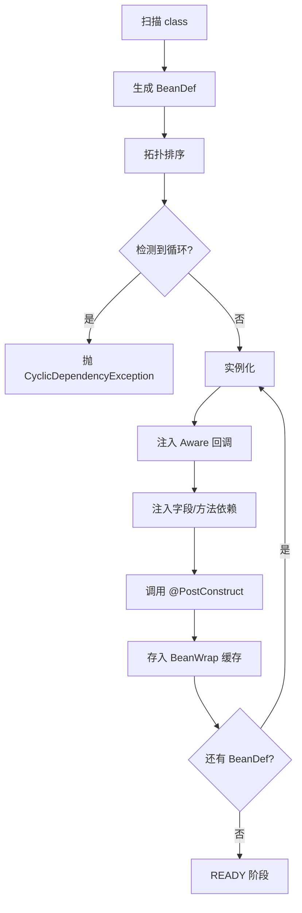

**顺序规则**：

1. 拓扑序（被依赖的先初始化）
2. 同层用 `@Order` 升序
3. 无 `@Order` 时按 bean name 字典序（确定性，便于测试）

### 4.12 错误处理

| 阶段 | 异常 | 处理 |
|------|------|------|
| GATHERING | `ClassNotFoundException` | EAR 缺关键依赖 → 部署失败，记录到 `apps.error.log` |
| GATHERING | `@Component` 类构造抛错 | 跳过此 bean，记 warn，继续收集其他 |
| COMMITTING | `CyclicDependencyException(A→B→A)` | 整体部署失败，`state = FAILED` |
| COMMITTING | `NoSuchBeanException(name)` | 部署失败 |
| COMMITTING | `@Inject` 字段类型有多个候选 | 部署失败；要求显式 `@Primary` |
| COMMITTING | `@PostConstruct` 抛 RuntimeException | 部署失败，回滚已注入的 bean |
| READY | 路由注册冲突（同一 path 已被占用） | 部署失败，列出冲突的 bean+method |
| RUNTIME | 路由调用时抛错 | 该次请求 500，**不影响 bean 实例**，发 `RouteInvokeErrorEvent` |

### 4.13 stop() 反向流程

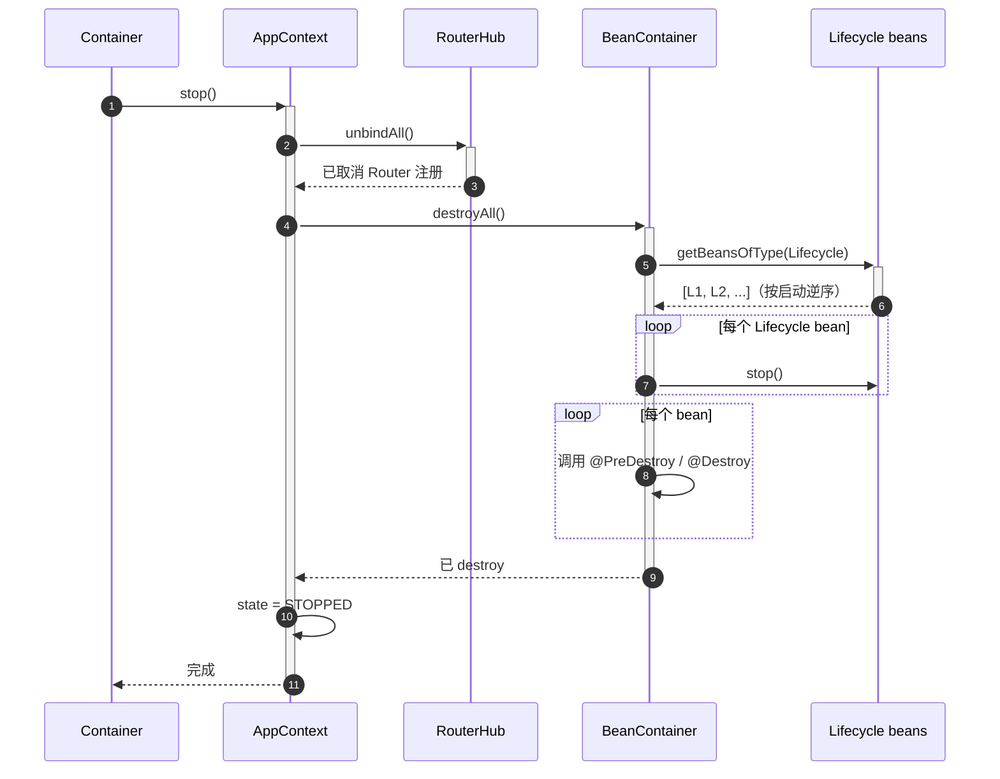

**注意点**：

- `stop()` 必须**幂等**：多次调用是 no-op
- `stop()` 期间任何业务请求被 Router 拒收（RouterHub 已 unbind）
- 关闭 CL 顺序：先 `BeanContainer` → 再 `ResourceLoader` → 再 `appCL.close()`（必须最后，否则上面两步找不到 class）

---

## 五、独立 NIO 服务（其他下游模块）

### 5.1 设计动机

**Container 和独立 NIO 服务是 edap-nio 的两种典型"下游用法"**——两者解决的问题不同，**且都通过 Edap 的 ServerGroup API 接入**，不是 Edap 的"成员"。

| 用法 | 解决的问题 | 典型形态 |
|------|-----------|----------|
| **Container**（edap-container 模块） | "一堆 microservice Java 应用的部署与隔离" | 一个进程里管多个 EAR、多 appId、Bean 容器、ClassLoader 隔离 |
| **独立 NIO 服务**（其他下游模块，如未来的 edap-gateway / edap-mail） | "单个独立的 NIO 服务" | 一个进程里就一个服务（网关 / 邮件 / 监控），无 Bean 隔离需求 |

**两者在 Edap 看来完全一样**——都是"`addServerGroup` + 几个 Server 子类"。Edap 不区分也不需要区分。

例子（**两者的差别**）：

- **Container 场景**：一个进程里要部署 5 个 microservice（user-service / order-service / inventory-service / payment-service / notification-service），它们要按 appId 隔离、各自的 ClassLoader、各自的 Bean 容器、各自的协议 Router——这就是 Container 解决的问题。

- **独立 NIO 服务场景**：一个进程只跑一个网关，专门做请求路由 / 鉴权 / 限流，**没有多应用隔离需求**——这种服务通常自己就是一个独立模块（如未来的 `edap-gateway`），在自己的 Bootstrap 里 new 一个 `ServerGroup` 并 `addServerGroup` 到 Edap。

### 5.2 不需要任何 SPI

**Edap 不定义 NIOComponent / EdapMember 等任何"成员"接口**。下游模块只需要：

1. `import io.edap.Edap;` —— Edap 已经提供 `addServerGroup` / `getServerGroups` / `getNio` / `getProps` 四个公开 API
2. 把自己的 `ServerGroup` 创建出来，`addServerGroup` 到 Edap
3. `edap.run()`

**不需要**实现任何 edap-nio 里的接口。这就是模块依赖方向的体现。

### 5.3 示例：edap-gateway 模块（未来）

```java
// 在 edap-gateway 模块的 Bootstrap 里
Edap edap = new Edap();

ServerGroup gatewaySG = new ServerGroup("gateway");
gatewaySG.addServer(new GatewayHttpServer(8080));   // ← Server 子类，Gateway 模块自己实现
edap.addServerGroup(gatewaySG);                     // ← Edap 对下游模块的唯一扩展点

// 可选：如果网关和 microservice 部署在同一进程
Container container = new Container(new File("apps"));
container.attach(edap);                             // Container 内部也会 addServerGroup
container.start();

edap.run();
```

### 5.4 示例：edap-mail 模块（未来）

```java
// 在 edap-mail 模块的 Bootstrap 里
Edap edap = new Edap();

ServerGroup mailSG = new ServerGroup("mail");
mailSG.addServer(new MailPollerServer(
    edap.getProps().getString("mail.smtp"),
    edap.getProps().getInt("mail.port", 25)
));
edap.addServerGroup(mailSG);

edap.run();
```

### 5.5 Container vs 独立 NIO 服务 选型

| 场景 | 用 Container（edap-container） | 用独立 NIO 服务（自建模块） |
|------|------------------------------|---------------------------|
| 多个 microservice EAR 部署在同一进程 | ✅ | — |
| 按 appId 隔离多个应用 | ✅ | — |
| 多版本蓝绿部署 | ✅ | — |
| 不同应用不同 ClassLoader | ✅ | — |
| Bean 注入 / DI 需求 | ✅ | — |
| 单一服务（网关 / 邮件 / 监控） | — | ✅ |
| 直接用 edap-nio + Props，没有多应用隔离需求 | — | ✅ |
| 不需要 Bean 容器 / DI | — | ✅ |

**典型组合**（同一进程里多种下游模块并存）：

```
Edap.run() 启动顺序：
  1. nio.start()                       ← Edap 是 NIO 框架的容器，先启动 NIO 实例
  2. for sg in serverGroups.values():  ← 遍历所有 addServerGroup 进来的 ServerGroup
       for s in sg.servers:
         s.start(nio)                  ← 每个 Server 自己处理启动逻辑

其中 serverGroups 里可能有：
  ├── "apps" ServerGroup        ← Container（edap-container 模块）注册的
  ├── "gateway" ServerGroup     ← Gateway（edap-gateway 模块，未来）注册的
  └── "mail" ServerGroup        ← Mail（edap-mail 模块，未来）注册的
```

---

## 六、协作流程

### 6.1 应用部署流程

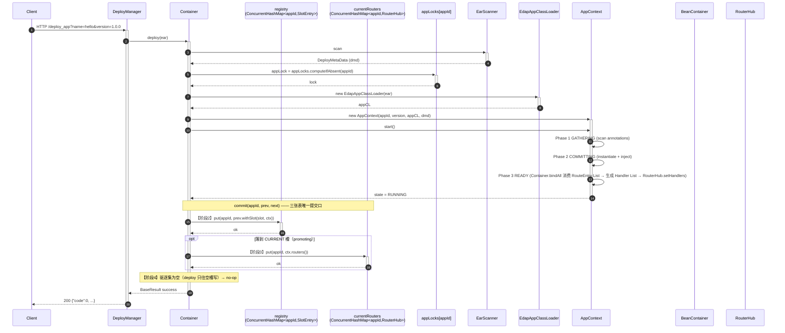

### 6.2 多版本切换（蓝绿）

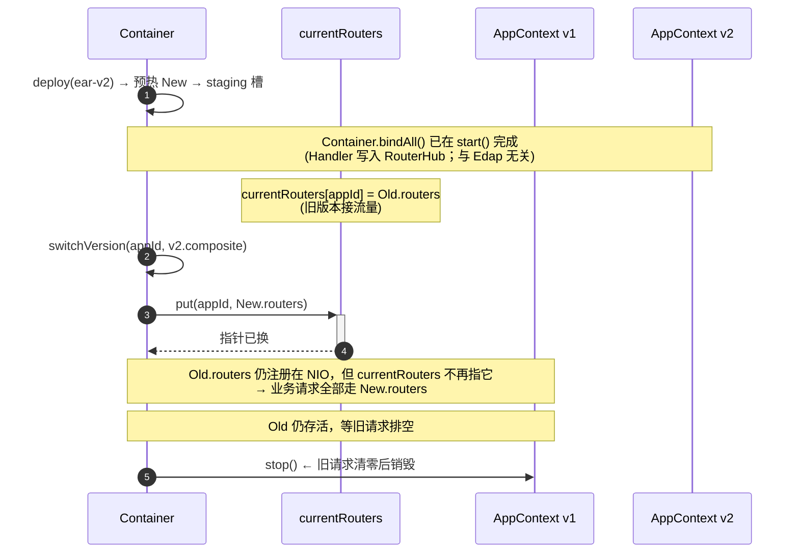

**关键**：switchVersion 只更新 `currentRouters[appId]` 指针，**不**调任何 Edap 方法。`AppContext` 之间通过"哪个 RouterHub 在 `currentRouters` 里"实现"路由层切换"而不是"实例替换"——所有 AppContext 的 routes 在各自 start() 时都已注册到 NIO，只是接流量的指针在切换。旧 `AppContext` 的 bean 仍存活直到旧请求处理完。

### 6.3 Edap 启动流程（Container + 独立 NIO 服务，由 Bootstrap 串起）

> 全部代码都在 **edap-container / 各个下游模块的 Bootstrap** 里，Edap 自己**不**认识 Container / Gateway / Mail。

```mermaid
sequenceDiagram
    autonumber
    participant B as Bootstrap<br/>(edap-container)
    participant E as Edap<br/>(edap-nio)
    participant C as Container
    participant Reg as registry
    participant SG as ServerGroup

    B->>+E: new Edap()
    B->>+C: new Container(appsDir)
    B->>+C: container.attach(edap)
    C->>+E: edap.addServerGroup("apps", sg)
    E-->>-C: ok
    C-->>-B: state = ATTACHED
    B->>+C: container.start()
    loop 每个 appsDir 下的 .ear
        C->>+Reg: deploy(ear) → appLock 抢占 → registry.put(slotEntry)
        Reg-->>-C: ok
    end
    C-->>-B: state = RUNNING
    B->>+E: edap.run()
    E->>E: nio.start()
    E->>SG: sg.servers[].start(nio)
    SG-->>-E: 所有 Server 已 start
    E-->>-B: state = RUNNING
    Note over B: 监听 SIGTERM...
    B->>+E: edap.stop()
    E->>SG: 逆序 sg.servers[].stop()
    E->>E: nio.stop()
    E-->>-B: state = STOPPED
```

---

## 七、线程模型

### 7.1 Edap 启动期

- `Edap.run()` 在主线程
- 不创建业务线程
- 串行遍历 `serverGroups` 里的每个 `Server` 并 `start(nio)`，每个 Server 在自己的线程策略里启动

### 7.2 Container 启动期

- `Container.start()` 在 `Bootstrap` 的主线程里被调
- 部署已有 EAR 时**串行**逐个调 `deploy(ear)`；每个 `deploy(ear)` 内部用 `appLocks[appId]` 串行化"同 appId 的并发部署/卸载"；不同 appId 互不阻塞
- 部署期间不影响其他已部署 AppContext 的运行

### 7.3 AppContext 启动期

| 阶段 | 是否可并行 | 备注 |
|------|-----------|------|
| GATHERING | ❌ 单线程扫描 | 注解反射开销大，单线程避免与 I/O 抢资源 |
| COMMITTING | 可选并行 | 拓扑序完成后可对"无依赖叶子"并行实例化；默认**保持单线程**简化心智 |
| READY | 单线程 | 仅注册路由表 + 发事件，开销小 |

### 7.4 运行期

- I/O 线程由协议层负责（HTTP 用 edap NIO 的 Selector 线程池）
- 业务逻辑在 I/O 线程上**直接执行**（不带额外线程切换）
- `@Stateful` bean 的分片实例**仅在同一 I/O 线程访问**（同一 shardKey 落到同节点），无需锁

### 7.5 部署与运行期重叠

- `Container.appLocks[appId]` 串行化"同 appId 的 registry 变更"（不同 appId 完全并行）
- 业务请求**不被**部署操作阻塞（RouterHub 已就绪，bean 已 RUNNING；registry 读 0 锁）

### 7.6 关闭顺序

1. `Bootstrap` 在 SIGTERM 时调 `edap.stop()`
2. `Edap.stop()` 拿 `lifecycleLock`
3. 逆序遍历 `serverGroups`，逆序停每个 `Server`
4. **可选**：`Bootstrap` 显式调 `container.stop()` —— Container 逆序停止所有 AppContext
5. AppContext 逆序：`@PreDestroy` → `Lifecycle.stop()` → CL close
6. 状态归 `STOPPED`

---

## 八、与 README §13 的关系

| 本文档章节 | README 对应 | 关系 |
|-----------|-------------|------|
| 第二章 Edap | §13.1 | 本文档强调 Edap **不**依赖下层；ServerGroup 是 Edap 对下游模块的唯一扩展点 |
| 第三章 Container | §13.1 / §13.2 | 本文档给出 Container 通过 `edap.addServerGroup(...)` 接入 Edap 的字段表 + 状态机 |
| 第四章 AppContext | §13.3.1–§13.3.12 | 本文档补充状态机、Sequence、BeanContainer 内部、错误路径 |
| 第五章 独立 NIO 服务 | （README 未涉及） | 新增：未来 edap-gateway / edap-mail 等模块的接入模式 |
| 第六章 协作流程 | §13.3.7, §19 | 部署时序图、版本切换、Bootstrap 启动全流程 |
| 第七章 线程模型 | （README 未涉及） | 新增 |

**修订约定**：当 README §13 调整设计方向时，本文档**同步更新**对应章节；不允许出现两处矛盾。

---

## 九、扩展点（待实施阶段细化）

> 以下条目是当前未完成、Stage 1+ 才会触达的扩展点；列在这里是为后续工作留位置。

1. `BeanPostProcessor` 注册机制（目前 Phase 2 只支持 Aware，未来支持自定义 PostProcessor）
2. `@Conditional` 条件 bean（按节点类型 / 配置动态决定是否注册）
3. `@Scope("custom")` 自定义 Scope SPI
4. `BeanPostProcessor` 与 AOP 织入的集成（`@Transactional` / `@RateLimit` 等）
5. `Environment` 集成远端配置中心（Nacos / Consul）的刷新机制
6. `EventPublisher` 跨 AppContext 转发（经由 `Container.eventBus`）
7. **多个 Container 成员**（多租户场景）：当前 `getContainer()` 仅返回第一个，后续可扩为 `getContainers(): List<Container>`
8. **ServerGroup 热插拔**：当前需 `run()` 前添加，未来支持运行时 `addServerGroup` / `removeServerGroup`
9. **成员优先级排序**：当前按添加顺序，未来可声明 `priority()` 或依赖关系
